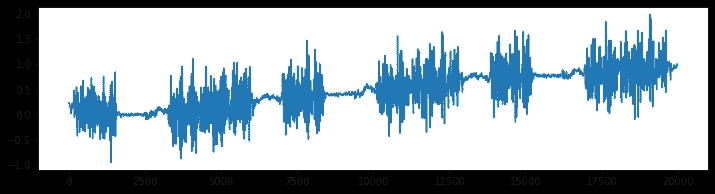
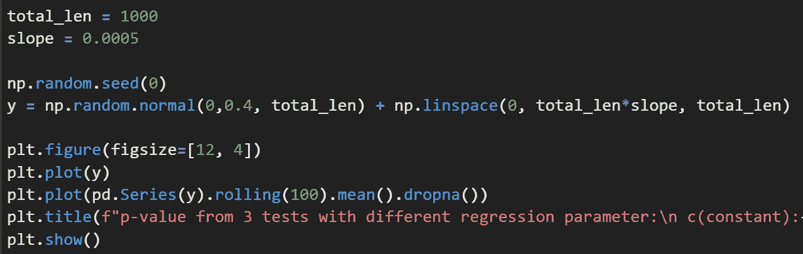
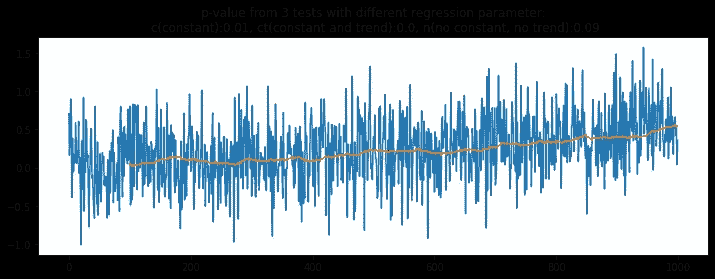
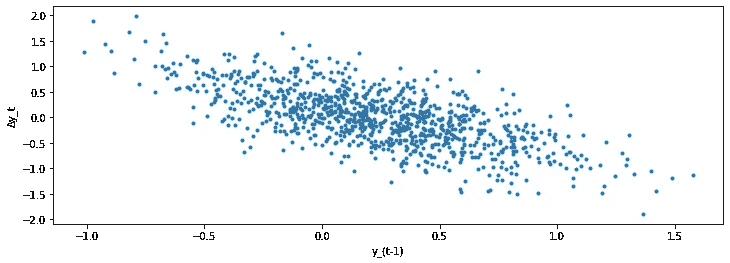
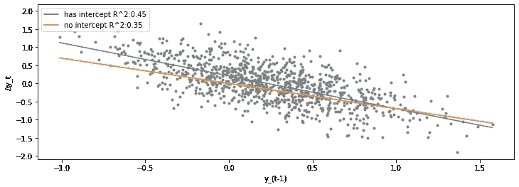
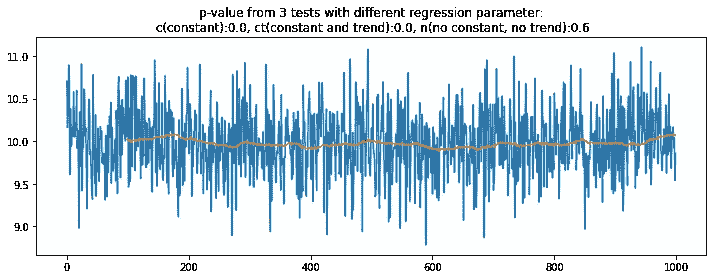
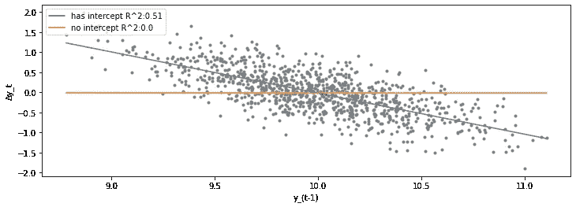
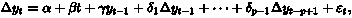
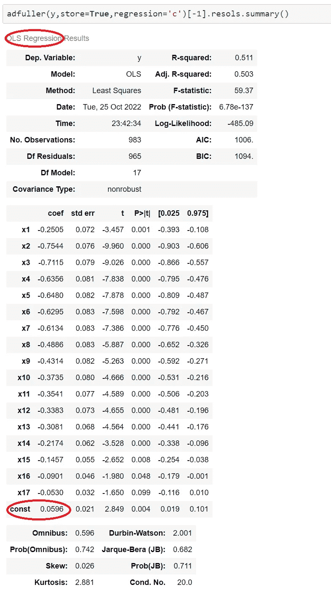
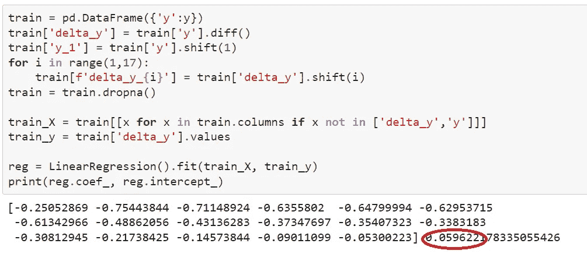

# 为什么这种趋势时间序列是平稳的？

> 原文：<https://towardsdatascience.com/why-is-this-trending-time-series-stationary-f3fb9447336f>

## 从一个怪异的例子看扩展的 Dickey-Fuller (ADF) 测验

[简·侯伯](https://unsplash.com/@jan_huber?utm_source=medium&utm_medium=referral)在 [Unsplash](https://unsplash.com?utm_source=medium&utm_medium=referral) 上拍照

平稳性是时间序列分析中最基本的概念之一。一般来说，平稳性将为用各种统计方法模拟时间序列提供极好的特性。扩展的 Dickey-Fuller (ADF) 检验可能是最广泛使用的检验平稳性的方法。

网上有很多关于这个话题的文章。我不会在基本的介绍上浪费你的时间，比如平稳性的定义，如何做 ADF 测试等等。在这篇文章中，我将分享我在一个应用程序中遇到奇怪的情况后探索 ADF 测试的旅程。

我将展示的学习路径是学习数据科学的典型路径。首先，我们认为我们理解了一个工具或概念，但我们只是承认并记住了这个术语。当我们将它应用于实际数据时，我们可能会发现意想不到的、具有挑战性的问题，这些问题促使我们进行更多的研究和进一步的理解。

同样，我会在 GitHub 上分享我的代码；最后请在参考文献部分找到链接。

## **意外旅程的开始**

前几天我在处理一些时间序列。图 1 显示了其中的一个。没有双重的**上升趋势存在，**和**方差也随时间变化**。有了这个清晰的可视化，我不需要测试稳定性。不知什么原因，我还是用 ADF 测试试了一下。令人惊讶的是，p 值几乎为 0，这意味着我应该拒绝零假设，并接受它是平稳的。

图一。有趋势的时间序列(图片由作者提供)

太奇怪了。测试结果似乎是错误的。我想调查 ADF 测试背后发生了什么。我尝试的第一步是用合成数据复制这个问题。我用下面的代码生成了一些测试数据。代码只是模仿了缓慢趋势的行为，而不是季节性。

图 1 中有 20，000 个观察值，这意味着趋势上升非常缓慢。我创建了一个斜率为 0.0005 的时间序列。经过 1000 次观察后，时间序列平均值从大约 0 上升到 0.5。然后让我们使用默认参数使用来自**stats models . TSA . stat tools**的 adfuller()函数对其进行测试。p 值为 0.01，再次出现“问题”。图 2 显示了结果。你可以忽略标题，把注意力放在上升趋势上。稍后我会解释为什么我们有来自三个不同 ADF 测试的 p 值。

图二。具有 ADF 测试结果的合成时间序列(图片由作者提供)

## **DF 测试背后的数学原理**

我们必须深入了解 ADF 测试究竟在做什么。原来它的数学背景并不复杂。首先，ADF 测试只是 T2 的迪基-富勒测试的高级版本。DF 测试有三个主要版本**(来自维基百科):**

**版本 1: 测试单位根:∆yᵢ = δyᵢ₋₁ + uᵢ**

****版本 2:** 用常数检验单位根:∆yᵢ = a₀ + δyᵢ₋₁ + uᵢ**

****第三版。**趋势不变且确定的单位根检验:∆yᵢ = a₀ + a₁*t + δyᵢ₋₁ + uᵢ**

**在每个版本中，**零假设是有一个单位根，δ=0。****

**Statsmodels 包支持带参数**“回归”的所有三个版本。****

**对于版本 1，回归是‘n’(没有常数，没有趋势)。**

**对于版本 2，回归是‘c’(仅常数)；这是默认设置。**

**对于版本 3，回归是“ct”(常数和趋势)。**

**我用三种不同的设置重新运行了测试，下面是新的结果。**

**对于版本 1，p 值为 0.09。我们不应该拒绝无效假设。**

**对于版本 2，p 值为 0.01。我们已经将它视为一个问题，因为这是默认设置。**

**对于版本 3，p 值为 0.00。这是意料之中的，因为时间序列确实是**稳定的，具有确定的趋势**。**

**所以对于这个例子数据，如果我们用版本 1 (regression='n ')测试，我们不会说它是平稳的。我们可能不应该使用默认设置。但是你可能也想知道，为什么这个常数项会有这么大的不同呢？我们再多挖点。**

## **从 DF 检验到线性回归**

**基于上述定义，DF 检验只是线性回归。图 3 显示了线性回归的所有点。y 轴是∆yᵢ，x 轴是 yᵢ₋₁，uᵢ是余数。版本 1 意味着我们必须拟合一条没有截距(没有常数)的线。版本 2 意味着我们必须用截距(常数)拟合一条线。**

****

**图 3。∆yᵢ和 yᵢ₋₁(图片由作者提供)**

****Skitlearn linear regression**通过参数 fit_intercept 很好地支持了这两个选项。图 4 下面是两条拟合的线。如你所见，有截距的线比没有截距的线更合适。R 平方得分也明确证实了这一点。另外，请注意橙色线的斜率小于蓝色线的斜率。换句话说，橙色线的斜率更接近于 0。**

****

**图 4。线性回归结果(图片由作者提供)**

**我们也可以通过可视化来思考:点不是以(0，0)为中心，所以拟合的回归线不应该经过(0，0)。截距应该大于 0。因为 0 是起始均值，∏y 应该大于 0，所以总体均值会增加。如果我们强制回归线通过(0，0)，会对数据进行欠拟合，由于来自(0，0)的影响，斜率会变得更接近 0。**

**我们已经看到包括截距影响是否符合线性回归。为什么一条线的拟合方式会影响 ADF 测试结果，p 值从何而来？**

## **从线性回归到 p 值**

**现在有点复杂了。**DF 检验的最终 p 值不是来自线性回归的系数 p 值。**基本上，统计数据有一个特定的分布，称为 Dickey-Fuller 表。然后，我们使用 MacKinnon 的近似 p 值进行检验统计。您可以在 [Statsmodels 源代码](https://www.statsmodels.org/dev/_modules/statsmodels/tsa/stattools.html#adfuller)中找到详细信息。**

**因为零假设是δ=0，意味着测试拟合线的斜率是 0。我们不需要详细讨论如何获得 p 值。p 值和斜率(线性回归中的δ，而不是趋势斜率)之间关联的逻辑链如下:**

****一般来说，如果斜率远离 0，p 值应该更小，更有可能拒绝零假设，暗示无单位根且平稳。如果斜率为 0 或非常接近 0，p 值应该更高，更有可能接受零假设，并建议单位根和非平稳。**对于第二种情况，维基百科说，“这些测试的统计能力很低，因为它们通常无法区分真正的单位根过程(δ = 0)和近似的单位根过程(δ接近于 0)”。这就是为什么我们首先会有这个问题。我们正在处理一个接近单位根的过程。版本 1 找到了一个单元根，而版本 2 找不到单元根。**

## **为什么版本 1 适用于上面的例子？**

**版本 1 适用于图 2 中的数据，因为我们使斜率更接近 0，所以 p 值更高。**

**但是，我们不能使用版本 1 作为默认设置。版本 1 有两种情况(强制线通过(0，0)):**

**情况 1: (0，0)更接近所有数据点。如果直线必须经过(0，0)，那么直线会更平坦，斜率会更接近 0。图 4 演示了这种情况。请注意，图 4 中的演示只适合一个变量 yᵢ₋₁，实际的 ADF 将适合更多的滞后变量。**

**情况二:(0，0)远离所有数据点。如果直线必须穿过(0，0)，我们可能会拟合失败；本质上，斜率是 0，这意味着我们无法找到∆yᵢ和 yᵢ₋₁的线性关系，这样一条线将通过(0，0)并覆盖大多数数据点。**因此，测试结果会偏向有根单元**。**

**下面的图 5 显示了版本 1 测试未能拒绝零假设(p 值为 0.6)的一个例子，数据是稳定的，平均值为 10。图 6 解释了原因。如你所见，我们找不到没有截距的直线(r 平方为 0)，所以拟合直线的斜率为 0 (∆yᵢ不依赖于 yᵢ₋₁).**

****

**图 5。版本 1 无法识别静态时间序列(图片由作者提供)**

****

**图 6。线性回归找不到没有截距的直线(通过(0，0))(图片由作者提供)**

## **从 DF 测试到 ADF 测试**

**现在我们了解了 DF 检验是线性回归，以及如何从线性回归中获得 p 值，让我们继续学习 ADF。ADF 的公式为:**

****

**再次，线性回归。**“扩充”的部分是我们必须适应更多的系数。****

**statsmodels 包允许显示 AFT 测试的详细摘要。图 7 是结果。**

****

**图 7。ADF 测试的详细摘要(图片由作者提供)**

**我们看到“OLS 回归”(线性回归的默认解决方案)和 17 个系数。我没有指定最大延迟，所以测试将尝试一个基于时间序列长度的数字，即 17。**

**常数(截距)也是合适的。该值为 0.0596。**

**让我们通过使用 Scikit-learn 中的线性回归来实现 ADF 测试。图 8 是代码和输出。**

****

**图 8。用 Scikit-learn 进行 ADF 测试(仅线性回归部分)**

**截距为 0.0596，其他系数与图 7 相同。Scikit-learn 中的线性回归只是简单的 OLS。我们正在做同样的事情，所以结果是一样的也就不足为奇了。**

## **旅程的终点**

**在我弄清楚如何设置参数之后，我使用版本 1 (regression ='n ')测试了图 1 中的原始时间序列，得到的 p 值为 0.08，表明它不是平稳的。请注意，图 1 中的数据是零均值，所以你可以想象(0，0)更接近数据点(∆yᵢ，yᵢ₋₁).使用版本 1 测试将帮助我们。**

**因为图 1 中的趋势斜率是最小的，所以我们也可以用步长对时间序列进行重采样，这样会增加斜率。例如，如果我用四个步骤测试它(值[::4])，它将不能通过 ADF 测试的默认设置(回归的 p 值是 0.17 = ' c ')。**

**问题解决了。**

## **外卖食品**

**不要盲目相信 ADF 结果。可视化是你的朋友。**

**ADF 检验是简单的线性回归，statsmodels 的实现使用 OLS 来解决回归问题。然后，它使用 Dickey–Fuller 表提取 p 值，验证拟合回归中第一个滞后变量的系数为 0 的零假设。**

**ADF 检验在检验近单位根过程(δ接近于 0)时有局限性。**

**我们需要相应地选择合适的 ADF 版本。例如，当你看到一个恒定的趋势，并想测试“趋势平稳”，你需要选择“ct”作为参数。如图 1 和图 2 所示，如果要捕捉均值为 0 的信号的缓慢趋势，可能需要选择“n”作为参数，以避免拟合截距的影响。Statsmodels 还支持带参数“ctt”的量化趋势。在某些情况下，这个高级选项可能是个不错的选择。如果你想进一步挖掘，请参考[处理关于包括截距和确定性时间趋势项](https://en.wikipedia.org/wiki/Dickey%E2%80%93Fuller_test#Dealing_with_uncertainty_about_including_the_intercept_and_deterministic_time_trend_terms)的不确定性。**

**希望你对 ADF 测试有所了解。**

**享受你的时间序列吧！**

**在 [LinkedIn](https://www.linkedin.com/in/ning-jia-04b55b241/) 上联系我。**

***PS:我对时间序列数据有经验和热情。如果你喜欢这篇文章，你可能会对我其他关于时间序列* *的* [*帖子感兴趣。*](https://medium.com/@ning.jia/list/time-series-7691e7b85020)**

## ****参考文献****

**[GitHub 上的笔记本文件](https://github.com/ningja1/blog_notebooks/blob/main/stationary_adf_test/post.ipynb)**