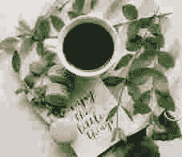

# 为什么神经网络对计算机视觉很有帮助

> 原文：<https://towardsdatascience.com/why-neural-networks-can-solve-simple-tasks-d268a770dbce>

## 换句话说，简单的问题

照片由[法赫米·法克鲁丁](https://unsplash.com/@fahmipaping?utm_source=medium&utm_medium=referral)在 [Unsplash](https://unsplash.com?utm_source=medium&utm_medium=referral) 上拍摄

R 最近，我在[上发帖说什么时候不用神经网络](https://medium.com/towards-data-science/when-not-to-use-neural-networks-a97608dbd3f6)。这一次，我想反过来谈谈为什么这些奇特的网络在解决视觉和语言问题上如此有效会很好。所以在某种意义上，这是一篇关于机器学习模型的*灵活性*方面的文章，以及为什么神经网络是灵活性之王。

在之前的帖子中，我提出了以下经验法则:**在 AI 内部，我们使用简单的模型来解决挑战性的任务，使用复杂的模型来解决简单的任务。**在这种情况下，复杂是指我们需要推理的问题，而简单是指我们凭直觉解决的问题。例如，你需要做一些思考来将 48976 乘以 15948，但是你可以很容易地识别照片中的人脸。在计算上，乘法是微不足道的，而识别人脸是非常复杂的。

当谈到机器学习算法时，许多技术可以解决复杂的人类问题。不过，确实只有一种方法能够可靠地解决简单的人类任务:*神经网络* s。这一切都归结于它天生的灵活性，可以将特征组合成更有意义的表示。为了理解这一点，我们需要了解一下*算法如何看待*。

# 模特看到了什么

在说计算机视觉之前，我们先通过*咖啡品鉴稍微绕道一下。*不要太书呆子气，当谈到*好咖啡与坏咖啡*时，有几个特征很重要。这里有一个关于[购买/寻找好咖啡](www.youtube.com/watch?v=O9YnLFrM7Fs)的精彩视频。以下是我的简单总结:

*   豆子收获后的天数
*   烘烤后的天数
*   使用的烘焙强度
*   它有多少“身体”
*   酸性有多强
*   它有发酵的味道吗？

由于我们是数据科学家，我们可以将此建模为一个简单的分类问题:我们有一些整数特征(自收获/烘焙以来的天数)、一些类别(烘焙强度、酒体和酸度)和一个布尔值(发酵/未发酵)。然后，我们可以买一些咖啡包，交给一些专家，记录他们对每个包的反馈。换句话说，他们有多喜欢/不喜欢每个样本。

准备好我们的数据集后，我们可以尝试一些机器学习模型来预测给定的咖啡包是好是坏。在这个背景下，我强调了每个模型如何看待解决这个问题的任务。

**免责声明:**虽然我基于 Hoffmann 的视频给出了上述特征，但下面的大多数例子都是虚构的。欢迎在评论区分享你的咖啡喜好，尽管☕️.

## **线性模型**:

一个线性分类器本质上学习了一个"*y =****a***⋅*x+****b****函数。这里， *y* 表示标签， *x* 表示特征， *A* 表示特征权重， *b* 表示特征偏差。请注意， *A* 和 *b* 是向量，为我们的六个特征中的每一个保持一个值。学习过程因此学习适当的 *A* 和 *b* 值，当咖啡好的时候产生正的 *y* ，否则产生负的。*

*直觉上， *b* 代表了我们对每个特性本身的重视程度，不考虑咖啡本身( *x* )。这就是这个术语被称为“偏见”的原因同时， *A* 衡量我们对咖啡特性的重视程度。因此，举例来说， *b* 代表我们总体上对酸度的喜爱程度，而 *A* 则模拟了每种酸度如何改变我们的基本估值。*

***注意，线性模型不执行特征间推理**。换句话说，它所做的只是总结出它对每个特性的看法。因此，举例来说，考虑到咖啡豆的年龄，它不能评估烘焙强度如何与咖啡的酸度相互作用，或者我们对每种元素的感知如何变化。**换句话说，他们看到的只是一堆数值。***

## *决策树(DTs)*

*在每个节点上，DTs 将寻找最具分割性的特征。例如，过去三个月烘烤的许多包装被认为是合适的，而大多数不新鲜的被认为是坏的。然后，它将寻找下一个最佳特征来按顺序分割每个子集。例如，对于最近烘烤的包装，咖啡主体导致了最大的意见分歧。相比之下，对于不新鲜的咖啡，发酵的味道非常能说明咖啡的质量。*

*同样， **DTs 不能直接混合特征。然而，他们可以通过他们的层级性质利用一些相互依赖。**在这个例子中，这棵树可以察觉到发酵的味道对陈咖啡比对新烘焙的咖啡更重要。尽管如此，所有决策一次只考虑一个特性。*

## *神经网络*

*神经网络层是激活函数σ内的线性模型。数学上，我们得到“*y =*σ*(a*⋅*x+b)*”对于一个三层网络，我们得到下面的组成:"*y = l₃(l₂(l₁(x))*，"或者，扩展层项，我们得到完整的表达式"*y = σ(a₃⋅σ(a₂⋅σ(a₁⋅x+b₁)+b₂)+b₃)*"传统上，L₃ 被称为输出层，而L₁和 L₂被称为隐藏层(因为被“隐藏”在输入和输出之间)*

***关键在于认识到每一层都将一组特征作为输入，并产生另一组特征。**换句话说，它结合了各种特征，创造了一种新的问题表现形式。然后，第二层获取组合的特征，并输出已经混合的特征的组合。最后，第三层也是最后一层从接收到的特征混合中产生最终输出。*

***虽然线性模型对特征关系是盲目的，决策树只能间接实现它们，但神经网络不断混合特征，以创建更精细的表示。**在文献内部，“隐藏”的层次产生“隐藏”的特征。然而，我发现将“隐藏”一词解释为神经网络就像侦探一样不断发现数据中隐藏的模式更有启发性。*

*这种对特征的不断细化使得神经网络成为模型灵活性之王。也是从*深度学习*中的*深度*一词而来。神经网络不是在“浅层表示”上操作，而是创建理解层，揭示数据的深层结构。*

# *意义就在里面*

*之前，我们考虑了一个简单的监督学习设置。现在，查看以下数据:*

**

*图片由作者提供。*

*我问你，*全能的人类，*这个形象的内容是什么？*

*很难发现，嗯？*

*是的，我对待你就像线性模型对待它的数据一样:*没有上下文，宝贝*。*

*看，视觉数据的问题是像素几乎没有价值。换句话说，1920x1080 的全高清图像只不过是两百万多一点的无意义特征。因此，上面的条带只是一个常规的图像降采样和展平。这具有剥夺图像像素的所有先前空间关系的效果。
下面是另一个例子:*

**

*图片由作者提供。*

*在这个版本中，我只是随机像素。如上所述，不能从图像中得出任何意义。**这说明了图像的含义是如何在像素关系中编码的**。从数学上来说，这张图像的像素与原始图像完全相同，但却完全无法辨认。
为了您的观赏乐趣，以下是原文:*

**

*布里吉特·托姆在 [Unsplash](https://unsplash.com?utm_source=medium&utm_medium=referral) 上拍摄的照片。由作者调整大小和裁剪*

***整篇文章最关键的一段**来了:*

> *神经网络擅长处理复杂的输入，如图像、音频和文本，因为它们天生具有将较小的特征组合成复杂抽象的能力。一遍又一遍，无意义的像素被组合成图案和图案的图案。*

*相反，由于更简单的模型在提取多特征模式的能力方面受到限制，它们不能处理高维问题。简而言之，包含大量无意义特征的场景。*

*作为一个元示例，这篇文章中没有一个单词或句子可以捕捉到它的全部含义。相反，整个信息被一点一点地编码在每个单词、每个句子中。说到音频，一秒钟的音乐是用 44.1k 的微小样本来表示的。我们需要将这个数字调整到更易于管理的程度，比如任何有意义操作的音符或音素序列。*

# *回到咖啡*

*在我们的咖啡例子中，所有特征都是完全有意义的:烘焙日期、酸度、酒体等。这些特征之所以存在，是因为我们人类直接或间接地从嘴里感知到了它们。更简单的模型适用于这类问题，因为寻找有用特征的所有工作都已经完成了。在这里使用神经网络几乎总是没有任何好处。*

*现在，考虑一台真正对咖啡取样的机器，识别通过其传感器的微量化学物质。它能产生的特征数量是巨大的。这一次，更简单的模型不再适合这项任务。相反，神经网络模型可以解析数据丛林，并得出对分类非常有用的有限特征集。*

*神经网络将提出的大多数特征可能与我们人类可能注意到的东西非常相似。例如，它可能学会评估样品中酸性分子的低/高频率。同样，缺少更多的芳香成分可能意味着不新鲜的豆子或更老的烘焙。*

*这个实验也可能适得其反。在上一篇文章的[中，我强调了灵活的模型如何经常学习伪模式，这些伪模式在本地解决了一个数据集，但没有推广到外部数据。例如，我们可能在对所有老烘焙咖啡进行采样的那天没有正确清洁机器，因此，算法学会了将灰尘检测为劣质咖啡的标志。](/shortcut-learning-how-and-why-models-cheat-1b37575a159)*

# *神经网络出现之前的日子*

*最后，在神经网络在 2010 年代非常流行之前，我们有其他技术来解决这些复杂的任务。例如，有很多令人兴奋的人脸识别方法。特别是，许多作者衍生了几种[模式匹配算法](https://en.wikipedia.org/wiki/Scale-invariant_feature_transform)来寻找面部标志，如眼睛、鼻子和嘴巴。*

*作者使用许多信号处理技术进行音频处理，如快速傅立叶变换(FTT)，将高维信号转换为频带甚至音符和音素。同样，文本数据可以转换成更经济的表示，比如单词包，以及最近的单词向量(文本嵌入)。*

*尽管如此，**所有这些技术都有一个共同的主题:有人提出了有价值的特征，将高维问题简化为更有价值的表示。这种方法如此普遍，以至于有了一个名字:*特征工程*，这是人类天真无邪的壮举。***

*神经网络，尤其是卷积网络，带来了一个戏剧性的转变:*特征学习*。**神经网络将单调乏味的特征进化为更恰当的表达方式的过程自动化。此外，网络可以重复创建多层次的表示，这对于我们人类来说很有挑战性。最后，他们不需要昂贵的专家来解决新的任务。***

*回到这篇文章的开头，我说过“只有一种方法能够可靠地解决简单的人类任务:*神经网络* s。”这里的关键词是*可靠地*。例如，支持向量机解决了一些奇特的问题，如[内核 PCA](https://en.wikipedia.org/wiki/Kernel_principal_component_analysis) 和[光谱聚类](https://en.wikipedia.org/wiki/Spectral_clustering)，然而，你不能期望支持向量机开箱即用地可靠处理任何输入数据。XGBoost 也是如此。*

*一个伟大的神经网络可靠性的例子是麻省理工学院的工作[利用无线信号反射探测穿墙的人类](http://rfpose.csail.mit.edu)。作者同时记录了几个演员做日常活动时的相机图像和 WIFI 反射。然后，他们对相机图像运行了一个姿势估计框架，并训练了一个模型来使用 WIFI 数据而不是图像复制结果。关于隐私的结果令人印象深刻。网络是如何完成这样的壮举的？没有人知道。它完全靠自己学习。没有特征工程，只有原始数据，和几个矩阵。*

*毕竟，通过墙壁探测人是一项简单的任务:)*

*暂时就这些了。如果你对这篇文章或报纸有任何问题，请随时评论或与我联系。您也可以订阅我在这里发布[的通知](https://ygorserpa.medium.com/subscribe)。顺便说一下，说到咖啡，[如果你愿意直接支持我的工作，你可以给我买一杯](https://www.buymeacoffee.com/ygorreboucas))*

*如果你是新手，我强烈推荐[订阅](https://ygorserpa.medium.com/membership)。对于数据和 IT 专业人员来说，中型文章是 StackOverflow 的完美组合，对于新手来说更是如此。注册时请考虑使用[我的会员链接。](https://ygorserpa.medium.com/membership)*

*感谢阅读:)*