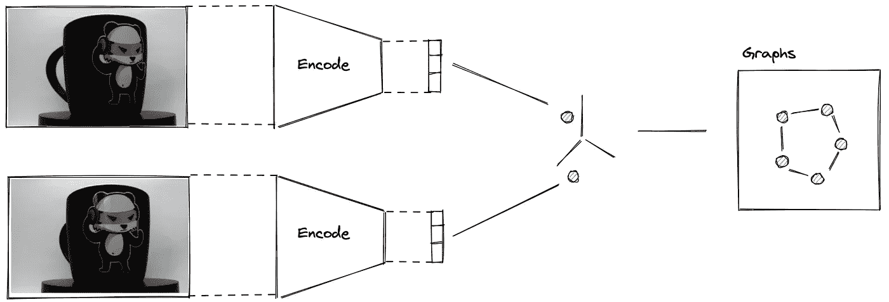
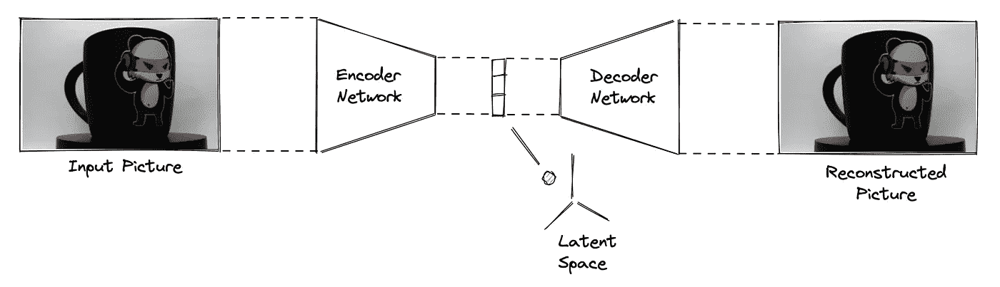
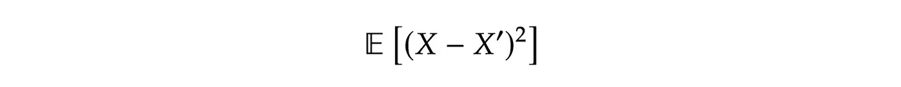
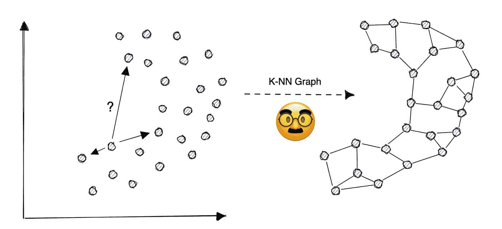
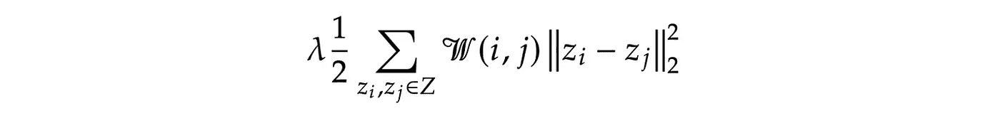
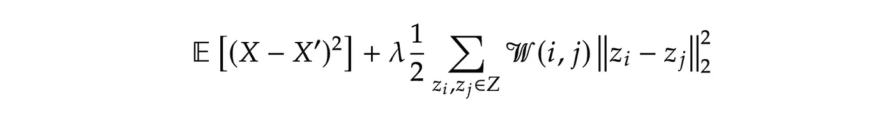

# 为什么不用 CNN 提取特征？

> 原文：<https://towardsdatascience.com/why-not-use-cnn-to-extract-features-1f18341bee8>

## 如何发现数据中的意外模式

潜在空间图示例(图片由作者提供)

意外中有美。

就在你认为你已经想通了所有事情的时候，一些新的事情突然出现，让你大吃一惊。数据分析也是如此。当你查看数据集，试图找到模式和趋势时，有时你会遇到一些不太有意义的东西。这就是异常检测的用武之地。

异常检测是识别数据中异常模式的过程。这些异常模式可能是不符合正常趋势或行为的任何东西，它们可能是由各种各样的事情引起的，例如数据收集中的错误、异常值，甚至是恶意活动。异常检测非常重要，因为它可以帮助您发现数据中的问题，否则您将无法发现这些问题。

异常检测的方法有很多种，但是在这篇博文中，我们将关注一种特殊的方法:流形学习。流形学习是一种寻找高维数据的低维表示的技术。

# 自动编码器

自动编码器是一种人工神经网络，分为两个主要部分:编码器网络和解码器网络。

每个部分执行以下操作:

1.  **编码器** **网络:**在一个叫做潜在空间的低维空间中减少一个高维输入。
2.  **解码器网络:**将潜在空间映射成输入图像的表示。

自动编码器属于非监督学习技术的范畴，因为数据不需要有标签。编码器减少输入数据的维数，解码器从潜在空间再现输入，并且两个网络被优化以减少输入和输出数据之间的差异。

编码器和解码器网络可以被设计为服务于特定的任务。在图像的情况下，我们通常使用我们训练的卷积神经网络(CNN ),以便减少输入 X 和其重构输出 X '之间的均方误差(MSE ),即

输入 X 与其重构输出 X '之间的均方误差

自动编码器的常见使用案例有:

*   维度缩减
*   图像压缩
*   数据去噪
*   异常检测

对于后者，经典方法侧重于通过查看输入与其重建版本之间的差异来发现异常。假设当输入类似于训练数据集时，自动编码器表现良好，但是在异常周围产生高重建误差。为了使用这种方法，我们用无异常数据训练自动编码器，并观察自动编码器的输入和输出之间的差异。

另一种可能性是确保模型学习潜在空间的有意义的表示，并直接在这个低维空间中发现异常。这就是拉普拉斯自动编码器的用武之地。

> 但是首先，我们必须建立一个 K-最近邻图来训练拉普拉斯自动编码器。

# k-最近邻图

k-最近邻图(k-NNG)是每个节点与其最近邻相连的图。例如，在下图中，每个节点都连接到其三个最近的点。

k-NN 图形草图(图片由作者提供)

欧几里德范数可能是最直观的接近度度量，因为它给出了两点之间的最短距离。可以根据应用选择其他流行的距离度量，如[闵可夫斯基、曼哈顿、汉明或余弦](/9-distance-measures-in-data-science-918109d069fa)。

对于高维输入，如图片，我们需要选择一个距离度量来衡量图像之间的相似性，如结构相似性指数(SSIM)或基于梯度方向直方图(HOG)。

例如，我们可以使用 HOG 描述符，并用 Wasserstein 度量或卡方距离计算两个直方图之间的距离。

选择度量标准时，我们需要记住，一个好的距离度量标准应该是:

*   **信息量**:距离可以直接翻译为相似程度
*   **反身**:从“A 到 B”和“B 到 A”的距离相等
*   **灵敏**:距离变化时变化平滑
*   **有界**:指标落在受限范围内

# 拉普拉斯自动编码器

> 使用自动编码器时，最大的挑战是确保模型实际学习潜在空间的有意义的表示。

拉普拉斯自动编码器也使用编码器-解码器结构，但是区别在于用于训练两个网络的损失函数。

仍然训练自动编码器，以便减少输入和其重构输出之间的误差，但是在损失函数中增加了正则化项，以便在高维和低维之间保持相同的邻居。这意味着输入空间中的接近数据点将在潜在空间中保持接近。

为了构建拉普拉斯自动编码器，我们首先必须在输入数据上构建 KNN 图，并且在损失函数上添加正则化项，一旦相同的邻居被映射到潜在空间中，该正则化项鼓励保持相同的邻居。

从 KNN 图中，我们导出了一个权重矩阵(W ),当 Xi 和 Xj 之间的距离很大时，它具有小的 W(i，j ),而当 Xi 和 Xj 之间的距离很小时，它具有大的 W(I，j)。正则化函数定义如下:

拉普拉斯自动编码器的正则化函数

其中 Zi 和 Zj 分别表征来自输入 Xi 和 Xj 的潜在空间中的映射点。第一个参数(λ)是正则化权重，我们可以将其作为模型的超参数进行调整。

拉普拉斯自动编码器旨在优化的全损失函数定义如下:

拉普拉斯自动编码器的损失函数

# 最后的话

那么，当你的数据不太符合模型的时候，你能做什么呢？

使用卷积神经网络(CNN)来查找数据中的意外模式。CNN 非常适合从图像中提取特征，并已被证明在发现传统方法难以检测的模式方面非常有效。

使用非监督方法相对于监督等效方法的主要优势在于，我们不需要标记任何数据，这是一项非常昂贵的任务。权衡的结果是，我们可能检测到不是异常的模式，而是数据集固有的模式。

我希望你喜欢这个教程，并发现它很有用。如果你有任何问题或意见，欢迎在下面发表。

好奇想了解更多关于 Anthony 的工作和项目吗？在[媒体](https://medium.com/@anthonycvn)、 [LinkedIn](https://www.linkedin.com/in/anthonycavin/) 、 [Twitter](https://twitter.com/Anthony66333223) 上关注他。

*需要技术写手？将您的请求发送到*[*https://amigo CCI . io*](https://amigocci.io/blog/mlops-at-medium-scale/)*。*