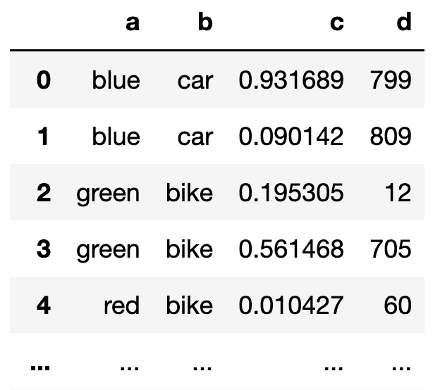
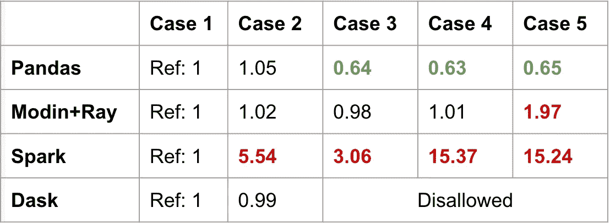
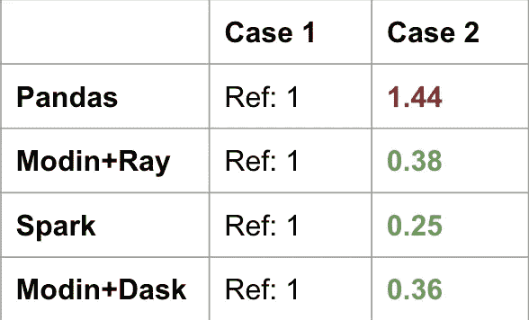
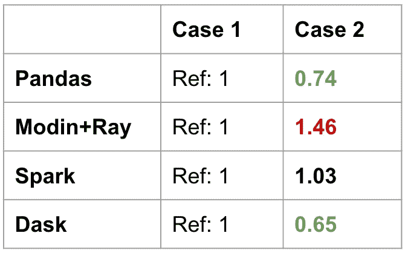
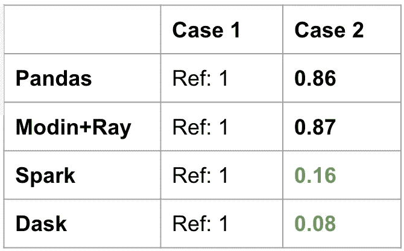
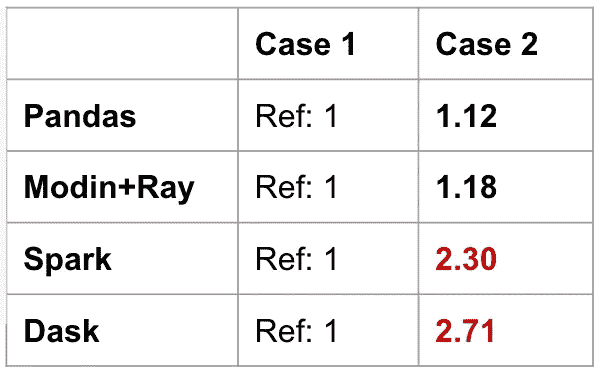

# 为什么熊猫式界面对于分布式计算来说不是最佳的

> 原文：<https://towardsdatascience.com/why-pandas-like-interfaces-are-sub-optimal-for-distributed-computing-322dacbce43>

## 深入了解熊猫界面的假设

编剧[凯文·库](https://www.linkedin.com/in/kvnkho/)和[汪涵](https://www.linkedin.com/in/han-wang-97272610/)

这是我们最近的[皮肯谈话](https://www.youtube.com/watch?v=b3ae0m_XTys)的书面版本。


照片由 [Jukan Tateisi](https://unsplash.com/@tateisimikito?utm_source=medium&utm_medium=referral) 在 [Unsplash](https://unsplash.com?utm_source=medium&utm_medium=referral) 上拍摄

# 分布式计算的熊猫式框架

在过去的一年半时间里，我们与想要将 Pandas 代码转移到 Dask 或 Spark 以利用分布式计算资源的数据从业者进行了交谈。他们的工作负载很快变得过于计算密集型，或者他们的数据集不再适合 Pandas，Pandas 只能在一台机器上运行。

在我们的对话中，一个反复出现的主题是像考拉(更名为 PySpark Pandas)和 [Modin](https://github.com/modin-project/modin) 这样的工具，它们旨在使用相同的 Pandas 接口将工作负载引入 Dask、Ray 或 Spark，只需改变 import 语句(大部分)。

例如，PySpark Pandas [的替代产品](https://databricks.com/blog/2021/10/04/pandas-api-on-upcoming-apache-spark-3-2.html)可能是:

```
# import pandas as pd
import pyspark.pandas as pd
```

据推测，所有东西都应该在 Spark 上运行。已经有一些[博客](https://lakefs.io/how-easy-it-is-to-re-use-old-pandas-code-in-spark-3-2/)表明这并不完全正确(截至 2022 年 5 月)。这里和那里都有一些小问题，但我们在这里不是为了谈论微小的差异。**这篇文章讲的是由于分布式计算的细微差别而一直存在的根本差异，而熊猫与分布式计算并不兼容。**

类似熊猫的框架之所以流行，是因为很多数据科学家抗拒改变(我自己也经历过！).但是仅仅改变导入语句会使用户避免理解分布式系统中真正发生的事情，缺乏理解会导致无效的使用。

我们将看到，试图与 Pandas API 实现 1:1 对等将需要在性能和功能上做出妥协。

# 基准数据

我们创建了一个具有以下结构的数据帧。列`a`和`b`是字符串列。列`c`和`d`是数值。这个数据帧将有一百万行(但是我们也会在某些情况下改变它)。

我们将在 Pandas、Modin (on Ray)、PySpark Pandas 和 Dask 中创建这个数据帧。对于每个后端，我们将对不同案例的操作进行计时。这一点在讨论完第一个问题后应该会更加清晰。



按作者分类的图像-示例数据

# 问题 1: Pandas 假设数据在物理上是在一起的

最常用的熊猫方法之一是`iloc`。这依赖于数据的隐式全局排序。这就是为什么 Pandas 可以快速检索给定索引值集中的行。它知道在哪里访问它需要检索的行的内存。

以下面代码片段中的 5 种情况为例，我们将评估每种操作相对于情况 1 的速度。**我们不进行跨框架的比较。我们希望看到每个框架的不同性能。**下面的案例 3–5 是基于位置访问行和列。情况 5 特别是在数据帧的中间。我们将在熊猫、摩丁、PySpark 熊猫(也称为考拉)和 Dask 上运行这五个案例。

在下面的基准测试中，Pandas 在使用整数位置值访问数据时速度加快了。这是因为在单台机器上访问内存中的数据相对便宜。在各种情况下，Modin 在提供一致的性能方面做得很好，但是当访问数据帧的中间时(情况 5)，速度降低了 2 倍。



按作者分类的图片—数据访问比较

PySpark Pandas(表中标为 Spark)和 Dask 给出了有趣的结果。Spark 在所有情况下都有明显的减速。得到头部是相对优化的，但是其他的都是性能较差的。事实上，获取数据帧的尾部或中部会导致 15 倍于获取头部的持续时间(情况 1)。

Dask 实际上不允许在行上使用`iloc`。为了让`iloc`表现得像熊猫一样，必须对性能做出妥协，以维持全球秩序。这是一个有意的设计决策，偏离了熊猫的语义以保持性能。

PySpark Pandas 以牺牲性能为代价，优先考虑维持熊猫的平价。与此同时，Dask 对防止不良行为更加敏感。对比这些框架向我们展示了设计理念的不同。这也是第一次表明**统一界面并不意味着一致的性能特征。**

# 问题 2:熊猫认为数据洗牌很便宜

在分布式环境中，数据存在于多台机器上。有时，需要跨机器重新安排数据，以便每个工人拥有属于一个逻辑组的所有数据。这种数据移动被称为“洗牌”，是分布式计算中不可避免但代价高昂的一部分。

取两个等价的运算。目标是为每个`d`值保留具有最高值`c`的行。注意 a `groupby-max`并不保存整行。案例 1 执行全局排序，然后删除重复项以保留最后一行。另一方面，情况 2 使用`groupby-idxmax`操作来保持最大行。然后较小的数据帧被合并回原始数据帧。该基准测试使用了 100k 行，而不是 100 万行。

对于熊猫来说，情况 2 实际上比情况 1 慢，如下表所示。所有的分布式计算框架在第二种情况下都要快得多，因为它们避免了全局排序。相反，`groupby-idxmax`是一个优化的操作，首先发生在每个工作机器上，连接将发生在一个更小的数据帧上。可以优化小数据帧和大数据帧之间的连接(例如，广播连接)。



作者提供的图片—随机比较

这是一个很常见的熊猫代码片段的例子，它不能很好地翻译成分布式设置。类似于问题 1 中的全局排序讨论，进行全局排序是一个非常昂贵的操作。

熊猫式框架的问题在于，用户最终会以相同的本地计算思维方式处理大数据问题。如果用户在迁移到分布式设置时不更改代码，很容易遇到耗时过长的次优操作。

# 问题 3:熊猫认为指数是有益的

熊猫思维中根深蒂固的核心概念之一是指数。如果用户有熊猫背景，他们会认为这个指数是有益的，值得设置或重置。让我们看看这如何转化为其他后端。

以下面的代码片段为例。我们筛选给定的组，然后计算这些记录的总和。案例 1 没有索引，案例 2 使用了索引。

具体来说，`set_index`没有包含在基准测试中。这是因为`set_index`有自己的开销。结果如下所示:



按作者分类的图像—索引行为比较

对于熊猫来说，当数据帧被`a`索引时，速度会加快。对于摩丁或者火花来说，并没有什么改善。Dask 有显著的改进。

**同样，统一的界面并不意味着一致的性能特征。**通常，某些操作无法满足用户期望。这个也没办法有好的直觉。我们已经知道，为了支持 Pandas API 的分布式版本，必须做出一些妥协，但是很难知道那些设计决策到底是什么。每一个类似熊猫的框架都需要在不同的方向进行特定的优化。

还要注意，对于上面提到的所有类似 Pandas 的框架，MultiIndex 并不完全受支持。

# 问题 4:急切与懒惰的评估(第一部分)

惰性评估是分布式计算框架的一个关键特性。当在数据帧上调用操作时，会构建一个计算图。只有在执行需要数据的操作时，操作才会发生。

在下面的代码片段中，案例 1 读取文件并计算所有列的最小值。案例 2 读取文件并计算两列的最小值。对于这个问题，我们将使用不同的数据集。这个新的有 40 列和 200 万行随机数。在这个一行表达式中有两三个步骤:加载文件，过滤列，然后得到最小值。

结果如下所示。因为熊猫和摩丁对事物的评价都是热切的，所以案例 2 只是比案例 1 略有缩减。这是因为最小值的计算量较少(两列而不是全部)。但是加速并不多，因为在过滤所需的列之前，先读取全部数据。

另一方面，PySpark Pandas 和 Dask 对这个操作有巨大的加速。这是因为他们知道最终只需要两列，所以他们只从 parquet 加载这两列(parquet 相对于 csv 文件的一个好处)。对于三个操作(load、filter、min)，PySpark Pandas 和 Dask 能够通过最小化磁盘 I/O 来优化计算，这是由于它们的惰性。



作者图片—懒评对比 1

摩丁特别选择优化迭代工作负载的体验，并且还匹配熊猫的行为。另一方面，PySpark 熊猫选择了和 Spark 一样的懒评价。即使它们都是“分布式熊猫”的一种形式，它们也有非常不同的性能特征。

# 问题 4:急切与懒惰的评估(第二部分)

在这里，我们看到一个热切评价帮助用户的案例。但是当实践者不理解懒惰评估时，也很容易遇到重复工作。

请参见以下案例，案例 1 仅获取两列的最小值，而案例 2 获取最小值、最大值和平均值。

在下面的结果中，熊猫和摩丁似乎没有在案例 2 中发生任何重新计算。`sub`被读取后已经保存在内存中。这是意料之中的，因为我们在上一个基准中看到熊猫和摩丁热切地评价。另一方面，PySpark Pandas 和 Dask 表明`sub`被计算了多次，因为我们没有明确地[持久化](https://spark.apache.org/docs/latest/rdd-programming-guide.html#rdd-persistence) `sub`。



作者图片—懒评对比 2

在第 4 期中，我们看到了懒惰评估的两面性。我们看到了一个场景，其中它导致了急剧的加速，在最后一个场景中，当使用不当时，它会导致速度变慢。这并不意味着急切或懒惰的评估更好，更重要的是**当我们处理大数据以获得最佳结果时，我们需要注意框架正在做什么。**

这是一个常见的陷阱，因为 Pandas 没有让用户注意到分布式计算复杂性的语法。从熊猫来的人不知道`persist`行动。

# 结论

Pandas 非常适合本地计算(除了有太多的方法来做一些操作)。但是我们需要认识到该接口的固有局限性，并且理解它不是为在几台机器上扩展而构建的。 **Pandas 不是为分布式计算设计的接口。**

如果你想尝试另一个不像熊猫的语义层，[赋格](https://github.com/fugue-project/fugue/)采取了不同的方法。Fugue 是一个用于分布式计算的开源抽象层。虽然它可以将 Pandas 代码引入 Spark 和 Dask，但它有意与 Pandas 接口解耦，以避免面临 Pandas 类框架所面临的妥协。