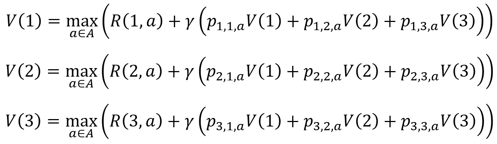
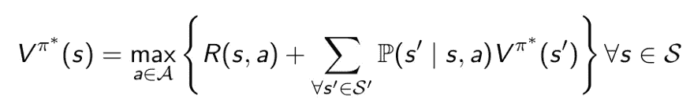
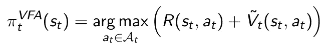
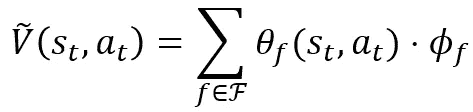
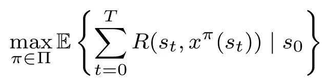
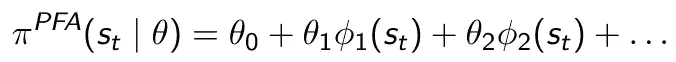

# 为什么强化学习不需要贝尔曼方程

> 原文：<https://towardsdatascience.com/why-reinforcement-learning-doesnt-need-bellman-s-equation-c9c2e51a0b7>

## 强化学习中著名的贝尔曼方程和 MDP 公式的再评价

理查德·贝尔曼在圣莫尼卡的兰德公司工作时，创立了动态编程和他著名的递归方程。照片由 [Sung Shin](https://unsplash.com/@ironstagram?utm_source=medium&utm_medium=referral) 在 [Unsplash](https://unsplash.com?utm_source=medium&utm_medium=referral) 上拍摄

在学术界，将强化学习(RL)算法与马尔可夫决策过程(MDP)公式和著名的**贝尔曼方程**联系起来经常是样板文件。乍一看，这是有意义的，因为我们通常旨在为 MDP 找到近似最优的策略。然而，在许多方面，RL 已经偏离了动态编程的起源如此之远，以至于人们可能会想，在我们的问题定义中，我们是否真的需要贝尔曼方程。

这篇文章并不是对贝尔曼方程本身的批评。正如我们将很快看到的，这是一个非常优雅的公式，在一行数学中捕捉到甚至最混乱的问题。考虑到许多现实世界的组合问题的问题状态比宇宙中的原子还多，这是一个相当大的壮举。

当你理解了顺序决策问题的复杂性和重要性，你可能会像我一样欣赏贝尔曼的贡献。然而，这并不意味着我们需要在 RL 中使用它们。

# 什么是动态编程？

照片由[朱利安·迈尔斯](https://unsplash.com/@julianmyleshoward?utm_source=medium&utm_medium=referral)在 [Unsplash](https://unsplash.com?utm_source=medium&utm_medium=referral) 上拍摄

动态编程起源于 20 世纪 50 年代。当时，理查德·贝尔曼在圣莫尼卡的兰德公司工作。就在那里，坐在一棵棕榈树下——或者我是这么想的——理查德·贝尔曼发明了他著名的方程式。

虽然我不会在这里深入解释动态编程，但关键的概念是，跨越一个时间范围的大问题可以分解成一系列嵌套的小问题。这些较小的问题可以递归地解决，产生一个最优的**决策策略**，为每个问题状态提供最佳的行动。

要部署动态规划，我们必须能够将问题定义为 MDP，包括(I)状态空间、(ii)动作空间、(iii)转移函数和(iv)奖励函数(可能还有(v)贴现率)的形式化。决策必须只依赖于当前状态——所谓的**马尔可夫(或无记忆)性质**。如果条件满足，我们可以(理论上)使用动态规划来解决问题。

贝尔曼认识到，对于每个状态，可以定义一个**价值函数**，捕捉一个行为的直接回报/成本和(贴现的)下游价值。例如，我们可能决定每天储备多少产品，预测概率销售情况。

考虑一个三态问题。在每个状态下，我们可以采取一个动作`a∈A`。然后，以概率`p_s,s’,a`，我们移动到另一个具有相关价值函数`V(s’)`的状态。我们可以将每个状态的值函数定义为一个方程组:

三态问题的价值函数系统[图片由作者提供]

最大化每个价值函数优化了策略。简而言之，如果我们知道最优价值函数，我们总是可以选择最大化预期累积回报的行动。简单地说，这就是贝尔曼的解决方案。

价值函数方法的美妙之处在于，我们不需要知道任何关于实际问题结构或决策规则的东西。**知道最优值函数就等于知道最优策略。**

寻找最优值函数的经典动态规划求解方法有[值迭代](/implement-value-iteration-in-python-a-minimal-working-example-f638907f3437)和[策略迭代](/implement-policy-iteration-in-python-a-minimal-working-example-6bf6cc156ca9)。您可以在以下文章中详细了解它们:

    

# 贝尔曼方程和维数灾难

刚才讨论的三态问题非常容易处理，但是如果有一百万个状态，方程组就会变得一团糟。幸运的是，我们不需要手写出所有的方程。事实上，整个系统可以被压缩成一行至高无上的数学优雅:

贝尔曼方程。由于价值函数之间的相互引用，系统是递归的。可以使用诸如值迭代之类的动态编程技术来找到最佳值函数。

想想就觉得很刺眼。一个状态`s`可以是一个包含元素的巨大向量，甚至可能包含随机知识。动作`a`可能受到许多约束，并且只能通过求解复杂的数学程序来识别。看似简单的概率函数`P`可能隐藏着一个怪诞的随机系统，导致许多可能的结果状态`s’`，它们都需要明确的评估。随机环境中的顺序优化通常是非常非常混乱的。然而，贝尔曼设法将所有这些动态捕捉到一个单一的，易于理解的线。这是一件艺术品，真的。

不幸的是，模拟一个问题的能力并不意味着我们能够真正解决这个问题。还记得那个三态方程组吗？事实上，这个问题不会只包含三种状态，而是更多。假设我们有一百万个状态，每个状态有一百万个可能的动作，以及一百万个状态(结果)我们可以在之后到达。这需要考虑 10 种⁸可能性，大致相当于地球上沙粒的数量。那些熟悉组合优化的人知道解决如此大规模的问题有多容易，甚至更难。

理查德·贝尔曼本人非常清楚他的解决方法在计算上的局限性，他创造了术语*‘维数灾难’*来强调他的方法缺乏可扩展性。其实可能是**三咒** : *状态空间*，*动作空间*，*结果空间*。

对于许多问题，无论我们有多少计算能力，我们都无法将 MDP 分解为最优。这就是强化学习的用武之地。

# 价值函数逼近

如果我们希望解决贝尔曼方程，我们必须找到每个状态的价值函数`s∈S`。对于每个单独的价值函数，我们应该评估与每个潜在结果`s’∈S’`相关联的价值函数(结果空间`S’`很可能等同于完整的状态空间`S`)。对于大的状态空间，这根本行不通。

典型的强化学习方法是(I)重复采样随机状态转换(而不是穷尽地评估每个可能的结果),以及(ii)用一组特征代替完整的状态描述(避免需要为每个单独的状态定义值函数)。因此，我们的目标是找到一个有希望接近最优的政策。但是，有多种方法可以实现这一点。

为了接近动态规划方法，我们可以求助于**价值函数逼近**。通过这种方法，我们明确地试图通过一个近似函数对`V(s)`建模。例子有 Q-tables ( [SARSA，Q-learning](/walking-off-the-cliff-with-off-policy-reinforcement-learning-7fdbcdfe31ff) )，[基于特征的线性函数逼近](/using-linear-programming-to-boost-your-reinforcement-learning-algorithms-994977665902)，或者 [critic networks](/a-minimal-working-example-for-deep-q-learning-in-tensorflow-2-0-e0ca8a944d5e) 。请注意，贝尔曼方程——当然是以近似形式——用于表达**决策政策**:

价值函数近似的策略定义。对于这个解决方案类，政策制定和贝尔曼方程之间有一个可见的联系，尽管递归方面已经消失了。

线性值函数近似值的示例。这里，我们用特征θ_f(s，a)和相应的权重ϕ_f.的线性组合来代替“真实”值函数

你可能会说我们近似贝尔曼方程，这种类比并不太牵强。

尽管如此，这个类比并不适用于强化学习的整个领域，也不适用于人类的整体决策。如果你接近一个十字路口，你可能会想到*‘左’**‘右’**‘直’*而不是去思考更远的路的下游值。许多经理完全能够在日常基础上做出连续决策，甚至没有听说过贝尔曼方程。无数的 RL 算法没有尝试明确地对价值函数建模。

简而言之，价值函数不是制定决策政策的必需品。

# 目标函数

我们正在慢慢了解这个故事的关键(是的，终于)。如果有这么多不需要定义价值函数的解决方案，为什么我们一直把它们包含在我们的问题公式中？

似乎一个普遍的误解是这个惯例的根源。简而言之:贝尔曼方程是*而不是*一个目标函数。这是一个**最优条件**。如果我们找到了最优值函数，我们就找到了最优策略。然而，**和 MDP** **的定义无论如何都不需要值函数**。

混淆的根源很容易看出:暗示目标的最大化函数，动态规划基础，最优值函数的最优政策保证。但是，我再重复一遍:*贝尔曼方程只是一个最优性条件*。可以使用动态规划来求解该问题，以找到 MDP 的最优策略。不多不少。

如果目标不是贝尔曼方程，那是什么？

答案在**奖励函数**(这是任何 MDP 的强制组件)。鉴于*价值*功能是一个有点抽象和人为的概念，*回报*功能为我们采取的每一个行动定义了一个非常实际的回报(或成本)。当我们在一个(可能是无限的)时间范围内进行优化时，将我们的目标建立在累积回报的基础上是有意义的。

对于*有限的*决策范围，我们可以简单地将奖励的总和作为我们的**目标函数**(例如，最大化下周的销售额)。对于无限的地平线问题，我们可以采用贴现报酬序列或者简单的平均报酬(理查德·萨顿建议后者)。请注意，这些是非常自然的目标，符合人类通常的决策方式。

有限视野目标函数的例子。在这种情况下，我们只是随着时间的推移最大化总报酬。注意我们不需要价值函数。

# 其他强化学习课程

随着贝尔曼方程的消失，常见的 RL 方法如[策略梯度算法](/a-minimal-working-example-for-continuous-policy-gradients-in-tensorflow-2-0-d3413ec38c6b)更有意义。事实上，在沃伦·鲍威尔提出的四类政策中，只有一类(价值函数逼近)与贝尔曼方程密切相关。在如下概述的备选策略类中，我们看不到动态编程的痕迹:

策略函数近似(PFA)提供了基于状态返回决策的直接表达式。

成本函数逼近(CFA)增加了奖励函数，以纳入下游效应，而没有为此目的公开定义价值函数。

你可以看到强化学习当然不需要求解贝尔曼方程，甚至不需要近似求解。

   [## 强化学习的四个策略类别

towardsdatascience.com](/the-four-policy-classes-of-reinforcement-learning-38185daa6c8a) 

# 结束语

是时候完成这个循环了。强化学习是解决具有计算挑战性的顺序决策问题的框架。由于它们可能变得相当复杂，我们需要精确和明确的问题定义来与利益相关者交流并找到解决方案。出于这个目的，使用 MDP 符号惯例是非常合理的。

尽管相当一部分 RL 算法试图逼近贝尔曼方程中假设的值函数，但许多解决方案根本不遵循动态编程范式。由于贝尔曼方程是一个**最优条件，而不是一个目标函数**，包含它在最好的情况下是多余的，在最坏的情况下是误导的。如果有的话，假设我们遵循基于价值的方法，RL 决策*政策*可能是贝尔曼方程的近似。

一个 MDP 只需要四个成分:(I)状态空间，(ii)动作空间，(iii)转移函数和(iv)奖励函数。贝尔曼方程或价值函数无处可寻。RL 需要一个**目标函数**来处理，但这只是一个简单的奖励的总和或平均序列。如果我们不逼近价值函数，贝尔曼方程就没有作用。

动态规划和相应的递归值函数系统是一块数学上的辉煌。贝尔曼的工作是顺序决策的一个突破，即使在今天，它仍然保留了很大的理论和实践影响。

和任何东西一样，只是有一个使用它的时间和地点。

# 外卖食品

*   贝尔曼方程是求解 MDPs 的一个**最优性条件**，而不是目标函数。潜在的概念是，拥有最优价值函数等同于拥有最优策略。价值函数系统可以使用动态规划来求解。
*   典型的**目标函数**只是将累积奖励最大化，例如，采用贴现奖励流或一段时间内的平均值。这些只需要*奖励*函数，不需要*值*函数。
*   许多强化学习解决方案与动态编程没有直接联系。贝尔曼方程仅明确用于四个策略类别中的一个**，即价值函数逼近。**
*   贝尔曼所宣扬的价值函数并不一定反映人类如何做出决策。最大化(折扣)**累积或平均奖励**是一种更自然的沟通决策的方式。

# 进一步阅读

贝尔曼河(1961 年)。*自适应控制过程:指导游览*。普林斯顿大学出版社。

鲍威尔，W.B. (2019)。随机优化的统一框架。*欧洲运筹学杂志*275.3(2019):795–821。

萨顿和巴尔托公司(2018 年)。*强化学习:简介*。麻省理工出版社。

鲍威尔和梅塞尔(2015 年)。能源中的随机优化教程——第二部分:能量存储图解。 *IEEE 电力系统汇刊*31.2(2015):1468–1475。

纳伊克，a .，沙里夫，r .，Yasui，n .，姚，h .和萨顿，R. (2019)。折扣强化学习不是一个优化问题。【https://arxiv.org/pdf/1910.02140.pdf 

维基百科(2022)。*贝尔曼方程。*[https://en.wikipedia.org/wiki/Bellman_equation](https://en.wikipedia.org/wiki/Bellman_equation)

维基百科(2022)。*动态编程。*[https://en.wikipedia.org/wiki/Dynamic_programming](https://en.wikipedia.org/wiki/Dynamic_programming)

维基百科(2022)。*马尔可夫决策过程。*[https://en.wikipedia.org/wiki/Markov_decision_process](https://en.wikipedia.org/wiki/Markov_decision_process)

维基百科(2022)。*理查德·贝尔曼。*[https://en.wikipedia.org/wiki/Richard_E._Bellman](https://en.wikipedia.org/wiki/Richard_E._Bellman#cite_note-15)