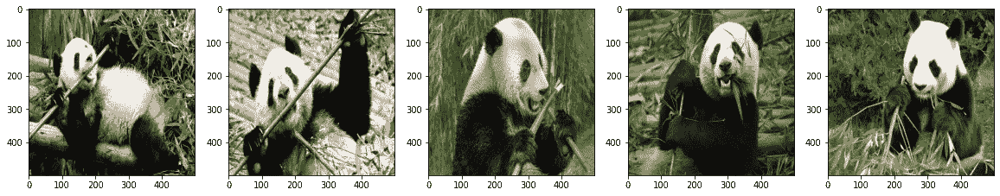
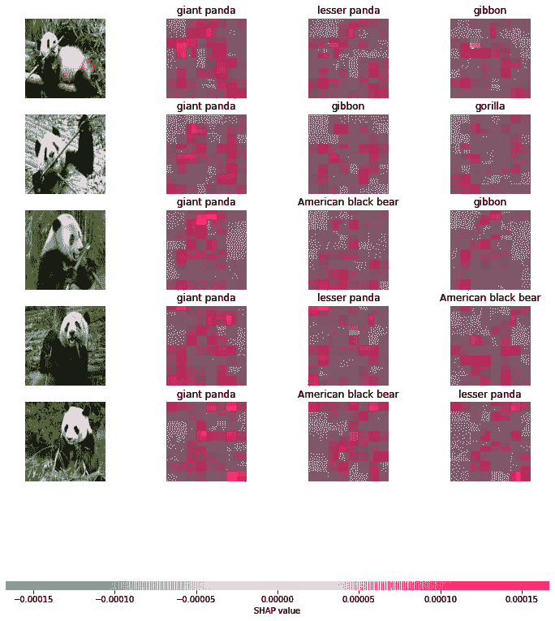
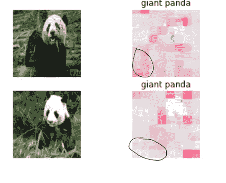

# 为什么 SHAP 价值观可能不完美

> 原文：<https://towardsdatascience.com/why-shap-values-might-not-be-perfect-cbc8056056be>

## SHAP 价值观弱点的两个例子和可能的解决方案概述

SHAP 值似乎消除了机器学习模型的复杂性和解释难度之间的权衡，鼓励研究人员和数据科学家设计算法，而不用担心如何理解任何黑盒给出的预测。但是 SHAP 能解释所有的财产吗？

在这篇文章中，我们将通过一些例子来讨论 SHAP 价值观的一个重要弱点。可能的解决方案概述也将很快提交。

# SHAP 价值观及其局限性

SHAP 值基于合作博弈理论，通过在特征之间公平分配“支出”来量化导致预测的特征之间的交互。

然而，Frye 等人[1]认为，SHAP 值有一个明显的局限性，因为它们忽略了数据中的所有因果结构。更准确地说，这种框架在模型解释中将所有特征放在同等的地位上，要求属性平等地分布在信息相同的特征上。

例如，考虑一个将资历和工资作为输入并预测此人是否能从银行获得贷款的模型。SHAP 看重的一个形象告诉我们，他的资历和薪水都有很大的 SHAP 价值，这有助于他成功申请。然而，他的工资主要来自他的资历，在这种情况下，没有理由因为他的资历而给他的工资分配一个大的 SHAP 值。

SHAP 值框架中因果结构的缺失可能是严重的，在某些用例中会导致错误的决策，因为考虑用大 SHAP 值改进某个特征，而这些值可能只是其他特征的结果。回到贷款的例子，形象 SHAP 告诉一个人，你没有得到贷款，因为你的工资低，他引诱你换一份工资更高的工作。然而，申请仍然可能被拒绝，因为新工作会导致资历变浅。

我们将在接下来的章节中提供一些更详细的例子。

# 熊猫图像示例

本节考虑一个用于图像分类的预训练深度学习模型的示例，Inception V1，具有 [1001 个类别标签](https://storage.googleapis.com/download.tensorflow.org/data/ImageNetLabels.txt)，包括大熊猫、树蛙等。在[tensor flow hub](https://tfhub.dev/google/imagenet/inception_v1/classification/5)上可用。详细的实现在[笔记本](https://colab.research.google.com/drive/1sqdDEkgzZk4Q0LfVn8ysW6xwxgqcESvb#scrollTo=f2P3QSDSeRK1)中提供。

以下实验考虑包含 5 幅大熊猫图像的以下集合，每幅图像被预处理为大小为(500，500，3)范围从 0 到 255 的数组，并且我们希望计算由初始 V1 模型给出的图像的前三分之一可能类别的 SHAP 值，以了解哪些像素对最终分类结果的贡献更大。

作者图片:一组熊猫图片

为此，我们编写了下面几行代码:

计算 SHAP 值

前两行除了重新缩放图像数组以适应模型的输入之外什么都不做。我们使用与输入图像大小相同的遮罩作为 SHAP 值计算的背景。 *image_plot* 函数给出了结果的直观图示:

图片作者:SHAP 价值观的大熊猫形象

深入查看结果，尤其是最后两张图像，我们立即注意到，熊猫身体中的像素具有较大的 SHAP 值，即我们标记了一个圆的位置:

具有与熊猫无关的大 SHAP 值的像素

这种归因可能有一个直接的解释:注意到这些像素形成了大熊猫最喜欢的竹子，我们认为它们的频繁存在带来了这种有偏见的重要性。如果我们知道熊猫的存在是竹子的因果祖先，那么将竹子的重要性归因于熊猫身体当然更有意义，而不幸的是，SHAP 值无法通过假设所有特征都是独立的来捕捉如此重要的信息。

# 可能的解决方案

好消息是，研究人员已经注意到，在当前的 SHAP 价值观框架中，这种因果结构并不存在。这里我们给出了两种方法:非对称 SHAP 值[1]和偶然 SHAP 值[2]。

非对称 SHAP 值(asv)主要消除了当前 SHAP 值框架的对称性，即如果两个特征值对所有可能的联盟的贡献相等，则它们的贡献应该相同。相比之下，当将所有“收益”加在一起时，引入了包含特征因果关系的权重作为概率度量。这样的设计更强调从根本原因方面的解释，而不是对直接原因的解释。

另一方面，Heskes 等人[2]指出*“不需要借助非对称的 Shapley 值来整合因果知识”*，并提出了一个因果 SHAP 值(CSVs)框架。该定义只不过是通过用 Pearl[3]的微积分定义价值函数来合并干预。这种设计确实将一个特征的重要性分解为两部分:直接和间接，并且通过考虑这两种不同类型对最终预测的影响，将导致更好的决策。

我邀请读者关注我以后的文章，以获得关于 CSV 的具体示例的更详细的解释和实现。

# 参考

[1] C. Frye、C. Rowat 和 I .格非，“不对称的 shapley 值:将因果知识纳入模型不可知的可解释性”，载于*神经信息处理系统进展 33:神经信息处理系统 2020 年年度会议，NeurIPS 2020，2020 年 12 月 6-12 日，virtual* ，H. Larochelle，M. Ranzato，R. Hadsell，M. Balcan 和 H. Lin 编辑。, 2020.

[2] D. Janzing，L. Minorics 和 P. Blöbaum，“可解释人工智能中的特征相关性量化:一个因果问题”，载于*第 23 届人工智能和统计国际会议，AISTATS 2020，2020 年 8 月 26-28 日，在线【意大利西西里岛巴勒莫】*，ser。机器学习研究会议录。，第 108 卷。

[3]Do-Calculus 重温朱迪亚珍珠主题演讲，2012 年 8 月 17 日，UAI-2012 年会议，加利福尼亚州卡特琳娜【https://ftp.cs.ucla.edu/pub/stat_ser/r402.pdf 