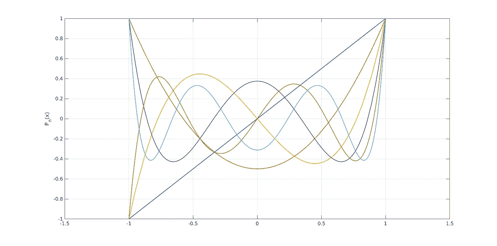
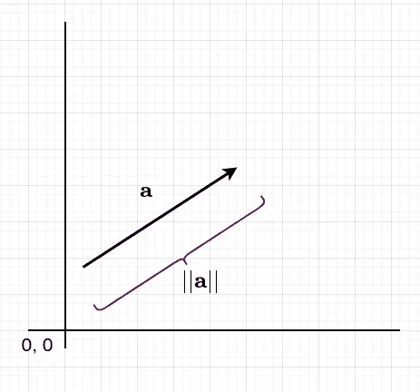
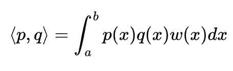
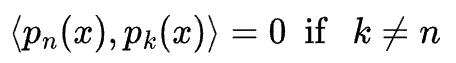
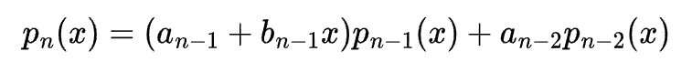
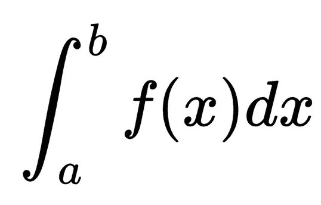
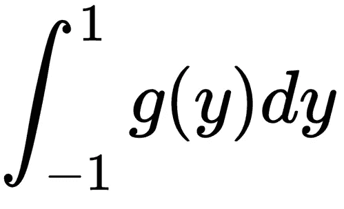
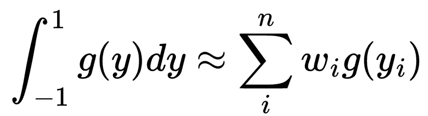
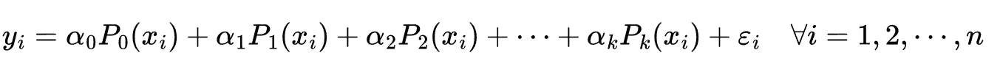

# 为什么要用正交多项式？

> 原文：<https://towardsdatascience.com/why-should-we-use-orthogonal-polynomials-b42b36f158a7>

## 数据科学的正交多项式

这张图片是作者使用人工智能工具生成的。

1 至 6 次勒让德多项式:图片由作者生成

正交多项式是求解和解释许多次微分方程的有用工具。此外，它们是函数的最小二乘近似、差分方程和傅立叶级数的方便的数学工具。正交多项式的另一个重要应用是纠错码和球封装。正交多项式的一些其他模糊应用是图的匹配多项式和随机矩阵理论。

为了更好地理解正交多项式，我们首先需要理解向量、内积、正交性、Gram-Schmidt 正交归一化和希尔伯特空间。接下来的几段给出了这些预备知识的简要概述，以便理解正交多项式。

# 预赛

## 向量

矢量是有方向和大小的物体。考虑一下你开车的速度。如果我们不量化汽车的行驶方向，那么它就不是一个矢量。但是如果我们指定汽车向东行驶，那么它可能是一个矢量，因此它将被称为速度。几何上，它是一条线段，箭头指向某个方向。在印刷文本中，可以用粗体字母表示，如 **a** 或普通字母上的箭头。在本文中，我们将使用粗体字母。矢量 **a** 的大小由∨**a**∨给出，如图 1 所示。一般来说，∨**一个**∨也叫一个**范数**。在二维坐标空间中，点由有序对 *(x，y)* 表示。向量的每一端可以由两个这样的有序对 *(x，y)* 和 *(u，v)* 来定义。由所有这样的有序对组成的平面称为**向量空间**。对于所有的实数，二维向量空间用ℝ表示。

图一。一个向量

## 内部产品

内积是将两个向量相乘的一种方式，结果是一个标量(即，只是一个大小，没有方向的概念)。如果两个向量是用有序对 *(x，y)**(u，v)* 表示的 **a** 和 **b** ，那么它们的内积就是 *xu* + yv** 其中 *u** 是 *u* 的复共轭， *v** 是 *v* 的复共轭。当然，当这些数是实数时，那么复共轭就和数本身一样。内积也用÷**a，b** 表示。

## 正交性

两个向量 **a** 和 **b** 正交，如果它们的内积〈T4〉a，b 〉= 0。在这种情况下，一个向量在另一个向量上的投影折叠成一个点，我们得到的距离为零。如果一个向量列表中的向量是成对正交的，并且每个向量的范数等于 1，那么这个向量列表称为正交的。

## 格拉姆-施密特正交归一化

Gram-Schmidt 正交归一化过程将一列线性无关向量转换成正交向量。我将用一个例子来解释这个过程。

考虑三维向量空间中的三个向量: **a** (1，-1，1)**b**(1，0，1)**c**(1，1，2)。我们寻找的新的向量列表是[ **u** ， **v** ，**w】**。

1.  **u = a =** (1，-1，1)。
2.  **v = b**-**(****b，u**〉⋅**u/| | u | |)=**(1/3，2/3，1/3)
3.  **w**=**c**-**(**〉**c，u**〉⋅**u/| | u | |)**-**(**〉**c，v**〉⋅**v/| | v |)=**(-1/2，0，1/2)

这些是正交向量。现在，我们将它们归一化，用它们除以它们的范数得到标准正交向量，从而得到 **u** (√3/3，-√3/3，√3/3)， **v** (√6/6，√6/3，√6/6)， **w** (-√2/2，0，√2/2)。

现在，回到正题。

# 正交多项式

多项式也可以以类似于向量的方式使用，即，它们在给定范围*【a，b】*上服从类似于正交向量的正交关系。在这个意义上，对于一个多项式 *p(x)* ，和一个变量 *x* 中的 *q(x)* ，我们可以将它们的内积定义为

等式 1。两个多项式的内积

其中 *w(x)* 为*【a，b】*范围内的任意非负函数。有趣的是，我们还可以对多项式执行 Gram-Schmidt 过程来获得正交多项式。作为例子，我们可以对*【1，x，x，…】*进行正交归一，得到一族正交多项式。根据 *w(x)* 的选择，我们可以得到不同的多项式族。例如:

1.  对于区间 *[-1，1]* 上的 *w(x) = 1* ，得到勒让德多项式。
2.  对于 *[-1，-1]* 上的 *w(x) = 1/sqrt(1-x* ，我们得到第一类切比雪夫多项式。
3.  对于 *[-1，1]* 上的 *w(x)* = *sqrt(1-x )* 我们得到第二类切比雪夫多项式。
4.  对于 *w(x) = exp(-x)* 关于 *[0，∞]* 我们得到拉盖尔多项式。

## 正交多项式的一些性质；

1.  如果 *pₙ(x)* 是 n 次多项式，则

因此， *pₙ(x)* 正交于所有次数小于 *n-1* 的多项式。

2.进一步地，随着系数的选择 *aₙ* 和 *bₙ* 取决于你选择*w(x)*我们有下面的递推关系:

性质 2 在法瓦德定理中陈述，给定如上所述的三项递推，存在 *w(x)* ，反之亦然。

# 正交多项式的一些应用

## 高斯求积逼近定积分

高斯求积是计算定积分的一种方法

*【a，b】*范围内的定积分

我们考虑一个变量代换 *x = ( b — a)y /2 + (a + b) y/2，*和*g(y)=(b—a)* f(x)/2*将上述定积分转换为

虽然中点规则和梯形规则在数值计算上述定积分时是最简单的，但有一个规则可以精确计算上述积分。在数值上，上述积分可写成

这需要选择合适的 *yᵢ* 和 *wᵢ* 。在这种情况下，卡尔·弗里德里希·高斯设计出，如果我们选择 *yᵢ* 作为与 *w(y)* 相关联的正交多项式*pₙ(y*的根，那么我们就可以精确地积分次数为 *2n-1* 的多项式。这条规则被称为**高斯求积**规则。显然，最简单的情况可能是当 *wᵢ* *= 1* 时，这就是勒让德多项式的情况。利用勒让德多项式，我们得到高斯-勒让德求积法则。

正如劳埃德·n·特雷费森在[https://epubs.siam.org/doi/abs/10.1137/060659831](https://epubs.siam.org/doi/abs/10.1137/060659831)中 所研究的那样，高斯求积极其有效。

## 正交多项式回归

通常在线性回归模型方法中，选择合适的多项式阶是必要的。在模型构建策略中，我们以递增的顺序将数据拟合到模型中，并在模型拟合的每一步测试回归系数的显著性。这就是**正向选择法**。我们不断增加顺序，直到最高顺序的 t 检验不显著。

我们还有一个**反向消除**方法，我们从一个适当的最高阶模型开始，开始消除每个最高阶项，直到我们获得剩余最高阶项的显著 t 检验统计量。

向前选择法和向后淘汰法不一定导致相同的模型。然而，我们可以寻找一个模型，在这个模型中，增加一个新的高阶项只是改进了模型，而不需要重新计算。这不能通过变量 *x* 的连续幂来实现。但是它可以通过正交多项式系统来实现。如果线性回归具有形式 *y = Xβ + ε* ，那么等价的正交多项式回归模型由下式给出

> 我希望正交多项式的主题对对数值分析和模型拟合技术感兴趣的读者有所帮助。如果你有兴趣阅读更多类似的话题，请通过[https://rahulbhadani.medium.com/membership](https://rahulbhadani.medium.com/membership)订阅 Medium。虽然只是 5 美元/月，但对我有很大的帮助，因为 Medium 支付你的订阅费的一部分给作家。

# 参考

1.  [https://mathworld . wolfram . com/Gram-schmidtortonormalization . html](https://mathworld.wolfram.com/Gram-SchmidtOrthonormalization.html)
2.  [https://Twitter . com/sandwich maker/status/1477449233405861889](https://twitter.com/sandwichmaker/status/1477449233405861889)
3.  [https://github.com/sigma-py/orthopy](https://github.com/sigma-py/orthopy)
4.  [https://math . okstate . edu/people/yq Wang/teaching/math 4513 _ fall 12/Notes/Gaussian . pdf](https://math.okstate.edu/people/yqwang/teaching/math4513_fall12/Notes/gaussian.pdf)
5.  [https://docs . scipy . org/doc/scipy/reference/generated/scipy . integrate . quadrature . html](https://docs.scipy.org/doc/scipy/reference/generated/scipy.integrate.quadrature.html)
6.  [https://people.sc.fsu.edu/~jpeterson/numerical_quadrature](https://people.sc.fsu.edu/~jpeterson/numerical_quadrature)