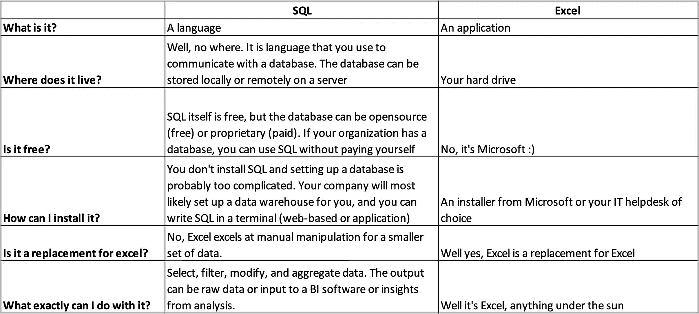

# 你为什么要在业余时间学习 SQL？

> 原文：<https://towardsdatascience.com/why-should-you-pick-up-sql-in-your-spare-time-65634dbb6eb1>

SQL 简单易学，可用于各种业务应用。它是一种用于商业数据分析的强大语言。不费吹灰之力，每个人都可以学会使用 SQL。

凯文·Ku 在 [Unsplash](https://unsplash.com?utm_source=medium&utm_medium=referral) 上的照片

# 什么是 SQL，它做什么？

SQL(发音为“sequel”或“S-Q-L”)代表结构化查询语言。它是一种用于与数据库通信的标准计算机语言。换句话说，它允许您与数据库对话以提取数据或进行更改。看看最近的招聘信息，你会发现对 SQL 技能的需求越来越大。这是因为数据在商业中变得越来越关键，SQL 有利于每个人都知道，而不仅仅是数据专业人员。

两个主要群体将 SQL 用于不同的目的。第一种是开发人员使用 SQL 构建数据库或与数据库交互。你电脑上的大部分应用程序或者你日常使用的网络应用程序都是由数据库驱动的。当您访问应用程序或输入数据时，SQL 代码会在后端执行，以向数据库读取或写入数据。

*   将数据插入数据库:如果你正在开发一个应用程序，你需要将数据插入数据库。例如，当新用户注册您的应用程序时，他们的信息需要添加到数据库中。
*   更新数据库中的数据:这是开发人员的另一项常见任务。例如，如果用户更改了他们的地址，您必须相应地更新数据库。
*   从数据库中删除数据:您可能还需要从数据库中删除数据。例如，如果用户删除了他们的帐户，您必须从数据库中删除他们的数据。

第二个用户组是从数据库中检索数据以进行业务分析的业务人员。这些将是业务人员将执行的最受欢迎的用例。知道如何从数据库中提取数据并进行简单的数据分析将在你的职业生涯中非常有用。活动示例包括:

*   从数据库中检索数据:这是使用 SQL 可以做的最基本的事情。您可以使用各种筛选器来准确指定要检索的数据。例如，您可以检索上个月在加利福尼亚购物的客户的所有数据。
*   执行数据分析:SQL 也常用于数据分析。例如，您可以使用 SQL 来计算加利福尼亚所有客户的平均购买量。

# 为什么了解 SQL 有好处？

塞巴斯蒂安·赫尔曼在 [Unsplash](https://unsplash.com?utm_source=medium&utm_medium=referral) 上的照片

作为一名商务人士，学习 SQL 可以让你在决策时更加以数据为导向。在当今的商业世界中，数据变得越来越重要。不用等别人给你提供数据，你可以自己访问数据，迅速得到你需要的答案。

自己处理数据也会让你更懂数据。这意味着当数据呈现给你时，你将能够更好地理解数据，并且你也将能够更有效地向他人传达你的数据需求。那些能够有效分析数据的人将比那些不能有效分析数据的人有明显的优势。

SQL 也是简历中一项有价值的技能。如前所述，SQL 技能的需求越来越大，了解 SQL 会让你在潜在雇主面前更有市场。

# 我已经知道 Excel 了。何必学习呢？

照片由[米卡·鲍梅斯特](https://unsplash.com/@mbaumi?utm_source=medium&utm_medium=referral)在 [Unsplash](https://unsplash.com?utm_source=medium&utm_medium=referral) 上拍摄

对于小数据集，Excel 是一个优秀的工具，但是当数据变大时，它很快就变得很麻烦。每个 Excel 文件都有行数限制(大约一百万行)。当数据超过这个限制时，您需要将数据分割成多个文件或使用其他工具。您组织的数据通常也不会存储在您的计算机中。因此，将不同数据源的数据收集到您的计算机中进行分析既费时又麻烦。另一方面，SQL 是为处理大型数据集而设计的，比 Excel 快 10-100 倍。

除了数据大小限制之外，Excel 的另一个问题是它是为单用户使用而设计的。换句话说，它假设只有一个人同时使用数据。数据存储在本地计算机上，如果两个人在处理同一个数据集，他们需要手动合并他们的更改。这可能会导致错误和数据不一致。相反，SQL 数据库是为多用户并发使用而设计的。用户可以在不影响彼此工作的情况下查询集中存储的数据。

Excel 的另一个问题是不同文件中的数据不容易合并。如果在两个不同的 Excel 文件中有数据，则必须手动将数据从一个文件复制并粘贴到另一个文件中。这不仅耗时，而且容易出错。最糟糕的是，如果你在分析中犯了一个错误，由于数据分散在不同的步骤中，很难追踪到错误。即使您找到了错误，您仍然需要再次执行所有的 VLOOKUP 和复制粘贴。

作者图片:SQL 与 Excel 常见问题

# 怎样才能开始学习 SQL？

[真诚媒体](https://unsplash.com/@sincerelymedia?utm_source=medium&utm_medium=referral)在 [Unsplash](https://unsplash.com?utm_source=medium&utm_medium=referral) 上拍摄的照片

如果你想学习 SQL，有两个主要步骤:**学习**语言和**使用**语言。在学习部分，有大量资源可供您开始学习:

*   [w3schools](https://www.w3schools.com/sql/default.asp)
*   [SQLZOO](https://sqlzoo.net/wiki/SQL_Tutorial)
*   [可汗学院](https://www.khanacademy.org/computing/computer-programming/sql)
*   [edX](https://www.edx.org/course)

除了这些资源，你还可以在 YouTube、书籍和训练营上找到指导视频。

一旦你掌握了技术部分，是时候开始应用你所学的知识来解决现实世界的商业问题了。最好的方法就是找到你感兴趣的数据，然后开始摆弄它。您的组织可能已经有一个数据仓库，或者您可以寻找公共数据集。这是一个重要的步骤，因为它允许你以一种有意义的方式应用你所学的概念。做好这一点，你会发现你很快就精通 SQL 了。

您为此使用的数据不需要很大。事实上，从小型且结构良好的数据开始往往更容易。寻找小型且结构良好的数据集的绝佳场所。在下一篇文章中，我将讨论如何通过在商业环境中使用语言来学习 SQL。

# 总结

随着业务越来越受数据驱动，对 SQL 技能的需求也在增加。SQL 是一种通用的技能，任何想要检索和分析数据的人都可以使用。查看我的下一篇文章，关于如何在 Google BigQuery 上用真实世界的数据集学习 SQL。

  

开始学习 SQL，给自己一个优势。