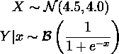
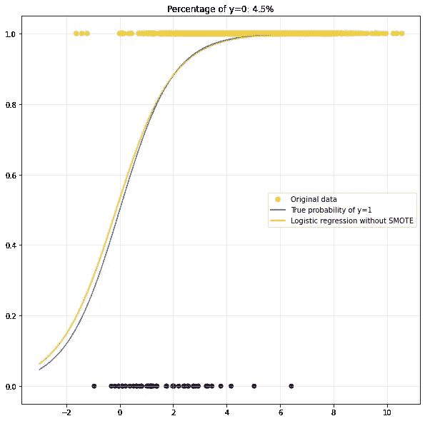
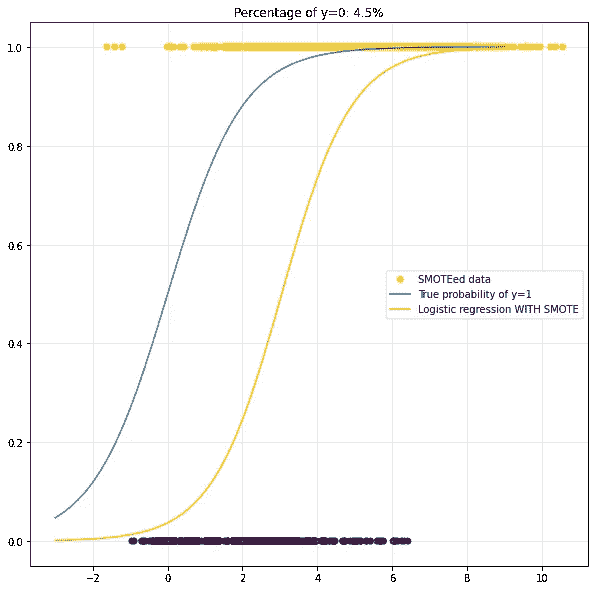
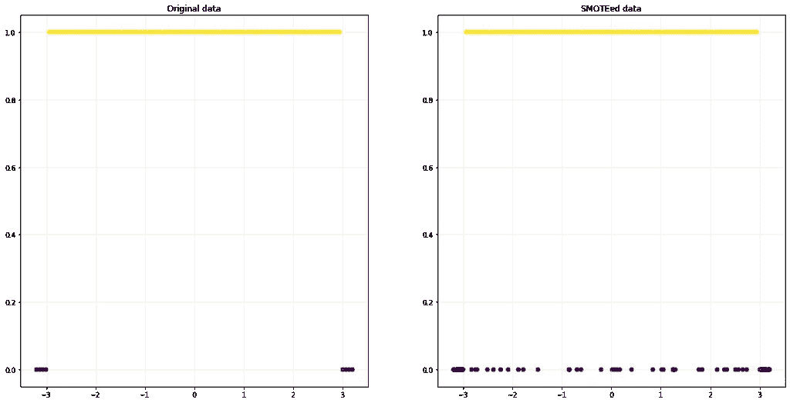
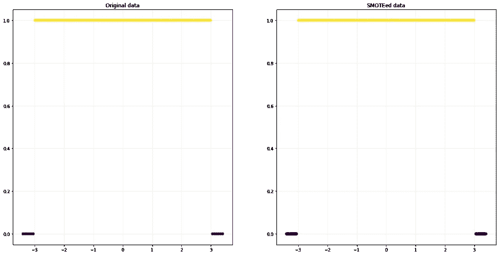
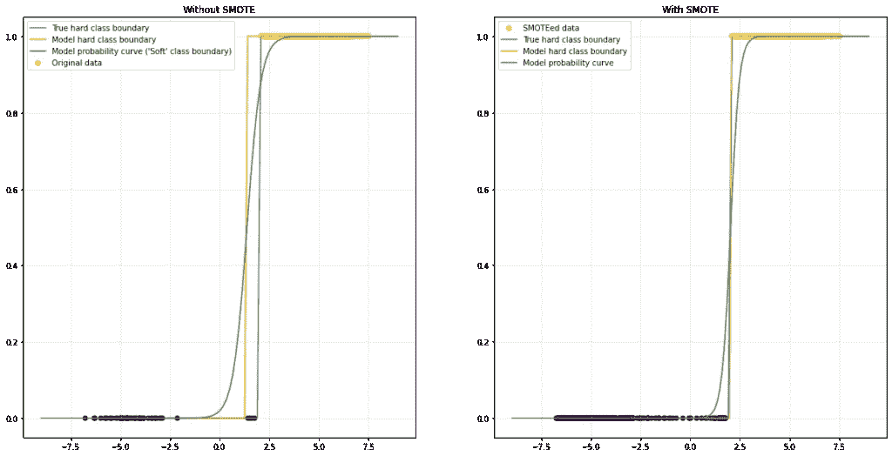

# 为什么 SMOTE 不一定是不平衡数据集的答案

> 原文：<https://towardsdatascience.com/why-smote-is-not-necessarily-the-answer-to-your-imbalanced-dataset-ef19881da57a>

## 人人都爱 SMOTE，但它真的是银弹吗？

埃伯哈德·🖐·格罗斯加斯泰格在 [Unsplash](https://unsplash.com/s/photos/smoke?utm_source=unsplash&utm_medium=referral&utm_content=creditCopyText) 上拍摄的照片

当不平衡分类的话题出现时，许多人称赞 SMOTE 是首选方法。事实上，流行的算法在社区的进化选择过程中幸存了下来。然而，我们仍然不应该盲目地对我们的问题提出现成的解决方案。为了证明这一点，我们可以构造让 SMOTE 惨败的实际玩具例子。在此之前，让我们简单回顾一下不平衡问题和算法本身。

# SMOTE 打算如何解决不平衡分类的问题

社区数据科学的大部分对不平衡数据的叙述如下:

如果数据集中的一个或多个类严重不足，分类算法在训练后通常无法识别这些类。为了解决这个问题，我们使用一些重采样技术来创建一个新的数据集，其中所有的类大致相等。SMOTE 算法是迄今为止经受住时间考验的重采样技术之一。

总之，SMOTE 通过在少数群体的域间隙中随机创建合成观测值来对代表性不足的类进行过采样。考虑一个 1D 的例子，其中你的少数类实例都位于区间`[0,1]`中。SMOTE 现在通过随机插入两个现有的数据点，在此间隔内创建更多的少数实例。

这里不再赘述，但如果想了解更多，推荐阅读[原文](https://arxiv.org/pdf/1106.1813.pdf)。值得一提的是，如果输入数据不连续，原始的 SMOTE 算法将不起作用。考虑一次性编码数据——随机插值步骤将创建非二进制合成数据，这显然是错误的。幸运的是，[不平衡学习](https://imbalanced-learn.org/stable/index.html)库包含了一个适合这种情况的[选择](https://imbalanced-learn.org/stable/references/generated/imblearn.over_sampling.SMOTENC.html)。

# 创建一个简单的例子，事情在 SMOTE 中上升

我们可以很容易地构造一个 SMOTE 有用的反例。考虑以下数据生成过程:

(图片由作者提供)

## 原始数据——一切看起来都很好

逻辑回归模型应该很容易学习条件类分布。由于输入变量`X`的变化，我们可以预期类别`y=0`的代表性不足。让我们用 Python 绘制这个例子:

*一个简单的例子，其中少数类仅占总数据集的 4.5%。由于足够大的训练集，逻辑回归模型可以容易地学习条件类概率。(图片由作者提供)*

正如我们所见，逻辑回归模型能够很好地学习潜在的类别概率。

## 过采样让事情变得更糟

现在，假设您不能像我们在这个例子中那样很好地检查数据。您可能只看到您的数据集不平衡，并迅速开始实施 SMOTE 解决方案。

让我们为上面的例子绘制这种方法的结果:

*使用 SMOTE 后的相同型号。逻辑回归模型预测的类别概率现在比*之前差得多。(图片由作者提供)

在应用 SMOTE 之后，我们的模型的性能显著下降。这很糟糕，因为 SMOTE 是处理不平衡数据的最佳解决方案。

## 哪里出了问题？

上述示例的结构很容易向我们指出潜在的问题:

**SMOTE 隐含地假设** **类分布在少数类实例周围的一些邻域中足够均匀。**

简单地说:如果数据生成过程在你的输入域中的类之间频繁地“跳跃”,你会有一段不好的时间。

我们可以用另一个情节来验证这一说法:

*根据数据生成流程，*少数民族类出现为`*abs(X)>3*`。然而，使用 SMOTE 破坏了这个简单的模式。(图片由作者提供)

在这个例子中，在每个“少数面元”中出现少于五个数据点。由于 SMOTE(默认设置)在每个少数点的五个最近邻点之间进行插值，因此该算法将合并来自远处聚类的样本。这显然打破了这个玩具例子中的模式。

一旦少数聚类大于 knn 步中的邻居数量，情况又变得合理了:

*一旦少数聚类包含足够多的数据点，SMOTE 将再次按预期工作。(图片由作者提供)*

# 是不是总的来说注定要失败？

像往常一样，我们不应该根据一个简单的例子就得出算法有用的结论。与其他方法一样，SMOTE 的有用性在很大程度上取决于手头的问题。毕竟原始论文是 2002 年的，所以算法到目前为止绝对是经得起时间考验的。

但是，您应该始终记住，每个数据科学问题都是不同的，即使是最受称赞的算法也可能无法完成您的任务。另一方面，[这篇文章](https://arxiv.org/pdf/2201.08528.pdf)提供了一些有用的经验法则，告诉你什么时候应该使用 SMOTE，什么时候不应该。

另一个例子，不幸的是，我在这一点上只有经验证据，是硬类边界的可区分分类器。SMOTEed 数据似乎“硬化”并改善了另一个玩具分类问题的逻辑回归模型的类别边界:

*无(左)和有(右)SMOTE 应用的 Logistic 回归。应用 SMOTE 会使模型的硬类边界(橙色线，通过舍入类概率获得)非常接近真实的类边界(蓝色线)(图片由作者提供)*

这表明 SMOTE 可能对不平衡图像分类特别有用。对于图像数据，我们通常可以期待低噪声。例如，一个明确的狗的图像实际上是一只猫的可能性相当低。此外，除了一些潜在的边界情况和种族，狗和猫很容易区分他们的外表。如前所述，这意味着相当严格的阶级界限。

对于表格数据，我们应该预料到标签噪声会更加普遍。考虑臭名昭著的信用卡欺诈检测问题，欺诈交易通常占少数类别。虽然偏远国家异常高的提款率更有可能是欺诈性的，但仍然有相当高的几率是正常的。

# SMOTE 不管用怎么办？

总结以上几节— SMOTE 可以工作，但不能保证。如果 SMOTE 让您失望，并且您已经验证了您的代码本身是正确的，我会推荐以下步骤:

1.  **网格搜索尽可能多的 SMOTE 超参数** —如果你有足够的可用资源和数据，你应该尝试彻底搜索最佳的 SMOTE 超参数，如果你还没有这样做的话。
2.  **尝试另一种用于不平衡数据的重采样算法**—Python 中的不平衡学习包提供了更多的重采样方法。尝试他们的又一轮超参数优化。
3.  **为你的分类器**调整决策界限——这个有点棘手，只用几句话来解释。我可能会在以后的文章中更详细地解释这一点。现在我推荐[这个](https://stats.stackexchange.com/questions/405041/philosophical-question-on-logistic-regression-why-isnt-the-optimal-threshold-v/405049#405049)和[这个](https://www.fharrell.com/post/classification/)来解释一下。
4.  **深入挖掘不平衡分类的研究** —一个快速的[谷歌学术研究](https://scholar.google.com/scholar?hl=de&as_sdt=0%2C5&q=imbalanced+classification+resampling&btnG=&oq=im)给你大约 25，000 篇关于不平衡分类问题重采样的文章。你很有可能找到适合你手头问题的东西。

# 结论

希望这篇简短的文章能够说服你不要盲目地跳上数据科学的宣传列车。虽然 SMOTE 和重采样在工具包中肯定有它们的位置，但它们并不是神奇的银弹。

显然，“SMOTE”和“re-sampling”甚至是求职面试中不平衡数据的预期标准答案。我个人认为这是很有问题的做法。实际上，这种做法进一步传播了关于 SMOTE 普遍适用性的错误观念。希望这篇文章能说服你。

此外，这也是另一个例子，说明了为什么对算法的深入理解是有用的，并且有助于调试。毕竟，[你确实需要(至少一些)机器学习的数学知识](https://sarem-seitz.com/blog/you-do-need-math-for-machine-learning/)🙂

# 参考

**【1】***Chawla，Nitesh V .等 SMOTE:合成少数过采样技术。人工智能研究杂志 2002 年第 16 期*。

**【2】***Elor，Yotam 哈达尔·阿韦尔布赫-埃洛尔。打，还是不打？。arXiv 预印本 arXiv:2201.08528，2022。*

*原载于 2022 年 6 月 13 日 https://sarem-seitz.com**的* [*。*](https://sarem-seitz.com/blog/why-smote-is-not-necessarily-the-answer-to-your-imbalanced-dataset/)