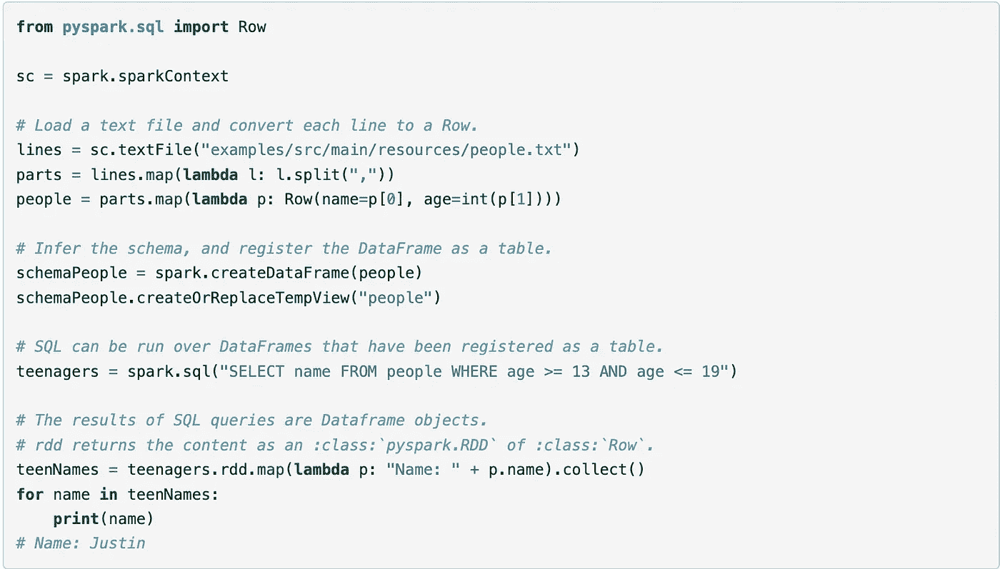
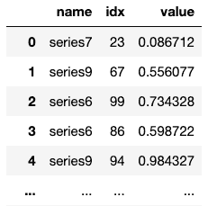
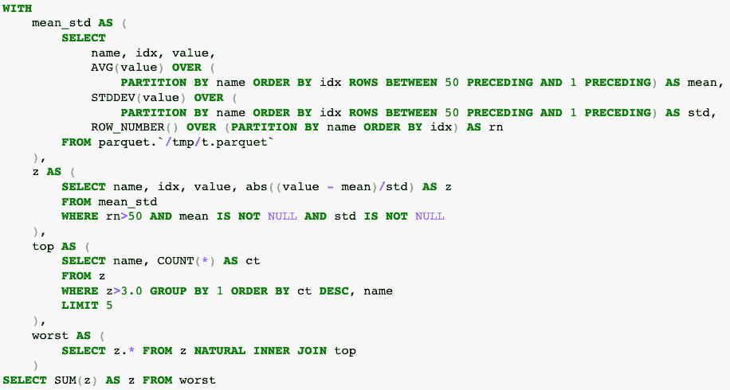
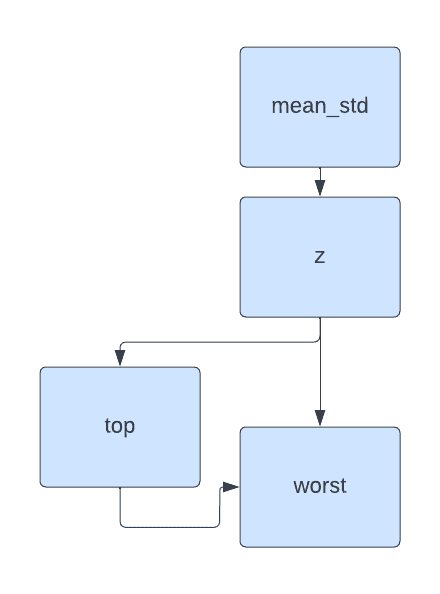
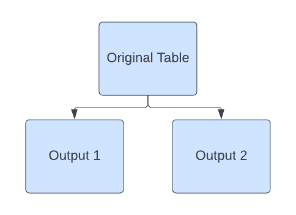
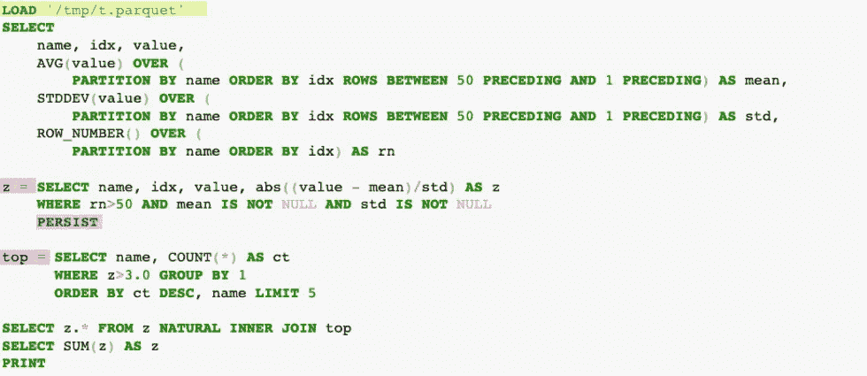
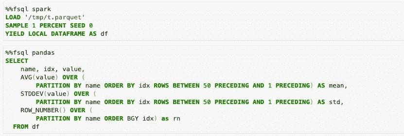

# 为什么类似 SQL 的接口对于分布式计算来说是次优的

> 原文：<https://towardsdatascience.com/why-sql-like-interfaces-are-sub-optimal-for-distributed-computing-45f62224bab4>

## 检查 SQL 接口的局限性

编剧[凯文·库](https://www.linkedin.com/in/kvnkho/)和[汪涵](https://www.linkedin.com/in/han-wang-97272610/)

这是我们最近的 [Spark Data + AI Sumit talk](https://databricks.com/dataaisummit/session/fuguesql-enhanced-sql-interface-pandas-and-spark-dataframes) 的书面版本。


柴犬驾驶飞机——作者图片

# 分布式计算的类 SQL 框架

在我们的上一篇文章中，我们讨论了使用 Pandas 接口进行分布式计算的局限性。有些人很快就认为我们支持 SQL，但这也不完全正确。在这里，我们将了解传统 SQL 以及将其用作大数据工作流语法的难点。对于活跃的 SQL 用户来说，这些都不会太令人惊讶，但是讨论它们将展示使用 SQL 与使用 Python 之间的权衡。

数据社区经常在 SQL 和 Python 之间两极分化。喜欢 Pandas 和 Spark 提供的功能接口的人通常会很快指出 SQL 为什么不能进行更复杂的转换，或者需要更多的代码行。另一方面，SQL 用户发现 SQL 作为一种语言更具表现力。在本文的最后一节，我们将展示这些工具并不相互排斥，我们可以通过[赋格](https://github.com/fugue-project/fugue/)无缝地利用它们。

# SQL 经常被 Python 代码夹在中间

当我们在本文中谈论 SQL 时，我们指的是像 [DuckDB](https://duckdb.org/) 这样的工具，或者对于大数据，像 [SparkSQL](https://spark.apache.org/sql/) 和 [dask-sql](https://dask-sql.readthedocs.io/en/latest/) 这样的工具。最后两个接口允许 SQL 爱好者用类似 SQL 的语言表达计算逻辑，然后在各自的分布式计算引擎(Spark 或 Dask)上运行它。

但是即使这些 SQL 接口存在，它们也经常在 Python 代码之间被调用。以 Spark 的[后续文档](https://spark.apache.org/docs/3.2.0/sql-getting-started.html#inferring-the-schema-using-reflection)(也见下图)为例，Python 代码仍然需要执行大量数据帧的转换或加载，以及 SQL 查询后的后处理。这是因为标准 SQL 没有表达分布式计算用户执行的许多操作的语法。目前，SQL 不足以表达端到端的工作流。



来自 [Spark 文档的示例](https://spark.apache.org/docs/3.2.0/sql-getting-started.html#inferring-the-schema-using-reflection)

对于主要想使用 SQL 的用户来说，有很多 Python 代码需要理解。SQL 通常被归入工作流的有限部分。我们将通过一个具体的例子更仔细地研究 SQL 的缺点。

# 示例数据和查询

以下面由多个时间序列组成的数据帧为例，有三列。第一列指的是分组，第二列指的是排序(你可以把它想象成一个 datetime)，最后一列指的是关注的值。



基线数据框架—作者提供的图像

以如下所示的查询为例。没必要真的深究和理解。如果这已经令人望而生畏，那是因为对于更复杂的操作来说，SQL 的表达能力更差，更难阅读。我们将在下一部分对其进行分解。



对基线数据帧的 SQL 查询—按作者排序的图像

该块中有 5 条`SELECT`语句。按顺序，他们做:

*   获得这些值的滚动平均值和滚动标准偏差
*   计算滚动 z 值(有足够预热的记录)并过滤掉空记录
*   根据异常值计数获取排名靠前的时间序列
*   用一个`INNER JOIN`获得最差时间序列的完整数据到先前的 z 分数表
*   对最差表中的 z 分值求和

此操作的设计并不完全合理。更重要的是查询和中间表的结构。我们有一个由两个下游表使用的中间表`z`。这就引出了传统 SQL 的第一个问题。

# 问题 1:传统的 SQL 缺乏用于分布式计算的语法

上面查询的结构如下所示。桌子`z`最终被`top`和`worst`共同使用。因为分布式计算使用惰性计算，所以只在需要时才计算操作。这样做的一个副作用是，当使用 Spark 或 Dask 时，`z`可能会被重新计算两次，一次用于`top`,一次用于`worst`。



数据帧 z 使用了两次—图片由作者提供

通过在 Spark 数据帧上显式调用`.persist()`可以避免`z`的重新计算。但是我们在使用 SparkSQL 接口的时候如何持久化呢？没有`PERSIST`关键词。我们需要分解 SQL 查询，并在查询的下游部分之前使用 Python 调用 persist 调用。SQL 也没有[分组映射语义](https://spark.apache.org/docs/2.4.4/sql-pyspark-pandas-with-arrow.html#grouped-map)。

问题是 SQL 没有分布式计算操作的关键字，比如持久化或广播。如果没有必要的语法，查询优化对我们来说就是一个黑盒，结果可能不是最佳的(在我们的例子中，差别是 21 秒对 12 秒)。这表明`z`花了 9 秒钟来计算，我们可以通过显式使用 persist 调用来删除重复的计算。

**缺乏表示这些的语法阻止了我们充分利用分布式计算引擎，除非我们将逻辑带回 Python。**

# 问题 2: SQL 传统上只返回一个表

接下来，一个 **SQL 查询与一个返回相关联。**它面向单一任务，限制了可能操作的表面积。例如，将一个数据帧分割成两个独立的数据帧通常用于机器学习(训练-测试分割)。如果不将一个查询分解成多个查询，这是不可能的，这会造成一些冗余。

对于熟悉 Python 的人来说，这相当于用一个函数调用返回多个值。



标准 SQL 不支持的语义—按作者分类的图像

# 问题 3: SQL 引入了大量样板代码

SQL 的另一个缺点是它引入了大量样板代码。上面的查询已经通过使用公共表表达式(cte)写得很好了，它允许从上到下读取。在其他情况下，SQL 从业者通常从内向外编写查询，其中内部查询用于外部“下游”查询。SQL 从业者经常不得不处理长达数百行的查询。

更深入地看这个查询，我们甚至不关心上面查询中的中间表，但是我们无论如何都要给它们命名，以便以后引用它们。**大量的样板代码降低了阅读查询所表达的业务逻辑的能力。**这增加了维护的开销，尤其是对于没有编写原始查询的人。

# 问题 4:修改会导致框架锁定

SparkSQL 支持使用修改后的语法读取 parquet 文件。注意，第一个`SELECT`语句有一个类似于下面的`FROM`:

```
FROM parquet.`/tmp/t.parquet`
```

这实际上是 Spark 特有的语法，有助于 Spark 用户，但它造成了框架锁定。SQL 的一个优点是它无处不在，被广泛采用，但是如果您想使用另一个 SQL 引擎，添加特定的语法会降低可移植性。这是创建框架锁定的 Spark 特定语法的最简单的例子，但是还有很多。

# 传统的 SQL 很难在大数据上迭代

这些问题的结果是大数据上的 SQL 查询变得难以迭代。痛点被放大了。大数据查询通常需要几个小时，这使得用户必须能够快速、廉价地进行迭代。

在处理大数据时，快速迭代有三个主要障碍。

*   **在迭代查询的下游部分之前，我们如何缓存昂贵的中间步骤的结果？**
*   我们如何在较小的数据上运行完整的查询来进行测试？然后在准备就绪时将其无缝引入大数据？
*   **我们如何在 SQL 语法中保持加载、保存和持久化等操作，以便不需要频繁地将数据提交给 Python？**

列表中的第一个包括在代码的 Python 和 SQL 部分之间处理数据帧的技巧，但这仍然是次优的用户体验。像上面这样相对较大的 SQL 查询需要拆分，并用更多的 Python 代码包围起来。我们如何避免这种情况，并将大部分代码保留在 SQL 中？

列表中的最后两个用目前的工具几乎是不可能的。即使 SQL 代码是标准的 SQL 并且跨后端兼容，我们的问题也变成了 Python 代码。同样，SQL 不足以单独表达端到端的工作流。我们求助于编写 PySpark 代码，这是框架锁定的另一个来源。

# FugueSQL —用于计算工作流的增强 SQL 界面

[FugueSQL](https://fugue-tutorials.readthedocs.io/tutorials/quick_look/ten_minutes_sql.html) 通过扩展标准 SQL 来解决这些问题，使其对计算工作流更具可读性、可移植性和表达性。FugueSQL 是 Fugue 的开源接口，使用户能够在分布式计算引擎上编写端到端的查询。我们可以使用 FugueSQL 将上面的 SQL 重写为下面的形式。



使用 FugueSQL 重写的 SQL —图片由作者提供

FugueSQL 遵循对任何后端都不可知的 SQL 原则；这段代码从任何框架锁定中删除。用户只需指定引擎，就可以在 Pandas 或 Duckdb 到 Spark 或 Dask 之间切换。上面的代码可以在任何后台的赋格支持上运行。

我们将检查上面查询中突出显示的更改:

1.  `LOAD`现在是一个兼容所有后端的通用操作。FugueSQL 还附带了一个`SAVE`关键字，它允许用户执行完整的提取-转换-加载(ETL)工作流。FugueSQL 的附加关键字下推到指定的后端。例如，`LOAD`用 Spark 引擎用 parquet 会翻译成 PySpark 的`spark.read.parquet`。
2.  变量赋值减少了大量样板代码。另一个变化是缺少一个明确的`FROM`条款。如果没有`FROM`子句，则自动消耗上一步中的数据帧。
3.  `PERSIST`关键字下推到后端持久化(本例中是 Spark)。这仅仅通过添加一个关键字就明确地消除了 z 的重新计算。

上面的代码片段是在 Jupyter 笔记本单元格中编写的。与原始查询相比，该查询可以很容易地分成多个单元格(稍作修改)。我们需要做的就是使用`YIELD`关键字来[将数据帧](https://fugue-tutorials.readthedocs.io/tutorials/fugue_sql/operators.html#yield)保存在内存中(或者为更大的数据帧归档)。这对于 SQL 用户来说更加自然，因为他们不需要处理 Python 代码来管理内存中的数据帧。



为迭代更改引擎—按作者排序的图片

这张图片中重要的一点是，在 Spark 上运行全部内容之前，我们可以使用 Pandas 或 DuckDB 引擎迭代采样数据。因为有了`YIELD LOCAL DATAFRAME`语句，所以`df`作为熊猫数据帧保存在内存中。

虽然本文没有涉及，但 FugueSQL 也能够与 Python 代码交互。从 FugueSQL 调用 Python 函数将在后面的文章中讨论，但是可以在这里找到一个例子。

# 结论

**固守传统的 SQL 使其无法表达端到端的计算工作流，通常需要补充 Python 代码。**开发人员的迭代时间很慢，因为对大数据的查询需要一段时间，而运行标准 SQL 需要重新运行所有中间步骤。 **FugueSQL 将 SQL 提升为一级语法，允许用户使用** `**LOAD, SAVE, PERSIST**` **等关键字调用与分布式系统相关的 Python 代码。**

FugueSQL 通过以下方式加快大数据迭代速度:

*   允许本地和分布式后端的无缝交换(DuckDB 或 Pandas 到 Spark 或 Dask)。
*   删除标准 SQL 引入的样板代码。
*   添加调用 Python 代码的关键字，允许 SQL 作为与 Python 相对的主要语言。

这些增强允许不太熟悉 Python 的 SQL 爱好者和数据从业者用他们喜欢的语法定义他们的代码。SQL 的优点是易于阅读，而 FugueSQL 的目标是在保持标准 SQL 的直观和表达精神的同时扩展这一点。

*编辑:“厂商锁定”改为“框架锁定”，因为 Spark 是开源的。来自 Giles Middleton 的反馈。*

# 资源

1.  [赋格懈怠——与我们聊天！](http://slack.fugue.ai)
2.  [赋格 Github](https://github.com/fugue-project/fugue/)
3.  [10 分钟后 FugueSQL](https://fugue-tutorials.readthedocs.io/tutorials/quick_look/ten_minutes_sql.html)