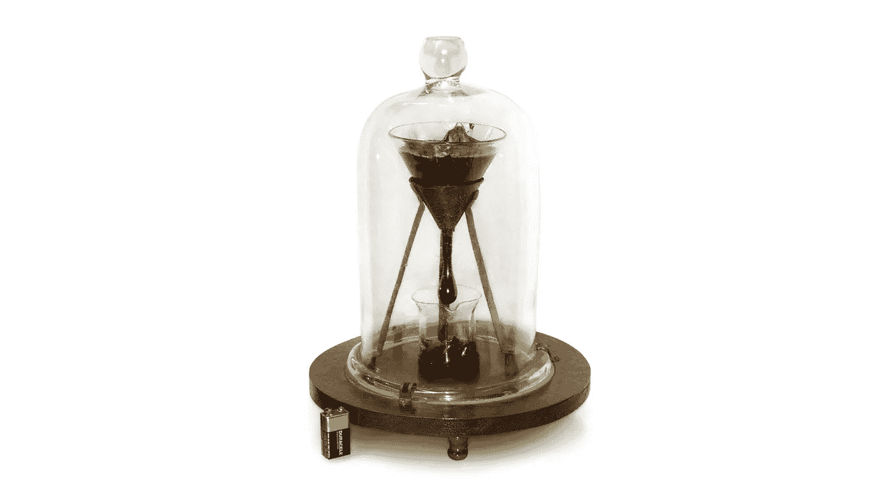
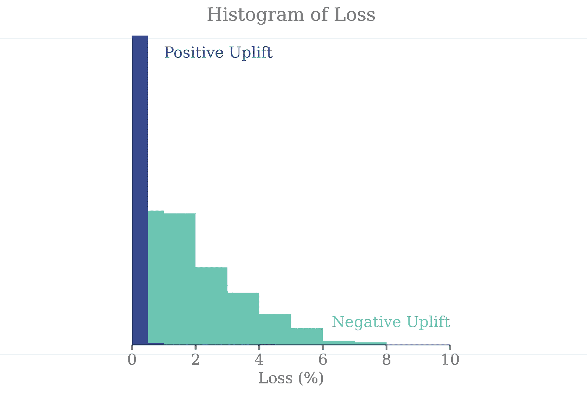
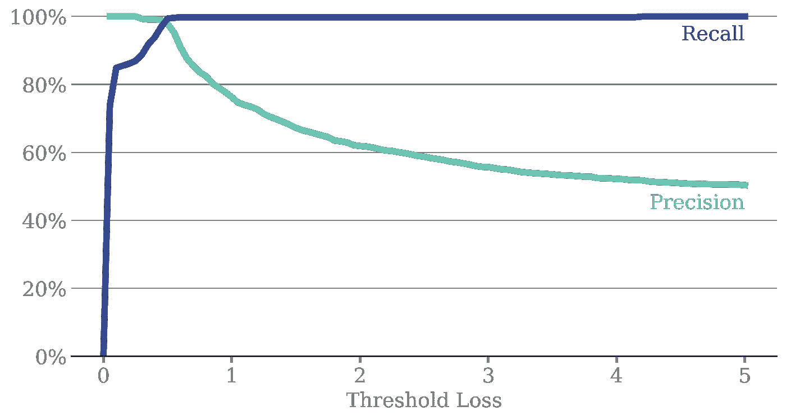
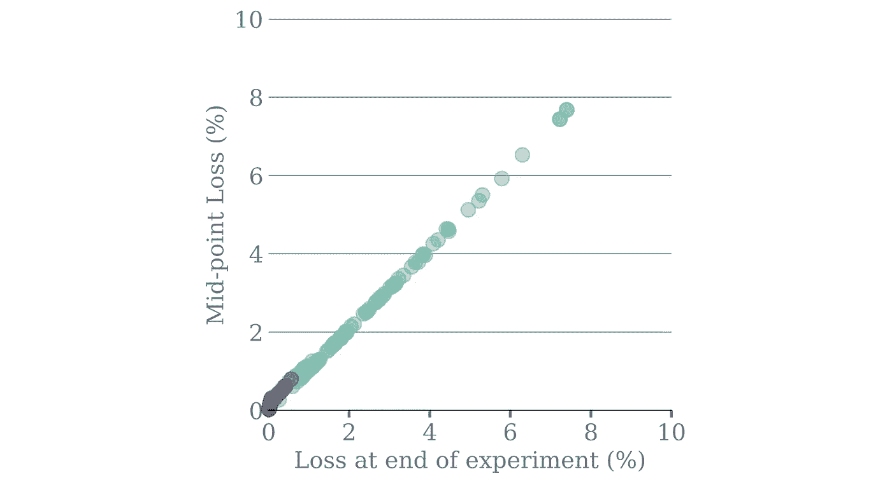
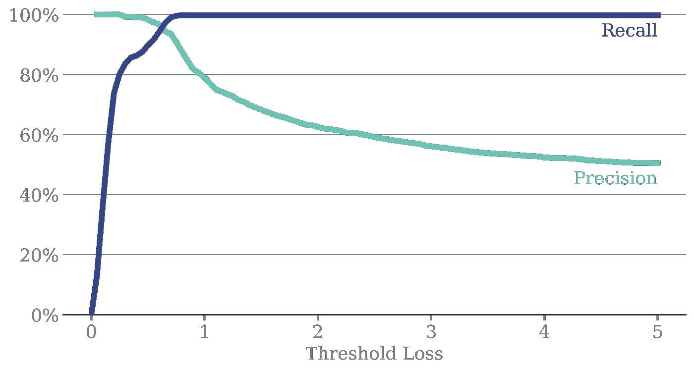
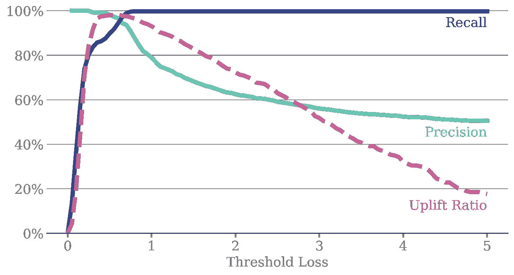

# 为什么统计显著性会毁了你的 AB 测试

> 原文：<https://towardsdatascience.com/why-statistical-significance-is-ruining-your-ab-tests-8f1f33d7810a>

## 如何加倍你的实验率和加倍你的实验产出

AB 测试中的统计显著性被广泛认为是决定何时停止实验以及最终是否在 AB 测试后推出新功能的基准统计。然而，等待收集足够的数据来满足统计显著性可能会损害您推出新功能的速度。

[图片来源](https://en.wikipedia.org/wiki/Pitch_drop_experiment)

由于所需的数据量，对 KPI 影响较小的新功能在实际时间内可能不会达到统计显著性。因此，你很可能会浪费时间开发新的功能，结果在实验后因为它们的影响小而被拒绝。或者也许你在构思阶段就拒绝了一个想法，因为你等不及证明它的价值。

我的观点是，如果这个新特性可能只会带来性能的小幅提升，那么它也不太可能导致性能的大幅下降。

> 如果潜在影响较小，我们可以做出更高风险的决策，而这些较小影响的特征可能是最多的，因此累积起来会产生较大的影响。

在这篇文章中，我将讨论如何从统计显著性切换到 [*损失*](/bayesian-experimentation-metrics-explained-bd2faebd937e) 作为你的实验停止标准，可以让你的实验率加倍，从而使你的实验产出加倍。

# 蒙特卡洛模拟设置

在这篇文章中，我通过蒙特卡洛模拟生成了一些合成的但真实的数据。我已经产生了 1000 个独立实验的结果。

1000 个实验中的每一个都有:

*   对照的转化率为 5%
*   从平均值为 0、标准偏差为 2.5 的正态分布中得出的变量转换率的上升

通过选择均值为 0 的正态分布，我们可以确保所有实验的净改善为零——如果我们在分析中看到改善，那是因为我们推出了更多正面改善多于负面改善的实验。我们还将生成许多影响较小的实验——影响较大的实验太容易分析，会对我的分析产生有利的偏见。2.5 的标准偏差确保 95%的所有实验都有-5%到 5%之间的提升。

对于每个实验，我已经计算出了达到 95%的 [*击败对照*](/bayesian-experimentation-metrics-explained-bd2faebd937e) 的机会所需的样本量。这个样本量代表实验的结束。在每次实验结束时，我还会计算选择变体 的 [*损失*或*风险。*](/bayesian-experimentation-metrics-explained-bd2faebd937e)

# 结果

下面是我们每个实验的*损失*的直方图，按照上升是正还是负来划分。我们可以清楚地看到，负上升(即变体比对照差)的实验具有更大的*损失*，而正上升(即变体比对照好)的实验具有的*损失*大多低于 0.5%。

图一

很明显，有非常有力的证据表明，实验的*损失*可以非常准确地确定一个新特性对我们的 KPI 有正面还是负面的影响。

# 根据损失对影响进行分类

让我们看看在实验中使用*损失*可以准确预测积极或消极影响的程度。为此，我们将使用阈值损失建立一个非常简单的分类器， *l* :

*   *损失* < *l* :正面影响
*   *损失* >损失*损失*:负面影响

> 在下图中，我画出了我们的分类器对于 l 值范围的精确度和召回率。

图 2

随着阈值损失的增加(向右移动)，我们将越来越多的实验归类为具有积极影响。由于我们大多数正面影响实验的损失低于 0.5%(图 1)，因此我们在这一点上达到了 100%的召回率。但是，我们也有几个负面影响实验有非常小的*损失*。随着分类器中的 *l* 增加，我们开始将一些负面影响实验误分类为正面影响，因为它们的损失很小。因此，我们开始看到精度下降。

然而，像这样的情节是数据科学家的梦想——准确率和召回率都在 95%以上，损失阈值为 *l* ~ 0.5%。

# 结论…到目前为止

让我们回顾一下到目前为止我们所学的内容。如果我们运行一个实验，直到我们达到统计显著性(*击败对照*的机会为 95%)，那么*损失*将为:

*   小(<0.5%) for the experiments with a positive impact
*   large (> 0.5%)用于有负面影响的实验

如果我们推出所有损失小于 0.5%的实验，那么我们将推出几乎所有具有积极影响的实验，并排除大多数具有消极影响的实验。

此时一个明显的问题是:为什么？我们已经达到了统计显著性，为什么还要计算损失和在我们的推广中犯潜在的错误呢？继续阅读寻找答案——我保证疯狂是有方法的！

# 样本量减半

在本节中，我们将探讨在比统计显著性所需样本量更小的样本量下*损失*的相关性。

> 让我们通过实验中点的*损耗*来定义 ***中点损耗***——当观众是统计显著性所需的一半时

下面是实验结束时的*损失*(当样本量足够大时，具有统计学意义)与中途的*损失*(*中点损失*)的散点图。

图 3

有趣的是:

> *中点损失*与实验结束时的*损失*非常相关——在实验进行到一半时，我们可以高度准确地预测实验结束时的*损失*会是多少

*中点损失*是实验结束时*损失*的重要预测值，实验结束时*损失*是上升的重要预测值。因此，我们可以通过计算*中点损失*来有效预测实验中途的结果。

# 根据中点损失对影响进行分类

现在，让我们来看看在使用*中点损失的实验中，我们能准确预测正面或负面影响的程度。*同样，我们将使用阈值损失构建一个非常简单的分类器

图 4

除了精确度和召回率稍低之外，精确度-召回率图在性质上类似于图 2。这里用作阈值的最佳*中点损失*现在是 0.6% —略高于实验结束时的*损失*。这并不奇怪，因为我们只有一半的样本量，因此对结果不太有信心。

# 总隆起

虽然精确度和召回率很有趣，但它们并不那么重要——这里的北极星指标是我们所有推出的功能的综合影响。为此，我将计算*提升比*:

> ***上升率*** 是所有铺开实验的上升总和，占所有正上升实验总和的%

此度量具有以下属性:

*   如果我们推出所有正上升的实验，而没有一个负上升的实验，那么我们将得到 100%的*上升率*
*   如果我们错误地推出了一些负面实验，那么*提升率*将会下降到 100%以下
*   如果我们因失误而未能推出一些积极的实验，那么*上升率*也将下降到 100%以下

我们希望最大化*提升率。*

下面是覆盖在我们的*中点损失*精确召回图上的*上升率*的曲线图。

图 5

我们看到的是，当*损失阈值*约为 0.6%时，*提升比率*达到峰值(~97%)，这是精确度和召回率最高的地方。在较低的 *l* 值下，我们的召回率非常低——我们无法识别和推出积极的实验。高于 0.6%时，精度开始下降——我们推出了太多的功能，但由于失误而产生了负面影响。

如果我们选择在中点损失*小于 0.6%时推出所有实验，那么我们将实现约 97%的提升率。这里非常关键的一点是，我们使用*中点损失*作为我们的止损标准。*

> 我们从实验中获得了 97%的性能，但是它们只运行了一半的时间。每个实验的持续时间减半意味着我们可以在同一时期运行两倍的实验，并提供 194%的*提升率*——几乎是等待实验达到统计显著性的性能提升的两倍。

# 结论

我们已经证明，我们可以根据*中点损失*近乎完美地预测一个实验会带来正面还是负面的提升。通过采用*中点损失*阈值标准来停止您的实验，您可以将所需的样本量减半，并将这些实验的持续时间减半——让您有时间运行两倍的实验，并实现两倍的提升。

## 评论

值得注意的是对所展示的模拟的一些评论:

*   5%的基线转换率非常小，这是特意选择的，因为较大的基线转换率更快达到统计显著性。
*   同样，我们的大多数实验都有-5%到 5%之间的提升，这也是较小的一面，因为当考虑统计显著性时，这也可能使这些实验不确定。

当您试图检测小转换率中的小变化时，选择以上因素来突出该方法的有效性。对于更大的影响实验或更大的基线转化率，你通常不会遇到实验持续时间达到统计显著性的问题。

另一个要考虑的因素是开展实验所需的工程时间。虽然这里介绍的方法可能允许您检测小的影响实验，但您需要相当多的影响实验才能产生有意义的结果。这将非常适合对您的产品进行小的更改，例如按钮颜色和副本的更改。

# Git 回购

用于模拟的代码都可以在[git repo](https://github.com/drmattcrooks/Medium-LossSimulations)中找到。