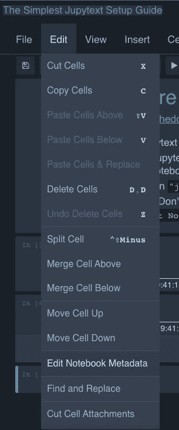
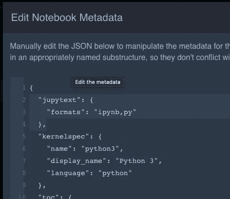
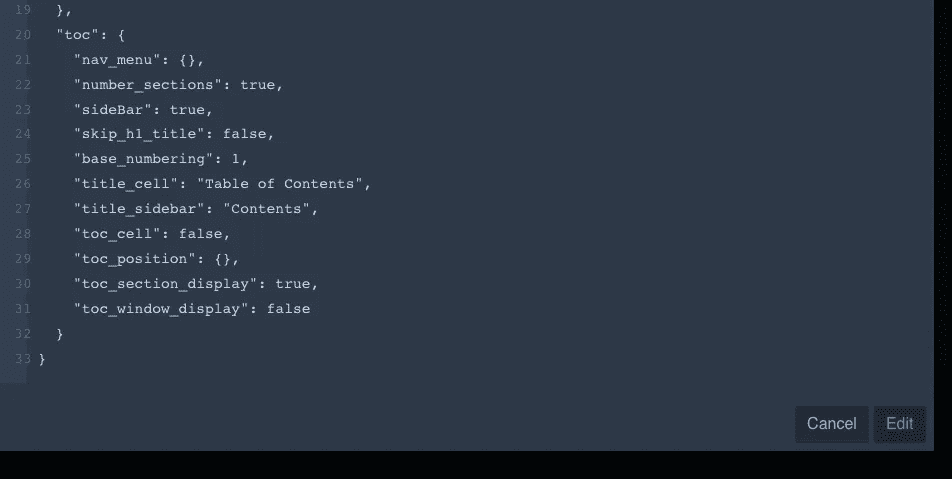
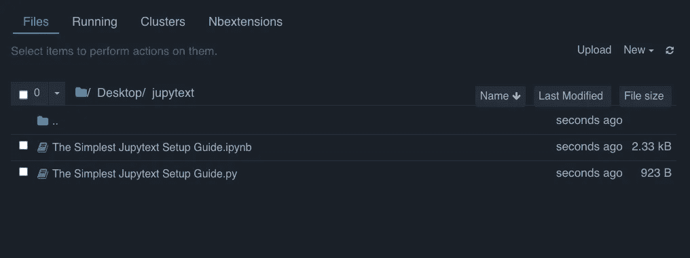

# 为什么要用 python 同步你的 Jupyter 笔记本(。py)文件？

> 原文：<https://towardsdatascience.com/why-synchronize-your-jupyter-notebook-with-a-python-py-file-bbf35baf02ee>

## 对于 Jupyter 笔记本来说，这是自动化 git 差异的最简单的方法


尼尔和祖玛·斯科特在 [Unsplash](https://unsplash.com?utm_source=medium&utm_medium=referral) 上的照片

# **什么是 Jupytext？**

Jupytext 已经存在几年了，有一些非常有用的指南可以分享 jupytext 能为你做什么。例如， [readthedocs](https://jupytext.readthedocs.io/en/latest/install.html) 页面分享了多个安装和配置技巧，并链接回 Marc Wouts 发布 jupytext 的[关于数据科学的文章](https://medium.com/towards-data-science/introducing-jupytext-9234fdff6c57)。

简单地说，jupytext 是一种自动复制不同格式文件的方法。Jupytext 不局限于简单的。ipynb '和'。下面分享的 py 例子。

# 一个常见的用例

在一个团队中开发 Jupyter 笔记本时，与 git 的区别可能很难理解，或者至少比较 Jupyter 笔记本结构中不必要的项目是一件麻烦的事情。有些资源，比如 ide 的附件，甚至是你可以授权的软件，可以为 Jupyter 笔记本提供更好的区别。

然而，一旦我学会了用 Jupytext 自动同步到 python 文件，我就知道这会导致我以最简单的方式寻找的 git 差异。

# 如何进行最简单的 Jupytext 设置

首先，安装 jupytext

```
pip install jupytext --upgrade
```

接下来，启动 Jupyter 笔记本服务器并打开笔记本。在 Jupyter 笔记本中，点击 ***编辑>编辑笔记本元数据***



编辑>编辑笔记本元数据(按作者分类的图像)

在元数据的顶部，添加下面的代码(或者类似的一行程序，因为它们在保存时会呈现相同的输出)。点击右下角的编辑按钮进行保存。不要太担心位置——这是否是第一个片段，等等。-因为订单会在关闭时自动重新订购。您可以重新打开元数据设置来验证您的更新是否已保存。

```
 "jupytext": {
    "formats": "ipynb,py"
  },
```



将 jupytext 片段拖放到元数据中(按作者排序的图像)



点击右下角的编辑按钮保存并关闭(图片由作者提供)

关闭 jupyter 笔记本时，会创建一个 *`.py`* 文件进行匹配。



瞧，现在有一个。与同步的 py 文件。“ipynb”文件(图片由作者提供)

# 就是这些了

无论何时编辑其中一个文件，另一个文件都会被更新。您可能需要刷新浏览器或 IDE 才能看到更新。

在*中检查。py'* 文件进行代码版本控制，如 git 或 svn，请放心，您离 Jupyter 笔记本天堂又近了一步。

如果你喜欢这篇文章，并且想读(写)更多这样的文章，请考虑使用我的推荐链接成为中等会员:【https://sabolch-horvat.medium.com/membership 