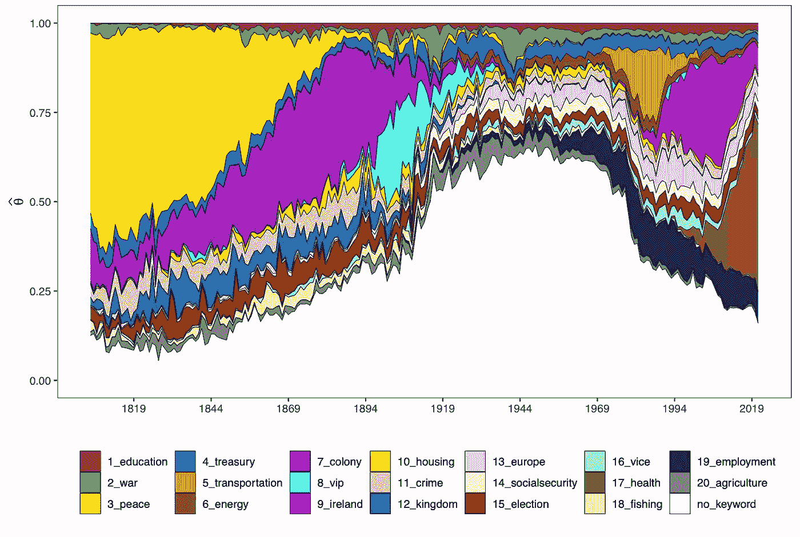
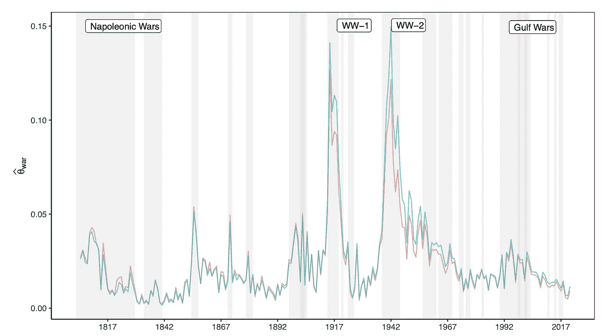
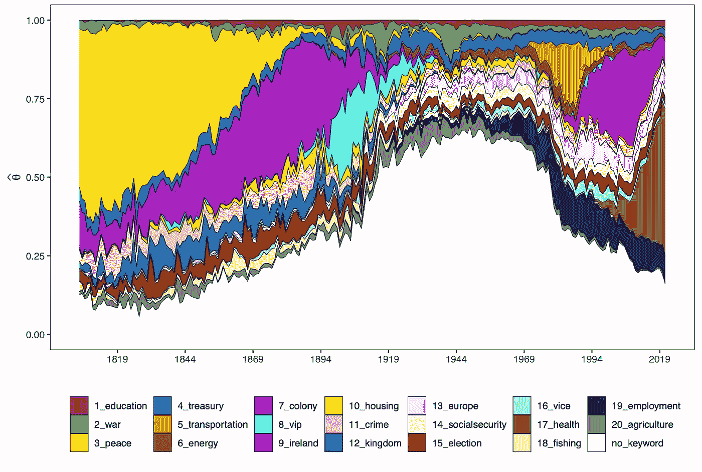

# 种子主题模型:用 keyATM 在 R 中实现它们

> 原文：<https://towardsdatascience.com/why-to-use-seeded-topic-models-in-your-next-project-and-how-to-implement-them-in-r-8502d15d6e8d>

## 基于英国议会记录的地缘政治风险建模

作者图片

在文本分析中，主题模型是从大量文档中提取主题的重要方法。也许在这个领域中最广泛使用的模型是**潜在狄利克雷分配(LDA)** 。

LDA 是一种**概率主题模型**，存在多种变体。今天我们来看看其中的一个:种子 LDA 模型。

种子主题模型允许研究者将一组关键词传递给模型，该模型在评估之前概述了所寻找的主题。这种播种提供了对评估过程的更多控制，并且也导致了结果的**【更好的】可解释性**。

在我最近的硕士论文中，我探讨了如何基于**文本数据**来**度量**地缘政治风险**的抽象概念。为此，我使用了过去 200 年[英国下议院议会辩论的记录](https://hansard.parliament.uk)，并应用了**种子话题模型**。**

数据科学可以帮助提供**新的测量工具**，并使我们能够将新的或者更精确的变量纳入**经济计量模型** 。

在我的申请中，这意味着用一个种子 [LDA](https://en.wikipedia.org/wiki/Latent_Dirichlet_allocation) 主题模型来衡量地缘政治风险，并将这一衡量结果插入一个[向量自回归](https://en.wikipedia.org/wiki/Vector_autoregression)。

我想给你一个种子 LDA 模型的概述，并提供一些基本设置的代码片段。

# 为什么是艾达？

LDA 模型假设文档由不同主题的混合组成，并且这些主题中的每一个都是单词的混合。

您可以通过多种方式扩展 LDA 模型。例如，您可以在文档中加入元信息，如作者或发布时间。

对我来说，动态种子 LDA 模型似乎足够了。因为它是一个动态的模型，你的主题可以随着时间的推移而发展，创造历史的线索，而不是快照。

在过去的 200 年里，世界发生了巨大的变化。与 2010 年的辩论相比，冷战、核武器的发明或语言的变化等发展可能会改变 1810 年的辩论。

# 为什么播种 LDA？

解释常规 LDA 模型发现的主题的诱惑是巨大的。

一个包含诸如*战争*、*军事*或*武器*等词汇的话题，必须是关于地缘政治风险的——对吗？

不对。至少在严格的意义上。

如果你想衡量一个概念，重要的是要有一个工具来传递**客观可解释的主题**。

在这种情况下，*目标*意味着，在实际评估您的模型之前，您需要通过概念**的明确定义。否则，你会发现自己事后挑剔，做出*主观*的解读。**

把这比作向你的朋友证明你可以用篮球打半场球:为了做好这件事，你必须先**宣布**投篮**，然后得分。而不是**打一枪**，事后大喊“我早告诉你了”**。****

# **工具箱:Quanteda 和 keyATM**

**我推荐用 R 来处理种子 LDA，主要是因为有库`[quanteda](https://quanteda.io/)`(数据清理)和`[keyATM](https://keyatm.github.io/keyATM/index.html)`(种子 LDA 模型)。**

**我想向您简要介绍一下计算动态种子 LDA 模型所需的步骤。**

**有关更深入的解释，请分别访问 [quanteda](https://quanteda.io/index.html) 和 [keyATM](https://keyatm.github.io/keyATM/) 的文档。**

# **预处理数据**

**首先，需要对数据进行预处理。为此，我们首先创建一个语料库。**

**第二步，我们可以用函数`tokens`预处理这个语料库，并用`keyATM_read`将其转换成适合 keyATM 模型的格式。**

**对于动态植入 LDA 模型，有必要创建一个周期变量，该变量从 1 开始，每个周期递增 1。在下面的代码中，一个周期反映了从 1805 年开始的 5 年。**

# **关键词词典**

**我们用一个关键字字典作为主题模型的种子。**

**每个主题可以传递任意多的关键字。然而，模型的拟合度很大程度上取决于你的关键词的**质量。例如，好的关键字出现在许多文档中，并且是感兴趣的概念所特有的。****

# **指定和评估模型**

**现在，我们可以为我们的模型指定一些超参数。同样，要获得更深入的解释，请访问上面提到的文档。**

**请注意，考虑到`no_keyword_topics`是很重要的，因为它使模型也能够**自由探索数据中的模式**。**

**最后，我们可以将所有这些组件作为参数组合在`keyATM`中来评估我们的模型。**

**重要的是要记住，估计*可能会*花费很长时间，并且可能需要大量资源。除其他因素外，计算成本还取决于文档的数量和长度。**

# **例子:用辩论记录衡量地缘政治风险**

**在评估之后，我们应该以整体的方式评估模型，即以不同的方式评估拟合的质量。**

**例如，我们可以查看我们的结果主题。我们用函数`top_words`得到一个主题中最“重要”的词，正如我们的模型所估计的那样。**

**对于我的应用程序，像*军事*、*国防*或*陆军*这样的词是代表地缘政治风险(话题战争)的话题的顶级词。请注意，我们如何以相同的估计得到财政、教育和和平概念的主题。通过在关键字字典中指定更多的主题，我们可以一次获得多个种子主题:虽然计算时间略有增加，但我们可以“几乎”免费获得额外的度量。**

****

**作者图片**

**对于动态主题模型，您还希望绘制出主题在一段时间内的发展情况。下图显示了一段时间内辩论中地缘政治风险的估计份额。阴影区域代表英国的军事冲突时期。**

****

**作者图片**

**您还可以看到**所有主题的份额**随时间的发展。所有非关键词话题的分享都被聚集到下面的白色区域。**

****

**作者图片**

**虽然其中一些主题的时间趋势似乎是合理的，如第一次世界大战前“殖民地”主题的重要性，但也有一些主题不太适合，如和平主题。**

**此外，这些话题相对于彼此的重要性可能令人难以置信，因为很难相信“战争”这个话题在第二次世界大战期间只占话语的 15%左右。**

**然而，种子主题模型是基于非结构化数据(例如文本)创建度量的令人兴奋的工具。在未来，重要的是加入更多的元数据，并改进种子关键词。在我的情况下，这可能意味着在模型中包括一个讨论者的政治倾向，或者使我的关键字字典更精确地适应这个概念。**