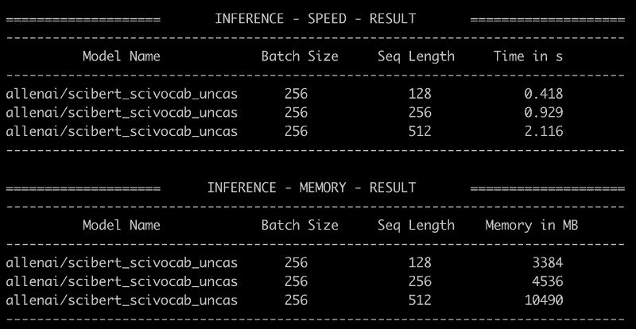
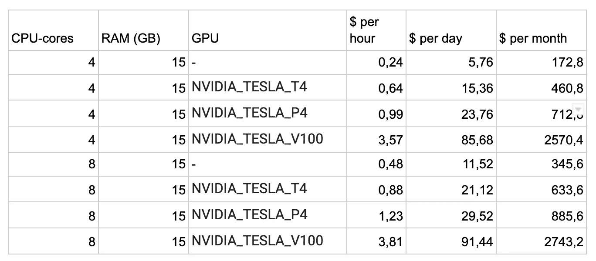
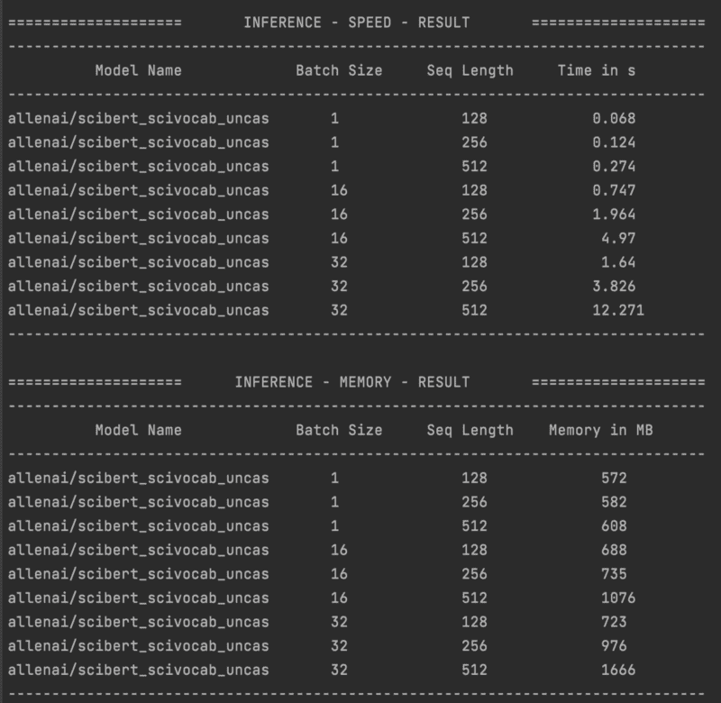
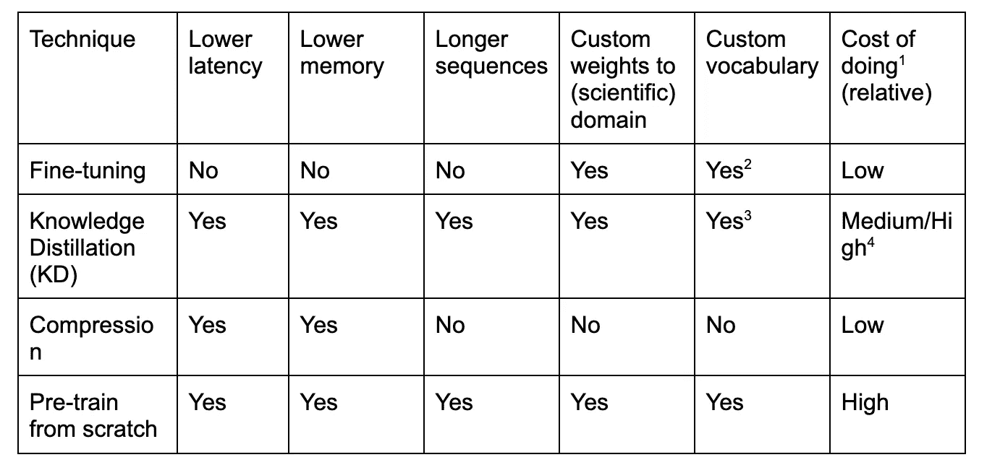

# 什么时候预先训练你自己的 Transformer 语言模型才有意义？

> 原文：<https://towardsdatascience.com/why-training-your-own-transformer-language-model-from-scratch-is-not-stupid-a658ce1428f4>

## *预先训练你自己的模型有什么缺陷、好处和步骤，以及现有 PLM 的局限性？*


图片由 DALL-E 生成，带有作者提示。

***这篇博文是写给谁的，对这篇博文有什么期待？***

这篇博文的目的是讨论如何使用预训练语言模型(PLM)来创建自然语言处理(NLP)产品，以及使用它们的优缺点。将讨论从头开始训练您自己的变压器模型。介绍了从头开始的预培训的高级益处和缺陷。该内容面向新的和有经验的 NLP 工程师，也面向参与创建涉及 NLP 的产品的其他专业人员。

***什么是预训练的变压器语言模型，为什么这么受欢迎？***

PLM 是使用自我监督的预训练任务对大量数据进行预训练的大型模型。Transformer 模型是 PLM 的一种特殊类型，它基于[0]中介绍的自我关注机制。变形金刚模型有很多变体，很多可以在拥抱脸(HF) [1]上找到。HF 是一个开源平台，工业和学术研究人员可以上传和下载模型。从零开始训练这些庞大的模型通常是由非常大的公司如谷歌、脸书和 OpenAI 或研究机构如艾伦人工智能研究所完成的。随着拥抱脸的兴起，许多没有资源或知识来创建这样一个模型的工程师已经可以使用它们了。采用 PLM 并将其应用于新问题是迁移学习的一种形式。

BERT [2]是 NLP 从业者中最著名的 PLM 之一，于 2018 年发布。然而，对大多数人来说，GPT-3 [3]可能是最广为人知的模型。这两种模型都基于变压器架构[0]。开源变压器模型在 NLP 产品和研究中已经变得无处不在。只需几行代码，使用 HF 开发的 transformers 库[1]，就可以将预先训练好的 Transformer 模型应用到您的新任务中。

在 [Slimmer AI，](https://www.slimmer.ai/)一个人工智能创业工作室，我们(共同)在我们认为人工智能可能具有颠覆性的领域建立企业。虽然建立合资企业是我们工作的一大部分，但我们也通过应用我们的人工智能专业知识来支持科学出版过程。对于这些产品，我们一直在寻找提高性能的方法。我们用预先训练好的变压器模型进行实验，看看它们是否适合某个产品。然而，由于交付期限的原因，我们并不总是有空间在一个项目中试验或尝试全新的东西。出于这个原因，Slimmer AI 引入了 AI Fellowship，ML 工程师花时间来提高他们的技能并了解最新的发展。这使得我们能够比日常的产品构建工作更深入地研究主题。点击这里阅读更多关于我们人工智能联盟[的信息。从头开始训练你自己的 Transformer 语言模型是一个大项目，而不是我们在构建一个单独的产品时会做的事情。在 AI Fellowship 中，我们探索并实验训练我们自己的语言模型。](https://medium.com/slimmerai/the-ai-fellowship-mastering-machine-learning-on-the-job-8811c4a4d943)

读完这篇博文后，你会了解到:

*   什么是预训练的变压器模型以及在哪里可以找到它们，更具体地说，您将了解 BERT [2]和 SciBERT [4]。
*   一个预先训练的模型在哪些方面拥有领域知识，以及你可以做些什么来使一个模型适应你的领域。
*   为什么应用这些模型会受到这些模型局限性的约束，它们的局限性是什么。
*   如何在不预先训练您自己的模型的情况下克服这些限制。
*   从头开始预先训练你自己的模型有什么好处。
*   当(考虑)训练你自己的基于 Transformer 的语言模型时，你应该考虑什么。

# 为什么产品生命周期管理不是灵丹妙药:SciBERT 案例研究

当考虑变压器产品生命周期时，作为 ML 工程师，我们主要关注两点:

1)模型的架构:层数、参数、注意机制、预训练任务等。

2)用于训练模型的数据的域。

作为一名应用 ML 工程师，关键技能之一是识别你正在处理的问题和领域。如果您正确地识别了问题，您就可以有效地搜索和应用您能找到的最相关的工具。例如，如果您正在处理法律数据，应用基于英语法律文本训练的模型比基于普通英语维基百科训练的模型更有可能给你带来更好的结果。

按照这种思路，BERT 是一个通用模型，因为它不是在特定的数据领域中训练出来的。它在来自图书语料库数据集和英语维基百科的通用英语文本上进行训练。另一方面，SciBERT [4]是一个专门的模型，它是在来自语义学者语料库的科学论文上训练的。因此，将这种模式应用到你为科学出版业创造的所有产品中是一个合乎逻辑的选择。问题解决了对吗？不完全是…

2019 年发布的 SciBERT 是一个强大的模型，它是为科学领域量身定制的，具有惊人的功能，今天仍然是一个强大的模型。在科学领域也有其他模型，如 BioBERT [5]或 SPECTER [6]，但在这篇博客文章中，我们将坚持讨论 SciBERT [4]。在科学出版行业构建产品时使用 SciBERT [4]的主要缺点是:

1.  **速度。**它需要一个快速的 GPU，这可能是昂贵的。
2.  **表演**。它的性能并不总是比一些更轻便的型号好多少。这就是为什么对于你开发的每一个产品，你都需要一个更简单的基线，比如 word 2 vec[8]embeddeds，看看你的 PLM 是否明显优于它。
3.  **输入限制。**它可以处理的最大序列长度是 512 个令牌。
4.  **域。虽然 SciBERT 是一个在学术论文上训练的模型，但是这些论文的领域并不是非常多样化。大约 80%的训练数据由来自生物医学领域的论文组成，其余 20%来自计算机科学领域。有许多不同的科学学科没有被这个语料库覆盖。**

**🐌SciBERT 速度和输入限制**

像 SciBERT 一样，使用 PLM 最简单的方法是以冻结的方式使用它。这需要加载模型并使用检查点上的权重来使用模型，而不是通过改变任务的权重来微调模型。您只需要向前传递您的语料库来创建文档嵌入(表示)。像 SciBERT 这样的大型 PLM 是具有许多参数的复杂模型。至关重要的是，任务性能随着模型的复杂性而增加。我们将在这一部分讨论速度，在下一部分讨论性能。

我们可以使用拥抱脸基准测试来获得一些具体的例子，看看 SciBERT 用了多长时间来特征化文本。我们的批量为 256，抽象长度为 128、256 和 512 个单词[7]。



图 1 — *通过 NVIDIA GeForce RTX 2080 Ti 上的拥抱脸进行 SciBERT 基准测试。图片由作者提供。*

假设你有一个 400 万篇论文的语料库，每篇论文使用大约 512 个单词(例如，标题和摘要)。然后，根据上面的基准，我们需要 55 分钟的处理时间:

```
featurize_time_in_minutes = ((4_000_000 / 256) * 2.116) / 60
print(featurize_time_in_minutes)
55.104166666666664
```

这仍然是一个可管理的时间量，我们可以存储我们的嵌入向量，并在每次我们想做新的实验时加载论文。这需要一些 IO 管理，但不是实验的明确障碍。

然而，512 个令牌并不总是足够的。这个数量大致相当于一篇论文摘要的大小。对于某些用例，最好使用(部分)全文。在这个场景中，文本需要以 512 为一批进行分块，因为 SciBERT 最多只能处理 512 个单词。比方说，平均来说，这些论文包含 5120 个单词(这是保守的)。这意味着每张纸需要 10 批 512 张。这将使我们的特征化步骤长达近 10 个小时。

此外，在生产中，最好能够在 CPU 实例上运行模型，因为 GPU 实例更昂贵。当 ML 产品被转移到生产中时，模型被存储在容器中，并且根据组织的基础设施，它们或者是自托管的或者是通过云提供商托管的。当模型是自托管的时，组织本身负责管理模型运行的硬件。使用云提供商可以避免这种情况，组织可以为使用云提供商硬件的时间付费。硬件越好，价格越贵。拥有一个 GPU 实例比拥有一个 CPU 实例要昂贵得多。假设终端全天候运行，这就是谷歌云平台(GCP)的成本。



一个端点的 GPU 成本概述，图片由作者提供。

上图显示了成本的巨大差异。CPU 推理容器要便宜得多。

在上一节中，我们研究了 GPU 上的基准测试，现在让我们转到 CPU 上，使用 SciBERT 在 CPU 上进行特性测试需要多长时间？这次我们分批取 1，16，32。因为批量越大耗时越长。



图 2 — *笔记本电脑 CPU(英特尔 i7)上的 SciBERT 性能指标评测。图片作者。*

在图 2 中，我们看到了一些限制。在 CPU 上运行这个不是很可行，尤其是在使用(部分)全文的时候。特征化一批 32×512 需要 12.271 秒，如果我们再次假设较长的文档大约为 5120 个单词，我们将不得不等待 2 分钟以上才能获得嵌入。这很快成为生产的瓶颈。

**模型域名**

如前所述，SciBERT 是一个为科学领域定制的模型，但是科学领域到底是什么？让我们再深入一点。NLP 中领域的概念定义模糊，经常以直观的方式使用[10]。在同一种语言中，在风格、词汇、话题和其他语言细微差别方面存在巨大差异。例如，在自然语言处理中，谈论来自“医疗领域”的数据是常见和典型的。然而，哪些文本适合这一领域并没有明确的定义。在[11]中，作者从不同的来源获取文本，如医学文本、法律文本和 IT 文本(软件手册)。通过对不同大型 PLM 的聚类实验，他们表明区分这三种来源并非易事。

PLM 的规模越来越大，人们可能会怀疑一个足够大的模型是否值得适应一个更适合的领域。在[12]中，作者表明，对于像 RoBERTa [13]这样的大型模型，仍然值得将模型应用于特定领域。他们在领域适应前后测试模型在生物医学和计算机科学领域的性能。对于这两个领域，模型的性能在适应后都有所提高。

我们可以说有两种方法可以使一个模型适应一个领域:

1.  通过模型网络的权重。
2.  通过模型的词汇。

***模型的权重有什么作用？***

权重对模型中的所有知识进行编码。当文本作为模型的输入给出时，基于模型的权重矩阵创建该文本的数字表示。

***什么是词汇？***

传统上，模型的词汇表由训练数据中出现的所有唯一单词组成。这是不可扩展的。在 BERT 和 SciBERT 的情况下，模型利用了子单词标记化，更具体地说是单词片段标记化[7]。因此，词汇表由单词的小片段或子单词组成。不同的模型使用不同的算法进行标记化，因此产生不同的词汇，但是一般来说，子词是基于它们在用于训练模型的语料库中出现的频率来创建的。

使用子词的主要好处是，该模型可以处理词汇以外的词，即在训练期间没有见过的词。模型词汇表的作用是 Transformer 模型中相对研究不足的方面。在[14]中，作者使用英语和日语两种语言的 RoBERTA 目标训练了一个语言模型，并表明使用不同的词汇构建方法会影响性能。在他们写作的时候，他们写道，模型的词汇在训练后不能改变，因此是模型架构中的一个关键决定。在[15]中，介绍了一种改变方法词汇的方法，但是这并没有被广泛实现。模型的词汇表仍然是一个重要的组成部分。

让我们看看 BERT 和 SciBERT 之间的一些词汇差异，以便更好地理解拥有不同的词汇如何影响特定领域单词的标记化。我们将看到四个科学术语:“抗脂多糖”、“血管造影术”、“近距离放射疗法”和“脑电图”。在科学领域中，拥有这些更长的特定领域的单词是很典型的。

**抗脂多糖**

BERT tokenizer: ['anti '，' ##lip '，' ##op '，' ##ol '，' ##ys '，' ##ac '，' ##cha '，' ##ride '，' ##s']

SciBERT 标记符:['anti '，' ##lip '，' # #多糖'，' ##s']

**血管造影**

BERT tokenizer: ['ang '，' # # loggraphy ']

SciBERT tokenizer: ['血管造影术']

**近距离放射治疗**

BERT tokenizer: ['bra '，' ##chy '，' ##therapy']

SciBERT tokenizer: ['brachy '，' ##therapy']

**脑电图**

BERT 标记符:['电子'，' # #事件'，' # #相位'，' # #对数'，' # #图形']

SciBERT tokenizer: ['脑电图'，' # #描记']

## '表示它是属于前一个单词的新 WP。

在单词“抗脂多糖”的第一个例子中，我们看到了 SciBERT 和 BERT tokenizers 之间的巨大差异。SciBERT 记号赋予器将单词分解成 4 个单词片段，而 BERT 记号赋予器将单词分解成 9 个单词片段。这两种模型的区别在于，SciBERT 模型的词汇表中包含“多聚糖”。

在第二个例子中，完整的单词“angiography”是 SciBERT 模型词汇表的一部分。如果我们想得到一个单一的向量来给出单词“血管造影”的数字表示，我们必须取平均值，或任何其他加权措施，在伯特的情况下。然而，如果我们使用 SciBERT，我们不必在单词块之间求平均值。这是有益的，因为该模型可以在这种唯一的标记中编码专门的知识，而不是将知识散布在也在其他方面使用的多个标记上。这种专用词汇表的另一个好处是序列长度变得更短，因此计算速度更快，或者在处理较大的文本时，它允许考虑更多的上下文。

## 预训还是不预训？

在前面的部分中，我们建立了像 SciBERT 这样的模型的一些限制，以及为什么它对我们来说不是理想的。在这一节中，我们将看看替代方案的利弊。我们的问题是，没有符合我们要求的拥抱脸预训练模型可用:

1.  快速高效的推断:最好不用 GPU，节省成本。低延迟和低内存。
2.  在多种多样的科学文本上的艺术(SOTA)或接近 SOTA 的表现。
3.  能够处理超过 512 个令牌的序列。

设计和训练你自己的模型是一项繁重的工作，即使我们有工具和框架来帮助我们，这也不是一项简单的任务。当在应用人工智能领域工作时，从头开始训练一个模型是非常激烈和昂贵的措施。

总的来说，如果我们希望有一个预先训练好的变压器模型来帮助我们解决问题，我们可以做两件事:

*   从头开始预训练模型。
*   改变现有模型。这可以通过压缩、知识提炼[18]和微调等技术来实现。

让我们来看看这些技术，它们对模型给予了什么样的控制，以及如何控制



不同模型定制技术概述，图片由作者提供。

表中信息的一些注释:

1.  如果你使用云图形处理器，成本包括时间和金钱。
2.  在已建立的微调管道中，词汇自适应不是惯例，在[15]中，作者展示了一种实现这一点的方法，但这不是已建立的实践。通常，仅在微调中，权重被调整。
3.  在[16]中，他们展示了如何从一个具有大量词汇的模型中使用 KD 并转移到一个具有较少词汇的模型的方法。
4.  KD 的成本取决于您的选择。更大的学生网络，更高的成本和更长的培训时间。

(可以使用不同的压缩技术，但是讨论它们是如何工作的超出了这篇博文的范围。知识提炼可以被视为一种压缩技术，在这篇文章中，我们将它单独列出，因为它在操作上不同于其他压缩技术。在蒸馏中，基于(较大的)教师模型的知识训练新的(较小的)模型。这不同于其他压缩技术，如剪枝[17]，从现有模型的连接被删除。在蒸馏中，有更多的自由，因此有更多的选择。例如，提取模型的架构可能与教师模型非常不同。

对于微调，有一些坏消息。尽管在拥抱脸网站上，我们可以找到很多免费的模型，但是符合上述需求的模型并不多。拥抱脸有三种模式，至少满足我们的一个要求:能够处理比 SciBERT 更长的序列:

*   allenai/longformer-base-4096
*   谷歌/大鸟-罗伯塔-基地
*   威斯康辛大学麦迪逊分校/纽约证券交易所

但是这些并不能满足我们所有的要求，这些模型之所以能够处理比 BERT 更长的序列，是因为它们使用了不同的注意机制。关于不同 PLM 中使用的不同注意机制的详细概述，请看由[托马斯·范东恩撰写的](https://medium.com/@thomasvandongen)[帖子](https://medium.com/towards-data-science/demystifying-efficient-self-attention-b3de61b9b0fb)。

如果我们看上面的表格，我们会发现“蒸馏”和“从头开始的预培训”在所有栏目中的得分都是“是”。然而，即使对于蒸馏，在技术上也有可能改变词汇，微调新领域的权重，实现新的注意机制，并同时降低延迟，这可能会很快变得混乱。正如 SciBERT 不是一颗神奇的子弹一样，在替代模型或技术方面也没有立竿见影的效果。

## 当你进行预训练时，你会期待什么？

从头开始预先训练一个模型是一个大项目，有好处也有潜在的陷阱。在本节中，我们将查看这些内容，并列出训练您自己的模型所需的步骤。

## 训练自己的模型有什么好处？

1.  您可以更深入地理解您正在使用的技术，并获得数据和架构优化方面的经验。这是你微调模型时不用处理的事情。
2.  完全根据您的喜好定制。一切都如你所愿。因此有可能为您提供您需要的定制性能。
3.  它看起来很酷，你可以为你的模型想一个名字。

读完这些好处后，你可能会很兴奋，并准备开始你的预训练，但在此之前，看看这些陷阱。

## 预先训练你自己的模型的陷阱。

*   决策:有很多决策要做。例如，架构(深度、层的类型、注意力的类型等)、损失函数、训练算法、数据集和超参数。
*   **大型项目:**这不是你的常规副业，很难在全职工作之外管理。因为涉及到大量的工作，这不是你一个人可以完成的，会有相互依赖。
*   **计算能力**:需要大量的培训和实验。要做到这一点，你需要有足够的计算能力。这是有代价的。即使您可以访问多个 GPU，您也需要确保高效地使用它们。
*   证明你更优秀:如果你想发布你的模型和结果，你必须证明你在一系列评估任务上更优秀。这并不是一件轻而易举的事情，因为你需要确保所有的测试条件对于你想要击败的模型都是一样的。

现在你明白了好处和陷阱，如果你决定从头开始预先训练你自己的模型，下面是你需要采取的步骤。

## 预先训练你自己的变压器模型的步骤。

1.  **数据。决定你将使用哪些数据，检查它，并特别注意你的序列长度。你有大部分是长序列文本还是大部分是短序列文本？**
2.  **记号赋予器。**决定你要使用哪种标记化方法，以及你的词汇量有多大。
3.  **注意。**决定你要用哪种注意力机制，这将决定你的序列长度可以有多长。许多机制都在 [Xformers](https://github.com/facebookresearch/xformers) 库中实现。
4.  **目标。**决定你将使用的培训前目标。如果你想保持你的训练有效，你需要寻找有效的训练前任务，如 ELECTRA [19]。
5.  **训练。**开始训练。在这个阶段，您将优化您的超参数。
6.  **评价。**评估你的模型。根据您的目标，如果您计划仅将您的模型用于您自己的产品/解决方案，您不必在广泛的学术任务上评估您的模型，但可以直接在这些任务上评估您的模型。
7.  **优化。**优化你的模型。即使您已经做出了有效的架构选择，也值得进行优化(例如 ONNX、蒸馏、修剪)以实现更低的延迟。
8.  **部署。**将它融入到你的产品中，并衡量是否有现实影响。

## 结束语

如果你的目标是快速开发一个好的产品，你不需要预先训练你自己的定制语言模型。通过使用 PLM，可以快速移动和快速创建产品。这可能不是最佳解决方案，但在某些情况下，这可能已经足够好了。验证您导入的 PLM 是否增加了足够的价值，以证明其规模和速度是合理的，这一点尤为重要。

预先训练你自己的模型在时间和计算能力上都是一项投资。如果你成功地训练了一个模型，你就有了可以用于未来产品的东西。而且，如果允许的话，根据你的隐私和数据权限，你可以发布你的模型，其他人也可以利用。我们每天都在使用开源代码和模型，能够为之做出贡献是表达“感谢”的一种好方式。

## **参考文献**

[0] Wolf，t .，处女作，l .，Sanh，v .，Chaumond，j .，Delangue，c .，Moi，a .，Cistac，p .，Rault，t .，Louf，r .，Funtowicz，m .，& Brew，J. (2019)。拥抱脸的变形金刚:最先进的自然语言处理。ArXiv，abs/1910.03771。
【1】瓦斯瓦尼，a .、沙泽尔，N.M .、帕尔马，n .、乌兹科雷特，j .、琼斯，l .、戈麦斯，A.N .、凯泽，l .，&波洛舒欣，I. (2017)。你需要的只是关注。ArXiv，abs/1706.03762。
【2】Devlin，j .，Chang，m .，Lee，k .，& Toutanova，K. (2019)。BERT:用于语言理解的深度双向转换器的预训练。ArXiv，abs/1810.04805。[3]布朗、T.B .、曼、b .、赖德、n .、苏比亚、m .、卡普兰、j .、达里瓦尔、p .、尼拉坎坦、a .、希亚姆、p .、萨斯特里、g .、阿斯克尔、a .、阿加瓦尔、s .、赫伯特-沃斯、a .、克鲁格、g .、海尼根、T.J .、柴尔德、r .、拉梅什、a .、齐格勒、D.M .、吴、j .温特、c .、黑塞、c .、陈、m .、西格勒、e .利特温、m 语言模型是一次性学习者。ArXiv，abs/2005.14165。
【4】贝尔塔吉，I .，罗，k .&科汉，A. (2019)。SciBERT:科学文本的预训练语言模型。自然语言处理经验方法会议。【5】李，尹俊杰，魏，金，金美贞，金美贞，苏春红，&康，金(2020)。BioBERT:用于生物医学文本挖掘的预训练生物医学语言表示模型。生物信息学，36，1234–1240 页。
【6】科汉，a .，费尔德曼，s .，贝尔塔吉，I .，唐尼，d .，&韦尔德，D.S. (2020)。SPECTER:使用引用通知转换器的文档级表示学习。计算语言学协会年会。
[7]舒斯特，m .，T25 中岛，K. (2012 年)。日韩语音搜索。2012 年 IEEE 声学、语音和信号处理国际会议(ICASSP)，5149–5152。
【8】米科洛夫，t .，陈，k .，科拉多，g . s .&迪安，J. (2013)。向量空间中单词表示的有效估计。学习表征国际会议。
【9】罗，k，王，L.L .，诺依曼，m .，r . m .&韦尔德，D.S. (2020)。语义学者开放研究语料库。计算语言学协会年会。
【10】Wees，M.V .，Bisazza，a .，Weerkamp，w .，& Monz，C. (2015)。域中有什么？统计机器翻译中的体裁和主题差异分析。ACL。
[11]阿哈尼，r .，T29 戈德堡，Y. (2020 年)。预训练语言模型中的无监督领域聚类。计算语言学协会年会。
[12]guru rangan，s .、Marasovi，a .、Swayamdipta，s .、Lo，k .、Beltagy，I .、Downey，d .、&Smith，N.A. (2020)。不要停止预训练:使语言模型适应领域和任务。ArXiv，abs/2004.10964。
【13】刘，y .，奥特，m .，戈亚尔，n .，杜，j .，乔希，m .，陈，d .，利维，o .，刘易斯，m .，泽特勒莫耶，l .，&斯托扬诺夫，V. (2019)。RoBERTa:稳健优化的 BERT 预训练方法。ArXiv，abs/1907.11692。
[14]博斯特罗姆，k .，T32 德雷特，G. (2020)。字节对编码不是语言模型预训练的最佳选择。调查结果。
【15】萨缅科，I .、吉洪诺夫，a .、科兹洛夫斯基，b . m .&亚姆什奇科夫，I.P. (2021)。微调变压器:词汇转移。ArXiv，abs/2112.14569。
[16]科列斯尼科夫，库拉托夫，科诺瓦洛夫，布尔采夫，M.S. (2022)。词汇缩减的俄语语言模型的知识蒸馏。ArXiv，abs/2205.02340。
[17]勒村，y .，登克，J.S .，T35 索拉，S.A. (1989 年)。最佳脑损伤。乳头。
【18】hint on，g . e . viny als，o .&Dean，J. (2015)。从神经网络中提取知识。ArXiv，abs/1503.02531。
[19]克拉克，k .，梁，m .，乐，Q.V .，T37 曼宁，C.D. (2020)。ELECTRA:预先训练文本编码器作为鉴别器而不是生成器。ArXiv，abs/2003.10555。