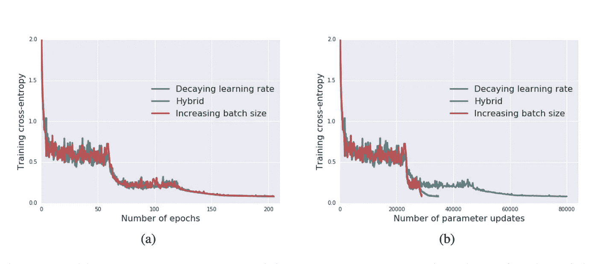
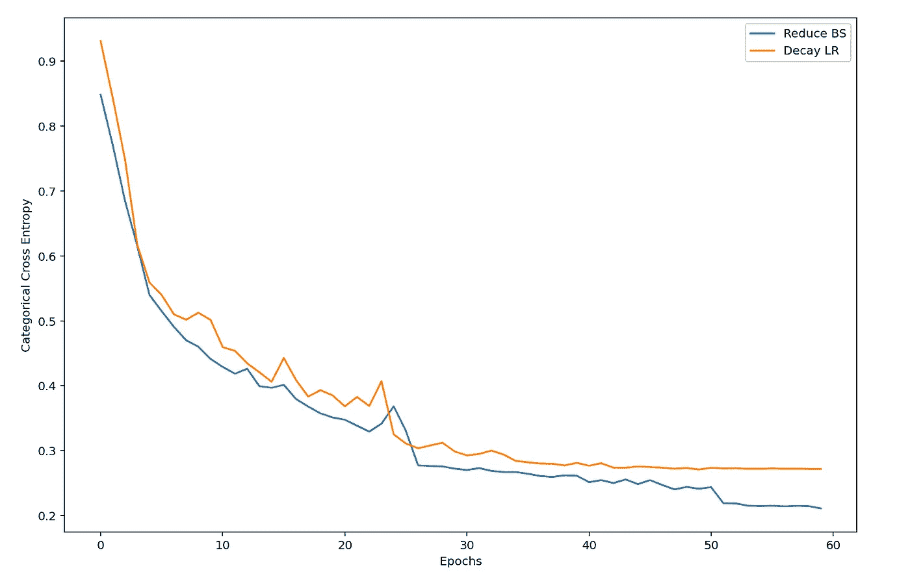

# 为什么在神经网络中使用学习率调度器可能是浪费时间

> 原文：<https://towardsdatascience.com/why-using-learning-rate-schedulers-in-nns-may-be-a-waste-of-time-8fa20339002b>

## 提示:批量大小是关键，它可能不是你想的那样！


安德里克·朗菲尔德在 [Unsplash](https://unsplash.com?utm_source=medium&utm_medium=referral) 上拍摄的照片

> **TL；DR:** 不是用一个因子来降低学习速率，而是用同一个因子来增加批量大小，以实现更快的收敛，如果不是更好的话，也能获得更好的训练结果。

近年来，神经网络的不断发展使得其在现实世界中的应用越来越多。尽管神经网络和其他类似的深度学习方法很受欢迎，但它们仍然存在严重的缺陷，影响了它们在未知数据集上的可用性或性能。

众所周知，神经网络消耗大量的计算资源和时间。随着对神经网络研究的不断深入，越来越多的复杂结构被提出并付诸实践。然而，即使一些较大的网络与较小的网络相比可能能够获得不错的性能，但其训练和推理时间的总量使它们不适用于许多现实世界的场景。减少神经网络训练时间的一个标准解决方案是增加批量大小，或者增加网络在其参数的一次更新中看到的数据量。从逻辑上讲，如果网络在每次更新时看到更多的数据，那么与每次出现新样本就更新其参数的网络相比，参数更新的总数将会减少。我们可以通过减少参数更新的次数来有效地减少网络训练时间。

## 批量大小和泛化差距

然而，最近的研究表明，更大的批量会导致更大的泛化差距(参见 Nitish Shirish Keskar 等人的“关于深度学习的大批量训练:泛化差距和尖锐极小值”)。术语“泛化差距”与“过度拟合”同义，描述的是训练数据和测试数据之间存在性能“差距”的现象，后者比前者更差。为了提高在看不见的数据集上的性能，模型需要能够将它们在训练中所学的知识归纳并应用到新的、看不见的样本上。

为了解释为什么增加批量大小会导致显著的泛化差距，想象一个以 2 递增的数字串，从“1，3，5，…”，一直到“…，37，39”。现在，假设你被告知在不看的情况下从列表中随机选择 15 个数字。在你睁开眼睛后，你有多大可能发现原始列表中的增量模式(假设事先没有告诉你模式)？经过一番重新整理，答案估计很有可能。这是因为您获得了列表中 20 个值中的 15 个；偶然地，一些组合可以泄露模式。如果你只能从列表中随机选择三个值会怎么样？你还能辨认出模式吗？答案并不确定，因为列表中 20 个值中的 3 个可能很少或没有给出关于每个数字之间的原始关系的信息(增量为 2)。


一个关于大批量和小批量之间差异的思想实验。图片来自作者。

批量大小对模型性能的影响与上述思维实验的方式相同:批量越大，模型越有可能在更少的时期内发现特征和目标之间的关系。这一发现可能有利于训练，因为该模型可以更快地达到全局最小值，但这是以较差的泛化能力为代价的。当模型在每个更新步骤中看到的数据较少时，它可能无法找到适合训练数据的最佳参数，但它更有可能为同一类型的所有数据集归纳出一个通用规则(就像世界上不是每个数字列表都有递增 2 的模式一样)。批量较大的模型更容易过度拟合，从而比批量较小的模型产生更大的泛化差距，而批量较小的模型可以在看不见的样本上表现良好。

## 批量大小和学习率与噪音训练的关系

Samuel L. Smith 和 Quoc V. Le 在他们的研究“关于一般化和随机梯度下降的贝叶斯观点”中，通过提出 SGD 优化器的“噪声标度”计算进一步证明了这一点:

其中 N 是训练样本的数量，B 是批量大小，ε是学习速率。由于 B << N，在大多数情况下，我们可以将噪声比例简化为

“噪声标度”值描述了由于批量更新而导致的 SGD 训练中随机波动的幅度。直观地说，噪声越小，训练结果越好，但请注意，在训练中保持合理的噪声量有助于模型的泛化，从而使训练规范化。将批量大小设置为相对较大的值将在整个训练过程中产生最小的噪声，从而导致较差的泛化能力，因此较大批量大小周围的直觉会导致较大的泛化差距。

增加批量大小和降低学习速率都会降低噪声水平。

衰减的学习率通常被用作训练的一部分来降低噪声。通过在训练开始时具有较大的学习率值，网络将能够在噪声情况下搜索较大的参数空间。一旦模型找到了要采取的最佳方向/步骤，额外的噪声可能会开始损害训练(即，验证损失开始增加)，然后学习速率会慢慢降低。当模型接近全局最小值时，这个动作将减少噪声，减慢到更稳定的训练阶段。这样做可以确保模型的泛化和良好的训练结果，但代价是复杂网络需要长达数天甚至数周的训练时间。

## 增加批量大小，而不是降低学习速度

注意，不仅衰减ε/学习率的值可以降低噪声水平，而且增加 B/批量大小的值也可以达到相同的效果。利用这一事实，Samuel L. Smith、Pieter-Jan Kindermans、Chris Ying 和 Quoc V. Le 在他们的研究中表明，学习速度和批量大小成反比。作者提出，不使用学习率调度器，而是在训练期间增加批量大小，这可以根据经验获得与衰减学习率相同的结果。在作者的实验中，他们在以下条件下训练了三种类型的模型:

1.  学习率下降:学习率反复下降 5 倍
2.  混合:在第一步增加批量，同时保持学习速率不变，然后训练类型恢复到#1。这种训练方法模拟了较大批量不可行的潜在硬件限制
3.  增加批量:批量以与#1 相同的速率增加 5 倍。

下图显示了他们的培训结果。



三种模型的实验结果。来自塞缪尔·史密斯等人。

在左边，我们观察到，随着批量的增加，模型的训练结果等价于学习率下降的训练。然而，与传统的衰减学习率模型相比，增加批量大小的模型实现了 67%的参数更新。更具体地说，作者指出，批量大小应增加到大约 N/10；然后，在剩余的训练持续时间内，该模型将回复到传统的衰减学习率训练风格。

本质上，我们可以用“批量调度器”代替学习率调度器，并大大减少训练时间。下面是作者在 Keras 中的方法的简单演示。使用森林覆盖类型数据集(可在 Scikit-learn 中找到)。

```
from sklearn.datasets import fetch_covtypedataset = fetch_covtype()
X = pd.DataFrame(dataset.data)
y = pd.DataFrame(dataset.target)
y = pd.get_dummies(y[0])X_train, X_test, y_train, y_test = train_test_split(X, y, test_size=0.25)
```

用于演示的模型是一个相当深的表格数据网络，有七个隐藏层和一个类似瓶颈的设计。

```
def create_testing_model():

    inp = L.Input(X.shape[1])
    x = L.Dense(512, activation="relu")(inp)
    x = L.Dropout(0.25)(x)
    x = L.Dense(256, activation="relu")(x)
    x = L.Dense(256, activation="relu")(x)
    x = L.Dropout(0.25)(x)
    x = L.Dense(128, activation="relu")(x)
    x = L.Dense(256, activation="relu")(x)
    x = L.Dense(256, activation="relu")(x)
    x = L.Dropout(0.25)(x)
    x = L.Dense(512, activation="relu")(x)
    x = L.Dropout(0.25)(x)
    out = L.Dense(7, activation="softmax")(x)
    normal_model = M.Model(inputs=inp, outputs=out)
    normal_model.compile(optimizer=tf.keras.optimizers.Adam(learning_rate=6e-4), loss=tf.keras.losses.CategoricalCrossentropy())

    return normal_model
```

通过模仿 Keras `ReduceLROnPlateau`回调，当验证损失在三个时期内没有改善时，批量大小从 256 开始增加 5 倍。

```
# timing purposes
batch_start = time.time()
# total epoch number
epoch=60
# ensure the batch size is 256 on the first epoch
batch_size=256/reduce_fac
# for recording training history
batch_history_total = pd.DataFrame([], columns=["loss", "val_loss"])
# init model
batch_model = create_testing_model()# make sure batch size does not exceed sample size/10 and epoch doens't go below 0
while epoch > 0 and batch_size <= len(X_train)/10:

    print(F"CURRENT BATCH SIZE: {batch_size*reduce_fac}")
    # early stop if val loss stops improving for 3 epochs
    early_stop = C.EarlyStopping(monitor="val_loss", patience=3, verbose=2)batch_history = batch_model.fit(X_train, y_train, epochs=epoch, batch_size=int(batch_size*reduce_fac), 
                                    validation_data=(X_test, y_test), callbacks=[early_stop], verbose=2)
    cur_history = pd.DataFrame(batch_history.history)
    # concat the current training history to the total dataframe
    batch_history_total = pd.concat([batch_history_total, cur_history], axis=0).reset_index(drop=True)
    # adjust batch size
    batch_size = batch_size*(reduce_fac)
    # decrease total epoch by the number of epochs trained
    epoch_trained = len(cur_history)
    epoch -= epoch_trainedif epoch > 0: 
    # reverting to reduce lr training
    print("reverting to reduce lr training")
    reduce_lr = C.ReduceLROnPlateau(monitor="val_loss", factor=(1/reduce_fac), patience=3, verbose=2)
    batch_history = batch_model.fit(X_train, y_train, epochs=epoch, batch_size=int(batch_size), validation_data=(X_test, y_test), callbacks=[reduce_lr], verbose=2)
    batch_history_total = pd.concat([batch_history_total, pd.DataFrame(batch_history.history)], axis=0).reset_index(drop=True)batch_end = time.time()
```

为了进行比较，用 256 的恒定批量训练相同的模型，同时降低验证损失没有改善的每三个时期的学习率。两个模型都训练了 60 个历元，仅用`ReduceLROnPlateau`训练的模型令人惊讶地慢了两倍(在 GPU 上)，验证性能稍差。



减少批量方法和衰减 lr 方法的训练结果比较。图片来自作者。

下次，在训练任何神经网络时，无论是图像分类、表格数据还是音频任务，都要给“批量调度程序”一个尝试。结果可能会为您节省一些时间(和细微的改进)！