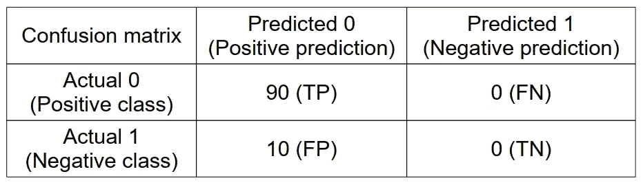
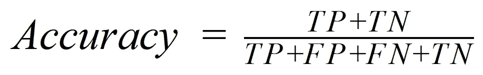
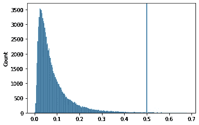
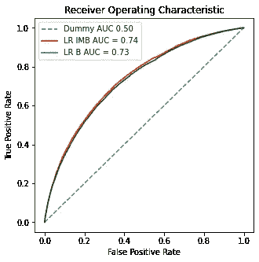

# 为什么我们需要处理不平衡的班级

> 原文：<https://towardsdatascience.com/why-we-need-to-deal-with-imbalanced-classes-ec0dc1a7b803>

类别不平衡自然会出现在某些类型的分类问题中，如信用归属(数据集通常包含的批准信用比拒绝信用多得多)或欺诈检测(欺诈通常只占总交易的一小部分)。

类别不平衡是指分类变量的模态之一相对于其他模态而言被过度表示，如下例所示:

不平衡变量的饼图示例(图片由作者提供)

建议在训练模型之前处理类别不平衡，建议的方法通常属于以下类别之一:

*   [过采样](/7-over-sampling-techniques-to-handle-imbalanced-data-ec51c8db349f)
*   [欠采样](https://medium.com/analytics-vidhya/undersampling-and-oversampling-an-old-and-a-new-approach-4f984a0e8392)
*   [两者的结合](https://machinelearningmastery.com/combine-oversampling-and-undersampling-for-imbalanced-classification/)

如果你想了解关于某个主题的更多信息，我已经为每种方法链接了一些资源。这篇文章将重点阐述为什么首先要解决职业不平衡，以及它对模型性能的影响。假设您熟悉分类模型的性能测量，如果不熟悉[这里](/8-metrics-to-measure-classification-performance-984d9d7fd7aa)是一个很好的起点。

# 所选择的性能度量标准需要意识到类别不平衡

让我们考虑一个类似于饼图所示的例子，数据集中 0 类和 1 类之间的比例为 1:10。我们希望建立一个分类模型，根据一些特征来预测 0 或 1。

在这种情况下，选择准确度作为性能度量(例如，总预测中正确预测的比例)可能导致训练连续预测最频繁类别的虚拟模型。对于这种模型，混淆矩阵将由下式给出:

班级失衡情况下虚拟模型的混淆矩阵(图片由作者提供)

根据精度公式，我们可以看到我们的虚拟模型可以提供 0.9 的精度:

准确率评分(图片由作者提供)

这种数字在理论上可能听起来不错，但来自一个实际上解释不了太多的模型，并且在新数据上概括得很差。为了防止这种行为，通常在实践中根据几个度量标准来评估模型。例如，通过计算 ROC AUC 得分(在这种情况下为 0.5)，可以很容易地排除这种极端情况。

但是为模型评估选择一个好的度量标准从来都不是显而易见的，尤其是在类不平衡的情况下。从源头上解决阶层失衡有助于消除这种额外的担忧。

# 使用默认分类阈值可能会导致性能下降

执行模型评估时，分类阈值经常被遗忘，但它提供了额外的自由度，可以帮助调整已训练的模型，以达到所需的性能。

分类模型的原始输出通常是 0 和 1 之间的连续值，表示结果的概率。基于所选择的分类阈值，它被转换成类别 0 或类别 1。阈值默认设置为 0.5，该值通常将理论模型输出除以二(大多数 ML 模型通常假设正态性，尽管在该假设不成立的情况下一些模型足够稳健):

平衡训练集的模型输出和默认分类阈值的示例(图片由作者提供)

基于不平衡数据集训练模型会导致非常扭曲的输出分布。在这种情况下，使用分类阈值的默认值可能会导致性能下降。

不平衡训练集的模型输出和默认分类阈值示例(图片由作者提供)

甚至像随机森林这样的非概率模型也仍然依赖于这样的假设，即用于执行 bootstrap 聚合的抽样是有代表性的。在不平衡的类的情况下，这种假设不一定成立，并且会导致较差的整体性能。

在偏斜的输出分布的情况下，可以从 ROC 曲线或精确召回曲线计算“最优”分类阈值，如这里的[所示](https://machinelearningmastery.com/threshold-moving-for-imbalanced-classification/)，或者通过定义自定义网格搜索分数，这是我已经讨论过的主题[这里的](https://machinelearningmastery.com/threshold-moving-for-imbalanced-classification/)

# 平衡班级不是免费的

我们已经看到了处理不平衡数据的重要性，但是将这种转换应用于数据并不一定没有后果。根据选择的方法，它可能会引入偏差，导致过度拟合或删除重要信息。

在平衡了类之后，我们可以检查整体模型性能是否受到所使用的平衡技术的太大影响。对于我之前考虑的例子，不平衡数据(红色)的 ROC 曲线几乎与平衡数据(绿色)的 ROC 曲线重叠，这意味着增加的健壮性在性能上几乎没有损失。

如果平衡数据集获得的结果好得多或太好，则可能出了问题。一个常见的错误是在训练和测试中分割数据集之前或交叉验证之前进行过采样(有关示例和更详细的解释，请参见此处的)。这导致[数据泄露](https://medium.com/towards-data-science/how-data-leakage-affects-model-performance-claims-841eb01276bb)和评估指标不可信。

这篇文章的目的是说明类不平衡对训练模型和一些评估指标的影响。数据科学家已经在世界各地使用不同的方法来处理类别不平衡，但没有一种方法是免费的，它们对模型性能的影响需要正确评估。