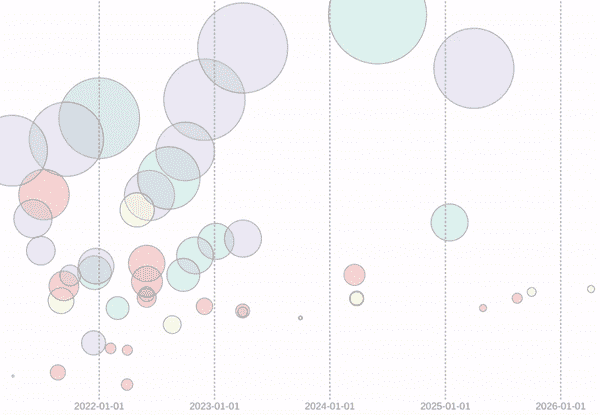
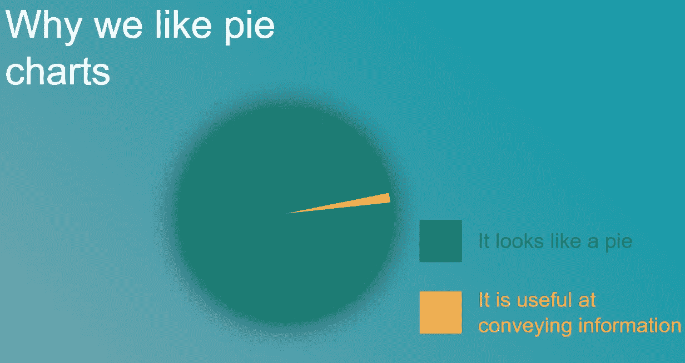

# 为什么我们应该在数据可视化中使用动画

> 原文：<https://towardsdatascience.com/why-we-should-use-animation-in-data-vizualisation-6004fb400014>

## 3 个有证据支持的理由，让数据充满活力

来源:作者

数据可视化中的动画在某种程度上是一个肮脏的词，作为一个数据可视化纯粹主义者讨厌的主题，它位于 3D 条形图之上，饼图之下。

爱他们或恨他们，饼状图在这里停留。来源:作者

诚然，滥用动画来可视化数据会造成混乱，并给我们的工作记忆带来压力。

然而，如果处理得当，移动可以给数据可视化增加一些其他方式无法复制的东西。在这篇文章中，我提出了 3 个理由，说明为什么你应该用 motion 让你的数据栩栩如生。

## 1.约会

21 世纪的所有媒体都在尖叫着吸引我们的注意力。竞争激烈，内容无处不在。这导致内容提供商采取越来越复杂的策略来吸引和保持我们的注意力。

商业世界也不例外。工具使得创建和分享内容变得越来越容易。然而，有点矛盾的是，这使得个人内容很难从任何给定组织中不断增加的“数字噪音”中脱颖而出。这种噪音会导致失去参与。人们可能会对信息变得麻木，即使这些信息很有见地、信息丰富，纯粹是因为它们没有吸引力。

那么，对于数据可视化来说，为什么这很重要呢？答案很简单；参与是关键，因为无法吸引用户的数据可视化也无法传达任何信息。

在吸引终端用户方面，企业可以从社交媒体巨头那里学到很多东西。2016 年，Twitter 对其数据进行了内部分析。他们发现媒体显著增加了内容的参与度。视频被转发的可能性是照片的 600%。[2]

> 视频被转发的可能性是照片的 6 倍，是 gif 的 3 倍。

这并没有告诉我们**为什么**视频比静态内容更突出。我们可以假设这样的媒体是

*   更容易让我们消化；
*   建议更高质量的内容(基于视频需要更多时间投入的事实)；和
*   从其他格式的“噪音”中脱颖而出。

微软的研究更进了一步，表明在数据可视化方面，motion 更吸引用户，因为它更“有趣”。在一项比较静态图表和动画图表的研究中，相比静态图表和图形，参与者更喜欢动画可视化。“用户反复反映动画状态‘有趣’或‘令人兴奋’，或者有一次‘感人至深’。”"[3]

## 2.情绪

情绪对我们的认知过程有着实质性的影响，包括感知、注意力、学习、记忆、推理和解决问题[4]。为了创造一个真正强大、持久和难忘的体验，我们必须与用户的情感互动。

动画可以用静态图表无法做到的方式做到这一点。即使是无生命的物体的动画也能让它们活起来。它可以创造更高层次的意义，包括因果关系和拟人。

为了理解这到底意味着什么，有必要看看下面这段 1944 年的海德尔-齐美尔错觉视频:

海德尔和西美尔 1944

尽管制作于近 80 年前，这个视频仍然能够对三个无生命的几何形状产生同样的情感依恋。

与最初(和随后)实验中参与者表现出的情感依恋一样令人惊讶的是解释的一致性。参与者看到相同的故事展开，并在描述场景时将人类特征归因于这些形状[5]。事实上，我们发现这样的图像很容易解释，这突出了它们向观众传达信息的能力。

## 3.信息

作为人类，我们天生就能感知运动。这基本上是一种生存机制，能够快速发现向我们移动的捕食者可能意味着生与死的区别。有趣的是，运动是这种认同的关键部分。

我们都经历过这种情况，就像当人群中的朋友开始向我们挥手时，我们更容易认出他们一样，一只被伪装掩盖的隐形动物一旦开始移动，就会立即失去隐形能力。

> 一旦开始移动，伪装成隐形的动物会立刻失去隐形能力。

最近的研究证实了我们识别移动物体的效率，即使是在“嘈杂”的背景下。通常，我们可以在 30 毫秒内识别这种情况下的对象[6]。

鉴于数据可视化的整个领域都致力于以可视化的方式呈现信息，使我们能够快速有效地处理信息，动画提供了一个强大的工具来“利用”我们对运动物体识别的敏感性。

## 结论

数据可视化中的运动在很大程度上被该领域的专家所回避。这意味着失去了一个机会；有明确的证据表明，动画可以增加参与度，与观众建立情感联系，并以更有效、更丰富的方式传达信息。

下次你需要可视化数据的时候，不要忘记用运动来赋予它生命！

## 进一步阅读

如果你对数据可视化中使用运动的例子感兴趣，我在下面附上一些我最喜欢的。如果你有更多的例子要补充，请评论。

*   汉斯·罗斯林 [200 年内去了 200 个国家](https://www.youtube.com/watch?v=jbkSRLYSojo)就是一个很好的例子。它已经被复制了很多次，但从来没有像汉斯那样以激情和表现力闻名。
*   条形图竞赛被描述为数据可视化的“坐立不安的旋转器”。他们是动画如何吸引观众的一个很好的例子。还不清楚是谁创造了第一个这样的例子，但是全球品牌的演变被认为是第一个病毒式的例子。
*   [这个欧洲](https://www.reddit.com/r/dataisbeautiful/comments/rth19l/oc_24_hours_of_flights_between_europe_and_the_us/)和美国之间航班的例子正在记忆中。用静态图表不可能以同样的方式重新创建它。

## 参考

[1] [视觉数据传播的科学:什么在起作用](https://journals.sagepub.com/doi/10.1177/15291006211051956)。2021 史蒂文·l·弗朗科内里等人。

[2] [推特内部数据分析](https://marketing.twitter.com/en/insights/best-practices-for-supercharging-campaigns-with-branded-emojis) 2016

[3] [动画在趋势可视化中的有效性](https://www.microsoft.com/en-us/research/wp-content/uploads/2016/02/tvcg2008-trendvis.pdf) 2016，乔治·罗伯逊等。

【4】[感性因果论与兽性](https://www.sciencedirect.com/science/article/abs/pii/S1364661300015060)。2017 年，布莱恩·J·舒拉，帕特里斯·D·特雷穆特

[5]f . Heider 和 m . Simmel(1944)对表观行为的实验研究。美国心理学杂志，57，243–259 页

[6] [空间抑制促进运动物体的快速图形-背景分割](https://www.nature.com/articles/s41467-019-10653-8)，Nature Communications 2019，Duje Tadin 等