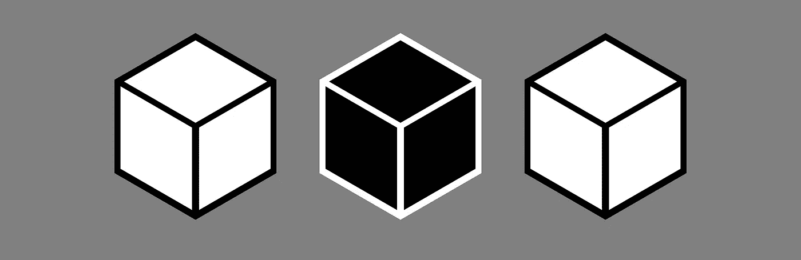
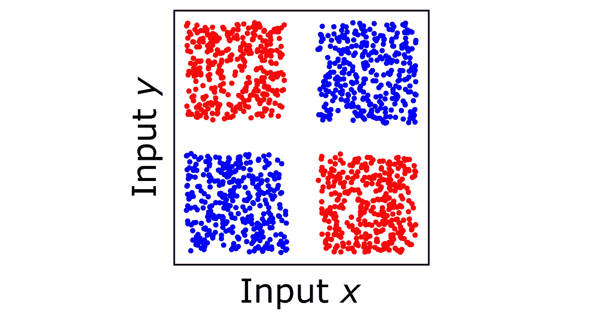
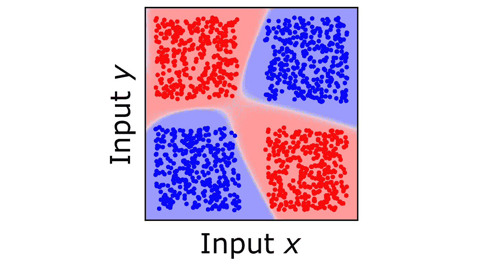
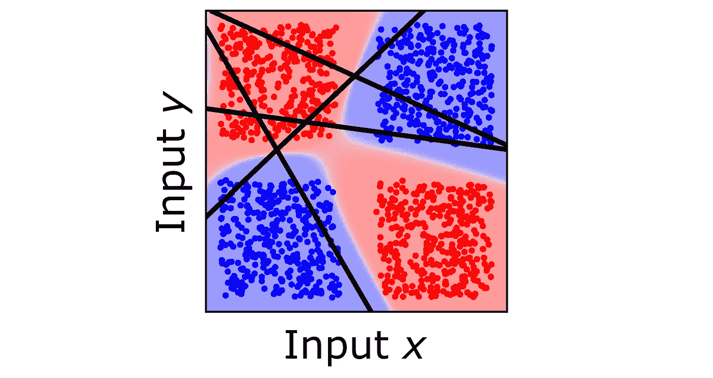
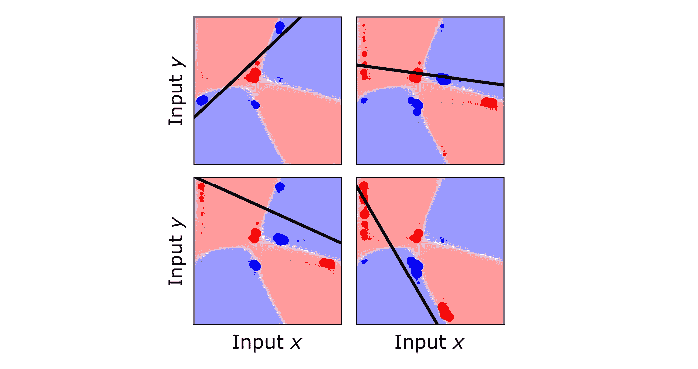
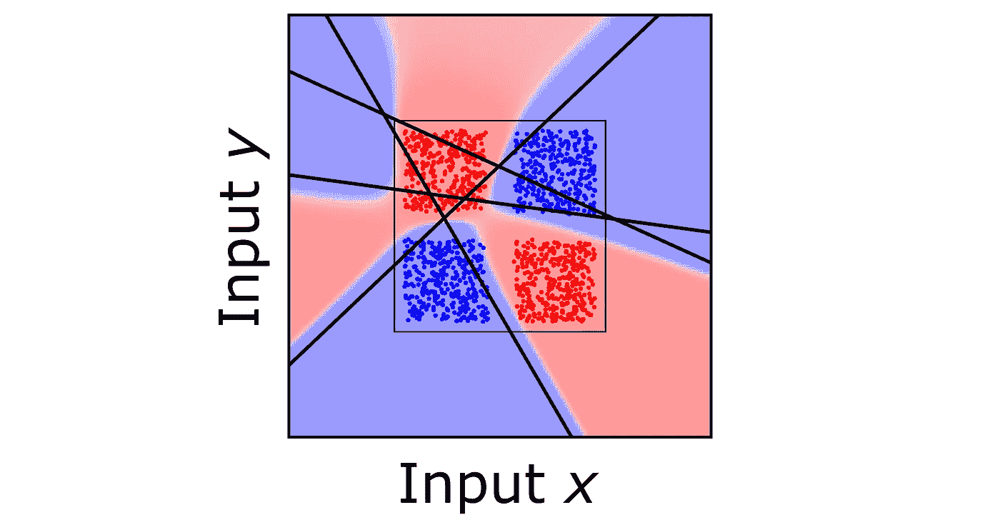
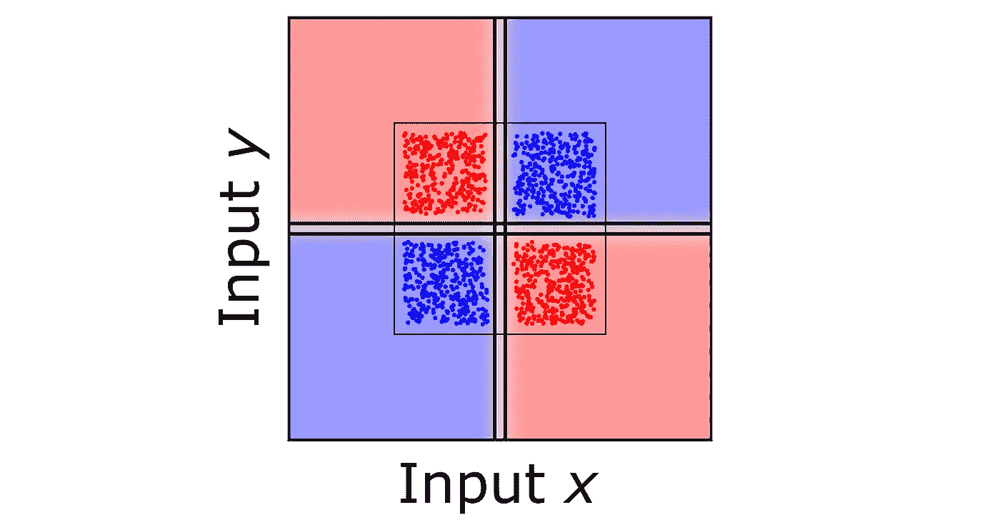

# 为什么我们永远不会打开深度学习的黑匣子

> 原文：<https://towardsdatascience.com/why-we-will-never-open-deep-learnings-black-box-4c27cd335118>

作者图片

## 但是我们仍然可以把整件事炸掉

尽管关于深度学习的黑盒有很多争论，但很少有人谈到为什么深度神经网络首先是黑盒。当我们说是黑匣子的时候，又是什么意思呢？这真的是很难的数学吗，还是有什么东西使得它们本质上无法解释？有什么方法可以训练深度神经网络，让它不是黑盒？

# **黑盒是什么？**

在最基本的层面上，“黑盒”只是意味着，对于深度神经网络来说，我们不知道所有单个神经元如何共同工作以达到最终输出。很多时候，甚至不清楚任何特定的神经元自己在做什么。

深度神经网络中的每个神经元从其他神经元接收一组输入，将每个输入乘以它在训练期间学习的权重，然后计算输出(通过将它传递给非线性激活函数)。众所周知，这在数学上等同于在前一层神经元的空间中绘制线性决策边界(例如，2 维中的线或更高维中的超平面)。当考虑多个神经元如何一起工作时，黑箱就出现了。

让我们看看这个非常简单的问题是什么样子的。我们有一个包含蓝色和红色样本的训练集。每个样本有两个输入值， *x* 和 y，我们可以在下面看到。

训练样本，每个样本由两个值(x，y)组成，标记为蓝色或红色

然后，我们训练一个简单的神经网络，它可以准确预测所有这些训练样本的蓝色或红色(该网络有 2 个隐藏层，每个隐藏层有 4 个神经元)。我们可以通过根据网络的输出给背景着色来表示网络学到了什么。

经过训练的神经网络的预测在背景中是彩色的

它能合理地预测所有( *x* ， *y* )对的标签，甚至在训练样本之外。现在我们来看看第一层的神经元在做什么。我们可以把他们的决策边界画成线。

单个神经元无法解释

它们没有多大意义。观察这些神经元的决策边界，我们发现了几个谜团。这些行与训练样本有什么关系？这些线路与网络输出有什么关系？而它为什么要这样学呢？

*这个*就是我们所说的“黑匣子”。

黑盒的存在是由于中间神经元在做出网络最终决定的过程中做出了这些奇怪的决定。不仅仅是复杂的、高维的非线性数学；黑匣子本质上是由于非直觉的中间决策。

# **为什么会有黑匣子？**

考虑每个神经元在训练过程中必须学习什么。较浅的神经元学习如何从输入中提取特征，并将它们映射到一些有用的潜在空间。更深层的神经元学习如何将训练样本从潜在空间映射到适当的输出。

然而，所有的神经元同时被训练。一开始，他们是随机开始的。较浅的神经元开始训练，以开发一个对较深的神经元当前正在做的事情有用的潜在空间。同时，更深层的神经元必须学会如何从这个最初糟糕的潜在空间映射到适当的输出。

虽然每个神经元都在学习做自己的工作，但它会因其他神经元的不良表现而受到削弱。他们学会补偿其他神经元的缺陷，这发展成一个相互依赖的可悲的缠结网络。

为了看到这一点，让我们看看上面例子中的四个第一层神经元。在训练结束时，我们可以通过计算损失函数相对于每个样本的神经元输入权重的梯度，来测量每个训练样本对每个神经元的决策边界的位置有多大影响。

四个第一层神经元中的每一个，每个训练样本的大小与其对神经元位置的影响程度成比例

最负责设计每个神经元的训练样本分布在输入空间中，并且不反映训练样本的明显结构。由于通过梯度下降学习的纠缠性质，每个神经元都做一点点事情，以处理它从前一层接收的混乱。结果是，不是每个神经元都有明确的功能来反映它试图学习的任务的结构，而是它的功能被涂掉了。这导致了黑箱，每个神经元形成看似无意义的决策边界。

这些纠缠的潜在空间的另一个结果是无法远离原始训练样本进行外推。我们可以缩小这个红蓝问题，看看神经元决策边界的混乱如何在训练样本的领域之外产生意想不到的、不良的行为。

缩小显示无法解释的隐藏神经元是造成推断不佳的原因

很明显，在遥远的外推法中，网络的行为渐近于基于神经元决定边界的几何形状。隐藏神经元的不可解释性是深度学习无法进行外推和概括的直接原因。在更高的维度上，这产生了奇怪的决策边界，导致了[对抗性攻击](https://www.nature.com/articles/d41586-019-03013-5)的现象。

# **炸毁黑匣子**

基于梯度的深度学习如果没有可解释性、泛化和对抗鲁棒性，永远无法实现真正的人工智能。我们不应该试图打开一个无法打开的黑匣子，而是需要将整个事情炸毁，并找到一种更类似于人类推理的深度学习的替代训练方法。即使是传统的基于梯度的深度学习的创始人之一 Geoffrey Hinton，[也说过同样的话](https://www.axios.com/artificial-intelligence-pioneer-says-we-need-to-start-over-1513305524-f619efbd-9db0-4947-a9b2-7a4c310a28fe.html)。

麦卡洛克和皮茨最初提出的人工神经元实际上是为了模仿简单的人类逻辑[1]。当我们开始依赖梯度下降来训练神经网络以解决更大、更复杂的问题时，我们只是被困在了黑盒中。

可解释的深度学习会是什么样子？对于上面的红色对蓝色问题，似乎最直观的神经网络将使用具有如下所示决策边界的神经元。

一个理想的神经网络的输出和第一层神经元的蓝色与红色的任务

现在，神经元对于训练样本有意义，并且很容易看出它们如何与网络的最终输出相关。网络进行推断是因为神经元学习了可解释的和可概括的决策边界。但是梯度下降怎么学这个呢？

它不能。

如上所述，梯度下降训练迫使神经元补偿其他神经元的不足，在多个神经元之间涂抹简单的功能。它没有教导神经元在网络中具有专门的和/或模块化的子功能。

因为神经元通过决策边界形成分离，理想情况下，它们会学习基于概念的结构来分离训练样本。这是最近提出的一种替代方法[的基础，该方法用于训练模仿人类推理的可解释的深度神经网络](https://rdcu.be/cyfGB)【2】。

在这种称为本质神经网络(ENNs)的深度学习新范式中，每个神经元都承担一些专门的功能(即分离训练样本的两个子群或区分不同的学习特征)，同时仍然能够扩展到大型问题，如计算机视觉和复杂的逻辑推理问题。

当我们抛弃梯度下降并使用更类似人类的方法来训练深度神经网络时，黑箱立即消失。通过赋予可解释性，我们使深度神经网络能够进行推断和概括，并且对敌对攻击更加鲁棒。这种新形式的神经符号人工智能正在带来许多新的能力，这些能力以前是传统的基于梯度的深度学习所不可能的。

黑盒不是神经网络的必要特征。随着我们超越反向传播和梯度下降，深度学习将回到它的起源，并再次模仿人类推理，而没有不必要的黑盒神秘主义。

**参考文献**

[1] W.S .麦卡洛克& W .皮茨，“神经活动中固有观念的逻辑演算”。*数学生物物理学通报* **5** ，115–133(1943)。

[2]布拉塞克和林明敏。“模拟推理的可解释神经网络”。*自然计算科学* **1** ，607–618(2021)。

[3]布拉塞克。《亚里士多德如何修复深度学习的缺陷》。*渐变* (2022)。