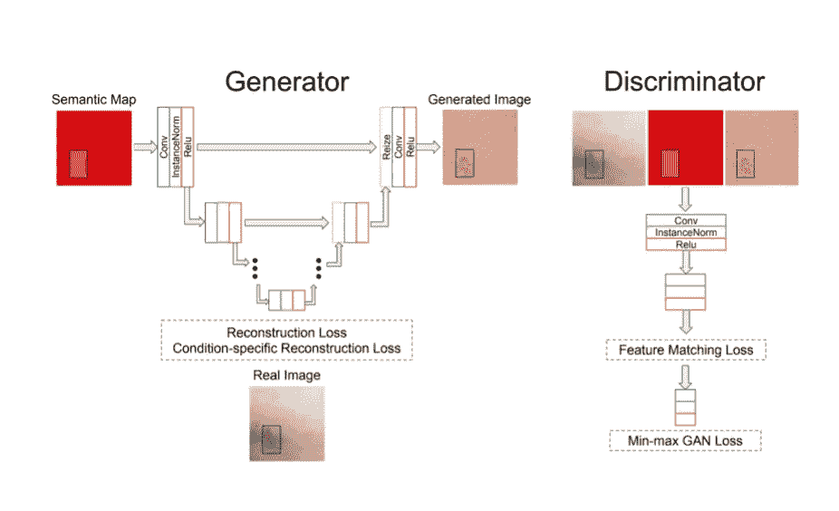

# 为什么您应该考虑对医疗数据使用生成式对抗网络

> 原文：<https://towardsdatascience.com/why-you-should-consider-using-generative-adversarial-networks-for-medical-data-d0fc03314b3>

## 将 GANs 用于医疗数据的两个优势

[国家癌症研究所](https://unsplash.com/@nci?utm_source=medium&utm_medium=referral)在 [Unsplash](https://unsplash.com?utm_source=medium&utm_medium=referral) 上拍摄的照片

有监督的深度学习方法需要大量可能难以获得的数据，尤其是在医学领域。一个原因是，它是私人数据，我们不能总是获得、使用和共享。第二个原因是很难获得这些数据的标签。需要专家标注者，比如医生护士，既费钱又费时。即使我们有大量带标签的数据，我们也可能会遇到其他问题，比如数据平衡。罕见的情况不会在数据中频繁出现，并且会产生影响我们模型结果的偏差。

**那么我们如何克服这些问题呢？有没有一种方法有帮助的潜力？生成性对抗网络。**

有这种潜力的一种方法是生成模型。在这篇文章中，我将描述如何使用生成方法，特别是生成敌对网络，我们可以减少上述问题。这篇文章将涉及数据量、平衡和隐私问题。

# 生成对抗网络

GAN 模型生成与训练集具有相同统计信息的新数据。它由两个相互竞争的网络组成，即生成器和鉴别器。**生成器**学习从潜在空间映射到感兴趣的数据分布，以便生成新的样本。**鉴别器的**目标是将生成器生成的候选数据与真实数据分布区分开。换句话说，对每个样本进行分类，不管它是真实样本还是生成的样本。**生成器的**目标是骗过鉴别器，让它相信生成的样本是真实的，最大化鉴别器的错误率。

**通过使用 GANs，我们可以生成新的医学样本，并解决数据量、平衡和隐私问题。**

# 数据量和平衡

在许多情况下，我们希望开发一种用于医疗目的的算法，但我们没有足够的数据，即使有，也是不平衡的。这两个问题都可以通过使用 GAN 方法生成高质量的合成数据来解决。

比如德摩根。DermGAN 是一个生成网络，将临床图像与皮肤状况相结合。皮肤状况、其存在区域(橙色矩形)和皮肤颜色(红色背景)的贴图编码通过生成器生成合成图像。

图片来自报纸—[https://arxiv.org/pdf/1911.08716.pdf](https://arxiv.org/pdf/1911.08716.pdf)

使用 DermGAN，我们可以生成大量关于皮肤状况的图像。这解决了数据量问题。我们还可以控制图像的平衡。我们可以从稀有条件中产生更多的样本，这解决了数据平衡问题。

这只是这一领域工作的一个例子。

**使用生成式方法可以生成几乎任何数量的图像，并且需要对样本进行平衡。这是克服数据量和平衡问题的一步。**

# 数据匿名化

大多数医学研究都是使用真实患者的私人医疗数据进行的。开源的数据集有好几个，但是局限于特定的领域和特定的数据分布，对于开发真实世界的系统来说是不够的。为了解决这个问题，每个小组都为自己手头的问题创建了自己的医学数据集。这些数据集是私有的，不能与组外的同事共享。因此，知识共享和结果的可复制性变得几乎不可能。

**通过使用 GANs 生成合成医疗数据，我们将能够创建新的数据集，并在医疗界共享它们，从而进一步推动研究。**

# 挑战

虽然这听起来很棒，但在使用合成数据之前，我们需要考虑几件事。比如说-

*   真实数据和合成数据之间的比率
*   用于从 GAN 采样图像的采样技术
*   合成数据的分布。
*   合成数据的质量
*   …

当我们考虑在模型中使用合成数据时，我们应该想到这一点。

# 总结

我希望我说服了您，医学界可以从开发和改进 GAN 方法中受益，以生成高质量的合成医学数据。我不确定我们是否已经到了只能使用合成数据的地步，尤其是不能用于所有领域。但我认为这是一个很好的动机，让我们努力开发医疗数据的 GAN 方法。我会继续在我的地盘上调查此事，并随时通知你。

<https://openaccess.thecvf.com/content/CVPR2021W/ISIC/html/Bissoto_GAN-Based_Data_Augmentation_and_Anonymization_for_Skin-Lesion_Analysis_A_Critical_CVPRW_2021_paper.html>  <https://arxiv.org/abs/1911.08716> 