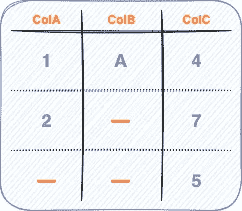
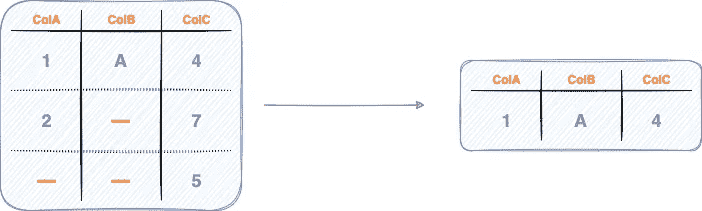
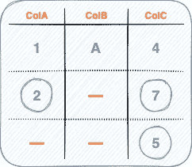
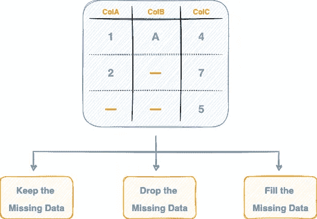
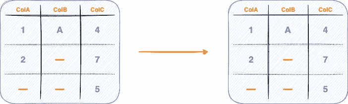
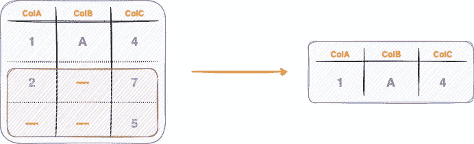
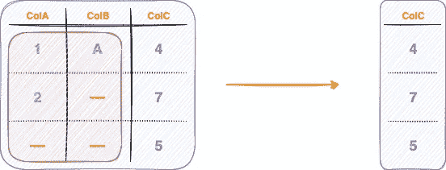
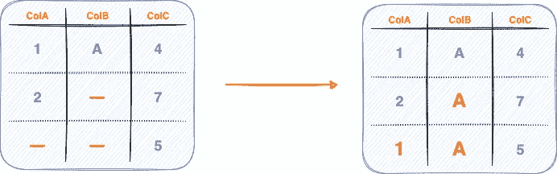

# 为什么应该处理丢失的数据，下面是如何做的

> 原文：<https://towardsdatascience.com/why-you-should-handle-missing-data-and-heres-how-to-do-it-270c321a4d6f>

## 使用熊猫处理丢失数据的综合指南

Pierre Bamin 在 [Unsplash](https://unsplash.com?utm_source=medium&utm_medium=referral) 上拍摄的照片

在每个真实世界的数据集中，丢失数据值几乎是不可避免的，并且在典型的数据收集过程中几乎无法避免。

这可能是由各种原因造成的，例如数据输入过程中的错误、数据收集过程中的技术问题、文件丢失/损坏以及许多其他原因。

在任何真实世界的数据集中，通常都有一些数据科学家和机器学习工程师必须处理的缺失数据，否则，它可能会在开发数据管道时导致几个问题。

表格中缺少数据(图片由作者提供)

因此，在这篇文章中，我将展示一些技术，您可以使用这些技术来处理数据驱动项目中的缺失数据，并可能消除构建数据管道时缺失数据可能导致的问题。

文章的亮点如下:

[**为什么要处理缺失数据**](#e5dd)[**处理缺失数据**](#4c34)[**【1】保留缺失数据**](#6893)[**【2】丢弃缺失数据**](#8553)<#a536>

**我们开始吧🚀！**

# **为什么应该处理缺失数据**

**在进入**如何**解决问题之前，有必要首先了解**为什么**有必要处理丢失的数据。**

**数据确实是所有数据科学和机器学习项目的主要驱动力。它是所有项目的核心元素，机器将根据它做出所有决定。**

**虽然缺失数据的存在确实令人沮丧，但从数据集中彻底消除缺失数据并不总是正确的做法。例如，考虑下图。**

****

**表格中缺少数据(图片由作者提供)**

**如果您考虑消除至少有一个缺失值的所有行，它将:**

## **#1 减少数据集中的数据点数量**

**如下图所示，直接拒绝包含任何缺失值的行会显著减少数据集中的行数。**

****

**删除至少有一个 NaN 值的行(作者图片)**

## **#2 导致我们已经拥有的其他有价值的(正确的)信息的丢失**

****

**在至少有一个 NaN 值的行中标记的非 NaN 值(图片由作者提供)**

**例如，在上面的数据帧中，即使中间一行的`ColB`的值没有被观察到，我们仍然精确地知道`colA`和`colB`中的相应值，这对数据管道仍然非常有价值。**

# **处理缺失数据**

**既然您已经理解了为什么应该处理缺失数据，那么让我们来理解处理缺失数据的技术方面。**

**每当您在表格数据中遇到缺失值时，基本上只有三个选项可供选择，如下图所示:**

****

**处理缺失数据的三种方法(图片由作者提供)**

**下面就来详细讨论一下这三种方法。**

# **#1 保留丢失的数据**

**顾名思义，该方法完全忽略数据集中任何缺失数据点的存在。**

**在这种情况下，数据集转换方法返回原始数据集的副本，如下图所示:**

****

**不对数据帧应用任何变换(图片由作者提供)**

**然而，这里本质上假设丢失的数据点不会在数据管道中引起任何麻烦，并且所利用的方法擅长处理丢失的数据。**

**因此，如果缺失的数据保持原样，那么决定他们的算法是否可以工作是数据科学家或机器学习工程师的工作。**

**保持丢失数据不变的方法定义如下。我们定义了函数`handle_missing_data()`,它将源数据帧作为一个参数，不做任何转换就返回它。**

**如上面的实现所示，原始数据帧保持不变。**

# **#2 丢弃丢失的数据**

**接下来，想象一下，如上所述，保留丢失的数据对于您的特定用例是不可行的。**

**在这种情况下，完全丢弃丢失的数据可能是一个前进的方向。**

**这里的主要思想是从数据帧中删除有任何缺失值的整行(或者一列，如果您的用例需要基于序列的分析的话)。**

**换句话说，在这种技术中，您只保留那些对应于每个列(或行)具有非空值的数据行(或列),并将数据集视为被删除的行从未存在过。**

## **逐行下降**

**顾名思义，这里的目标是删除数据帧中包含缺失值的行。**

**下图描述了按行放置。**

****

**删除至少有一个 NaN 值的行(作者图片)**

**在面向行的删除中，列数保持不变。**

## **按列丢弃**

**与按行删除相比，按列删除涉及删除数据帧中包含缺失值的列(或系列)。**

****

**删除至少有一个 NaN 值的列(作者图片)**

**在面向行的删除中，行数保持不变。**

## **履行**

**类似于上面讨论的保留缺失数据的策略，接下来，我们将实现`handle_missing_data()`函数来删除数据帧中缺失值的行(或列)。**

**您可以使用如下所示的`[dropna()](https://pandas.pydata.org/docs/reference/api/pandas.DataFrame.dropna.html)`方法从数据帧中删除行:**

**axis 参数指定要从数据帧中删除缺失值的方向(行或列)。**

*   **`axis=0`执行面向行的拖放。下面演示了这一点:**

*   **`axis=1`执行面向列的删除，如下面的代码块所示:**

# **#3 填写缺失的数据**

**最后一种方法是用某个值来填充缺失的数据，该值可能是给定未观察位置的最佳估计值，如下所示。**

****

**用随机策略替换缺失值(图片由作者提供)**

**该策略可能涉及用列的平均值、中值或列的最频繁值(众数)来填充缺失数据，具体取决于列中值的类型。**

**这是因为平均值、中值和众数只能对数值进行估计。但是，在分类列的情况下，mean 和 median 没有任何意义。**

**此外，填充标准完全取决于您的特定数据源、您正在解决的问题，以及您对评估特定缺失数据点的感觉如何。**

## **履行**

**寻找缺失值的最佳估计猜测值的最常用技术包括均值、中值和众数，如下所示:**

*   ****填充平均值:****

**平均值策略用列的平均值替换缺失值。**

**如上所述，中庸策略并没有取代`colB`中任何缺失的价值观。**

*   ****填充中间值:****

**接下来，中值策略用中值替换列中缺少的值。这在下面实现:**

**再一次，最初从`colB`丢失的值仍然用`NaN` 值填充。**

*   ****填充模式:****

**最后，用模式值填充会用该列中最常见的值替换缺失的值，如下所示:**

**您还可以对不同的列应用不同的填充策略，如下所示:**

**这里，我们用`colA`的平均值填充`colA`中缺失的值，用`colB`中的模式填充缺失的值。**

# **结论**

**总之，在这篇文章中，我演示了如何处理熊猫数据帧中的缺失数据。具体来说，我们研究了为什么处理缺失数据对您的数据管道至关重要，然后是处理缺失数据的常用策略。**

**在处理缺失数据时，您应该记住，在本文讨论的三种方法(保留、删除和填充)中没有正确的方法。这是因为每个案例都是不同的。**

**视情况需要，选择哪种具体方法总是由您来决定。**

****感谢阅读！****

**[🧑‍💻**成为数据科学专家！获取包含 450 多个熊猫、NumPy 和 SQL 问题的免费数据科学掌握工具包。**](https://subscribepage.io/450q)**

**✉️ [**注册我的电子邮件列表**](https://medium.com/subscribe/@avi_chawla) 不要错过另一篇关于数据科学指南、技巧和提示、机器学习、SQL、Python 等的文章。Medium 会将我的下一篇文章直接发送到你的收件箱。**