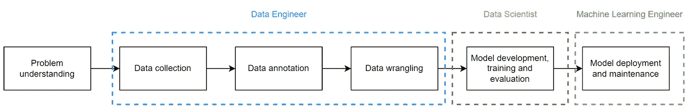
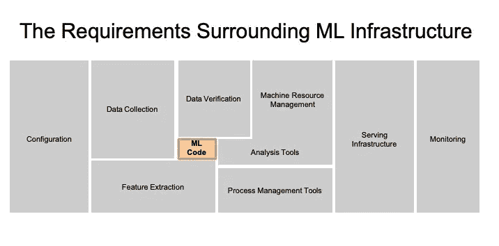

# 为什么你应该学习机器学习工程而不是数据科学

> 原文：<https://towardsdatascience.com/why-you-should-learn-machine-learning-engineering-and-not-data-science-e616141ea866>

## 意见

## 以及如何开始

马文·迈耶在 [Unsplash](https://unsplash.com?utm_source=medium&utm_medium=referral) 上的照片

# 介绍

根据[1]，数据科学是就业市场上最受欢迎的工作之一。但是现在还是这样吗？还是已经有更合意的了？

有！在就业市场上，机器学习工程正在超越数据科学。

在这篇文章中，我想阐明为什么机器学习工程在我看来正在超越数据科学，以及你如何开始学习它。

但我们先从了解两种工作角色的区别开始。

# 机器学习工程师 vs .数据科学家

引用一篇雪花文章很好地总结了这种差异[2]:

> 在同一项目或公司内，机器学习工程师比数据科学家更靠后。很简单，数据科学家将分析数据，并从数据中收集见解。机器学习工程师将专注于编写代码和部署机器学习产品。

我们还可以了解数据科学项目的生命周期，以便更好地理解差异:

图 1: ML 项目生命周期[3](图片由作者提供)。

所以基本上，一个数据科学家开发一个模型，训练和评估它。然后，机器学习工程师采用该模型，将其部署到生产中，并确保模型得到维护。所以机器学习工程师把训练好的模型放到产品中，这样就可以从模型中产生收入。

但是这两种工作不是同等重要吗？是的，他们是。但是，数据科学家已经从公司大规模聘用，因为他们大多处于建模和探索阶段。现在非常需要机器学习工程师，因为公司现在需要将这些模型投入生产，以从中创造价值。

根据 Venture Beat [4]的一篇文章，“87%的数据科学项目从未投入生产”。这是因为缺乏知道如何将模型投入生产的雇佣机器学习工程师。这种不匹配清楚地表明，公司现在更加关注(至少他们应该)雇用机器学习工程师，以便能够将模型投入生产。

在 Glassdoor 上查看公开招聘信息时，我们也可以看到这种差异。对于美国的加利福尼亚州，与 [**3345**](https://www.glassdoor.de/Job/california-machine-learning-engineer-jobs-SRCH_IL.0,10_IS2280_KO11,36.htm?suggestCount=0&suggestChosen=false&clickSource=searchBtn&typedKeyword=machine%2520learning%2520engineer&typedLocation=California%252C%2520Vereinigte%2520Staaten%2520von%2520Amerika&context=Jobs&dropdown=0) 机器学习工程师职位发布相比，目前有 [**1809**](https://www.glassdoor.de/Job/california-data-scientist-jobs-SRCH_IL.0,10_IS2280_KO11,25.htm?suggestCount=0&suggestChosen=false&clickSource=searchBtn&typedKeyword=data%2520sc&typedLocation=California&context=Jobs&dropdown=0) 数据科学家职位发布。所以机器学习工程师的空缺职位几乎是原来的两倍！

但是为什么数据科学家不能简单地学习如何将模型投入生产呢？因为数据科学家专注于 ML 代码，而 ML 代码通常只是整个 ML 基础设施的一小部分(图 2)。数据科学家也应该只关注那一小部分。专注于 ML 代码和部署、监控等基础设施实在是太复杂了

因此，在您的团队中拥有一名数据科学家**和一名机器学习工程师**来从您的数据中创造最佳价值是非常重要的。

图 2: ML 代码与完整的 ML 基础设施的比较。

好的，现在我们知道机器学习工程师目前在劳动力市场上更受欢迎。但是做一个机器学习工程师需要哪些技能呢？成为机器学习工程师需要学习什么？

# 成为机器学习工程师的途径

在这一部分，我想重点介绍成为机器学习工程师所需的技能，以及可能是最好的学习工具。最重要的是，我想给你提供我在成为机器学习工程师的旅程中参加的在线课程的链接。

声明:我只提供我自己参加过的课程的链接。我提供的链接不是附属链接，所以我没有从分享它们中得到任何钱。我只是想与你分享它们，因为它们真的在我的学习旅程中帮助了我！

## 最有价值的技能

因此，根据 Udacity [6]的一篇文章，这些是成为机器学习工程师最有价值的技能:

1.  **计算机科学基础与编程:**数据结构(堆栈、队列、…)、算法(搜索、排序、…)、可计算性和复杂性以及计算机架构(内存、缓存、带宽、…)
2.  **概率与统计:**概率、贝叶斯法则、统计测量(中位数、均值、方差、…)、分布(均匀、正态、二项式、…)和分析方法(方差分析、假设检验、…)
3.  **数据建模和评估:**发现有用的模式(相关性、聚类等)并预测未知数据点的属性(分类、回归、异常检测等)，使用正确的性能指标(准确性、f1 分数等)持续评估模型性能
4.  **应用机器学习算法和库:**为潜在问题选择正确的模型(决策树、最近邻、神经网络、多个模型的集成等等)，训练模型的学习过程(线性回归、梯度推进等等)，了解超参数的影响，体验不同的 ML 库(Tensorflow、Scikit-learn、PyTorch 等等)
5.  **软件工程和系统设计:**了解不同的系统组件(REST APIs、数据库、查询等)，为 ML 组件构建接口

## 学习工具

现在让我们来看看我认为必须学习的工具:

1.  **Python:** 这个我觉得很清楚。Python 仍然是机器学习领域排名第一的编程语言[7]，也很容易学。
2.  **Linux:** 作为一名机器学习工程师，会从事很多基础设施方面的工作，能够在 Linux 上工作真的很重要。
3.  **云:**越来越多的应用正在向云迁移。这意味着，作为一名机器学习工程师，你可能也会将模型部署到云环境中。因此，我建议学习与至少一个流行的云提供商(GCP，Azure，AWS)合作。我目前正在报名参加 Udemy 上的 [AWS 开发者证书课程](https://www.udemy.com/course/aws-certified-developer-associate-dva-c01/)，我真的很推荐！
4.  **Docker，Kubernetes:** 在我看来，这两个工具是每一个机器学习工程师必须学习的！它们非常强大，可以轻松地将模型部署到产品中，并为您的应用程序创建完整的架构。我参加了 Udemy 上的 [Docker 和 Kubernetes 完全指南](https://www.udemy.com/course/docker-and-kubernetes-the-complete-guide/)，在整个课程中学到了很多！

## 其他有用的在线课程

所以现在你知道了需要什么技能，需要学习什么工具，我还想向你展示一些其他有用的在线课程，我认为这些课程可以帮助你成为一名机器学习工程师(至少它们帮助了我):

1.  [**深度学习特殊化作者吴恩达:**](https://www.coursera.org/specializations/deep-learning) 本课程重点介绍深度学习以及如何训练图像分类领域的模型等等。安德鲁很擅长解释这个理论。但你也可以在实践课程中直接应用理论，这对于应用机器学习算法和库所需的技能来说是很好的。
2.  [**机器学习 Nanodegree by uda city:**](https://www.udacity.com/course/machine-learning-engineer-nanodegree--nd009t?utm_source=classcentral&utm_medium=ads_n&utm_campaign=fmf&utm_term=personal_discount&utm_content=nd009t)**uda city 这个所谓的 nano degree 专注于训练 ML 模型并投入生产，主要使用 AWS SageMaker 等。你也可以看看[我的中间文章](/retail-data-analytics-1391284ec7b8)，里面写了我为通过这门课程而做的顶点工程。注意:Udacity 用那个课程的更新版本替换了我的课程。但我认为这个新版本仍然很有意义。**
3.  **[**IBM 机器学习专业证书:**](https://www.coursera.org/professional-certificates/ibm-machine-learning)Coursera 上的这门课程集中在机器学习的每一个方面，动手量很大。您将了解监督和非监督机器学习、深度学习、强化学习等更多内容。在每门课程结束时，你必须建立自己的顶点项目，你还必须创建一个报告，描述你的应用等等。**

# **结论**

**你现在已经知道，成为一名机器学习工程师比成为一名数据科学家更令人向往。你现在也知道了成为一名机器学习工程师需要学习的技能和工具。**

**因此:去把你的手弄脏吧！学习这些工具，参加一些在线课程，并获得你的第一份机器学习工程工作。**

**还有一点我想说的是:永远要把你的手弄脏！尽可能多地动手做 ML 项目。并且不要忘记将你训练好的模型投入生产，因为你想成为一名机器学习工程师。**

**你也可以阅读我关于深度学习项目的文章，在那里我训练了一个 ML 模型并将其投入生产。**

**在这篇文章中，我解释了潜在的问题以及我是如何训练 ML 模型的。然后，我将训练好的模型打包到 Docker 容器中，并使用 Flask 创建一个简单的网页。**

**[在本文](/continuous-deployment-pipeline-using-github-actions-docker-and-aws-185bb3bf41b)中，我将 Flask 应用程序部署到 AWS 中，这样每个人都可以访问我的应用程序。**

**谢谢你把我的文章看完！我希望你喜欢这篇文章。如果你想在未来阅读更多类似的文章，请关注我，保持更新。**

# **接触**

**[**领英**](https://www.linkedin.com/in/patrick-brus/)|**[**GitHub**](https://github.com/patrickbrus)****

# ****参考****

****[1]托马斯·h·达文波特和 DJ·帕蒂尔，[数据科学家:21 世纪最性感的工作](https://hbr.org/2012/10/data-scientist-the-sexiest-job-of-the-21st-century) (2012)，哈佛商业评论****

****[2]雪花，[机器学习工程师 VS 数据科学家](https://www.snowflake.com/trending/machine-learning-engineer-vs-data-scientist#:~:text=Machine%20learning%20engineers%20are%20further,and%20deploying%20machine%20learning%20products.)****

****[3] Sundeep Teki， [ML 工程师 vs .数据科学家](https://neptune.ai/blog/ml-engineer-vs-data-scientist) (2022)，Neptune AI 博客****

****[4] VB 工作人员，[为什么 87%的数据科学项目永远无法投入生产？](https://venturebeat.com/ai/why-do-87-of-data-science-projects-never-make-it-into-production/) (2019)，VentureBeat****

****[5]拉希德·卡兹米，[生产中的机器学习(MLOps)](/machine-learning-in-production-mlops-80ab59628d97) (2022)，走向数据科学****

****[6] Arpan Chakraborty，[成为机器学习工程师需要的 5 个技能](https://www.udacity.com/blog/2016/04/5-skills-you-need-to-become-a-machine-learning-engineer.html) (2016)，Udacity****

****【7】Sakshi Gupta，[机器学习最好的语言是什么？](https://www.springboard.com/blog/data-science/best-language-for-machine-learning/) (2021)，跳板****