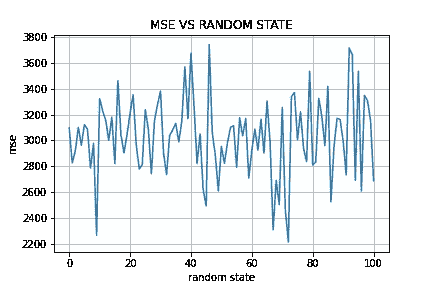

# 为什么不应该信任 train_test_split()函数

> 原文：<https://towardsdatascience.com/why-you-should-not-trust-the-train-test-split-function-47cb9d353ad2>

## 机器学习

## 反思如何使用 train_test_split()函数会导致错误的结果，并结合实际演示


在 [Unsplash](https://unsplash.com?utm_source=medium&utm_medium=referral) 上[摄影](https://unsplash.com/@photoholgic?utm_source=medium&utm_medium=referral)拍摄的照片

毫无疑问，几乎所有的数据科学家在他们的一生中都至少尝试过一次使用`train_test_split()`函数。scikit-learn Python 包提供了`train_test_split()`函数。通常，我们不太关心使用这个函数的效果，因为用一行代码我们就可以将数据集分成两部分，训练集和测试集。

**的确，使用该功能可能会有危险。在这篇文章中，我将试着解释为什么。**

文章组织如下:

*   `train_test_split()`功能概述
*   潜在风险
*   可能的对策。

# train _ test _ split()函数概述

`train_test_split()`函数由 sklearn 包下的 model_selection 子包提供。该函数接收以下参数作为输入:

*   **数组—** 要拆分的数据集；
*   **test_size —** 测试集的大小。它可以是浮点数，也可以是整数。如果它是一个浮点数，它应该是一个介于 0.0 和 1.0 之间的数字，表示要包含在测试集中的数据集的比例。如果它是一个整数，它是包含在测试集中的样本总数。如果未设置 test_size，该值将自动设置为列车大小的补码；
*   **train_size** —列车组的大小。它的行为是对 test_size 变量的补充；
*   **random _ state-在应用分割之前，数据集被混洗。random_state 变量是一个整数，它初始化用于洗牌的种子。它用于使实验具有可重复性；**
*   **洗牌** —指定是否在分割前洗牌。默认值为 True
*   **分层** —如果不是无，它为类别标签指定一个频率数组。这允许拆分阶段保留指定的类别标签的频率。

通常，我们从 [scikit-learn 文档](https://scikit-learn.org/stable/modules/generated/sklearn.model_selection.train_test_split.html)中复制如何使用`train_test_split()`的示例，并按如下方式使用:

```
from sklearn.model_selection import train_test_splitX_train, X_test, y_train, y_test = **train_test_split**(X, y, test_size=0.33, random_state=42)
```

我们不太在意这个特性的效果。我们继续写代码吧。

但是也有潜在的风险，我将在下一节向您展示。

# 2 潜在风险

在内部，`train_test_split()`函数使用一个种子，允许您将数据随机分成两组:训练集和测试集。

该数字是**伪随机**，因为相同的数据子部分对应相同的种子值。这对于确保实验的**再现性**非常有用。

不幸的是，使用一个种子而不是另一个种子可能会导致完全不同的数据集，甚至会修改接收训练集作为输入的所选机器学习模型的性能。

为了理解这个问题，我们举个例子。让我们考虑由 scikit-learn 库提供的经典**糖尿病数据集**。该数据集与 scikit-learn 一起发布，可通过[此链接](https://scikit-learn.org/stable/modules/generated/sklearn.datasets.load_diabetes.html#sklearn.datasets.load_diabetes)获得。

我们生成 100 个不同的训练/测试集对，具有不同的`random_state`值(从 0 到 99)，我们通过线性回归模型对每个训练集建模。然后，我们计算每个模型的均方误差(MSE)值。

首先，我们加载数据集:

```
from sklearn.datasets import **load_diabetes**diabetes = load_diabetes()
X = diabetes.data
y = diabetes.target
```

然后，我们计算每个模型的 MSE:

```
import numpy as np
from sklearn.model_selection import train_test_split
from sklearn.linear_model import LinearRegression
from sklearn.metrics import mean_squared_errorn = 100
mse_list = []
seed_list = np.arange(0, n)for seed in seed_list:
    X_train, X_test, y_train, y_test = **train_test_split**(X, y, test_size=0.30, random_state=seed)
    model = **LinearRegression()**
    model.fit(X_train,y_train) y_pred = model.predict(X_test)
    mse_list.append(**mean_squared_error**(y_test,y_pred))
```

我们将不同种子产生的不同 mse 存储在 mse_list 中。现在我们可以绘制 MSE。我们使用 matplotlib 包:

```
import matplotlib.pyplot as pltplt.plot(seed_list, mse_list)
plt.title("MSE VS RANDOM STATE")
plt.xlabel('random state')
plt.ylabel('mse')
plt.grid()
plt.savefig('mse vs random state.png')
plt.show()
```



作者图片

我们注意到 MSE 依赖于随机状态。我们还计算平均值和标准差:

```
import numpy as npmean = np.mean(mse_list)
std = np.std(mse_list)
```

它给出了以下输出:

```
mean = 3029.5400317608987std = 302.5362185895346
```

通过这个实验，我们可以得出结论，`train_test_split()`功能并没有看起来那么无害。

如何减轻`train_test_split()`的影响？让我们看看一些可能的解决方案。

# 3 种可能的对策

至少有两种可能的对策来减少`train_test_split()`的影响:

*   使用不同的随机状态值多次运行`train_test_split()`，如前一节所示。然后我们可以计算我们度量的平均值；
*   使用**交叉验证**，作为`train_test_split()`的替代方案。交叉验证自动将数据集分成 K 个折叠，并在 k-1 个折叠上执行训练阶段，在剩余的折叠上进行测试。然后，它移动折叠，并在接下来的 k-1 个折叠上重新进行训练阶段，并在剩余的折叠上进行测试。诸如此类。

[Eijaz Allibhai](https://medium.com/u/d86e20f6e783?source=post_page-----47cb9d353ad2--------------------------------) 有一篇非常有趣的文章，题为[机器学习中的保留与交叉验证](https://medium.com/@eijaz/holdout-vs-cross-validation-in-machine-learning-7637112d3f8f)，解释了 train_test_split()(也称为保留)和交叉验证之间的区别。

# 摘要

在本文中，我描述了使用 scikit-learn 包提供的`train_test_split()`函数的潜在风险。为了对比它们，一个可能的对策是使用交叉验证。

如果你读到这里，对我来说，今天已经很多了。谢谢！你可以在[这篇文章](https://alod83.medium.com/which-topics-would-you-like-to-read-c68314dc6813)里读到更多关于我的内容。

# 相关文章

[](/a-complete-data-analysis-workflow-in-python-and-scikit-learn-9a77f7c283d3) [## Python 和 scikit 中的完整数据分析工作流程-学习

towardsdatascience.com](/a-complete-data-analysis-workflow-in-python-and-scikit-learn-9a77f7c283d3) [](/how-to-spend-your-time-when-you-are-waiting-for-a-data-analysis-output-e71b383f43cb) [## 当你在等待数据分析结果时，你该如何打发时间

### 当你的计算机正在运行你喜欢的算法，而你正在等待的时候，一些建议不要浪费你的时间…

towardsdatascience.com](/how-to-spend-your-time-when-you-are-waiting-for-a-data-analysis-output-e71b383f43cb) [](/have-you-ever-thought-about-using-python-virtualenv-fc419d8b0785) [## 有没有想过用 Python virtualenv？

### 在终端和 Jupyter 笔记本上安装和使用 Python virtualenv 的实用指南。

towardsdatascience.com](/have-you-ever-thought-about-using-python-virtualenv-fc419d8b0785) [](/automl-in-python-a-comparison-between-hyperopt-sklearn-and-tpot-8c12aaf7e829) [## Python 中的 AutoML:Hyperopt sk learn 和 TPOT 的比较

### 两种流行的 Python AutoML 库的优缺点

towardsdatascience.com](/automl-in-python-a-comparison-between-hyperopt-sklearn-and-tpot-8c12aaf7e829)