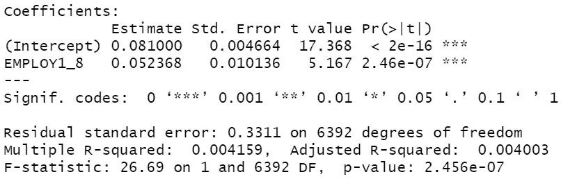
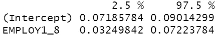

# 为什么您应该选择置信区间而不是 p 值

> 原文：<https://towardsdatascience.com/why-you-should-prefer-confidence-interval-over-p-value-e32293bd174c>

## 传达您的统计分析结果


埃尔佩佩在 [Unsplash](https://unsplash.com?utm_source=medium&utm_medium=referral) 上拍摄的照片

从根本上说，数据科学领域的分析师之旅包括三个阶段:学习、实践和展示。这些相位不一定是线性的；当然，我们大部分人都是来来回回。你认为这三个阶段中哪一个是最困难的？

个人觉得第三个最复杂。当然，前两个阶段的挑战已经够多了；然而，过了一段时间，你意识到学习并能够使用某些方法只是时间问题。毕竟，方法学家推导出了所有的方程，软件包开发人员将这些方程转换成随时可用的函数，慷慨的指导者创建了大量的教程来使您的生活更加轻松。相反，关于最后一个阶段，似乎有很多因素是我们无法控制的。

考虑一下演示阶段。在准备陈述你的发现(作为报告和/或口头陈述的一部分)之前，问自己至少三个问题:

## 1.我要向谁展示我的分析结果？

## 2.他们的局限性是什么(例如，缺乏统计培训/对行话的误解)？

## 3.考虑到这些限制，我怎样才能以一种既能被我的读者/观众所理解，又在技术上正确的方式来展示我的发现呢？

事实上，在有效和准确地展示您的统计结果方面存在许多挑战。**今天，我们将集中讨论一个我个人和许多其他人都在努力解决的特殊问题— *如何解释统计测试结果的重要性？我们应该依赖 p 值吗？还是应该更倾向于置信区间？***

# **现实世界的例子**

假设我们的研究问题是:*与非退休人员相比，退休人员在多大程度上更容易出现频繁失忆？*

为了调查这个问题，我们将使用消费者金融保护局(CFPB)开展的 2016 年金融福利调查的公开数据。

让我们将数据直接从 CFPB 网站导入到 R:

```
**#Import data**
data <- read.csv("[https://www.consumerfinance.gov/documents/5614/NFWBS_PUF_2016_data.csv](https://www.consumerfinance.gov/documents/5614/NFWBS_PUF_2016_data.csv)")
```

关于失忆的问题(变量名为 **MEMLOSS** )问:

> *在过去的 12 个月中，您是否经历过更频繁发生或越来越严重的困惑或记忆丧失？*
> 
> 响应选项包括:1=是，0=否

而关于退休的问题(变量名为 **EMPLOY1_8** )问:

> *以下哪一项描述了您目前的就业或工作状况？*
> 
> 回答选项为:1=自雇，2=为雇主或军队全职工作，3=为雇主或军队兼职，4=家庭主妇，5 =全职学生，6。永久患病、残疾或无法工作，7=失业或暂时下岗，8=退休

好消息是他们已经创建了一个退休虚拟人( **EMPLOY1_8** )，如果有人退休，这个虚拟人的值为 1，否则为 0。

让我们来估计一下*退休* *人*和*非退休*人中报告在过去 12 个月内经常失忆的受访者比例的差异。我们可以选择运行多个统计测试，这将导致我们得到相同的结论。不管怎样，让我们做一个加权最小二乘法(*即，使用包含调查权重的线性回归估计模型):*

```
**#finalwt is the weight variable which accounts for the complex survey design**
summary(lm(MEMLOSS~EMPLOY1_8,data=data,weights = finalwt))
```



(图片由作者提供)

如果您遵循 p 值方法，这就是您对上述发现的解释:

*在过去 12 个月中，退休人员中经常出现记忆力丧失的受访者比例比非退休人员高 5.24 个百分点。由于 p 值小于 0.05，这种差异在 5%的显著性水平上显著不同于 0。简单地说，退休的人比非退休的人更有可能经历频繁的记忆丧失/退休的人比非退休的人经历频繁的记忆丧失的概率有统计学上的显著差异。*

如果你的读者是推断统计学的专家，上述结论应该没问题。然而，如果你将上述结果传达给从未上过推断统计学课程的人，那该怎么办呢？

在我开始学习推断统计学之前，如果有人向我展示上述发现，我会跳过前面的部分，只关注“简单地说”之后的部分。至关重要的是，我会把“统计显著”解释为“使用统计方法发现的实质性/值得注意/值得注意/显著/重要的发现”

但是一个有统计学意义的发现到底意味着什么呢？(我会在另一篇文章中详细讨论这个问题)。在我们的例子中，这意味着**我们有充分的证据相信，退休人员和非退休人员之间频繁失忆的真实总体水平差异*不同于 0* 。**

[](https://vivdas.medium.com/statistical-significance-are-you-interpreting-correctly-7fff26130fb7) [## 统计学意义:你的解释正确吗？

### 知道零假设！

vivdas.medium.com](https://vivdas.medium.com/statistical-significance-are-you-interpreting-correctly-7fff26130fb7) 

现在，不管我是一个业余读者还是一个政策制定者，上面的发现对我来说既不有趣也没用。为什么？

# *对于没有接受过统计学培训的人来说，最令人困惑的部分可能是，起初，你说两者之间的差异是 5.24 个百分点。然后，你说这个差和 0 有很大的不同。数学上，5.24 和 0 不一样不是很明显吗？*🤔

如果我把注意力放在这个差异不为零的事实上，这个发现似乎很明显，因为我已经知道退休的人更有可能变老，而老年人更有可能经历频繁的记忆丧失。此外，我不知道两组结果的*差异有多大。*我想知道差异的**【程度】**或**【大小】**，这样我就能理解该发现的**现实世界意义(而不仅仅是所谓的统计意义)**。

传统使用的 p 值方法*在这方面失败了。不幸的是，许多学科的惯例是用 p 值法来解释统计检验的结果。在许多情况下，记者和博客曲解了这些结果*(不是他们的错*🤷‍♂️ *)* ，这最终导致了对现实世界现象规模的大规模误解😕。*

*这正是我更喜欢置信区间方法的原因。让我们估计一下差异的置信区间:*

```
*confint(lm(MEMLOSS~EMPLOY1_8,data=data,weights = finalwt))*
```

**

*(图片由作者提供)*

*作为一名分析师，如果你报告说，退休人员和非退休人员之间频繁失忆的差异的 **95%置信区间(CI)为【3.25 个百分点，7.22 个百分点】，**作为一名非统计学家，我会直观地这样想:**“有 95%的可能性*真正的差异在 3.25 个百分点和 7.22 个百分点之间*”***

*** *以上解读直观但错误。有趣的是，很多研究者是这样解释自己 95%的 CI 的* ***(O'Brien and Yi，2016)*** *。此外，如果你用谷歌搜索 95% CI 的解释，你会发现大量的资源显示相同的解释。****

*95%置信区间方法要有用得多。我们知道统计是减少不确定性的科学工具，理想情况下，任何统计测试都应该:*

1.  *产生*目标参数的估计值*并且*
2.  **在它的任一侧附加一系列可能的值*。*

*最重要的是，了解某种结果的可能性范围是在不确定情况下制定政策的先决条件。除了推断两组之间结果的真实差异是非零的(因为区间中不包含 0)，95% CI 方法帮助我们了解真实差异的可能性范围。*

*现在，成为**“技术上正确的**🤓**，*95%置信区间的解释与我们直观感知的相反*😒。下面是如何考虑这个问题的:***

## *****如果我们从同一人群中抽取 100 个不同的随机样本(即，如果 CFPB 进行 100 次相同的调查)并为每个样本构建 95%的置信区间，我们预计这 100 个置信区间中的 95 个将包含两组结果的(未知)人群水平差异。*****

## ***实际上，我们只从感兴趣的人群中抽取一个样本(即 CFPB 只进行了一次调查)。因此，这个 CI **[3.25 个百分点，7.22 个百分点]包含两组结果中真实**人群水平差异的概率是 95%。***

***上述内容的简化版本是:***

> ******正确一:*** *我们 95%确信区间【3.25 个百分点，7.22 个百分点】包含了两组结果的*真实人群水平差异*。****
> 
> ******错一:*** *我们有 95%的把握*两组结果的真实人群水平差异*在 3.25 个百分点到 7.22 个百分点之间。****

***总的来说，这是一个难题:***

1.  ***如果你使用 p 值/统计显著性方法来报告你的统计发现，读者会知道某事物的估计值是否为零。然而，在许多情况下，知道某事物的估计值是非零的可能没有什么实际用处。同样，一个有统计学意义的发现可能实际上是无关紧要的，然而读者可能直觉地认为这个发现是实质性的。***
2.  ***如果你用 95%置信区间的方法报告你的统计发现，读者会对估计的可能性范围和发现的实际意义有所了解。然而，尽管你尽了最大努力，从严格的技术角度来看，读者可能会以一种错误的方式直观地解释 95% CI。***

***因此，在这两种情况下都很有可能出现误解。然而，*置信区间方法中的误解可能是无害的*😐，而*在 p 值方法的情况下，误解可能很严重*😡。***

******更新:*** *我写了另一篇文章试图进一步解释置信区间的“正确”解释。你可以在这里找到:****

***[](https://vivdas.medium.com/confidence-interval-are-you-interpreting-correctly-a8834ba5a99b) [## 置信区间:你的解释正确吗？

### 直观的解释

vivdas.medium.com](https://vivdas.medium.com/confidence-interval-are-you-interpreting-correctly-a8834ba5a99b) 

如果你想阅读我以前关于如何尝试了解未知的的一些帖子，这里有一些建议:

[](https://vivdas.medium.com/why-is-correlation-neither-necessary-nor-sufficient-for-causation-in-non-experimental-data-900c866d59d7) [## 为什么相关性对于因果关系既不是必要的也不是充分的(在非实验数据中)？

### 玩具示例的详细说明](https://vivdas.medium.com/why-is-correlation-neither-necessary-nor-sufficient-for-causation-in-non-experimental-data-900c866d59d7) [](https://vivdas.medium.com/how-to-explore-the-effect-of-doing-something-1d5f0e70a778) [## 如何探究做某事的效果？(第一部分)

### 应用因果推理 101:反事实世界和实验理想](https://vivdas.medium.com/how-to-explore-the-effect-of-doing-something-1d5f0e70a778) [](https://vivdas.medium.com/how-to-explore-the-effect-of-doing-something-part-2-228f857bb060) [## 如何探究做某事的效果？(第二部分)

### 应用因果推理 101:非实验数据](https://vivdas.medium.com/how-to-explore-the-effect-of-doing-something-part-2-228f857bb060) [](https://medium.datadriveninvestor.com/does-money-buy-happiness-4ad92109c303) [## 金钱能买到幸福吗？

### 探索这个问题的实用教程](https://medium.datadriveninvestor.com/does-money-buy-happiness-4ad92109c303) 

**参考文献**

**2016 年 CFPB 金融福祉调查:**[https://www . consumer finance . gov/data-research/Financial-Well-Being-Survey-data/](https://www.consumerfinance.gov/data-research/financial-well-being-survey-data/)

**用户指南:**[https://files . consumer finance . gov/f/documents/cfpb _ nfwbs-puf-User-Guide . pdf](https://files.consumerfinance.gov/f/documents/cfpb_nfwbs-puf-user-guide.pdf)

**码本:**[https://files . consumer finance . gov/f/documents/cfpb _ nfwbs-puf-code book . pdf](https://files.consumerfinance.gov/f/documents/cfpb_nfwbs-puf-codebook.pdf)

**奥布莱恩，s . f .&易，Q. L. (2016)** 。我如何解释置信区间？*输血*， *56* (7)，1680–1683。***