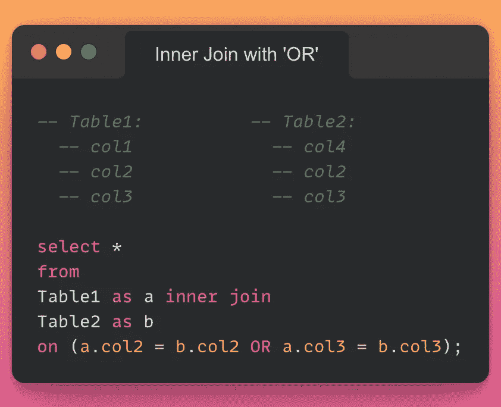
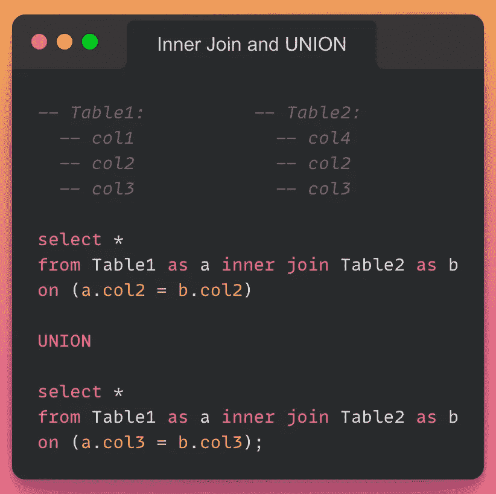
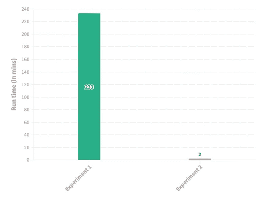

# 为什么现在应该停止在 SQL 连接中使用“OR”

> 原文：<https://towardsdatascience.com/why-you-should-stop-using-or-in-sql-joins-right-now-d5b6e83464cf>

## 向查询运行时优化迈出“急需”的一步


何塞·阿拉贡内塞斯在 [Unsplash](https://unsplash.com?utm_source=medium&utm_medium=referral) 上的照片

根据我的经验，在 Python 之后，结构化查询语言(SQL)是众多数据科学家在他们的机器学习/数据科学项目中最受欢迎的工具。玩数据库并看到它们通过 SQL 中定义的各种机制相互交互是令人愉快的，其中之一当然是 **SQL JOINS！**

如果你对连接不熟悉，我强烈推荐[这篇](https://www.w3schools.com/sql/sql_join.asp)文章，以便在继续之前理解它们。说到这里，让我们转到为什么我把你带到这里，当然，为什么我说你应该立即停止在 SQL 连接中使用条件“OR”。

# **实验一:**

考虑下面的查询，它采用两个表，即 *Table1* 和 *Table2，*，并在***【col 3】***或***【col 2】***中的值相等的情况下，在两个表之间执行内部连接。



涉及内部连接的 SQL 查询(作者使用 snappify.io 创建的图像)

乍一看，我相信您会想，这个查询有什么问题，对吗？但是当我实现了一个类似的查询，涉及到一个带有内部连接的条件“OR ”,每个表上有将近一万条(10⁴)记录时，查询表现异常。它花了将近 **3 小时 55 分钟**来执行，这促使我解决这里涉及的问题。我用一个条件“AND”代替条件“OR”进行了一个类似的实验，它在几分钟内就被执行了。

# 实验二:

在 StackOverflow 上快速查找将我带到了[这里](https://stackoverflow.com/questions/5901791/is-having-an-or-in-an-inner-join-condition-a-bad-idea)，这表明我们可以将条件“OR”转换为“UNION”操作，如下所示:



涉及内部连接和联合的 SQL 查询(作者使用 snappify.io 创建的图像)

本质上，我们可以将连接条件分成多个查询，并使用“SQL UNION”方法将结果连接起来。你可以在这里阅读 SQL 中的 UNION。

令我惊讶的是，这个查询仅用了 2 分钟就在实验 1 中使用的相同表上执行了**。**

为了消除随机性并确保资源的不可用性不会对运行时间产生影响，我将上述实验重复了三次。下面的柱状图描述了实验 1 和实验 2 在这三次试验中的平均运行时间。



实验 1 和实验 2 的运行时间是三次试验的平均值。

上面的观察确实提出了许多关于 SQL 的查询规划器如何优化 SQL 查询的问题。要知道为什么条件“或”特别有问题，让我们重复下面的问题。

# 问题 SQL 中的连接到底是如何执行的？

在这里，如果您首先理解要连接两个表，通过执行嵌套搜索来采用简单的方法是不可行的，这将会有所帮助，因为我们通常要处理大量的数据。例如，一个通常的嵌套搜索，每个表中只有一百万行(10⁶)，相当于一个**万亿**循环操作(10)。

为了优化这一点，SQL 利用散列连接通过查找两个输入之间的匹配行来合并表，这通常比使用嵌套循环更有效。这里，每一行都用一个特定的散列函数映射到它的散列值，两个表的比较发生在一个特定的散列桶中。

# 问题 2:实验 1 中接近四个小时的查询运行时间是否表明它选择了嵌套连接？

是的。实验 1 中的连接很可能是使用嵌套循环中的表扫描来执行的，如果表很大，这显然会很慢。

# **问题 3:如果连接通常在 SQL 中被优化，为什么 SQL 在实验 1 中仍然采用嵌套操作？**

这个问题特别与实验 1 中使用的连接条件有关，即，

```
condition1 **OR** condition2
```

我们可以从观察到的运行时推断出，上述连接条件对于散列连接是不可优化的。换句话说，SQL 不够聪明，无法优化连接条件或认识到查询本质上等同于多个查询的“联合”——除非像实验 2 中那样明确指定。这就是它花费了令人难以置信的大量时间来执行的原因。

# 问题 4:为什么实验 2 中的查询更快？

如上所述，SQL 无法识别实验 1 中的查询可能等同于两个查询的“联合”。这使得原始查询不可优化，我们没有其他选择，只能显式地将这些信息嵌入到查询中，并手动将其拆分，以协助 SQL 的优化模块。

这就把我们带到了这篇文章的结尾。总之，请注意，据我所知，这些限制特别存在于 SQL 连接中。你还可以在其他地方自由使用条件句“或”，如“WHERE”*、*、【HAVING】、*、*等。

非常感谢阅读，我希望你喜欢它。

非常感谢您的想法和反馈。


憨豆先生的迷因是用 clideo.com 创造的。