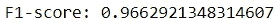
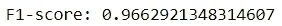
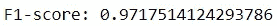

# 为什么您应该使用 Scikit-Learn 管道

> 原文：<https://towardsdatascience.com/why-you-should-use-scikit-learn-pipelines-8754b4d1e375>

## 这个工具把你的代码带到了一个新的高度

约翰·金南德在 [Unsplash](https://unsplash.com?utm_source=medium&utm_medium=referral) 上的照片

在使用 Scikit-learn 包足够长的时间后，机器学习工作流可能会开始出现重复。任务通常需要对数据进行一系列转换，然后将处理后的数据拟合到估计器，估计器随后将进行预测。

对于那些希望将他们的 Scikit-learn 专业知识提升到下一个级别的人，该模块提供了`Pipeline`类，这是一个使用户能够以更加用户友好的方式执行这些转换的工具。

在这里，我们深入研究 Scikit-learn 管道做什么，以及为什么它们应该更多地用于机器学习项目。

## 为什么要使用管道？

Scikit-learn pipeline 是一个工具，它将工作流程的所有步骤连接在一起，以简化流程。

构建管道的主要好处是提高了可读性。

管道能够通过一次调用执行一系列转换，允许用户用更少的代码获得结果。

它们只需要一个`fit`方法来将所有转换应用于数据，这比将`fit`和`transform`方法应用于每个预处理步骤的训练和测试数据要方便得多。

此外，通过使用管道来链接过程中的所有转换，用户一眼就可以轻松理解工作流。有了这种安排，提前进行修改和发现任何潜在错误将变得更加容易。

## 管道是强制性的吗？

此时，您可能会想:管道可能会提高可读性，但是我们不能通过使用适当的文档编写结构良好的代码来获得可读性吗？

答案当然是肯定的！

Scikit-learn 管道只是一个方便的工具，对于项目的成功并不重要。

然而，当一个模块直接提供了一个可以让生活变得如此简单的工具，为什么要拒绝它呢？

## 个案研究

Scikit-learn 管道的效用可以通过用 Python 创建一个管道得到最好的演示。

假设我们正在建立一个使用玩具数据集预测乳腺癌的模型。

构建模型的步骤包括:

*   使用最小最大缩放器缩放功能
*   利用主成分分析降低维数
*   将数据拟合到随机森林分类器

让我们先在没有管道的情况下进行这个练习，然后再使用管道。然后，我们可以在过程和模型性能方面比较这两种方法。

首先，我们需要导入以下包:

1.  **在没有管道的情况下训练模型**

*创建一个没有管道的评估器非常简单。对于每个预处理步骤，我们对训练数据使用`fit_transform`方法，对测试数据使用`transform`方法。然后，我们将处理后的数据与随机森林分类器相匹配，并用它进行预测。*

*既然已经训练了随机森林分类器，让我们使用 f-1 得分度量来评估它在测试集上的性能。*

**

*代码输出(由作者创建)*

*这是训练分类器的可行方法。然而，由于一些原因，从长远来看，它可能并不理想。*

*首先，随着编写更多的代码来促进转换，出错的几率会增加。例如，可能会意外地将`fit_transform`方法应用于测试数据，或者以错误的顺序执行转换(例如，在特征缩放之前执行 PCA)。*

*其次，这种方法产生的代码在可读性方面不是最理想的。当您执行工作流的每一步时，代码可能看起来很直观，但是当您在几个月后重新访问您的工作时，它会保持这种方式吗？对阅读你的代码的其他人来说是直观的吗？*

***2。用 a 管道**训练模型*

**这一次，我们将使用管道将过程中的所有步骤连接在一起。**

**这意味着创建一个管道对象，并在`steps`参数中指定所有的转换。输入的参数是一个元组列表，每个元组代表一个转换。**

**有多简单？**

**通过最少的代码，我们能够执行所有的转换，训练模型，并使用模型生成预测。**

**我们只需要使用一次`fit`方法来执行流水线中的所有步骤，而不是应用大量的`fit`和`transform`方法。**

**此外，我们现在可以清楚地检查在训练模型之前将应用于数据的一系列转换。这使得代码更容易理解，更不容易出错。**

**管道对象现在可以像任何估计器一样用于生成预测。让我们看看它在测试集上的表现。**

****

**代码输出(由作者创建)**

**f-1 分数保持不变，这并不奇怪，因为管道只是方便的工具，并不能提高模型性能。然而，如果我们比较两种方法中使用的代码，很容易看出 Scikit-learn 管道的吸引力。**

****3。额外收获:用管道优化模型****

**我们已经展示了 Scikit-learn 管道如何通过使用户能够用最少的代码训练模型来增强可读性。**

**然而，管道还有一个值得一提的特性。**

**除了用更简洁的代码顺序执行转换之外，pipeline 对象还可以通过超参数调整来优化模型性能！**

**通常，超参数调整用于单独为估计量寻找最佳超参数集。然而，通过管道，用户也可以优化特征工程过程！**

**为了实现这一点，我们需要创建存储工作流中所有步骤的管道对象以及存储所有感兴趣的超参数的字典。**

**该字典包含超参数及其对应的值列表，作为键-值对。该字典中的关键字必须以 <transformer>__ <hyperparameter>格式指定转换器/估算器和超参数。</hyperparameter></transformer>**

**在创建了管道对象和超参数字典之后，我们可以使用网格搜索来执行超参数调整。**

**最后，我们可以用最佳超参数导出模型，并使用它来生成预测。**

****

**代码输出(由作者创建)**

## **结论**

****

**在 [Unsplash](https://unsplash.com?utm_source=medium&utm_medium=referral) 上 [Prateek Katyal](https://unsplash.com/es/@prateekkatyal?utm_source=medium&utm_medium=referral) 拍摄的照片**

**总而言之，Scikit-learn 管道作为一种手段，以更简洁的方式将机器学习任务中的所有步骤链接在一起。**

**它们可能不会提高模型性能，但它们简化机器学习工作流程的能力使它们变得非常有价值。**

**我祝你在数据科学的努力中好运！**