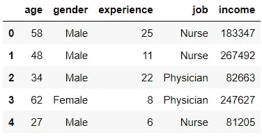
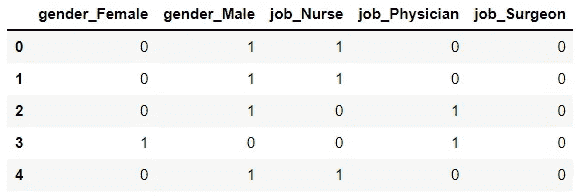
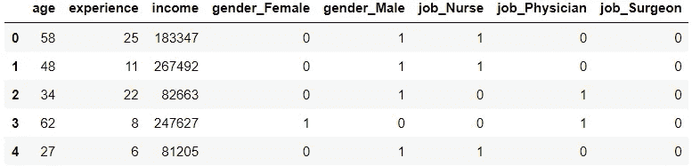
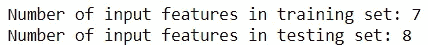
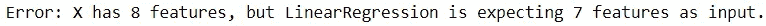
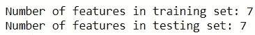

# 为什么不应该用 pandas.get_dummies 进行机器学习

> 原文：<https://towardsdatascience.com/why-you-shouldnt-use-pandas-get-dummies-for-machine-learning-e088a435beef>

## 反对用熊猫做热门编码的理由

来自 Pexels 的 Alexander Kovalev 的照片:[https://www . Pexels . com/photo/gray-photography-of-stop-signage-under-sky-1585711/](https://www.pexels.com/photo/grayscale-photography-of-stop-signage-under-sky-1585711/)

熊猫图书馆因其在机器学习项目中的实用性而闻名。

然而，Pandas 中有一些工具对于训练模型来说并不理想。这种工具的一个最好的例子是`get_dummies`函数，它用于一个热编码。

在这里，我们提供了熊猫的一个热门编码功能的快速纲要，并解释了为什么它不适合机器学习任务。

## 一个关于熊猫的热门编码

让我们先快速回顾一下如何用 Pandas 对变量进行热编码。

假设我们正在处理以下数据:

代码输出(由作者创建)

我们可以从这个数据集中创建虚拟变量，方法是识别分类特征，然后使用`get_dummies`函数转换它们。

代码输出(由作者创建)

然后，我们可以用虚拟变量替换数据集中的当前分类特征。

代码输出(由作者创建)

总而言之，`get_dummies`功能使用户能够用最少的代码来编码他们的特性，适合熊猫工具。

## 熊猫的缺点. get_dummies

`get_dummies`函数是一种快速简单的变量编码方式，可用于任何后续分析。然而，出于机器学习的目的使用这种编码方法是错误的，原因有二。

1.  **get _ dummies 函数不考虑看不见的数据**

任何机器学习模型都必须考虑看不见的数据。因此，用测试数据生成的虚拟变量必须与用训练数据生成的虚拟变量相匹配。

考虑到这一点，很容易看出使用 Pandas 进行热编码会导致什么问题。

熊猫图书馆的`get_dummies`方法基于当前值对特征进行编码。然而，测试数据中唯一值的数量总有可能*不*与训练数据中唯一值的数量相匹配。

在上例的数据集中，`job`特征包含 3 个唯一值:“医生”、“护士”和“外科医生”。对该列执行一次热编码会产生 3 个虚拟变量。

然而，如果测试数据的`job`特性比训练集的特性有更多的唯一值，会发生什么呢？这些数据会产生与用于训练模型的数据不匹配的虚拟变量。

为了说明这一点，让我们用这个数据训练一个线性回归模型，把`income`作为目标标签。

假设我们希望用一个测试数据集来评估这个模型。为此，我们还需要对新数据集进行热编码。但是，该数据集的`job`特征有 4 个唯一值:“医生”、“护士”、“外科医生”和“药剂师”。

因此，在对测试集执行一次热编码后，训练集和测试集中的输入特征数量不匹配。

代码输出(由作者创建)

一个热编码测试数据集有 8 个输入要素。

不幸的是，用包含 7 个输入特征的数据训练的线性回归模型将不能使用不同维度的数据进行预测。

为了展示这一点，让我们尝试在测试集上使用`predict`方法来生成预测。

代码输出(由作者创建)

正如预期的那样，该模型无法用这些测试数据进行预测。

**2。get_dummies 方法与其他机器学习工具不兼容。**

数据预处理通常需要执行一系列操作。

不幸的是，Pandas 库的一个热门编码方法很难与标准化和主成分分析等操作无缝结合使用。

虽然`get_dummies`函数当然可以集成到预处理过程中，但它需要一种在代码可读性和效率方面不太理想的方法。

## 更好的选择

幸运的是，有更好的编码分类变量的方法来解决上述问题。

这些方法中最受欢迎的是 Scikit Learn 的[onehotencode](https://scikit-learn.org/stable/modules/generated/sklearn.preprocessing.OneHotEncoder.html)，它更适合机器学习任务。

让我们使用当前数据集来演示 OneHotEncoder。

首先，我们创建一个`OneHotEncoder`对象，将‘ignore’赋给`handle_unknown`参数。这确保了经过训练的模型能够处理看不见的数据。

接下来，我们创建一个存储`OneHotEncoder`对象的`Pipeline`对象。

之后，我们创建一个`ColumnTransformer`对象，我们可以用它来指定需要编码的特性。

需要一个`ColumnTransformer`对象，因为没有它，*每个*列都将被编码，包括数字特征。使用该对象时，有必要将“通过”值分配给`remainder`参数。这确保了没有在转换器中指定的列不会被删除。

有了这个新的 column transformer 对象，我们现在可以用`fit_transform`方法对训练数据集进行编码。

最后，我们可以用`transform`方法对测试数据进行编码。

这一次，生成预测应该没有问题，因为训练集和测试集具有相同数量的输入特征。

代码输出(由作者创建)

## OneHotEncoder 的工作原理

在机器学习环境中，Scikit Learn 的`OneHotEncoder`优于 Pandas library 的`get_dummies`方法的原因有很多。

首先，它使用户能够训练模型，而不必担心训练集和测试集之间的分类特征的唯一值的差异。

其次，由于 Scikit Learn 库提供的其他工具，用户现在可以更有效地简化其他操作。

因为像`StandardScaler`和`PCA`这样的流行类来自同一个 Scikit Learn 包，所以更容易内聚地使用它们并有效地处理数据集。尽管给定的任务需要大量的操作，但是用户会发现用可读的代码来执行它们是很容易的。

使用`OneHotEncoder`的唯一缺点是它的学习曲线有点陡。希望学习使用该 Scikit 学习工具的用户还必须熟悉其他 Scikit 学习工具，如`Pipeline`和`ColumnTransformer`。

## 结论

照片由 [Prateek Katyal](https://unsplash.com/@prateekkatyal?utm_source=medium&utm_medium=referral) 在 [Unsplash](https://unsplash.com?utm_source=medium&utm_medium=referral) 上拍摄

当我开始训练模型时，使用熊猫为机器学习任务编码是我最大的失误之一，所以我认为值得强调这个问题，以免其他人犯同样的错误。

即使您一直在使用 Pandas 进行热编码，我也强烈建议您在未来的项目中切换到 Scikit Learn 库的`OneHotEncoder`。

我祝你在数据科学的努力中好运！