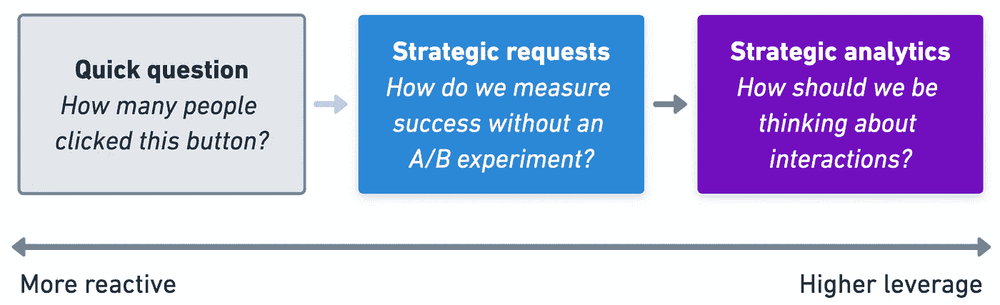
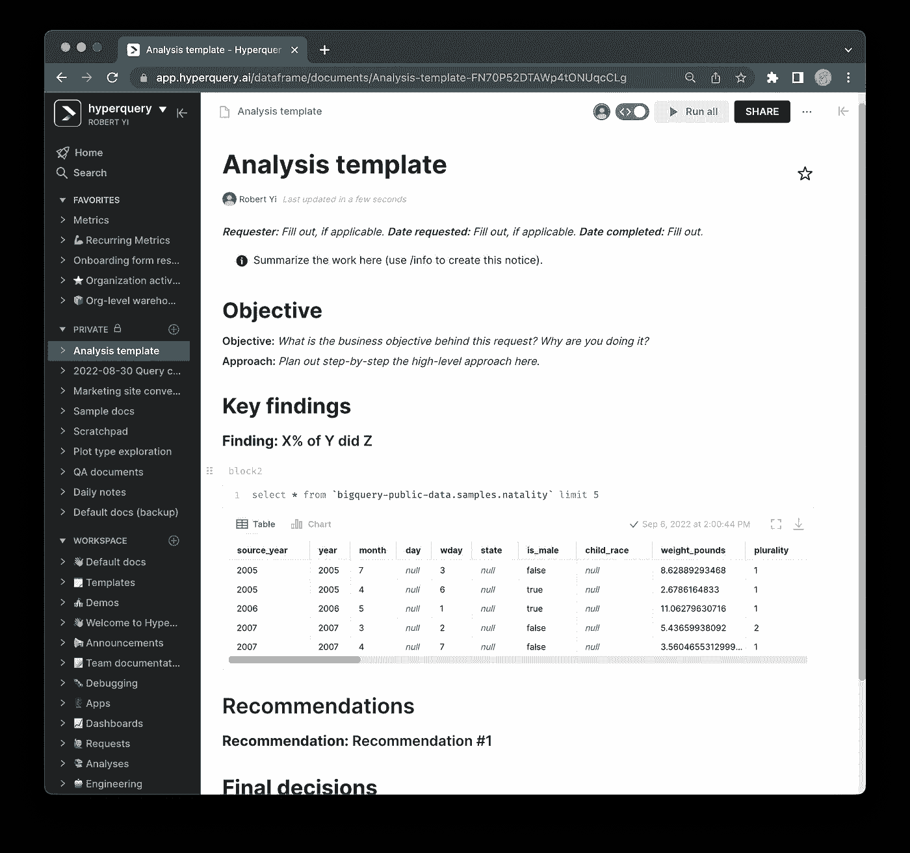

# 为什么你做的即席分析是错误的

> 原文：<https://towardsdatascience.com/why-youre-doing-ad-hoc-analytics-wrong-49d177202c7a>

## 在你下一次翻 SQL 垃圾箱之前:问为什么并记录所有的事情

可能是红鲱鱼。图片来自 Freepik。

当我在 Airbnb 担任数据科学家时，我最常收到的问题是:

> “你知道有多少人点击了这个按钮吗？”

但是这个问题的奇怪之处在于:这很少是利益相关者真正想要回答的问题。

像这样的临时问题是不可避免的(而且[实质上](https://twitter.com/imrobertyi/status/1557109250702204928?s=20&t=xjr4EJf8xdtBDobfONrH8g)！)数据科学/分析工作的一部分，然而这种类型的工作很少被讨论，更不用说优化或反思了。作为分析师，我们已经发展出令人印象深刻的技术能力，能够熟练地*回答*这类问题，但我们中很少有人学会最大化我们答案的影响——找到问题的根源并回答*而不是*。也就是说:我们擅长回答问题，但我们不擅长找到正确的问题来回答。

这里的一些自省可以帮助你决定你的团队是作为服务台 [SQL 猴子](https://robertyi.substack.com/p/the-analyst-isnt-your-bitch)还是作为利益相关者协作中的战略伙伴[。在接下来的内容中，我将讨论两种提升特设工作以服务于后者的实用方法:**询问为什么**和**记录一切**。](/dont-be-data-driven-be-analytics-driven-74cbb0518640)

# 第一步:总是问 W *hy*

开始临时工作时，第一步也是最重要的一步是简单地**询问为什么**需要完成这个请求。商业目标是什么？正在回答什么问题？问分析师的问题往往是转移话题。但是在每一个简短的问题背后，通常都有一个有价值的战略请求。在翻箱倒柜地研究数据之前，简单地*问一下为什么*可以帮助揭示隐藏在下面的真正的、战略性的问题。这一点至关重要，原因如下:

1.  **更好的决策** 问为什么*总是*导致更好的决策。如果您理解了业务目标，您就能够找到直接解决它的数据，而不是依赖于利益相关者的尝试。非技术人员根本不知道他们需要什么数据(也不应该期望他们知道)，更不用说什么分析是可能的了。因此，我们有责任确保我们提取的数据是他们应得的数据，而不是他们“需要”的数据。
2.  **更有趣的工作** *问为什么*会给我们带来更多有趣的问题。例如，“我们如何在没有实验的情况下测量影响”比我在文章开头提出的点击按钮的问题有趣得多。我怀疑我们中的许多人都明白，问为什么*会是*的首选回应方式，但我们故意忽略我们内心高贵的声音，以保护我们的时间用于我们自己的、更智力上令人满意的项目。但这是错误的心态。
3.  **为自己发现更好的项目** 回答足够多的战略要求，你会发现其中往往有规律可循。这些可以导致**分析团队*应该*致力于**的长期项目。我们应该像运营产品团队一样运营我们的数据团队，这是通过解决我们利益相关者的问题来实现的，而不是通过建立另一个无用的垃圾板。“以用户为中心是关键”，临时工作是我们成为以用户为中心的主要方式。

每一个快速提问的背后都是一个**战略要求**。揭开这一层可以为未来更深入的工作提供信息。图片作者。

# 第二步:文档。一切。

一旦你问了为什么，下一个最有效的方法就是写下你做了什么。写下:

1.  **业务目标**(您刚刚达成一致的目标)
2.  你的**方法**
3.  您的**发现**(以及您的 SQL 查询，以便能够重现这项工作)
4.  任何基于你工作的决定。

把它放在一个你的队友可以发现的地方，并创建模板，这样在浏览过去的工作时，认知负荷会最小化。工具在这里可以发挥巨大的作用。在 Airbnb，我们试图使用 Github 和 Google docs 来实现这一目的，但这些努力的问题是，在高度紧急的情况下，它们总是被搁置。现代文档工作区的工作效果要好得多——它们可搜索、易于书写，并且无缝协作。

一个分析模板，在[*hyperquery*](https://hyperquery.ai/?utm_source=medium&utm_medium=organic-content&utm_campaign=2022-09-02-ad-hoc-wrong)*中创建。图片作者。*

一旦你觉得分析“完成”了，就很容易忽略工作流程的这一部分。但是记录有助于你和其他人利用它超越单一的决定，让你的工作具有规模。您的利益相关者将受益于能够重新审视他们的决策以及这些决策的准确理由，但是当类似的问题不可避免地出现时，您和您的分析师同事可以搜索您的工作库，或者更好地，找到可以激励未来高杠杆努力的模式。

# 最终意见

临时工作占据了[40–50%](/what-is-ad-hoc-analytics-and-why-should-you-care-d59a45d466fe)的分析师时间，但投入其中的注意力很少相称。通过不断地问为什么并实施一些基本的文档实践，你不仅可以让这段时间更有影响力，而且也更有收获。也就是说，不管更好的操作点是什么，为您的团队建立某种策略或一套最佳实践来提升临时工作肯定是值得的。

如果你有任何自己成功的策略，请告诉我们！

*有兴趣了解更多关于为您的特设工作流提供超级动力的信息吗？在* [*联系我 Robert @ hyperquery . ai*](mailto:robert@hyperquery.ai)*，在*[*hyperquery . ai*](https://hyperquery.ai/?utm_source=medium&utm_medium=organic-content&utm_campaign=2022-09-02-ad-hoc-wrong)*查看我们专用的即席分析平台。*