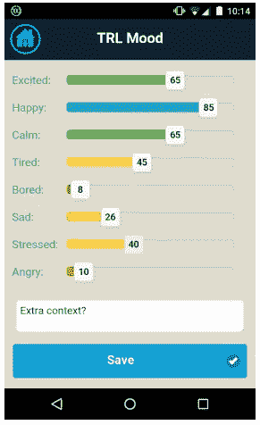
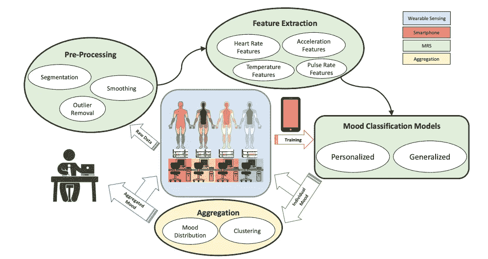
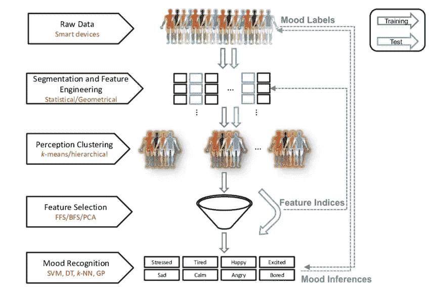

# 人工智能会理解我们的情感吗？

> 原文：<https://towardsdatascience.com/will-ai-ever-understand-our-emotions-2f27b5e2fa9d>

## 情感计算

## 使用机器学习来识别人类情感

由[黎明凤](https://unsplash.com/@leeminfu?utm_source=unsplash&utm_medium=referral&utm_content=creditCopyText)在 [Unsplash](https://unsplash.com/s/photos/meditation?utm_source=unsplash&utm_medium=referral&utm_content=creditCopyText) 上拍摄的照片

人工智能改变了我们的生活。到处都有大量的应用。从手机上的人脸识别软件和智能数字助理，如 Siri、Alexa 或谷歌助理，到推荐你下一首最喜欢的歌曲或电视剧。人工智能正被用于另一个计算领域，即情感计算。然而，这意味着什么呢？简单来说，就是机器有能力处理一些我们认为机器永远做不到的事情，也许科幻电影里除外；情绪！

## 我们的 Apple Watch 或 Fitbit 能知道我们的感受吗？

好吧，在现实中，这不是一个是或否那么简单。然而，总而言之，从生理传感器中可以提取出一些线索，帮助我们推断个人的情绪状态。例如，临床上最有效的方法之一是使用电流传感器来评估个体的压力。简单来说，传感器可以检测皮肤上的微量汗液，这有时表明我们处于紧张的状态。你的手心出汗了多少次，是什么时候？也许在考试或紧张事件之前？

另一个例子可能是紧张以及不同的人如何处理它。有些人可能会比平时动得更多，有些人可能会保持异常的安静和静止。在这两种情况下，身体活动与其通常状态不同，并且潜在地心率升高。

另一项经临床验证的观察将心率与压力联系起来。更具体地说，已经观察到心率即使平均为比如说每分钟 60 次，在一分钟内也不会以相等的间隔跳动 60 次。更具体地说，一个心跳到另一个心跳(心跳到心跳的间隔)将略有不同，例如 828 毫秒、845 毫秒、754 毫秒、742 毫秒。方差通常是几十毫秒到一百毫秒左右。这是一个重要的观察结果，因为它与自主神经系统的功能相关。具体来说，当我们处于战斗或逃跑模式时，心跳间隔往往更恒定，而如果我们放松，似乎会有更大的变化。这被正式定义为心率变异性(HRV ),它从生理角度让我们了解我们的感受。专业运动员也使用 HRV 来优化他们的训练制度，并在一些正念练习和生物反馈领域普遍推荐。

这些方法的共同点是使用特殊传感器以各种方式监控人体活动。说了特殊传感器，并不意味着它们不常见，不再是了。至关重要的是，能够测量心率、温度和运动的传感器嵌入到许多人拥有的商业设备中，如智能手表和健身带等。

## 但是这一切和人工智能有什么关系呢？

简而言之，这些传感器产生(时序)信号，算法可以利用这些信号来识别模式。实际上，从机器学习的角度来看，我们可以基于那些捕捉信息的信号来创建特征(特性)，这些信息可能被归类为特定的情绪状态。我们基本上是在那些捕捉情绪的信号中寻找那些线索。例如，从心率信号中，您可以计算并提取 HRV(如上所述，它在压力中起作用),或者从加速度计中计算活跃的时间等等。

这正是 2015 年一项用户研究从可穿戴设备收集生理数据时的想法。特别是，这项研究旨在通过在参与者身上安装身体传感器来收集上班时的数据，并在离开时停止收集数据。这项研究进行了 2 周，收集了许多小时的数据信号。为了开发有监督的机器学习模型，我们还需要标签。这就是为什么每个用户都必须下载并使用一个配套的 android 应用程序，用户必须在工作日和两周内每隔 2 小时报告一次他们的感受。Android 的应用程序界面示例如下所示。

用于情绪数据收集的 android 应用程序截图(Zenonos 等人，2016 年)

2 周后，对数据进行评估，并将参与者的手动标签(他们的情绪)与他们相应的多模态信号对齐。下面展示了从获得各种可穿戴数据信号到预测和推断潜在情绪的端到端过程的可视化。

情绪识别系统(MSR)如何工作的视觉描述(Zenonos et al. 2016)

由于不同的人可能会对情绪有不同的理解，或者对相同的情况有不同的反应，因此我们进行了进一步的研究来探索这种直觉。从下图中我们可以看到，与上面的方法相比，还有一个额外的步骤。具体来说，数据信号根据它们的相似程度被适当地分组在一起，以便不同的情绪感知落入相同的桶中(感知集群)。

感知集群架构的视觉描述(Khan 等人，2020 年)

总而言之，这项研究和有效计算在理解人类情感方面取得了巨大的进步。如今，随着商用智能手表能够对人们的压力水平提供反馈，这一点变得尤为明显。这只是开始。想象一下这项技术的可能性。不仅要了解情绪，还要了解潜在的精神状态，比如疲劳和冷静，这可能会挽救生命。想象一下一个卡车司机或外科医生在长途旅行或漫长而艰难的手术之前的情景。从精神状态的角度来评估健康状况的工具可能非常有用，如果不是至关重要的话。当然，然而，需要更多的研究来改进和验证这些模型，以及考虑任何伦理和隐私因素。

你可以在这里找到这篇文章中讨论的两篇研究论文:

[https://www . researchgate . net/publication/301583412 _ healthy office _ Mood _ recognition _ at _ work _ using _ smart phones _ and _ wearable _ sensors](https://www.researchgate.net/publication/301583412_HealthyOffice_Mood_recognition_at_work_using_smartphones_and_wearable_sensors)

[https://www . researchgate . net/publication/348109115 _ Perception _ Clusters _ Automated _ Mood _ Recognition _ Using _ a _ Novel _ Cluster-Driven _ modeling _ System](https://www.researchgate.net/publication/348109115_Perception_Clusters_Automated_Mood_Recognition_Using_a_Novel_Cluster-Driven_Modelling_System)