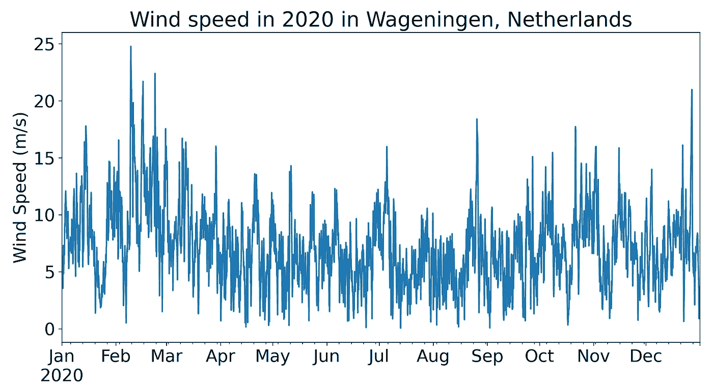
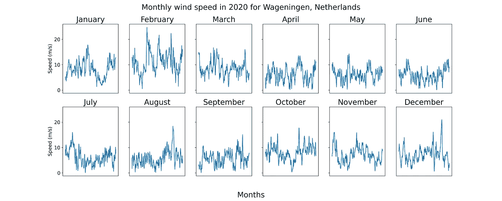
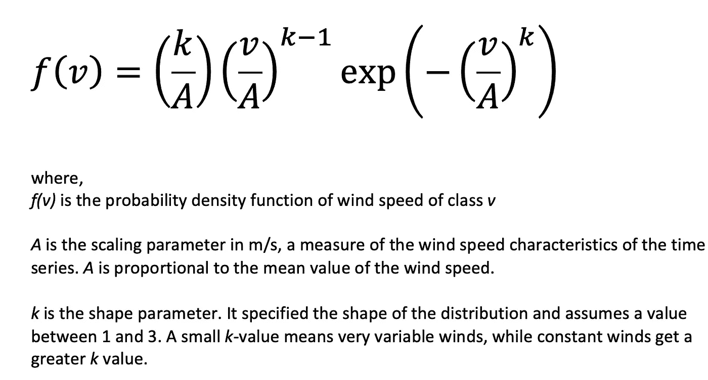
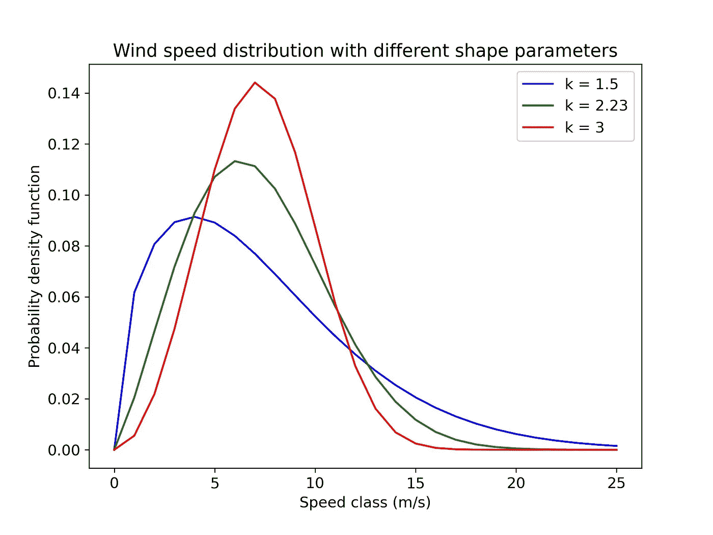
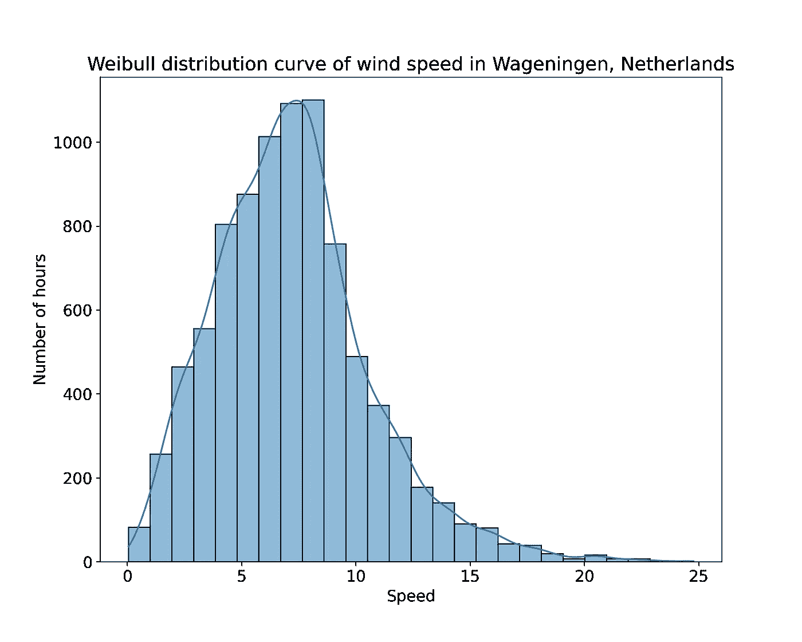
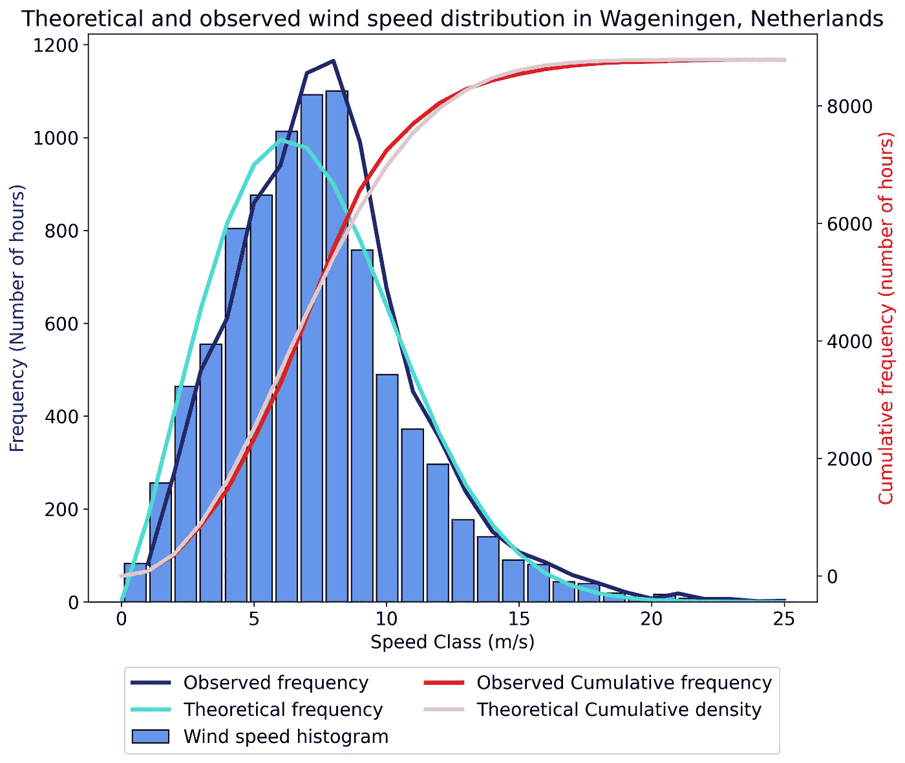
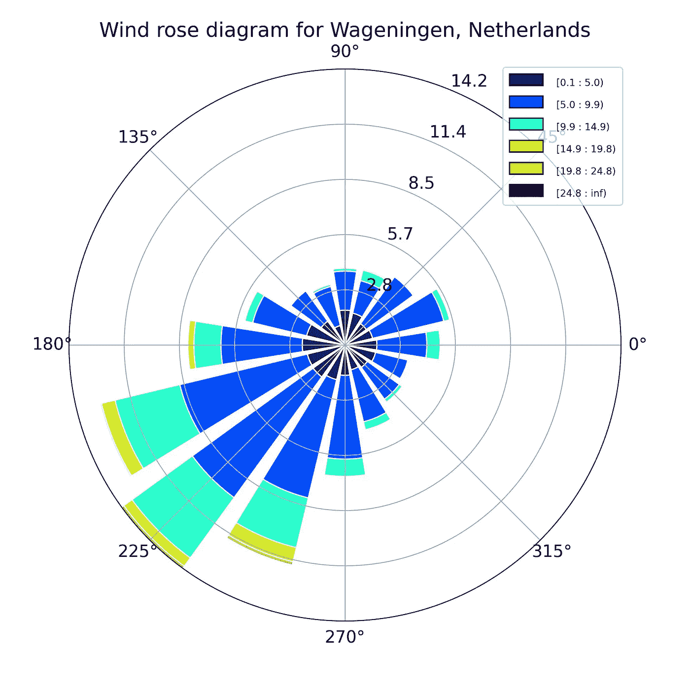
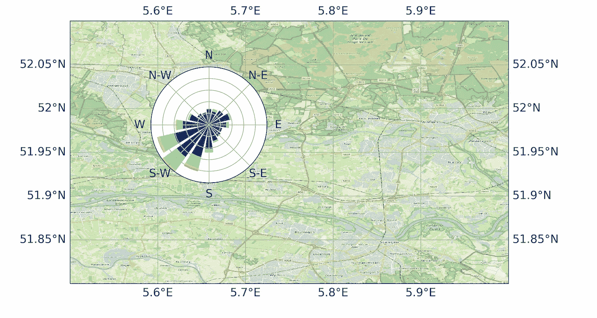
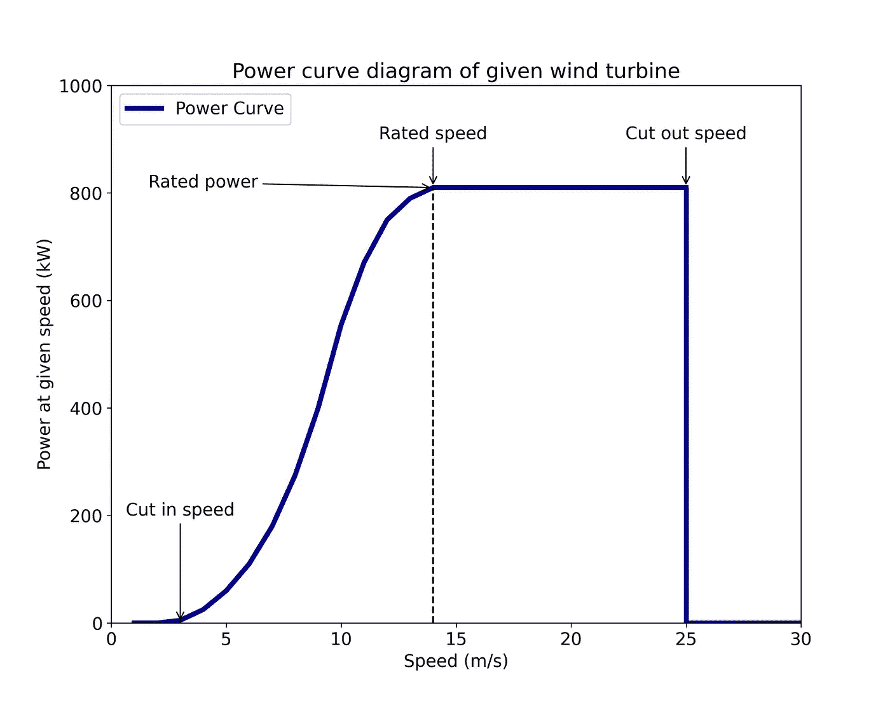
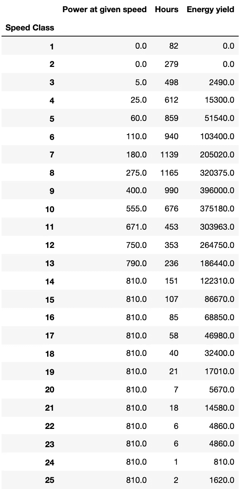

# 用 Python 进行风能物理和资源评估

> 原文：<https://towardsdatascience.com/wind-energy-physics-and-resource-assessment-with-python-789a0273e697>

# 用 Python 进行风能物理和资源评估

## 了解风速和风向的分布，并利用风能潜力

众所周知，太阳能和风能等可变可再生能源(VRE)是解决全球能源转型难题的关键因素。虽然这些能源不是穷尽性的，并且在没有燃料成本的情况下产生电力，但是目前与它们相关的主要挑战是它们的间歇性和不确定性。太阳不会一直照耀，风也不会一直吹。理解这些能源的物理特性是开发其巨大潜力的第一步。在这篇文章中，我将讨论风能的物理特性以及可以从这种能源中挖掘出来的资源潜力。为此，我将使用 Python。

让我们开始吧。


来自 [Unsplash](https://unsplash.com/) 的 [Sander Weeteling](https://unsplash.com/@sanderweeteling) 的图片

## 数据

荷兰是我迄今为止生活过的风最大的国家。这可能是由于该国的地理位置及其靠近北海。在这篇文章中，我正在考虑一个美丽的荷兰学生城镇 Wageningen 来评估风能的潜力。所选位置 2020 年 50 米高度的每小时风速和风向数据从由 NASA 全球能源资源预测(POWER)项目维护的[开源数据库](https://power.larc.nasa.gov/data-access-viewer/)中获得(NASA，2022)。

如下图所示，2020 年瓦赫宁根的每小时风速在 0 至 25 米/秒之间变化。中值风速为 6.98 米/秒，平均风速为 7.22 米/秒。



所选位置 2020 年的每小时风速。图片作者。

我想更仔细地检查一年中不同月份的风速是如何不同的。因此，我绘制了月风速曲线，如下图所示。我注意到与其他季节相比，冬季的风速更高。我还在 12 月、1 月和 2 月观察到一些峰值，类似于极端风速的情况。



按月份分类的选定位置的每小时风速分布图。图片作者。

## 威布尔分布

> *当全年测量风速时，注意到大部分地区很少出现强风，而中等和清新的风很常见* *(丹麦风力工业协会，2003)* 。

如果我们将一年中任何地点的每小时风速按升序排序，那么我们得到的形状在统计学语言中称为威布尔分布。这是一种曲线基本向右倾斜的分布类型。威布尔分布的公式如下所示:



威布尔分布函数的公式。图片作者。

某类风速的概率密度函数取决于两个主要参数，即比例参数和形状参数。形状参数决定了曲线的形状，在 1 和 3 之间变化，取决于给定时间范围内某个区域的风速可变性。

根据提供的 2020 年的数据，我使用以下公式获得了荷兰瓦赫宁根风速的形状参数和比例参数，分别为 2.23 和 8.15 米/秒

```
params = stats.weibull_min.fit(data, 
                               floc = 0, #Fix the location at zero
                               scale = 2 #set 1st scale parameter)
```

我想检查不同形状参数值下的风速分布图。因此，我使用`scipy.stats.weibull_min.pdf()`函数为 0 到 25 米/秒的速度范围构建了不同的曲线，并将参数传递给它。

绘制形状参数对威布尔分布影响的代码



显示风速分布中形状参数影响的图。图片作者。

我注意到风速分布曲线更短但更宽，形状参数值更低(此处为 1.5)，如蓝色曲线所示。这类似于更加多变的风。风速分布曲线较高但较窄，具有较高的形状参数值(此处为 3 ),如红色曲线所示。这表示风速更集中在 0 到 15 米/秒之间的更恒定的风

接下来，我使用 seaborn 库的`histplot`函数绘制了 2020 年荷兰瓦赫宁根的风速数据，如图所示。用于平滑分布的核密度估计被设置为真，并且对于 0 到 25 m/s 之间的每个速度等级，箱的数量被设置为 26

```
sns.histplot(data = df, x = df.Speed, kde = True, bins = 26)
```



荷兰瓦赫宁根 2020 年威布尔风分布曲线。图片作者。

我观察到，与其他速度等级相比，4 米/秒和 10 米/秒等级之间的风速具有更高的频率，每个速度等级一年中有超过 600 个小时。

接下来，我绘制了理论风速分布和观测风速分布。



2020 年荷兰瓦赫宁根的理论和观测风速分布。蓝线代表频率(左侧 y 轴)，红线代表每个速度等级(x 轴)的累积频率(右侧 y 轴)。图片作者。

理论分布曲线和观察到的分布曲线都显示了类似的模式。然而，理论频率曲线比观测频率更平滑。

威布尔分布函数在评估风能潜力时很重要，我将在功率曲线部分进一步讨论。

## 风玫瑰图

风玫瑰图显示了风速和风向的分布。为了构建风玫瑰图，我使用了一个名为`windrose`的 Python 包。使用的代码如下:

```
from windrose import WindroseAxesax = WindroseAxes.from_ax()ax.bar(df.Direction,
       df.Speed,
       normed=True, #get % of number of hours
       opening= 0.8, #width of bars
       edgecolor=’white’)ax.set_legend(loc = “best”)plt.title(f”Wind rose diagram for {place}”)plt.show()
```



荷兰瓦赫宁根的风玫瑰图。图片作者。

上面的风玫瑰图显示，2020 年瓦赫宁根最盛行的风向是西南方向。这给人的印象是风力涡轮机主要面向最大风能潜力的方向。圆圈周围辐条的长度表示风速的频率(这里用%表示，因为`normed`设置为真)。轮辐中占主导地位的蓝色和青色表明，2020 年 5-10 米/秒级和 10-15 米/秒级的风速最频繁。

还可以通过在父轴内创建子插入轴并在插入轴上绘制风玫瑰图，将风玫瑰图覆盖在该区域的地图上。这给出了基于该位置的地理地形的风剖面分布的感觉。

在地图上叠加风玫瑰图的代码



在荷兰瓦赫宁根地图上叠加风玫瑰图。图片作者。

## 势曲线

风力涡轮机的功率曲线是描绘风力涡轮机在不同风速下产生多少电功率输出的图表。这些曲线是通过现场测量发现的，其中从称为风速计的设备(放置在距离风力涡轮机合理距离的桅杆上)读取风速读数，并相对于涡轮机的电功率输出绘制。

对于本文，我考虑 Enercon E53/800 风力涡轮机，因为其轮毂高度也是 50 米，与风速数据相同。功率曲线数据取自[风机库](https://openenergy-platform.org/dataedit/view/supply/wind_turbine_library)(开放能源平台，2019)。

风力涡轮机需要最低风速来开始旋转，即所谓的启动速度。一旦风力涡轮机开始旋转，只有当风速超过阈值水平时，即所谓的接入速度时，风力涡轮机才开始发电。对于给定的涡轮机，接入速度为 3 米/秒。给定的风力涡轮机的功率输出从 3 米/秒稳定增加，直到达到 14 米/秒(额定速度)。从 14 m/s 开始，风力涡轮机开始产生其最大功率输出(额定功率)，在这种情况下为 810 kW。

随着风速的增加，风力涡轮机的叶片旋转得更快。然而，风力涡轮机被设计成在超过一定速度时停止运行，以防止损坏叶片。这个速度被称为切出速度，在这种情况下是 25 米/秒。当风速回落到切断速度以下时，涡轮机可以被允许重新启动并发电。



所选风机的功率曲线。图片作者。

为了计算给定风力涡轮机的发电量，给定风速等级下的功率输出需要乘以其相应的频率(以小时数表示)。在 2020 年荷兰瓦赫宁根的给定风力条件下，给定额定功率为 810 kW 的风力涡轮机的总发电量为 2631078 kWh 或 2631 MWh。在一个假设的设置中，如果给定的风力涡轮机全年每小时以额定速度运行，它将产生 7115 千瓦时。因此，给定设置中给定风力涡轮机的容量系数为 37%(前两个数字的比值)。



给定风力涡轮机的发电量计算。图片作者。

## 结论

虽然风能是通过廉价和清洁的电力来满足日益增长的全球能源需求的一种重要能源，但也存在一些与之相关的挑战——其中一个主要挑战是它的间歇性。然而，理解资源评估的物理和概念是利用任何能源的巨大潜力的第一步。

在本文中，我通过威布尔分布曲线讨论了风速分布的性质，用风玫瑰图分析了风速和风向的同时分布，并评估了使用风力涡轮机的功率曲线可以利用的能量潜力。

本文的 Python 实现可以在 jupyter notebook 的这个 [GitHub 库](https://github.com/hbshrestha/Data_Analytics)中找到。感谢您的阅读！

## **参考文献**

丹麦风力工业协会(2003 年)。[描述风的变化:威布尔分布](http://www.xn--drmstrre-64ad.dk/wp-content/wind/miller/windpower%20web/en/tour/wres/weibull.htm)。

美国国家航空航天局(2022)。[世界能源资源(电力)项目预测数据查看器](https://power.larc.nasa.gov/data-access-viewer/)。

开放能源平台(2019)。[风力发电机库](https://openenergy-platform.org/dataedit/view/supply/wind_turbine_library)。