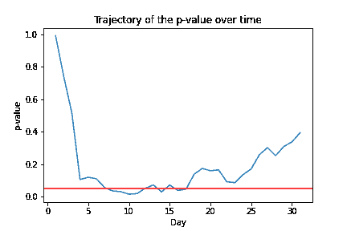
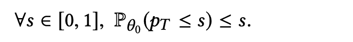
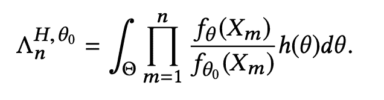
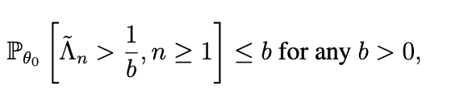
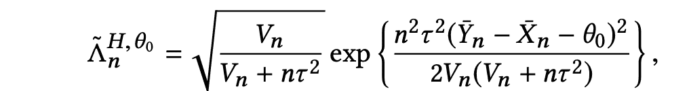
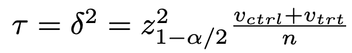
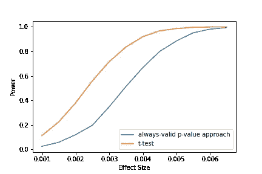

# 愿望铲球偷看总是有效的 p 值

> 原文：<https://towardsdatascience.com/wish-tackles-peeking-with-always-valid-p-values-8a0782ac9654>

## 在不增加假阳性率的情况下自适应地查看和总结实验

在运行你的 A/B 测试之前，你是否估计了效应大小并计算了样本大小？当您结束 A/B 测试时，您是否只检查一次 *p* 值？当*p*-值为 5.1%(比阈值 5%高 0.1%)并且已经达到预先计算的样本量时，您是否会停止实验并得出产品特性没有改善业务的结论，而不是延长实验时间？如果你对任何一个问题的回答是否定的，那么你的实验的假阳性率(第一类错误率)很可能是夸大的。

当实验者在实验达到预先计算的[样本量](https://en.wikipedia.org/wiki/Sample_size_determination)【1】之前，根据观察到的结果偷看并做出决定时，假阳性率被夸大。对于固定样本量测试(如 t-test)，最佳实践是在启动实验之前估计所需的样本量，并在达到样本量后得出结论，但许多实践者在实践中并不遵循这一点。

要求实验者取得统计学学位并忠实地遵循程序是最好的解决方案吗？我们认为实验者有很强的理由偷看，偷看应该被允许。在本文中，我们介绍了我们对窥视问题的研究，以及我们如何在 [Wish](https://www.wish.com/careers?hide_login_modal=true) 实现*始终有效 p 值*来控制假阳性率，同时使实验者能够自适应地结束他们的实验。

# 偷看会使假阳性率增加四倍

我们通过运行 1000 个模拟的 [A/A 测试](https://www.analytics-toolkit.com/glossary/a-a-test/)来评估假阳性率，包括有无窥视。每个 A/A 测试都是使用模拟存储桶分配和真实指标数据(一个月的商品总值数据)构建的。在每个 A/A 测试中，我们使用[韦尔奇的 t 检验](https://en.wikipedia.org/wiki/Welch%27s_t-test)和[零假设](https://en.wikipedia.org/wiki/Exclusion_of_the_null_hypothesis) —两个实验桶之间没有显著差异。任何检测到的差异都是假阳性，因为在 A/A 测试中，两个实验桶来自同一个[群体](https://en.wikipedia.org/wiki/Statistical_population)。

不进行窥视(即在所有 1，000 个 A/A 测试的相同样本量下得出结论)，假阳性率约为 4.7%。相比之下，如果我们在第一次*p*-值低于阈值 5%时结束实验，假阳性率约为 21%。

甚至我们更加保守，将决策规则设置为*当连续 n 天 p 值低于 5%时结束实验*。假阳性率仍然很高。下表展示了对应于**T5【n不同值的假阳性率。**

当连续 n 天 p 值低于 5%的实验结束时的假阳性率

# 为什么偷看会提高假阳性率？

A/B 测试平台通常利用固定样本量测试(例如 t-test)，其中所需的样本量是预先估计的。只有当实验者在达到预先计算的样本量后仅结束一次实验时，固定样本量测试才能最佳地权衡假阳性率和检测真阳性的概率(功效)。

当适应性地结束实验时，假阳性率显著增加，即，当实验变得具有统计显著性时结束实验。下图描绘了典型 A/A 测试的*p*-值随时间变化的轨迹。我们对为期一个月的 A/A 实验中的每一天都应用了 Welch 的 t 检验。在 A/A 实验的整个过程中，*p*-值多次低于红线(决策阈值*p*-值< 0.05)的情况并不罕见。此外，如果我们无限期地运行实验，并在*p*-值为 5%时立即结束实验，则假阳性率会达到 100%。也就是说，*p*-值总是在某个时候由于偶然的原因降到 5%以下。



# 为什么实验者会偷看？

如果偷看大大增加了假阳性率，为什么实验者不总是计算所需的样本量，只有在达到预先计算的样本量时才结束实验？

**样本量计算困难且不准确**

在进行实验之前，计算样本量是很困难的，至少是不准确的，因为这需要实验者估计效果的大小——新产品特性会产生多大的影响。在进行实验之前，实验者通常不太了解她的新产品特性的影响。即使实验者具有关于其新产品特征要移动的度量的广泛领域知识，并且可以从以前的实验中估计效果大小，如果她低估了效果大小，则计算的样本大小可能会大得多，因为期望的样本大小是效果大小的平方。例如，当估计的效应大小是真实效应大小的一半(或 10%)时，实验者会等待四(或 100)倍的时间。

实验者有充分的理由偷看

虽然偷看会增加假阳性率，但实验者有强烈的动机去偷看。因为 1)在科技公司进行的在线实验的数据源源不断，2)尽快完成实验对客户和公司都有好处。

在现代在线实验中，实验者实时观察数据，这使得实验能够自适应地调整样本容量(称为自适应样本容量测试)。商业伙伴经常问数据科学家要等多久才能让实验达到统计显著性，数据科学家可以等更长时间或更早停下来调整样本大小。这对于农业研究来说是不可能的，因为大多数实验设计理论是在 100 年前发展起来的。在农业实验中，即使实验者想偷看，她也别无选择，只能等到作物季节结束时收集数据。

实验者希望尽快结束实验，以改善或停止伤害用户体验。在固定样本量的测试中，实验者不应该在样本量达到之前向所有用户推出一个有益的特性，即使实验结果已经暗示了显著的改进。否则，固定样本量测试(如 t-检验)会导致高阳性率。反之亦然，如果实验者不想错误地扼杀一个产品特性，即使早期的实验结果显示出显著的退化，她也不能停止实验。

我们没有要求所有从业者(他们不一定受过严格的统计训练)遵循实验设计的最佳实践，这有时是违反直觉的，而是为从业者提供了总是有效的 *p* 值。这使得我们可以在实验结果显示出显著的正面或负面影响时，立即结束实验。

# 始终有效的 p 值方法的工作原理

我们在 Wish 的内部实验平台中实现了始终有效的*p*-值。始终有效的 *p* 值的一个巨大优势是，最终用户在实验 UI 中看不到任何差异，并且可以像解释固定样本量测试产生的 *p* 值一样解释始终有效的 *p* 值。此外，当数据科学家启动他们的实验时，他们不需要用头撞墙来计算所需的样本量。

如果你想知道这种方法如何工作的数学细节，请通读本节的其余部分。如果您只是对使用这种方法感兴趣，那么在不影响理解的情况下，您可以跳过本节的其余部分。

这里的一个关键信息是，即使当你偷看时，你的实验的假阳性率也得到很好的控制——一旦你看到 *p* 值低于阈值(例如，5%),就结束实验。

为了让 p 值无论实验者何时选择停止实验都始终有效，我们需要确保



也就是说，在零假设θ₀下，小于阈值 s 的 *p* 值的概率(范围从 0 到 1)在任何时间 t 都小于 s。这意味着即使在依赖于数据的时间查看 *p* 值，假阳性率仍低于预定义的阈值 s。例如，如果我们将阈值设置为 5%，只要始终有效的 *p* 值低于 5%，我们就可以结束实验，并且 fpp

始终有效的 *p* 值方法利用[顺序测试](https://en.wikipedia.org/wiki/Sequential_analysis)，该方法应用于临床研究，数据随时间顺序到达。拉梅什·乔哈里等人。al 介绍了一种序贯测试——混合序贯概率比测试(mSPRT ),它适用于 A/B 测试，能够在不增加假阳性率的情况下进行序贯决策。本质上，始终有效的*p*-值计算为 1/λ，其中λ计算如下



这里，λ代表数据遵循零假设的可能性与数据遵循混合备选假设的可能性的[比](https://en.wikipedia.org/wiki/Likelihood-ratio_test)，h(θ)是θ在备选假设下的混合分布。直觉上，λ越大，数据越有可能来自零分布。

可以证明λ在零假设下是一个[鞅](https://en.wikipedia.org/wiki/Martingale_(probability_theory))，因此，



因此，1/λ遵循始终有效的 *p* 值的定义。

具体来说，估计如下



在哪里

*   Y̅ₙ和 X̅ₙ分别是处理桶和对照桶的样本均值。
*   样本量为 n。
*   Vₙ是对照桶的样本方差和处理桶的样本方差之和。

[赵震宇等人。al](https://arxiv.org/pdf/1905.10493.pdf) 已经表明，混合分布 h(θ)中的τ可以估计如下:



其中 Z 为 [Z 统计量](https://en.wikipedia.org/wiki/Standard_score)，α为显著性水平，v_ctrl 和 v_trt 分别为对照和处理桶的样本方差。

# 总是有效的 p 值方法控制假阳性率

我们通过运行 [A/A 测试](https://www.analytics-toolkit.com/glossary/a-a-test/)来评估始终有效的 *p* 值方法的假阳性率。在每个 A/A 测试中，我们在每个数据点到达后计算始终有效的*p*-值，当始终有效的*p*-值低于 5%或实验达到预定的样本量时，我们结束实验，该样本量远大于任何典型实验所需的样本量。我们的 A/A 研究表明，始终有效的 *p* 值方法的假阳性率低于 5%。

# 总是有效的 p 值方法导致令人满意的功率

我们还研究了始终有效的 *p-* 值方法的真阳性率([功效](https://en.wikipedia.org/wiki/Power_of_a_test))，如下所示:

1.  模拟两周的数据，其中处理桶的平均值比对照桶的平均值大 0.1%
2.  在每天的数据到达后，使用 t 检验和永远有效的 *p-* 值方法计算 *p* 值。
3.  如果 Welch 的 t 检验得出的*p*-值在 14 天中的任何一天小于 5%，或者最后一天的始终有效的*p*-值小于 5%，则我们声明检测到差异。
4.  重复步骤 1 到步骤 4 10，000 次
5.  将差值从 0.1%增加到更大的值，然后重复步骤 1 至步骤 4。

我们测试了不同的效应大小(范围从 0.1%到 1%)，并比较了永远有效方法和 t 检验方法的功效。请注意，这不是一个公平的比较，因为 t 检验在顺序应用时有更高的假阳性率。我们绘制了两种方法在不同效应大小下的真实阳性率。下图表明，即使与假阳性率较高的 t 检验相比，始终有效的 *p* 值方法也能产生令人满意的功效。



永远有效的 p 值方法和 t 检验之间的功效比较

始终有效的 *p* 值的一个警告是，当桶高度不平衡时，它们往往不太可靠。实际上，在 Wish，当两个桶不太不平衡时(例如，处理与控制的比率不大于 5)，我们应用该技术。

# 结论

尽管偷看大大增加了假阳性率，但从业者有充分的理由偷看。为了使他们能够在控制假阳性率的同时尽快结束实验，我们实现了始终有效的 *p* 值，这使得实验人员能够实时调整实验长度(样本大小)。我们的模拟研究表明，总是有效的 *p* 值方法控制了假阳性率，并且具有令人满意的真阳性率。

# 感谢

感谢 Eric Jia 和对本项目的贡献。我也非常感谢刘派、Pavel Kochetkov 和 Lance Deng 对这篇文章的反馈。

```
References
[1] Johari, Ramesh, et al. “Peeking at a/b tests: Why it matters, and what to do about it.” *Proceedings of the 23rd ACM SIGKDD International Conference on Knowledge Discovery and Data Mining*. 2017.[2] Zhao, Zhenyu, Mandie Liu, and Anirban Deb. “Safely and quickly deploying new features with a staged rollout framework using sequential test and adaptive experimental design.” *2018 3rd International Conference on Computational Intelligence and Applications (ICCIA)*. IEEE, 2018.
```