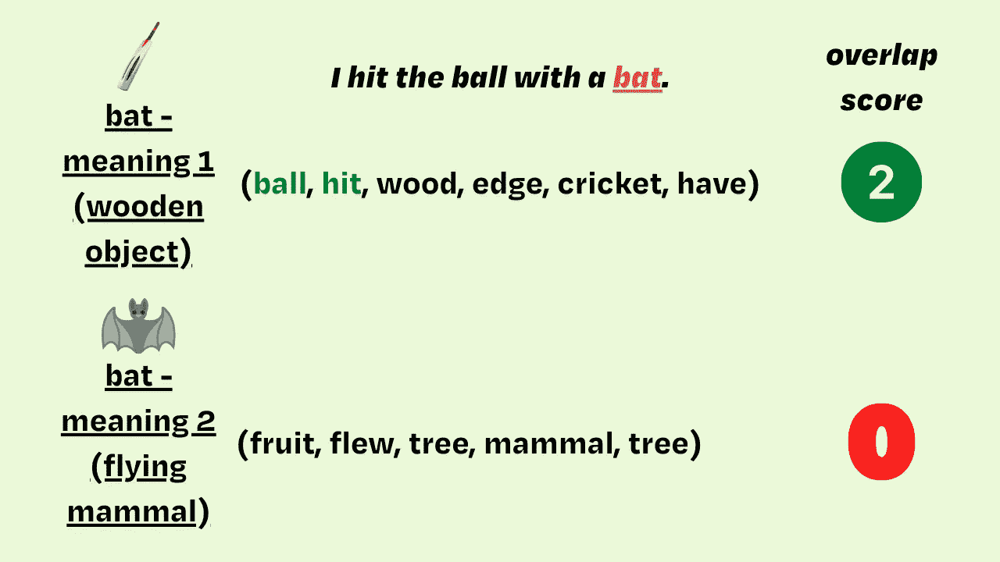
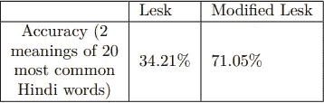

# 印地语和 Python 的 hindiwsd 库的词义消歧

> 原文：<https://towardsdatascience.com/word-sense-disambiguation-for-hindi-pythons-hindiwsd-library-da782623ea1c>

格伦·卡丽在 [Unsplash](https://unsplash.com?utm_source=medium&utm_medium=referral) 拍摄的照片

随着迄今为止在自然语言处理(NLP)和语言学领域取得的所有进步，你会认为智能系统能够找出在特定上下文中使用的单词的正确含义。然而，情况并非如此，至少在像印地语和混合代码的 Hinglish 这样的低资源语言中不是这样，在这些语言中还有许多工作要做。这显然为**词义消歧**的研究和其他面向应用的工作打开了许多机会。因此，我和我的合著者 Mirza Yusuf 决定构建一个 Python 库，作为那些对研究印地语和混合代码的 Hinglish 的词义消歧感兴趣的人的一个有用的起点。这篇文章简要介绍了我们的思维过程、工作和图书馆。

## 词义消歧

简单来说，词义消歧是指识别一个词在一定语境中使用的正确含义。这里有一个例子:

> "我用球棒击球。"

一个非常简单直白的句子而且我相信我们大多数人都知道这里的“bat”指的是板球、棒球等运动中使用的木棍状物体。现在，“蝙蝠”的另一个意思是倒挂在树上的会飞的哺乳动物，但是我们知道你不能用它来击球(或者我希望如此)。

这就是我们的问题陈述的本质。我们进行了研究，以设计出最佳的方法，教我们的系统根据单词使用的上下文来消除它们的歧义。虽然像英语这样的高资源语言已经做了大量的工作，但是低资源语言还有很长的路要走。

由于能够很好地读、写和理解印地语，我和我的合著者决定解决印地语以及混合代码的 Hinglish 文本的这个问题。

## 我们的方法

我们最初花了很多时间寻找相关的数据集和预先存在的 Python 库，以及大量的文献调查。在这个过程中，我们遇到了 WordNet，这是一个由单词之间的语义关系组成的词汇数据库，并最终出现了 IndoWordNet，这是一个由主要的印度语言组成的 WordNet 版本。

我们必须做出的一个重要决定是，为了成功地解决这个问题，要看使用哪种学习方法/模式。现在，我们通常着眼于涉及神经网络架构的监督或非监督方法，如 LSTMs、GRUs、BERT 等。然而，我们发现现有的监督和非监督方法很难使用，数据集格式也不是非常理想的形式。这促使我们探索基于字典的方法，在实验中，我们还发现这种方法比有监督或无监督的方法更快，并且很好地利用了 WordNet 的特性。

## Lesk 算法

Lesk 算法是一个相当简单但有效的算法，它利用了 WordNets 的结构和特性来执行词义消歧。

本质上，它接受要消除歧义的单词以及该单词使用的上下文，然后使用 WordNet 找出该单词的意思。

伪代码是这样的:

基于上下文(歧义词周围的词)和在 IndoWordNet 中找到的与歧义词相关的词，计算重叠。对于 IndoWordNet 中存在的单词的每个意思计算这种重叠，并且具有最高重叠分数的意思被认为是正确的意思。

这里有一个例子可以让你更好地理解:

使用 [Canva](https://medium.com/u/46cb8d4ce352?source=post_page-----da782623ea1c--------------------------------) 制作的图像

然而，我们注意到这个算法有一个主要问题——它只提供了一个非常一般化的解决方案。由于用于各种不同含义的支持单词(上下文)的共同性质，Lesk 算法经常不能识别给定句子中单词的正确含义。

## 自定义 Lesk 算法

这促使我们探索监督和非监督的方法，却发现这一领域的数据集特别缺乏。因此，我们缩小了问题陈述的范围。我们决定为 **20** 个最常用的歧义印地语单词增强词义消歧。这使得我们也可以用这 20 个单词的各种含义来建立一个特殊的数据集，并使用它来增强我们的 Lesk 算法。

我们继续修改 Lesk 算法，使自定义数据集中出现的单词在确定单词的含义时也发挥作用。

我们使用了一个叫做“*交集*的附加参数来增强算法。这是我们的算法版本的伪代码，尽管只做了很小的改变，我们观察到结果有很大的不同！

## 结果

通过一个小的调整和一个更集中的方法，我们能够大大提高我们基于字典的 Lesk 算法的准确性。

我们能够将所选的 20 个单词以及每个单词最常用的两个意思的准确率提高一倍。更重要的是，我们能够创建一个框架，可以在未来用于研究目的，或者简单地作为一个项目的方便工具！

词义消歧的准确度比较

虽然这可能不是最稳健的解决方案，而且对于整个语言来说肯定需要时间，但我们希望我们在这里的工作将鼓励未来对数据集进行更多的研究和管理，从而可以直接使用监督和非监督方法，并提供快速预测。

更多信息可以查看我们的 [**Python 包**](https://pypi.org/project/hindiwsd/) 这里或者干脆

> pip 安装 hindiwsd

欢迎在我们的 Github 库上与我们交流，我们非常乐意帮助您！

以下是我们发表的论文的链接，以防有人需要:[http://www . lrec-conf . org/proceedings/lrec 2022/workshop/wild re 6/pdf/2022 . wild re 6-1.4 . pdf](http://www.lrec-conf.org/proceedings/lrec2022/workshops/WILDRE6/pdf/2022.wildre6-1.4.pdf)