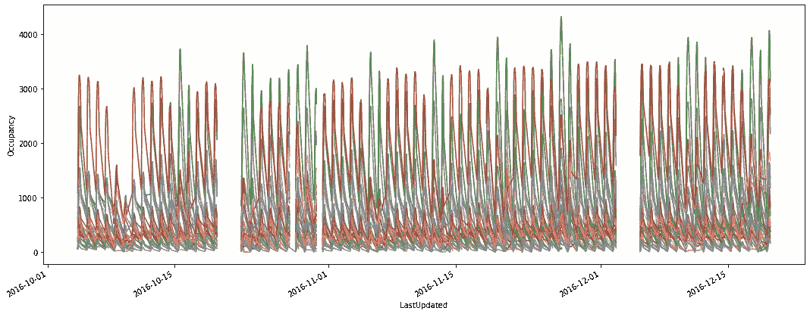
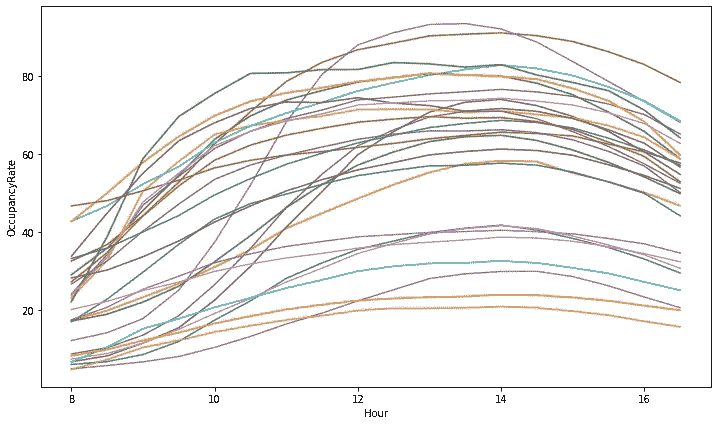
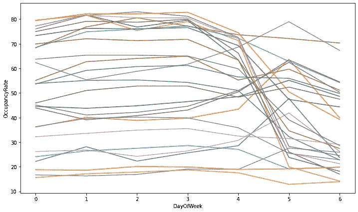
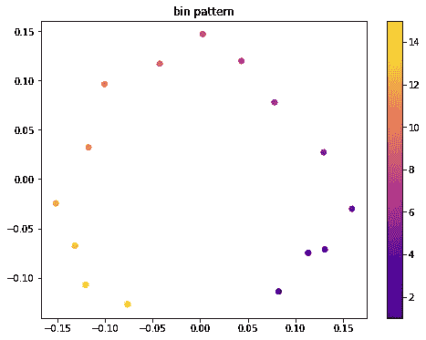
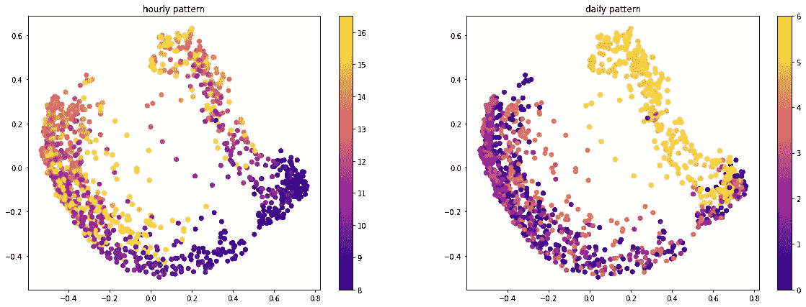

# 带时间序列的 Word2Vec:一种迁移学习方法

> 原文：<https://towardsdatascience.com/word2vec-with-time-series-a-transfer-learning-approach-58017e7a019d>

## 学习时间序列的有意义的嵌入表示


照片由[希亚姆](https://unsplash.com/@thezenoeffect?utm_source=medium&utm_medium=referral)在 [Unsplash](https://unsplash.com?utm_source=medium&utm_medium=referral) 上拍摄

向量表示是机器学习生态系统中的一个关键概念。无论我们面临什么样的任务，我们总是试图赋予我们所掌握的数据以意义。**我们习惯于采用技术来提供数据的数字表示，以发现隐藏的行为并产生有价值的见解**。

**随着深度学习的兴起，以较少的假设和较少的努力获得有意义的数据表示正在成为现实**。我们来想想 TF-IDF(词频-逆文档频)。这是自然语言处理中采用的一种技术，用于将一组原始文本文档转换成一个数字矩阵。TF-IDF 在很长一段时间内占据了主导地位，代表了一种编码文本序列的好方法。深度学习的出现拯救了新技术，首先是 Word2Vec，然后是 transformer 编码。它们是现成的解决方案，并且在提供文本数据的数字数据表示方面非常有效，而不需要(在大多数情况下)理解上下文。这使得它们比老式的 TF-IDF 更受欢迎。

在 NLP 领域采用深度学习嵌入表示是革命性的。**通常将术语*“嵌入表示”*与涉及文本数据的应用**联系在一起。这是因为很容易概括文本内容中单词的位置依赖性。如果我们认为还存在其他表现出位置依赖性的数据源，**为什么不在其他领域推广文本嵌入技术呢？**

一个引人入胜的想法可能是**将 NLP 中获得的成果转化到时间序列领域**。乍一看，这可能是一个完美的拟合，因为时间序列数据也是由位置/时间关系来表征的。主要的好处应该在于提供学习技术，这些技术可以产生遵循潜在的时间依赖性的数据的有价值的向量表示。这不是我们第一次对时间序列数据的嵌入感兴趣。我们发现了 [**Time2Vec**](https://medium.com/towards-data-science/time2vec-for-time-series-features-encoding-a03a4f3f937e) 作为时间的模型不可知表示的效用，可以在任何深度学习预测应用中使用。我们还提出了 [**Corr2Vec**](/corr2vec-a-wavenet-architecture-for-feature-engineering-in-financial-market-94b4f8279ba6) 通过研究多个时间序列的相互相关性来提取它们的嵌入表示。

在本帖中，**我们尝试在时序域**中应用 Word2Vec。我们的目标是利用无监督方法的灵活性，如 Word2Vec，来学习时间序列的有意义的嵌入。生成的嵌入应该能够捕获底层系统行为，以便在其他上下文中也可以重用。

# 数据

我们从 evergreen UCI 知识库中收集了一些开源数据(参见这里的[UCI 许可政策的](https://networkdata.ics.uci.edu/about.php))。[停车伯明翰数据集](https://archive.ics.uci.edu/ml/datasets/Parking+Birmingham)包含 2016/10/04 至 2016/12/19 期间每小时 8:00-16:30 的停车占用率。它非常适合我们的目的，因为它记录了来自不同位置的数据，使我们能够在多变量的情况下进行切换。

我们掌握了原始占用率(即当时停车场有多少辆车)和最大停车容量。



所有停车区域的占用时间序列(图片由作者提供)

数据显示了缺失观测值的存在，但也显示了一些有规律的季节性模式。我们观察每天和每周的行为。所有的停车区往往在下午达到最大占用率。其中一些人在工作日使用最多，而其他人在周末更忙。



所有停车区域的占用率小时模式(图片由作者提供)



所有停车区的占用率每日模式(图片由作者提供)

# 建模

如何将 Word2Vec 应用于时序数据？当将 Word2Vec 应用于文本时，我们应该首先用一个整数映射每个单词。这些数字代表单词在整个文本语料库中的唯一标识符。它们需要允许唯一的可训练嵌入的关联。对于时间序列，我们也应该这样做。整数标识符由宁滨连续时间序列生成为区间。在每个时间间隔，我们关联一个唯一的标识符，它指的是一个可学习的嵌入。


时间序列离散化示例(图片由作者提供)

在将时间序列离散化之前，我们应该考虑对它们进行缩放。在多元环境中工作时，这一点尤为重要。我们需要以统一的方式应用离散化来实现单义整数映射。考虑到我们的停车数据，我们使用占用率系列(在 0-100 范围内标准化)来避免误导学习行为。

Word2Vec 架构与 NLP 应用程序中的架构保持一致。有不同的现成解决方案。我们选择手工 Tensorflow 实现:

```
input_target = Input((1,))
input_context = Input((1,))
embedding = Embedding(n_bins+1, 32)
dot = Dot(axes=1, normalize=True)([
     Flatten()(embedding(input_target)), 
     Flatten()(embedding(input_context))
])
model = Model([input_target, input_context], dot)
model.compile(
     optimizer=Adam(learning_rate=1e-5), 
     loss=BinaryCrossentropy(from_logits=True)
)
```

训练数据和相关标签由跳格法生成。它根据用户定义的窗口大小生成整数对。同一窗口中的整数对的标签等于 1。随机生成的配对被标记为 0。

通过检查学习到的嵌入，我们了解到网络可以自动识别我们数据的循环性质。



每个装箱的时间序列序列的 2D 嵌入可视化(图片由作者提供)

扩展所有时间序列的嵌入表示，我们注意到每小时和每天的观察之间的明显分离。



每个时间序列中所有观测值的 2D 嵌入可视化(图片由作者提供)

这些可视化证明了我们方法的优点。假设条件低，需要设置的参数少，就可以生成有意义的时间序列嵌入。

# 摘要

在这篇文章中，我们提出了著名的 Word2Vec 算法的推广，用于学习有价值的向量表示。没有太多的努力，我们采用了在时序上下文中应用 Word2Vec 所需的所有考虑因素。最后，我们展示了这种技术在一个非标准的 NLP 应用程序中的有效性。整个过程可以很容易地集成在任何地方，并很容易地用于迁移学习任务。

## 引文

*   Dua d .和 Graff c .(2019 年)。 [UCI 机器学习知识库](http://archive.ics.uci.edu/ml)。加州欧文:加州大学信息与计算机科学学院。
*   丹尼尔·h·斯托尔菲、恩里克·阿尔巴和姚。智能城市停车场占用率预测。in:2017 年 6 月 14 日至 16 日在西班牙马拉加举行的 Smart-CT 2017 第二届国际会议。
*   伯明翰市议会。

[**查看我的 GITHUB 回购**](https://github.com/cerlymarco/MEDIUM_NoteBook)

保持联系: [Linkedin](https://www.linkedin.com/in/marco-cerliani-b0bba714b/)