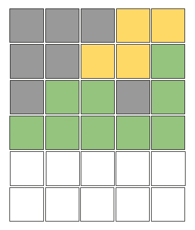
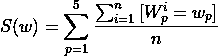
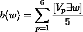

# 使用 Python 3 构建一个 Wordle 解算器

> 原文：<https://towardsdatascience.com/wordle-solver-using-python-3-3c3bccd3b4fb>

# 使用 Python 3 构建一个 Wordle 解算器

## 用 Python 3 开发字母位置概率求解单词

Wordle Guess Block |作者图片

大家好，我相信现在你们都已经看到了 Wordle，Twitters 的最新困扰。

如果你和我一样，你在这个游戏中挣扎。但是不要担心，在搜索和数据分析的帮助下，我们可以变得很棒，你可以把你自己的获奖截图发布到你的 Twitter 上。

# 什么是沃尔多

首先，让我解释一下什么是 Wordle。Wordle 是一个简单的游戏，你有六次机会猜出一个五个字母的单词。

每次预测之后，游戏都会给你提示。

绿色瓷砖表示您预测了字母的正确位置。

黄色的瓦片意味着字母在单词中，但是你的预测有错误的位置。

最后，灰色的瓷砖意味着这个字母不在单词中。每天游戏的单词都会被重置，让每个人都有机会猜对单词。

# 构建控制台游戏

有了对 Wordle 的新认识，让我们用 python 3 为我们的主机构建一个可玩的游戏版本。我们将创建一个包含游戏板和规则的自定义类。我们班有四个函数。

第一个功能是检查游戏是否结束。如果玩家成功猜中了暗号，游戏就结束了。如果玩家使用了所有六种猜测，游戏也完成了。

类的第二个功能决定了游戏的结果。该函数返回一个元组。第一个元素是代表游戏结果的二进制值。如果玩家赢了，元组的第二个元素被设置为游戏获胜的猜测。如果玩家输了，元组的第二个元素被设置为 99。

该类的第三个函数用玩家最近的猜测更新游戏面板。

第四个也是最后一个函数决定玩家的猜测是否有效。此功能有助于验证用户输入，以确保游戏正常运行。

# 构建游戏助手

现在让我们制作实际的 Wordle 解算器。我们的单词库从 15917 个单词开始，给我们猜对单词的初始概率只有 0.0063%。这个小百分比意味着如果我们想要赢得比赛，缩小搜索空间是至关重要的。

为了帮助增加赢得游戏的概率，我们首先要做的是利用游戏规则来缩小我们的搜索空间。根据我们猜测返回的颜色，我们可以从我们的单词库中过滤出灰色/黑色字母，因为我们知道它们不在秘密单词中。

我们可以应用于单词库的另一个过滤器是选择包含黄色字母的单词，因为我们知道所有黄色字母都在秘密单词中。我们还可以过滤掉在猜测位置带有黄色字母的所有单词，因为我们知道该字母不会在那个位置。

我们将执行的最后一个利用是在预测位置过滤所有绿色字母，因为我们知道这是在单词中。

既然我们知道如何缩小搜索空间，我们需要确定如何猜测最有影响力的词。为此，我们将使用每个字母定位概率的总和对每个单词进行评分。

单词评分公式|作者图片

*   S =单词得分
*   w =当前单词
*   W =单词库
*   n =单词库中的单词量
*   p =当前字母在 word 中的位置

通过使用字母定位概率，我们尽最大努力找到绿色和黄色字母，这样我们可以缩小我们的单词库，增加我们猜测正确单词的概率。

如果一个元音字母不在我们知道的字母中，我们将在单词评分等式中添加一个偏差，以鼓励找到一个元音字母。我们这样做是为了利用这样一个事实，即我们知道每个单词都有一个元音。我们添加到单词得分的偏差是单词中唯一元音的百分比。

元音偏差|作者图片

*   b =元音偏向
*   w =当前单词
*   V =元音库

最后，我们返回单词得分的`argmax`,因为我们知道这是最有影响力的单词。

# 包裹

现在你知道了，我们已经成功地创建了我们的 Wordle solver，这给了我们赢得游戏的高概率。

你可以在我的 GitHub [这里](https://github.com/bellerb/wordle_solver)查看完整版本的代码。

感谢阅读。

# 参考

*   [https://www.powerlanguage.co.uk/wordle/](https://www.powerlanguage.co.uk/wordle/)