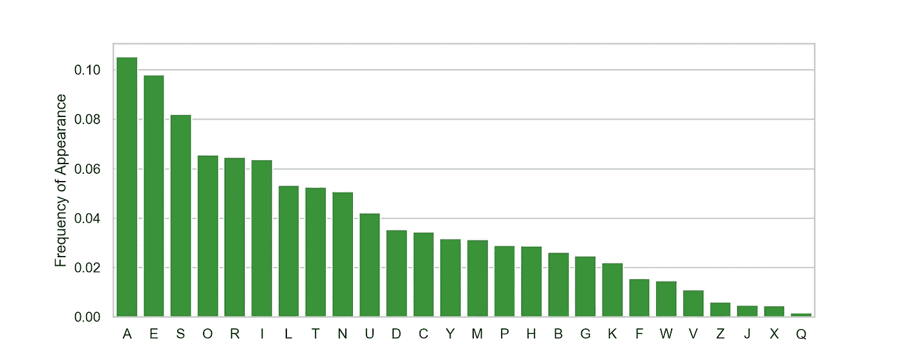
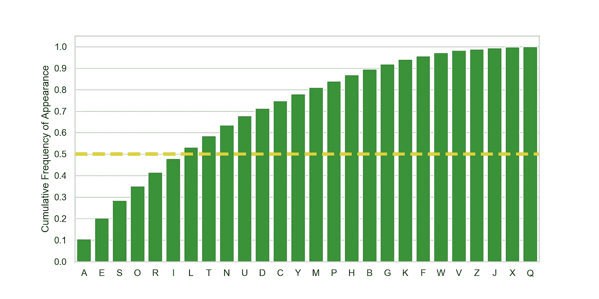
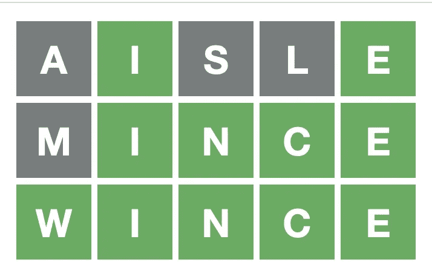
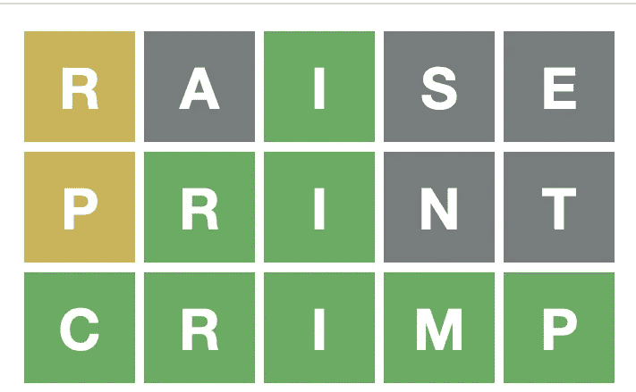

# WORDLE-VISION:简单分析提升你的 WORDLE 游戏

> 原文：<https://towardsdatascience.com/wordle-vision-simple-analytics-to-up-your-wordle-game-65daf4f1aa6f>

# WORDLE-VISION:简单分析提升你的 WORDLE 游戏

斯文·布兰德斯马在 [Unsplash](https://unsplash.com?utm_source=medium&utm_medium=referral) 上的照片

我爱文字游戏。近十年来，我有一种不太健康的痴迷，那就是与朋友一起玩[单词](https://www.wordswithfriends.com/)，每天同时与玩家玩多达十几个游戏，事实上，这些玩家不是我的朋友，而是随机的对手。然而，近年来这个曾经流行的移动应用程序已经失宠，留下了我和一群挥之不去的怪人，他们会通过应用程序内的聊天功能与我进行奇怪的对话(见图 1，这是许多例子中的一个)。因此，我对这个应用程序的兴趣减弱了，最终消失了。

图 1:与一个陌生人(众多陌生人中的一个)的应用程序内对话的单词片段。我的幽默尝试总是不受重视。

然后我听说了一个风靡全国的叫做[的游戏。不需要下载，也没有账户登录，没有广告，没有来自 randos 的主动信息。我很好奇。对于那些不熟悉单词的人来说，这个游戏的目的是在 6 次尝试中猜出 5 个字母的英语单词。这个游戏告诉你是否猜对了一个字母，也告诉你是否猜对了它在单词中的位置。](https://www.powerlanguage.co.uk/wordle/)

玩了一个星期后，我开始想:最佳的第一个猜测是什么？凭你的第一次猜测，你什么也没找到，对吗？嗯，这不完全正确。我们有一些先验知识。例如，我们知道正确的单词必须是 5 个字母长的英语单词。它可能需要一个或多个元音，或者至少一个 *Y* 。此外，你可能听说过 *E* 是英语中使用最多的字母(尽管这并不一定适用于所有由 5 个字母组成的**英语单词)。我内心的科学家渴望找到一种方法，利用公开可用的单词数据来决定最佳单词猜测。**

与你可能在网上读到的相反，并不总是需要用最先进的机器学习模型来解决数据问题。您可能不需要花费数天时间来担心调整超参数、交叉验证或在您的神经网络中包含多少隐藏层。有时候一杯咖啡、[几十行代码和几个条形图可以让你在短时间内走得很远。](https://github.com/rrgupta/WORDLE-VISION)

快速收集一些见解的第一步是找到一个包含英语中所有单词的词典。幸运的是，这被证明是相当容易做到的(因为互联网)。我在 dwyl 的回购中发现了 GitHub 上的一个[文本文件，包含 37 万字。出于 Wordle 的目的，我们只关心 5 个字母的单词，这样我们就有将近 16，000 个单词。接下来我想知道的是在 5 个字母的单词中最常见的字母是什么。为此，我需要计算每个字母的频率，结果如图 2 所示。](https://github.com/dwyl/english-words)

图 2:5 个字母单词中字母的频率分布。10.5%的字母是 **A，** 9.8%的字母是 **E** ，以此类推(图片由作者提供)。

我有点惊讶地发现，在 5 个字母的单词*中，字母*是最常见的，占所有字母的 10.5%。字母 *E* 紧随其后，为 9.8%，其次是 *S* 为 8.2%。不出所料，所有元音都排在前 10 位，而字母 *V* 、 *Z* 、 *J* 、 *X* 和 *Q* 出现频率最低。查看数据的另一种有趣方式是进行累计求和，以获得图 2 的累计频率版本。下面的图 3 显示了这个分布的样子。

图 3:在 5 个字母的单词中发现的字母的累积频率分布。我们可以看到，前 7 个字母占了所有字母的一半以上(图片由作者提供)。

关于累积分布的巧妙之处在于，我们可以清楚地看到，前 7 个字母( *A* 、 *E* 、 *S* 、 *O* 、 *R* 、 *I* 、 *L* )占了 5 个字母单词中所有字母的一半以上(53%)。似乎合乎逻辑的是，最佳的第一个单词猜测应该是只包含这 7 个字母的单词。原来，这本词典中有 231 个单词只有**使用字母 *A* 、 *E* 、 *S* 、 *O* 、 *R* 、 *I* 、 *L* 。因此，我们现在将 16，000 个 5 个字母的单词缩减为 231 个，减少了 98.5%。**

但是这 231 个单词中的一些包括 *SALSA* ，它(虽然美味)只由 3 个不同的字母组成，因此削弱了我们在第一次尝试中消除字母的能力。因此，**首先猜测的更好的单词是只使用前 7 个字母并且每个字母只使用一次**。强加这个要求留给我们的只有 60 个单词，这是一个更合理的数量，我们可以快速排序。

关于这整个分析的一个重要的警告是，我使用 5 个字母的英语单词的完整列表作为输入。事实上，可能的单词列表是大约 2500 个最常见单词的精简集合。访问这个 2500 个单词的列表将极大地改善这里的结果。作为替代，我可以手动筛选我们的 60 个单词列表，删除更深奥的单词。剩下的单词组成了我精选的 21 个最佳单词列表(按字母顺序排列):

# 
过道
沉香
崛起
崛起
伯爵
赖尔
激光
说谎者
说谎者
洛里斯
失败者
涂油者
口述
铁轨
升起
雷亚尔
滚转
滚转
角色
滑行者
太阳能

让我们在几个真实的单词游戏中尝试一下这个列表中的一些单词作为第一猜测。在图 4 中，我展示了 1 月 22 日(左)和 1 月 23 日(右)的 Wordle 结果。

图 4:左边——我的单词(2022 年 1 月 22 日的第 217 号),我使用了第一个单词**过道**,来自我策划的 **21 个最佳单词猜测列表**。右—我的单词(2022 年 1 月 23 日的第 218 号)，我尝试了我列表中的另一个单词， **RAISE** ，作为第一猜测(作者的[单词](https://www.powerlanguage.co.uk/wordle/)的截图)。

1 月 22 日猜过道帮我试了 3 次才解决了这个问题！在最初的猜测之后，我使用上面图 2 中的频率来帮助指导我随后的猜测。比如我在*闪避*之前猜到*肉馅*是因为 *M* 比 *W* 出现的频率更高。令人惊讶的是，我猜中的每一个正确的字母都在正确的位置上，这说明运气在这个游戏中的作用不可低估。1 月 23 日猜*加注*也让我试了 3 次才解出谜题。我再次参考了我所学的关于频率的知识来帮助我选择下一个要猜的字母。

现在有了一些数据驱动的见解，前进吧！

## 我为这个分析编写的代码以及上面的条形图可以在[my word le-VISION GitHub repo](https://github.com/rrgupta/WORDLE-VISION)中找到。

[1]Lexico.com。"字母表中哪些字母最常用？"2021.https://www.lexico.com/explore/which-letters-are-used-most(2022 年 1 月 23 日访问)

[2]维克多，丹尼尔。"《沃尔多》是一个爱情故事。"*纽约时报*，2022 年 1 月 3 日[https://www . nytimes . com/2022/01/03/technology/wordle-word-game-creator . html](https://www.nytimes.com/2022/01/03/technology/wordle-word-game-creator.html)