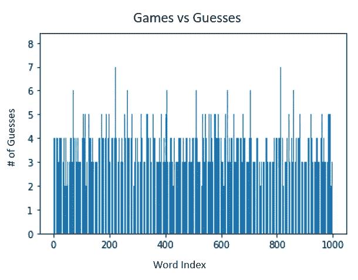

# 单词机器人

> 原文：<https://towardsdatascience.com/wordlebot-386395472639>

## 使用谱聚类和强化学习在 Wordle 中取胜

[Wordle](https://www.powerlanguage.co.uk/wordle/) 是一款简单的文字游戏，由 Josh Wardle 开发。在[纽约时报](https://www.powerlanguage.co.uk/wordle/)上读到这个消息后，我试了一下，立刻就被吸引住了。我的妻子和我已经形成了一种竞争，每天都在比较我们的猜测计数，我认为制作一个机器人加入竞争会很有趣。在这篇文章中，我将回顾 Wordle 的规则，并通过 1000 多个模拟游戏介绍我的机器人的设计和性能。使用的主要 ML/AI 技术有[谱聚类](https://en.wikipedia.org/wiki/Spectral_clustering)和 [Q 学习](https://en.wikipedia.org/wiki/Q-learning)。

TLDR；

*   我用机器学习建立了一个机器人，在硬模式下玩 Wordle。
*   在 1000 多个模拟游戏中，机器人平均猜了 3.767 次**才找到正确的单词。**
*   该机器人在 1000 场模拟游戏中输掉了 8 场，总体胜率为 99.2%。

## 单词入门/规则复习

对于外行人来说，Wordle 是一个类似于 Hangman 的猜谜游戏。每天，你有多达 6 次的机会来猜测一个隐藏的单词。对于每个猜测的每个字母，您都会收到反馈(绿色表示字母在隐藏单词中且位置正确，黄色表示字母在单词中但位置错误，灰色表示字母不在隐藏单词中)。

如果你在**硬模式**下玩游戏，你**需要**使用来自每个猜测的反馈来通知你随后的猜测(防止你纯粹为了获得信息而提交猜测，并减少可能的单词池)。我的机器人在硬模式下玩。

## 相关著作

快速浏览博客圈发现，我不是唯一一个对使用数据科学解决 Wordle 挑战感兴趣的人。

*   Matt Rickard [描述了一种贪婪的方法](https://matt-rickard.com/wordle-whats-the-best-starting-word/)来确定 Wordle 的“最佳”开始猜测，这是基于尽可能多地排除答案选项(他选择了“SOARE”，我甚至不知道这是一个单词)。
*   Mark Scherschel II [提出使用成对距离来衡量单词中心性](https://medium.com/@schersch/an-informed-first-wordle-d2b3f001cd1a)，选择“TARES”作为最佳起始单词选择，因为它与其他单词相对接近。

我想在我的机器人设计中融入并扩展这些想法，以构建一个自主代理，更少地关注**最佳首词**，而更多地关注管理**最佳下一个猜测**的**政策**，以从一个游戏状态导航到下一个游戏状态。理想情况下，这个代理会从它的经验中学习，并随着它玩越来越多的游戏而提高它的性能。

## 源数据

虽然英语中有超过 12，000 个五个字母的单词，但其中许多都是古老的或深奥的。Wordle 的创建者将答案库限制在约 2300 个日常语言中的常用词。我从 Wordle 源代码手动复制了 2300 字的库来训练我的 bot。

## 单词相似度图

可行单词的集合被组织在无向图数据结构中。每个“节点”或“顶点”都是一个单词，单词之间的每个“边”或“链接”都通过一个简单的相似性得分进行加权。得分由两个单词之间的每个普通字母加 1 分组成，如果普通字母也在单词中的相同位置，则加 1 分。

为较小答案库中的所有单词计算成对相似性得分，并存储在对称邻接矩阵中。

## 谱聚类

谱聚类用于将图划分成 k 个“社区”(相似节点的组)。我使用的 k 值为 5。在这篇文章中，我不会深入研究这个算法，但是如果你没有遇到过这个算法，你可以把它看作是相似图的 K-Means。对于那些有兴趣进一步阅读的人来说，[看看这个维基百科帖子](https://en.wikipedia.org/wiki/Spectral_clustering)(很好的起点)。

## q 学习

q 学习是一种强化学习的形式，它寻求学习一种基于经验的政策π(以状态、行动和结果奖励之间的转换的形式)。Q 学习中的一个挑战是定义一个离散的状态空间，使得代理可以通过实验获得足够的经验来学习给定情况下的“最佳”行动，以最大化期望的回报。另一个挑战是建立一个有效平衡短期和长期回报的奖励系统(例如，训练一个机器人吃一块糖比为上大学存钱更容易)。

在本练习中，我通过离散化 k 个社区中的节点分布来定义状态。当 k=5 时，这导致了 126 种可能的状态。

动作被定义为机器人应该从哪个社区选择下一个单词猜测。

奖励被定义为以下三个部分的总和:缩减系数、正确系数和获胜奖金。

收缩因子被定义为猜测前的可行单词数与猜测后的可行单词数的比率。猜测排除的单词越多，收缩系数越大。

正确系数定义为每个绿色字母 2 分(正确位置的正确字母)，每个黄色字母 1 分(正确字母，错误位置)，每个灰色字母 0 分(字母不在正确单词中)。

这个机器人每猜对一次就能获得 1000 分的高额奖金。

## 总体战略

对于每个游戏，一个年级的班级从 2315 个常见的 5 个字母的单词库中随机选择一个单词。然后，机器人使用迭代方法进行猜测。在每次迭代中，机器人执行以下操作:

*   对剩余的可行单词集使用谱聚类来划分图
*   离散化词在聚类中的分布
*   使用 Q 学习器选择一个聚类，从中得出下一个猜测
*   选择猜测作为所选聚类的“质心”(该聚类中具有最高总相似性得分的单词)
*   将猜测传递给 Grader 类，该类评估猜测并以每个字母的分数向量的形式返回反馈(2 代表绿色，1 代表黄色，0 代表灰色)
*   基于来自分类器的反馈过滤图形以排除不可行的单词
*   计算奖励，并在下一次迭代中传递给 Q 学习者

当机器人猜出正确的单词时，它会终止迭代。

根据这个策略，我让机器人玩 1000 场游戏，并记录每场游戏的猜测次数。

## 表演

在 1000 场游戏中，机器人平均猜对次数为 **3.767 次**。它“输”了 8 次(需要猜 6 次以上来识别正确的单词)，总胜率为 99.2%。下面的图表显示了该机器人在 1，000 场游戏中的表现:

WordleBot guess 统计了超过 1000 个模拟游戏。

## 结论

我对我的机器人的总体表现感到惊喜。我自己的单词平均水平徘徊在 3 到 4 之间，所以这个机器人绝对可以和人类抗衡！

也就是说，还有很大的改进空间。计算和存储相似性得分是我的机器人当前设计中计算效率最低的部分，因为它需要为 2315 个单词计算 5359225 个成对的相似性得分。由于该图是对称的，从技术上讲，大约 500 万次相似性计算可以减半为大约 250 万次。因为分数永远不会改变，所以它们实际上只需要计算一次(而我当前的设计出于权宜之计，不必要地重新计算分数)。整个模拟在 Google Colab 环境中运行大约需要 45 分钟，我相信通过一些重构，这个运行时间可以大大减少。

此外，还有许多可以调整的参数。例如，在这个练习中，我任意地将社区的数量设置为 5，并取得了对我来说足够好的结果，但是可能还有其他一些最佳的社区数量。

最后，我怀疑机器人的 Q 学习部分可能是矫枉过正。随着机器人获得经验，我没有观察到我预期的每场比赛猜测次数的减少，这表明没有太多的“收敛”发生。对于一个有趣的短项目来说，我真的很满意它的结果。

这篇文章的扩展版本包括代码可以在我的 GitHub 页面的 [Jupyter 笔记本中找到。你怎么接近这样的机器人？请在评论中告诉我！](https://github.com/danschauder/wordlebot/blob/main/Wordle_Bot.ipynb)