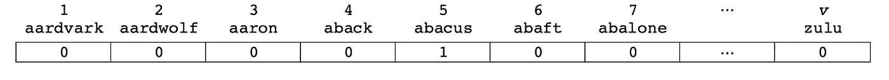
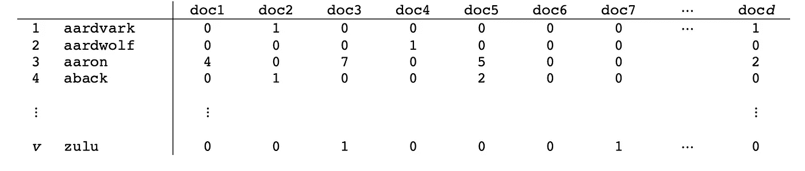
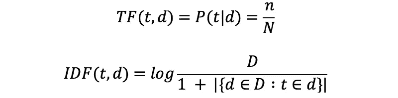
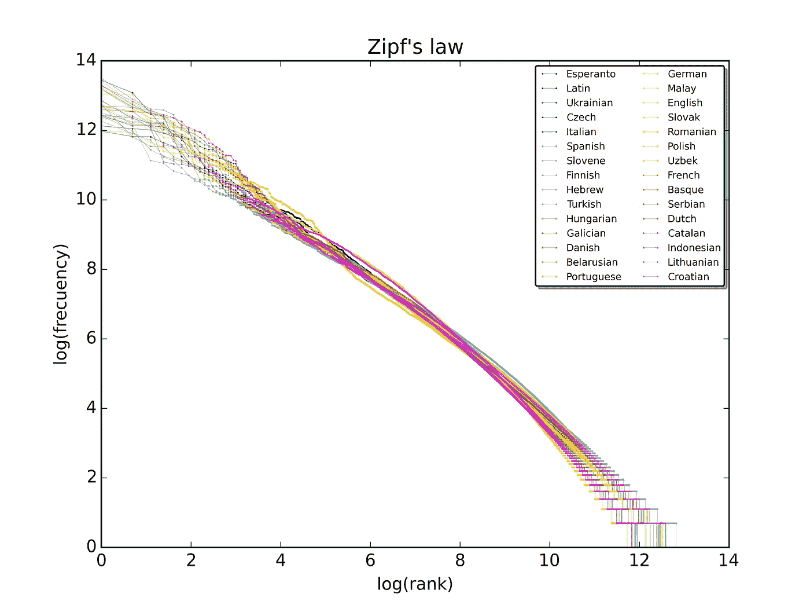
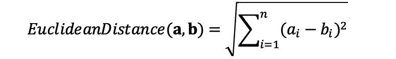
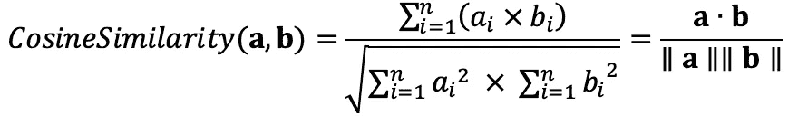
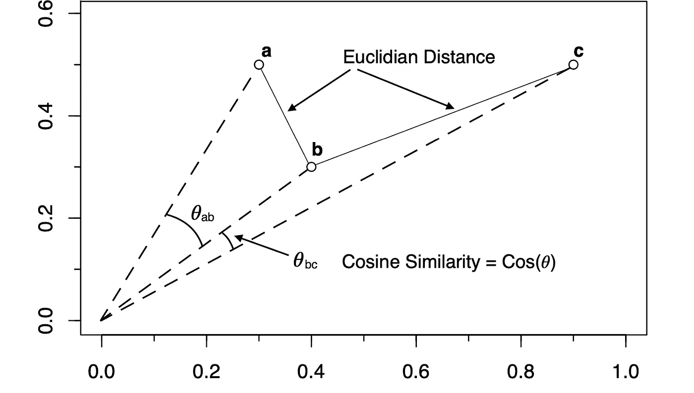
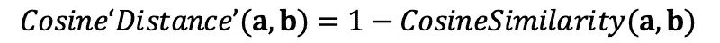
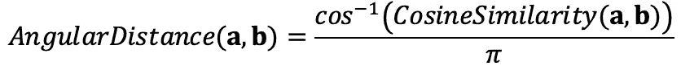

# 单词转化成向量

> 原文：<https://towardsdatascience.com/words-into-vectors-a7ba23acaf3d>

## [单词嵌入入门](https://towardsdatascience.com/tagged/word-embeddings-primer)

## 单词嵌入的概念

****

**照片由[阿玛多·洛雷罗](https://unsplash.com/@amadorloureiro)、[穆库尔·瓦德瓦](https://unsplash.com/@mukulwadhwa)、[塔曼娜·茹米](https://unsplash.com/@tamanna_rumee)在 [Unsplash](https://unsplash.com?utm_source=medium&utm_medium=referral) 上拍摄**

**本文是 2ⁿᵈ系列**中的一篇关于单词嵌入的入门文章:** 1。[word 2 vec 背后有什么](https://medium.com/@jongim/a-primer-on-word-embeddings-95e3326a833a) | 2。**单词成向量** |
3。[统计学习理论](https://medium.com/@jongim/statistical-learning-theory-26753bdee66e) | 4。[word 2 vec 分类器](https://medium.com/@jongim/the-word2vec-classifier-5656b04143da) |
5。[word 2 vec 超参数](https://medium.com/@jongim/the-word2vec-hyperparameters-e7b3be0d0c74) | 6。[单词嵌入的特征](https://medium.com/@jongim/characteristics-of-word-embeddings-59d8978b5c02)**

**第一篇文章，[**Word 2 vec**](https://medium.com/@jongim/a-primer-on-word-embeddings-95e3326a833a)**，**介绍了系列文章，为 word 嵌入做好铺垫。在本文中，我们将回顾导致现代单词嵌入的基本 NLP 概念。**

# **数据驱动的自然语言处理简介**

**虽然从最早的人类文字开始，人们就已经开始研究语言学，从最早的计算机开始，自然语言处理(NLP)就已经发展起来，但直到 20 世纪 90 年代，NLP 中的“统计革命”才形成(Johnson，2009)。这个时代标志着 NLP 的重点从符号或基于规则的算法(如语法或句法)转向数据驱动的技术，该技术将更强大的计算机上的机器学习与互联网上的大型语料库相结合。**

**根据 Nivre (2002)的说法，统计以三种主要方式参与 NLP:**

1.  ****应用**:应用于随机模型的算法是确定性的**
2.  ****采集**:模型使用来自经验数据的推断**
3.  ****评估**:包括描述性统计、估计和假设检验**

**约翰逊(2009)讨论的“统计革命”主要是关于采集方法。**

**接下来，我们将回顾导致机器学习技术应用于 NLP 的统计获取方法。**

**在书面文件中，单词掌握着主要意思。虽然标点、大写、符号、拼写、布局、格式、字体/手写和插图也可以传达意义，甚至可以应用于矢量或集成到单词矢量中，但大部分价值在于单词及其排序。**

# **基于频率的矩阵**

**在计算机语言处理中使用向量来表示单词的想法至少可以追溯到 1975 年，当时 Salton 等人(1975)发表了引入向量空间模型概念的基础性工作。最简单的向量空间模型是 *one-hot* 向量，其中在 1× *v* 向量的一个单元中使用数字 1 来显示词汇表 *v* 中唯一单词的存在，所有其他单元都为 0。**

****

****一个热词向量示例**(图片由作者提供)**

**我们将介绍以下三个额外的例子，说明如何在计算机语言处理中使用向量来表示单词(NSS，2017 年):**

1.  **字数**
2.  **术语频率-逆文档频率(TF-IDF)**
3.  **共现**

**使用这些向量空间模型的语言建模技术被称为*基于计数的*方法，因为它们使用全局单词出现值的总和(Almeida and Xexéo，2019；Levy 等人，2015 年)。**

## **字数**

**当收集分布式单词表示的单词数据时，可以从对一系列文档中的单词进行简单计数开始。每个单词在每个文档中出现的次数总和是一个*计数向量*。例如:**

****

****字数示例**
(图片由作者提供，灵感来自 Potts 和 MacCartney，2019)**

**计数向量是单词在文档中表示时的基本描述性统计，维度为 *v* × *d* ，其中 *v* 是词汇表中的单词数， *d* 是文档数。这个矩阵的每一行可以被认为是一个长度为 *d* 的字向量，它是一个稀疏矩阵。**

## **术语频率-逆文档频率(TF-IDF)**

**对于文档来说，一个更重要的描述性统计数据是单词在文档中的相对频率，即一个单词在文档中出现的频率相对于它在整个语料库中出现的频率。例如，在确定某个单词在文档中对于基于文本的搜索引擎结果排名的重要性时，该值非常有用。**

**计算相对频率值的典型方法称为*项频率-逆文档频率(TF-IDF)* ，并根据各种公式定义为乘以 *TF×IDF* ，但以下两个公式最常用(Voita，2020):**

****

**其中， *t* 为术语或单词， *d* 为文档， *n* 为 *t* 在 *d* 中出现的次数， *N* 为 *t* 在所有文档中出现的次数， *D* 为文档总数，| {*D*∈*D***

**对于 *TF* 和 *IDF* 统计，这些公式还有其他变化。 *IDF* 公式的一个值得注意的方面是在各种变化中一致使用 log，这在信息论中有理论依据(Robertson，2004)，其细节是在 TF *-* IDF 在互联网上广泛用于搜索后正式开发的。**

**这里的一个要点是，TF-IDF 值在很大程度上非常有用，因为它是原始统计数据的*重新加权*。**

**TF-IDF 字向量的维数与计数向量的维数相同: *v* × *d* 。矩阵的每一行都可以作为长度为 *d* 的字向量。**

## **共现**

**现在，让我们看一个*同现* *矩阵*的例子。下图是一个表格，显示了两个单词在语料库的每个文档中出现的频率。这个表也可以被认为是一个大小为 *v* × *v* 的矩阵，它与文档的数量无关。因为矩阵量化了词的接近度，根据语言学中的分布假设(Firth，1957)，值指向词的意义。**

****

****同现矩阵示例**
(图片由作者提供，灵感来自 Potts 和 MacCartney，2019)**

**这个矩阵的每一行都可以作为长度为 *v* 的词向量，其中 *v* 为词汇量。该矩阵是单词邻近度的模型，并且是比之前示出的单词计数矩阵更密集的矩阵。**

**但是共现矩阵不需要仅用于每个文档的单词。人们可以查看段落、句子或一定数量的单词窗口中的成对单词。原来设置一个相关的*窗口大小*是相当重要的。我们将在下一节“实验设计考虑”中讨论窗口大小。**

**尽管如此，因为大多数值是重复的，所以同现矩阵并不像理想的那样密集，所以可以应用降维技术而不会丢失重要的信息，正如我们将在下面题为“降维”的部分中看到的。**

**有许多方法可以形成字数统计向量，这取决于所建模的内容。对于语境，再多几个计数向量分别是:单词×语篇语境、音系片段×特征值、单词×句法语境(Potts 和 MacCartney，2019)。**

# **重新加权**

**我们之前讨论过 TF-IDF，其中的 *idf* 为单词计数值增加了一个权重。TF-IDF 值是*重新加权*的一个例子，可以用来将信息集中到一个字向量中。**

**向量空间模型中的重新加权通常涉及调整单词的频率，正如我们在 TF-IDF 中看到的那样。在自然语言中，原始单词计数在很大程度上受到词频倾向于遵循 [*Zipf 定律*](https://en.wikipedia.org/wiki/Zipf%27s_law) 的事实的影响，也就是说，当绘制 log( *rank* )与 log( *frequency* )时，它几乎是线性的。**

****

****维基百科语料库**
词频中的齐夫定律(Sergio Jimenez via[Wikipedia](https://en.wikipedia.org/wiki/Zipf's_law#/media/File:Zipf_30wiki_en_labels.png)， [CC BY-SA 4.0](https://creativecommons.org/licenses/by-sa/4.0) )**

**重新加权的一个挑战是确保不常用词的信息被充分表示，而不引入来自离群数据放大的异常。基于计数的向量的重新加权公式的示例包括(Potts 和 MacCartney，2019 年):**

1.  ****归一化**:向量值的欧几里德或 *L* norming (L2 范数)**
2.  ****概率**:将向量值表示为概率*P*(*d*|*t*)，总和为 1**
3.  ****观察/预期** : *O* / *E* 以及相关的χ或*G*-测试统计**
4.  ****TF-IDF** :参见上一节，注意 TF-IDF 的变体考虑了单词的经验分布**
5.  ****PMI** :逐点互信息**
6.  ****PPMI** :正逐点互信息**

**上述重新加权公式适用于字数统计向量，其中 *t* 是单词，而 *d* 是文档。**

**使用哪种重新加权公式取决于应用。在*自然语言理解*中，Potts 将 PMI 称为“故事的英雄”(Potts 和 MacCartney，2019)，因为它倾向于揭示自然语言处理中的见解。PMI 的公式是:**

****

**其中 *P* ( *t* ， *d* )是单词 *t* 和文档 *d* 一起出现的概率， *P* ( *t* )是单词出现的概率， *P* ( *d* )是文档出现的概率。PMI 量化了两个事件发生的概率之间的差异，如果事件是独立的，则给出它们的联合分布和它们的单独分布。由于当个体概率变得非常小时，PMI 很难定义，因此更经常使用 PPMI(Jurafsky 和 Martin，2019)。PPMI 用 0 代替负的 PMI 值。**

# **实验设计考虑**

***窗口缩放*是一个与数据收集方式有关的重新加权概念。在共现矩阵示例中，为每个文档测量并记录单词的共现。如果共现的范围被改变为部分或段落而不是整个文档，则得到的矩阵是不同的。事实上，上下文窗口通常被测量为一定数量的单词，例如 10。当单词出现在单独的句子中或包含标点符号时，是否被计算在内是其他考虑因素。**

**计算单词以创建单词向量的一个重要方面是用于*预处理*文档的标准。例如:**

*   **标点符号应该包含还是删除？**
*   **是否应该去掉大写以使单词被认为是相同的，即使一些单词的大写会改变它们的意思？**
*   **是否应该运行一个*命名实体识别*脚本来将名称分类到预定义的类别中，比如人名、企业名称和街道名称？**
*   **是否应该标记词类，以便区分单词的动词和名词形式，如“run ”?**
*   **是否应该修改动词，使动词的所有时态都相同(例如，*词条化*或*词干化*)？(动词的预处理通常通过去除英语中动词的‘ed’结尾来完成。)**
*   **拼写错误和生僻字应该怎么处理？**
*   **像“the”和“a”这样非常常见的词应该删除吗？**
*   **表情符号应该被包括在内吗？🤔**

**当决定是否以及如何预处理文档以准备单词嵌入训练时，需要回答这些类型的问题。**

**像单词的开始和结束这样简单的事情也不总是很清楚。在英语中，空格通常分隔单词，但连字符有助于创建复合词。另一方面，在德语中，复合词是不发音的，而且会变得很长，例如在拼出数字 123，456 时:**

> **einhundertdreiundzwanzig tau sendvierhundertsechsundfünfzig**

**此外，甚至不考虑“单词”作为向量的基本度量单位，而是考虑字母组合(*字符 n-grams* )来寻找意义模式，这值得吗？**

**对如何预处理文档做出适当的决定是实验设计的一个重要方面，这取决于所构建的应用程序和语言模型。**

# **距离测量**

**一旦从数据中设计和创建了单词向量，应该如何测量它们的相似性呢？也就是说，如果一个语言模型预测了一个具有特定向量估计的单词，那么在给定其在数据集中的向量的情况下，应该如何发现最近的单词呢？**

***欧几里德距离*是矢量的几何标准。它的方程式是:**

****

**其中 **a** 和 **b** 是两个大小为 *n* 的向量。然而，在记录词的频率的向量空间模型中，更频繁的词往往具有更大的量级，这往往阻碍了词的比较(Jurafsky 和 Martin，2019)。几何上，当向量方向是唯一的度量时，可以使用*余弦相似度*，这是用于测量单词嵌入相似度的最常见度量(Jurafsky 和 Martin，2019；Turney 和 Pantel，2010 年)。余弦相似性的公式为:**

****

**在这里，点符号表示向量上的点积(粗体)，双垂直线表示向量的 *L* 范数，它在分母中用于归一化幅度。值的范围从 1 表示完全相反到 1 表示完全相同。**

**下图显示了在确定最近邻时，欧几里德距离和余弦相似性如何相互矛盾。**

****

****欧几里德距离和余弦相似度**(图片由作者提供)**

**注意，如果余弦相似度通过减去平均值而被归一化，则它成为*皮尔逊相关系数*。像余弦相似性一样，皮尔逊相关系数的范围从 1 到 1，但它是对线性关系量的度量，不受位置和比例的影响。**

**要将余弦相似性转换为“距离”度量，其中更远的距离由更大的数字表示，可以考虑使用:**

****

**但是请注意，这个度量不是一个“适当的”距离度量。根据 Potts 和 MacCartney 的说法，真实距离必须是对称的，对于相同的向量必须是 0，并且必须满足三角形不等式(Potts 和 MacCartney，2019)。因此，余弦相似度应转换为*角距离*，范围从 0 到 1:**

****

**在文献中用于词向量的额外距离度量(无论合适与否)有(Potts 和 MacCartney，2019):**

*   **与交集相关的基于匹配的方法，包括:匹配、Jaccard、骰子和重叠**
*   **与 Fisher 信息相关的 Kullback-Leibler (KL)散度方法，用于推导概率，包括:KL 散度、对称 KL 和 Jensen-Shannon 散度，以及具有偏斜的 KL**

**选择哪种距离度量取决于应用需要强调什么。在统计 NLP 中，测量结果的试错多于统计纯度。**

# **降维**

**可视化通过将多维数据减少到两个或三个维度来直观地显示主导关系，从而帮助我们理解向量关系。在统计学中，人们经常使用主成分分析(PCA)，其中向量被线性映射到数据方差最大化的二维平面中。**

***t*-分布式随机邻居嵌入( *t* -SNE)是一种用于可视化的机器学习算法，由范德马滕和辛顿于 2008 年发表，其目标是 *"* 很好地捕捉高维数据的大部分局部结构，同时也揭示全局结构，例如在几个尺度上存在的聚类”(范德马滕和辛顿，2008)。使用 *t* -SNE 来可视化一组单词关系或者甚至获得一大组单词关系的高级视图是很常见的。**

**PCA 和 *t* -SNE 是众所周知的用于在二维或三维中可视化向量的降维技术，但是它们也可以用于将单词向量的维数减少到任何更低的维数。**

**向量空间模型的其他降维技术包括(Potts 和 MacCartney，2019 年):**

1.  **奇异值分解**
2.  **LSA(也称为 LSI)，它使用截断 SVD**
3.  **非负矩阵分解(NMF)**
4.  **概率 LSA (PLSA)**
5.  **潜在狄利克雷分配**
6.  **使用神经网络的自动编码器**

**降维技术导致了基于机器学习预测的单词嵌入，最著名的早期方法是 Word2vec，我们将在统计学习理论介绍之后的未来文章中详细讨论它。**

# **摘要**

**在本文中，我们学习了如何使用向量来量化文本中的单词邻近关系，如何测量这些关系，以及如何使用降维和机器学习技术来最大化数据的可用性。**

**在本系列的下一篇文章 [**统计学习理论**](https://medium.com/@jongim/statistical-learning-theory-26753bdee66e) 中，我们将回顾一下理解一个浅层神经网络分类器的数学理论，比如 Word2vec。**

**这篇文章是 2ⁿᵈ系列文章**中关于单词嵌入的初级读本:** 1。[word 2 vec 背后有什么](https://medium.com/@jongim/a-primer-on-word-embeddings-95e3326a833a) | 2。字成矢|
3。[统计学习理论](https://medium.com/@jongim/statistical-learning-theory-26753bdee66e) | 4。[word 2 vec 分类器](https://medium.com/@jongim/the-word2vec-classifier-5656b04143da) |
5。[word 2 vec 超参数](https://medium.com/@jongim/the-word2vec-hyperparameters-e7b3be0d0c74) | 6。[单词嵌入的特征](https://medium.com/@jongim/characteristics-of-word-embeddings-59d8978b5c02)**

****关于这个主题的更多信息:**我推荐学习更多关于单词嵌入基础的资源是斯坦福大学的这个在线计算机科学课程:Potts，c .和 MacCartney，B. (2019)。 [*CS224U 自然语言理解*](https://web.stanford.edu/class/cs224u/2019/) 。**

# **参考**

**阿尔梅达，f .和 Xexéo，G. (2019)。词汇嵌入:一个综述。可从 [arXiv:1901.09069v1](https://arxiv.org/abs/1901.09069) 获得。**

**弗斯，J. R. (1957)。语言学理论概要，1930-1955。在弗斯(编辑)，*语言分析研究*，语言学会特刊，第 1-32 页。英国牛津:巴兹尔·布莱克威尔出版社。**

**约翰逊博士(2009 年)。统计革命如何改变(计算)语言学。计算语言学协会 2009 年欧洲分会关于语言学和计算语言学之间的相互作用研讨会的会议录:良性、恶性还是空洞？，第 3–11 页。 [PDF](https://www.aclweb.org/anthology/W09-0103/) 。**

**jurafsky d .和 Martin j .(2019 年)。*语音和语言处理:自然语言处理、计算语言学和语音识别的介绍*。徒弟堂，[第三版，2019 稿](https://web.stanford.edu/~jurafsky/slp3/)。**

**Levy、y . Goldberg 和 I . Dagan(2015 年)。利用从单词嵌入中获得的经验改进分布相似性。《计算语言学协会汇刊》，3:211–225。可在 doi [10.1162/tacl_a_00134](https://www.aclweb.org/anthology/W14-1618/) 处获得。**

**Nivre，J. (2002 年)。自然语言处理中的统计方法。在布本科 j .和旺格勒。*促进它。第二次促进瑞典新大学和大学学院 IT 研究的会议*，第 684–694 页。斯克夫德大学。**

**NSS (2017 年)。[对单词嵌入的直观理解:从计数向量到 Word2Vec](https://www.analyticsvidhya.com/blog/2017/06/ word-embeddings-count-word2veec/) 。*分析 Vidhya。***

**Potts c .和 MacCartney b .(2019)。 [*CS224U 自然语言理解*](https://web.stanford.edu/class/cs224u/2019/index.html) ，在线计算机科学课程。加州斯坦福:斯坦福大学。**

**罗伯逊(2004 年)。理解逆文献频率:关于 IDF 的理论争论。*文献杂志*，60(5):503–520。可在 doi[10.1108/00220410410560582](https://www.researchgate.net/publication/238123710_Understanding_Inverse_Document_Frequency_On_Theoretical_Arguments_for_IDF)处获得。**

**黄和杨(1975)。自动标引的向量空间模型。*ACM 的通信*，18(11):613–620。可在 doi[10.1145/361219.361220](https://doi.org/10.1145/361219.361220)处获得。**

**特尼博士和潘特尔博士(2010 年)。从频率到意义:语义学的向量空间模型。*人工智能研究杂志*，37:141–188。 [PDF](https://www.researchgate.net/publication/45904528_From_Frequency_to_Meaning_Vector_Space_Models_of_Semantics) 。**

**范德马滕和辛顿(2008 年)。使用 t-SNE 可视化数据。*机器学习研究杂志*，9:2579–2605。 [PDF](https://www.google.com/url?sa=t&rct=j&q=&esrc=s&source=web&cd=&ved=2ahUKEwiHiZrerKbtAhVE6aQKHc04BxIQFjABegQIBBAC&url=https%3A%2F%2Fwww.jmlr.org%2Fpapers%2Fvolume9%2Fvandermaaten08a%2Fvandermaaten08a.pdf&usg=AOvVaw3ywBqd8s9cRemL_RqAWoa9) 。**

**沃伊塔湖(2020)。[自然语言处理课程:单词嵌入](https://lena-voita.github.io/nlp_course/word_embeddings.html)。 *Github* 。**

***除非另有说明，数字和图像均由作者提供。**