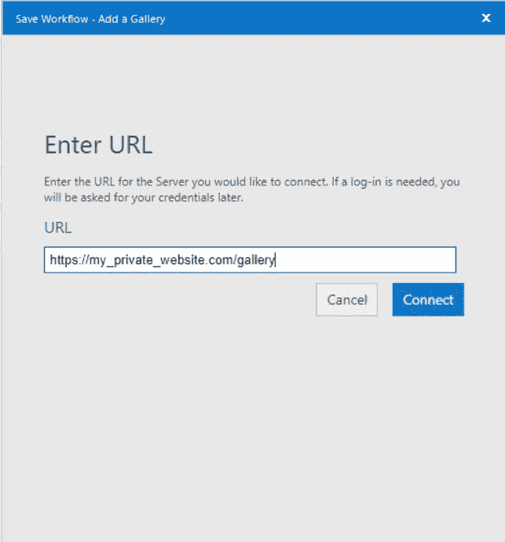
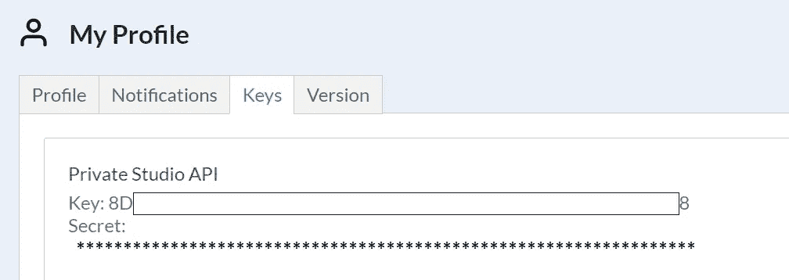
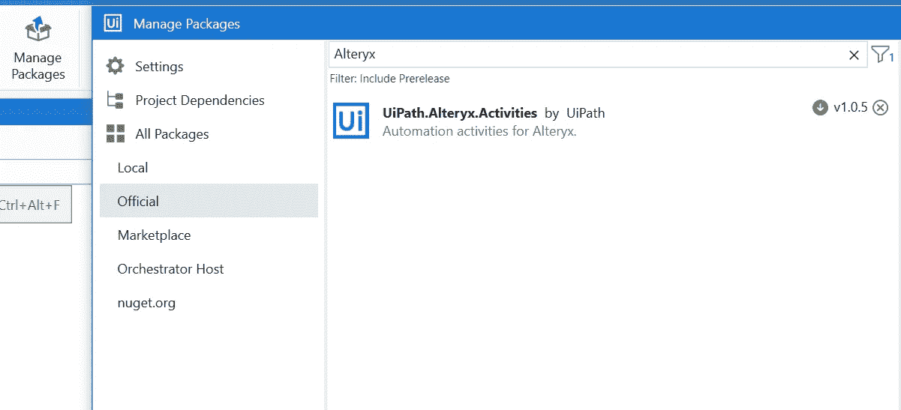
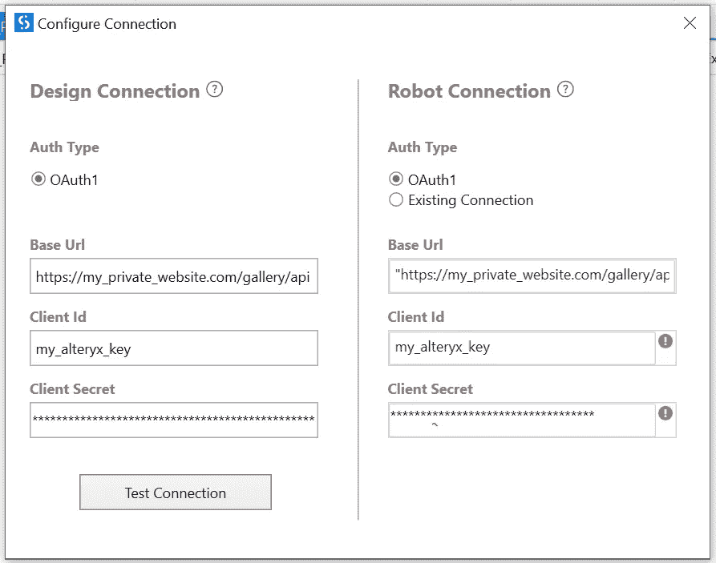
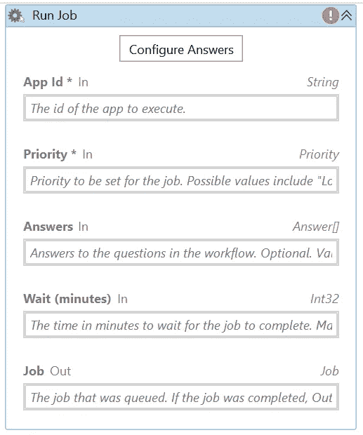

# 使用 UiPath 的 Alteryx

> 原文：<https://towardsdatascience.com/work-with-alteryx-from-uipath-82c92d4bbf42>

## 如何从 UiPath 对 Alteryx 工作流进行 API 调用

托拜厄斯·卡尔松在 [Unsplash](https://unsplash.com?utm_source=medium&utm_medium=referral) 上的照片

UiPath 的应用之一是机器人过程自动化( [RPA](https://www.uipath.com/rpa/robotic-process-automation) )。基本上，您可以构建机器人来自动执行由您的分析师执行的日常重复性任务，例如通过从不同来源获取数据并转换它们来每月发布一份报告，或者从不同的部分提取数据并检查它们，或者填写数据输入所需的数千种表格。这将使数据分析师能够专注于更高效的任务，并提高工作效率。

Alteryx 有各种应用程序，如数据提取、加载和转换，以及高级应用程序，如具有机器学习模型创建和预测的分析。相互补充，UiPath 和 Alteryx [宣布了一个合作关系](https://www.uipath.com/newsroom/alteryx-and-uipath-expand-partnership-broaden-analytics-automation-with-new-connector)，其中一个连接器在 UiPath 中宣布，另一个连接器在 Alteryx 中宣布，这样你可以使用 API 调用从 UiPath 运行 Alteryx 工作流，或者你可以从 Alteryx 调用 UiPath 工作流。

在本文中，我将解释如何从 UiPath 运行 Alteryx 工作流。

## 将 Alteryx 工作流保存到图库:

这种集成工作的一个要求是，您的 Alteryx 工作流必须保存到 Alteryx 服务器/私有图库中。这可能是您所在组织的图库，也可能是您托管 Alteryx 工作流的私人网站(针对个人)。为此，请单击文件→另存为→私人画廊

保存到私人画廊。图片作者。

输入您私人网站的 URL。图片作者。

第一次这样做时，系统会提示您输入网站的 URL，以便将 Alteryx 连接到您的图库。或者，您可以连接到 Alteryx 公共画廊。您可以在 [Alteryx 社区图库最佳实践](https://community.alteryx.com/t5/Alteryx-Community-Resources/Submitting-to-Gallery-Best-Practices/ta-p/878157)中找到更多相关信息。

在您的 Alteryx 图库中，当您点击您的工作流程时，您会注意到 URL 对于您的每个工作流程都有一个唯一的作业 ID。这个作业 ID 很重要，因为它是传递给 UiPath 的参数，以便从 UiPath 调用 Alteryx 工作流。它是下面显示的 URL 中“/”之后的最后一个键。

> https://my _ private _ website . com/gallery/app/my _ job _ name/622 a28 ebae5a 222114428966

你需要从你的 Alteryx 私人图库中得到的另一个信息是你的 API 密匙和秘密密匙(比如密码)。如果您不是管理员，请联系您组织的 Alteryx 管理员，确认您的帐户已启用“API”访问。请注意，即使您的私有配置文件显示启用了 API 访问，您的管理员也必须在他们的终端(在订阅→用户→ API 访问下)启用它，这样 UiPath + Alteryx 集成才能工作。

您将在 Alteryx 服务器配置文件中找到您的 API 密钥和秘密。作者图片

## 从 UiPath 连接到 Alteryx:

在 UiPath 内部，第一步是添加 Alteryx 包，该包已经由 UiPath 作为官方包发布。

在 UiPath 中安装 Alteryx 包。作者图片

将 Alteryx 应用程序范围添加到您的序列中，然后单击“配置”。

在 UiPath 中配置 Alteryx 作用域。作者图片

单击“测试”连接以确认您的连接成功。如果这里出现错误，请检查您的 API 密钥、秘密 ID 和基本 URL。注意，你的基础 URL [*必须*](https://docs.uipath.com/activities/docs/alteryx-scope) 以“ */gallery/api* ”结尾。请与 Alteryx 管理员确认您的 API 访问是从“订阅→用户→ API 访问”启用的。

确认连接后，下一步是输入您的作业 ID、优先级(0，1，2，其中 0 是默认值)和变量，如 Answers In、wait time 和 Job Out(声明一个变量来存储输出)。

在 UiPath 中配置您的作业。作者图片

就是这样！使用这种方法，当运行 UiPath 工作流时，您将能够在后台运行 Alteryx 工作流。UiPath 将自动连接到您的 Alteryx 服务器，进行所需的 API 调用来运行工作流。这样做的主要优点是，您的 UiPath 工作流现在可以从中央 orchestrator 运行，而无需在客户端计算机上安装 Alteryx，并且需要在后台运行的 UiPath 进程可以继续这样做，而无需为了运行 Alteryx 工作流而接管对键盘/鼠标的控制。