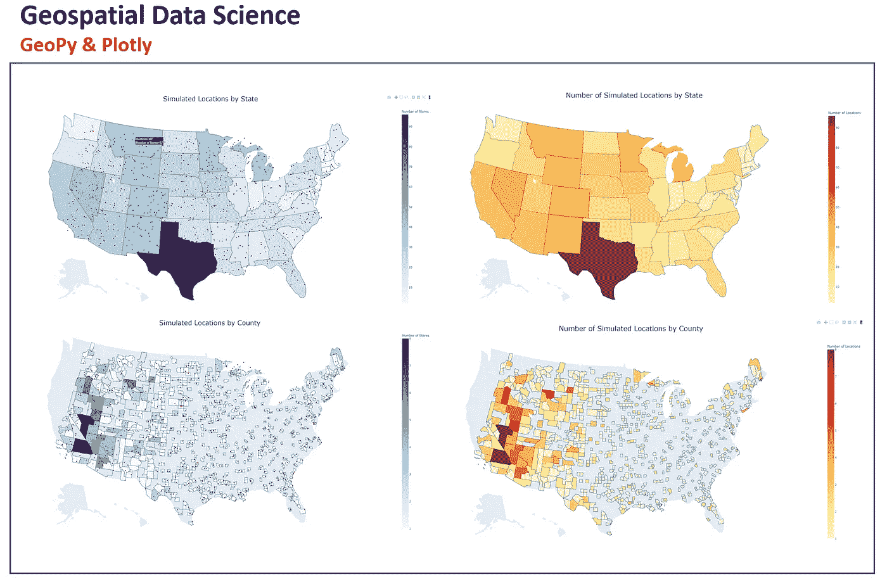
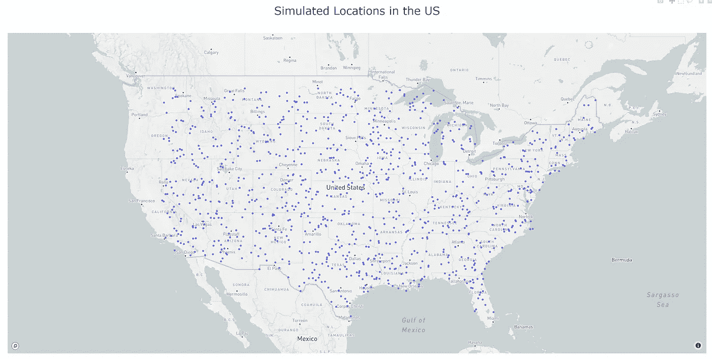
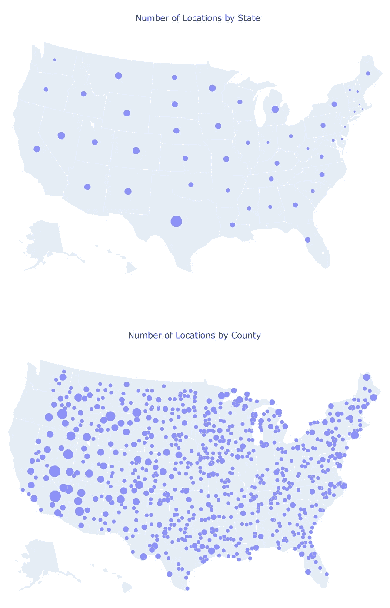
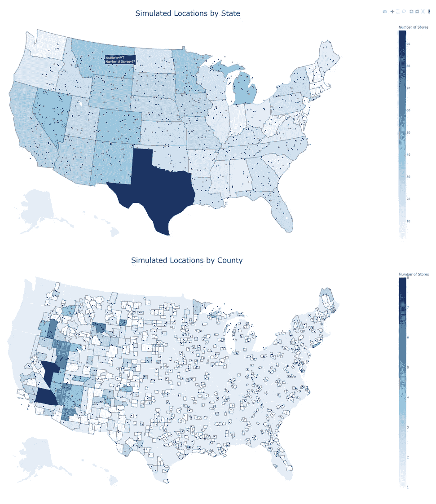
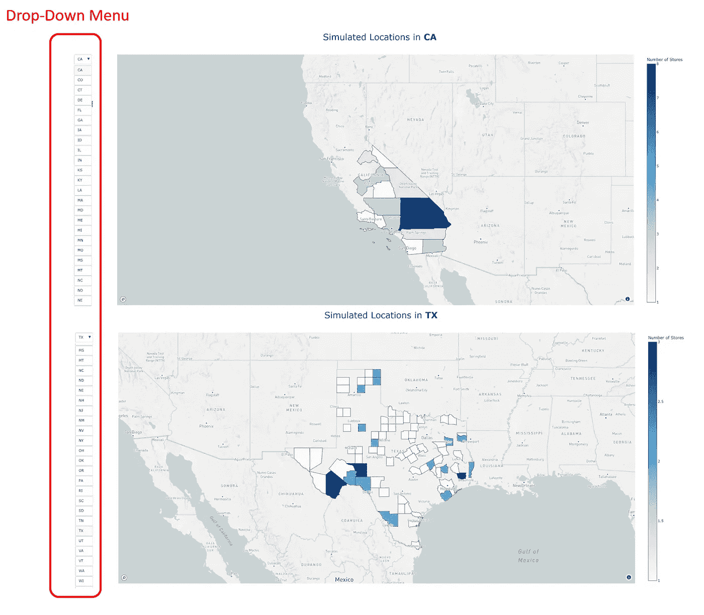
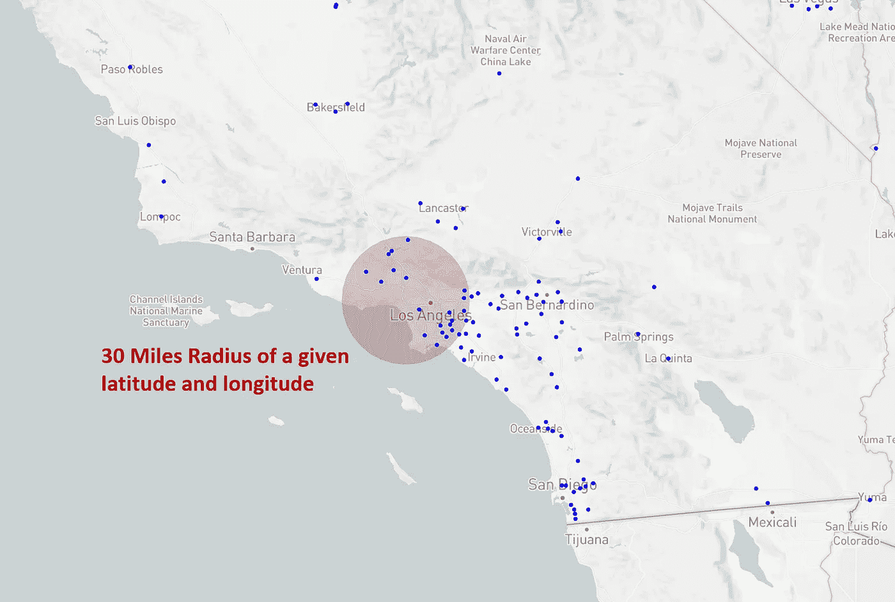
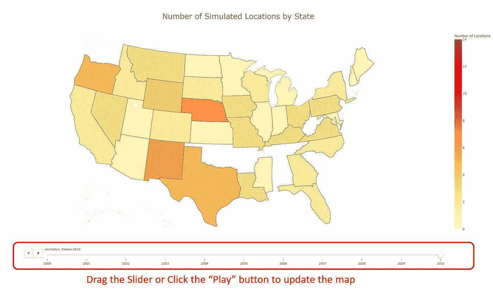

# 如何使用 Python GeoPy 和 Plotly 创建交互式地图

> 原文：<https://towardsdatascience.com/work-with-geospatial-data-and-create-interactive-maps-using-geopy-and-plotly-28178d2868f1>

## 地理编码，**反向地理编码，计算**表面距离，行驶距离，用 Python 创建散点图、气泡图、Choropleth 图和动画图



作者图片

地理空间数据科学正在蓬勃发展。典型的地理空间数据集包括纬度、经度、地址、街道名称、邮政编码等数据。这些数据需要一套不同的工具来处理，并将其转化为见解。在本文中，我将分享对处理地理空间数据和创建地理空间可视化有用的 **Python 库**:**GeoPy**和 **Plotly** 。

# 一.处理地理空间数据

GeoPy 是一个 Python 库，提供对几种流行的地理编码 web 服务的访问，如 Google Maps、Bing Maps、nomist 和 Yahoo BOSS。它是帮助我们处理地理空间数据的有用工具。

## 安装库

打开 anaconda 提示符或命令提示符，并键入以下命令。

```
pip install geopy
```

## 导入库

```
import geopy
```

## 初始化地理编码服务 API

正如我上面提到的，有许多地理编码 API 可用。可以使用免费 API，比如， **OpenStreetMap** 或者付费 API，比如， **Google Maps。这完全取决于你将如何部署你的程序。你会得到你所付出的。一个免费的 API 可能很适合你自己喜欢的项目。如果您将部署用于商业目的，您应该考虑付费 API，因为您可以扩展每日 API 配额限制。**

为了使用谷歌地图 API，我们需要一个谷歌地图 API。你可以按照这个[快速教程](https://yoast.com/help/generate-set-google-maps-api-key/)为**免费**生成自己的谷歌地图 API 密匙。

```
# **OpenStreetMap API**
from geopy.geocoders import Nominatim
geolocator = Nominatim(user_agent="[Y](mailto:aaron_clover@hotmail.com)our Email")# **Google Maps API**
from geopy.geocoders import GoogleV3
geolocator = GoogleV3(api_key='Your Google Maps API Key')
```

## 从原始地址中提取纬度和经度

为了创建地图，我们需要获得每个位置的纬度和经度。通常，数据集会包含地址信息，如街道号、街道名称、城市、州、邮政编码。要获得纬度和经度，我们可以使用 GeoPy 的“ **geocode** ”函数。

```
address = '5801 SW Regional Airport Blvd Bentonville AR'
location = geolocator.geocode(address)
print(location.latitude, location.longitude)
# 36.3236395 -94.255661
```

[“地理编码”功能的另一个用途是**将杂乱的地址数据转换成干净、标准化的格式**。](/transform-messy-address-into-clean-data-effortlessly-using-geopy-and-python-d3f726461225)

## 从纬度和经度提取原始地址信息

有时，数据集可能只有纬度和经度，而没有任何地址信息，例如对人类有意义的城市、州、邮政编码。**逆向地理编码**是将位置坐标转换为带有位置信息的地址的重要步骤。要实现这一点，我们可以简单地使用“**反向**函数来获取位置的地址信息

```
location = geolocator.reverse('36.350885, -94.239816')
print(location.address)
# 2658, Southwest 20th Street, Bentonville, Benton County, Arkansas, 72713, United States
```

除了我们上面提到的公共和商业地理编码服务 API，还有**政府地理编码 API**，它们对公众开放。例如，我们可以从 [**FCC 的 Area 和 Census Block API**](https://geo.fcc.gov/api/census/)**中提取县信息，使用经纬度。**

**在下面的代码中，我们创建了一个**函数**，“extract_location_data”，使用纬度和经度从 FCC API 返回位置信息。**

```
import requests
import urllib
def **extract_location_data**(lat, lon):
    params = urllib.parse.urlencode({'latitude': lat, 'longitude':lon, 'format':'json'})
    url = '[**https://geo.fcc.gov/api/census**/block/find?'](https://geo.fcc.gov/api/census/block/find?') + params
    response = requests.get(url)
    data = response.json()
    return dataresult = extract_location_data(36.350885, -94.239816)
print(result['County'])
print(result['State'])
# {'FIPS': '05007', 'name': 'Benton County'}
# {'FIPS': '05', 'code': 'AR', 'name': 'Arkansas'}
```

## **测量两地之间的表面距离**

**两个地方之间的距离可能是许多机器学习模型中的一个基本特征。但是数据集中通常缺少这些信息。为了计算距离，我们不必自己应用数学公式。GeoPy 库中提供了**测地线**函数来计算两个地方之间的表面距离。**

**在下面的代码中，“**测地线((lat_1，lon_1)，(lat_2，lon_2))** ”将返回两个坐标之间的表面距离。您可以用公里、英里或英尺来返回距离。**

```
from **geopy.distance** import **geodesic**
point1 = (36.236984, -93.09345)
point2 = (36.179905, -94.50208)
distance = **geodesic**(point1, point2)
print(**distance.miles**, ' miles')
print(d**istance.meters**, ' meters')
# 78.80808645816887  miles
# 126829.32109293535  meters
```

## **测量两地之间的行驶距离**

**表面距离仅仅是一个理论概念，它适用于两个地方之间的直线距离。我们可能需要汽车、自行车或步行的驾驶距离，这在机器学习模型中更有意义。使用 API 很容易获得行驶距离。**

****方法一**:使用 [**自由 OSRM API**](http://project-osrm.org/docs/v5.5.1/api/#general-options) 计算行驶距离**

**OSRM 是一个免费的开源 API。用 Python 中的“**请求**”函数提取信息很容易。在下面的代码中，它向 API 发送两个坐标，它将返回行驶距离和行驶时间。**

```
import requests
import json
lat_1, lon_1  = 36.236984, -93.09345
lat_2, lon_2  = 36.179905, -94.50208r = requests.get(f"[**http://router.project-osrm.org/route/v1/driving/{lon_1},{lat_1};{lon_2},{lat_2}?overview=false**](http://router.project-osrm.org/route/v1/driving/{lon_1},{lat_1};{lon_2},{lat_2}?overview=false)""")
routes = json.loads(r.content)
route_1 = routes.get("routes")[0]
print(route_1["duration"], ' seconds') 
print(route_1["distance"], ' meters') 
# 8048.5  seconds
# 150883.3  meters
```

****方法二**:使用 [**谷歌距离矩阵 API**](https://developers.google.com/maps/documentation/distance-matrix/overview) 计算行驶距离**

**我们也可以使用 **googlemaps** 库和 **Google 的距离矩阵 API** 来获取类似的信息。从下面的代码中可以看出，从谷歌的距离矩阵 API 得到的结果与从 OSRM API 得到的结果相当。**

```
import **googlemaps**gmap = **googlemaps.Client**(key='Your Google Maps API Key')
gmap_output = gmap.distance_matrix((36.236984, -93.09345), (36.179905, -94.50208), mode='driving')
print(gmap_output['rows'][0]['elements'][0]['duration']['value'], 'seconds')
print(gmap_output['rows'][0]['elements'][0]['distance']['value'], 'meters')
# 6913 seconds
# 150700 meters
```

# **二。基本地图**

**在本节中，我将讨论如何使用 **Plotly** 库来创建具有交互功能的漂亮地图。这些图表很容易制作，并且是独立的，可以随时展示。**

**Plotly 还制作了 [**Dash** ，这是一个用于创建可视化、构建 web 应用程序和部署机器学习模型的 Python 框架。](/deploy-machine-learning-model-using-dash-and-pipenv-c543569c33a6)**

## **安装库**

**打开 anaconda 提示符或命令提示符，并键入以下命令。**

```
pip install plotly
```

## **导入库**

**除了 Plotly 基本函数，我们还将 Plotly 使用 [**。Express**](https://plotly.com/python/plotly-express/) ，它是 Plotly 的一个包装器，可以用简单的语法创建复杂而丰富的交互图形。**

```
import plotly
import plotly.express as px
```

## **注册地图框令牌**

**如果你要创建一个基于 MapBox 服务的地图，那么你需要[注册一个免费的 MapBox 账户](https://www.mapbox.com/)并获得一个 MapxBox 令牌。这里 可以获得一个免费的地图框令牌 [**。典型的令牌看起来像“PK . eyj 1 ijoyiwayb 24 ty 2 xvdmvyxxxxsi 6 imnrcgvybwd 3 atcwaxuyd 242am v9 nzfvaziifq . 8 snsj 0 JCI 1 vknued 2 finib”。**](https://docs.mapbox.com/api/accounts/tokens/)**

**如果使用 Plotly.Express，您可以在`layout.mapbox.access_token`或`px.set_mapbox_access_token()`配置功能中注册令牌。**

```
from urllib.request import urlopen
**px.set_mapbox_access_token**(open('mapbox.mapbox_token').read())
**mapbox_access_token** = open('mapbox.mapbox_token').read()
```

## **创建模拟位置数据**

**对于本文，我将创建一个模拟的地理空间数据集，其中包括美国 1000 个随机生成的地点。**

```
lon = []
lat = []
county = []
state = []
observation = 1while observation <= 1000:
        lon_0 = np.random.uniform(-120,-65)
        lat_0 = np.random.uniform(26,48)
        data = **extract_location_data**(lat_0, lon_0)
        print(data)
        if data['status'] == 'OK':
            if data['County']['FIPS'] != None:
                lon.append(lon_0)
                lat.append(lat_0)
                county.append(data['County']['FIPS'])
                state.append(data['State']['code'])
                observation +=1
            else:
                pass
        else:
            pass 

years = [randint(2000, 2010) for i in range(1000)]

df = pd.DataFrame({'long': lon, 'lat': lat, 'state': state, 'county_fips': county, 'year': years})
```

## **在地图中创建位置散点图**

**首先，让我们创建一个最简单的地图，一个散点图，它在地图上显示位置。我们将使用 Plotly.Express 中的" **scatter_mapbox** 。在程序中，我们需要指定位置的**纬度**和**经度**。**

**要导出地图图形，我们可以使用“ **write_html** 函数将绘图保存在本地文件夹中。**

```
fig = px.**scatter_mapbox**(
    df, 
    lat="lat", 
    lon="long", 
    zoom=4,
    title = 'Simulated Locations in the US'
    )fig.write_html('Locations Map.html')
```

****

**作者图片**

## **创建 Choropleth 地图**

**接下来，我们将创建 choropleth 地图，这是一种统计专题地图，使用颜色的强度来表示地理位置内地理特征的汇总。在下面的代码中，我们将创建两个 choropleth 地图——第一个显示美国每个州的沃尔玛商店**的数量，第二个显示每个县**的沃尔玛商店**的数量。****

**在创建地图之前，我们需要汇总数据来计算每个州或县的沃尔玛商店数量。为此，我们在 Pandas 中使用“groupby”和“count”函数。然后可以使用“ **choropleth** 功能创建 Choropleth 图。**

*   **" **location** "参数将采用地理单位(例如，州或县 FIPS 代码)。**
*   **" **color** "参数将采用与地理单元内的颜色强度相对应的数值(例如，沃尔玛商店的数量)。沃尔玛商店的数量越多，颜色越深。**
*   **" **locationmode** "参数表示地图上的一组位置。它可以采用“ISO-3”、“美国-州”或“国家名称”中的一个。“ISO-3”是一个由三个字母组成的国家代码，而“美国-州”将返回带有州边界的美国地图。**县边界**在“locationmode”参数中不可用。相反，我们需要在“ **geojson** ”参数中包含一个县 **GeoJSON** 文件。此 GeoJSON 文件位于'[https://raw . githubusercontent . com/plot ly/datasets/master/geo JSON-counties-FIPS . JSON '](https://raw.githubusercontent.com/plotly/datasets/master/geojson-counties-fips.json')。**
*   **"**范围**参数表示地图中的范围。它可以取“世界”、“美国”、“欧洲”、“亚洲”、“非洲”、“北美”或“南美”中的一个**
*   **" **color_continuous_scale** "参数指定当由" color "表示的列包含数值时的连续色标**

```
# by state
store_by_st = df.groupby('state')['long'].count().reset_index()
store_by_st.rename(columns = {'long':'Number of Locations'}, inplace = True)fig = px.**choropleth**(
    locations=store_by_st['state'], 
    color = store_by_st['Number of Locations'].astype(float), 
    **locationmode**="**USA-states**", 
    **scope**="usa", 
    **color_continuous_scale** = 'ylorrd', 
    labels={'color':'Number of Locations'},
    title = 'Number of Simulated Locations by State'
    )
fig.write_html('Choropleth Map by state.html')##################
# by county 
with urlopen('[**https://raw.githubusercontent.com/plotly/datasets/master/geojson-counties-fips.json**'](https://raw.githubusercontent.com/plotly/datasets/master/geojson-counties-fips.json')) as response:
    **counties** = json.load(response)store_by_county = df.groupby('county_fips')['long'].count().reset_index()
store_by_county.rename(columns = {'long':'Number of Locations'}, inplace = True)fig = px.choropleth(
    locations=store_by_county['county_fips'], 
    color = store_by_county['Number of Locations'].astype(float), 
    **geojson=counties, 
    scope="usa"**, 
    color_continuous_scale = 'ylorrd', 
    labels={'color':'Number of Locations'},
    title = 'Number of Simulated Locations by County'
    )
fig.write_html('Choropleth Map by county.html')
```

****

**作者图片**

## **基于列创建气泡图**

**接下来，我们将使用“ **scatter_geo** ”函数创建气泡图。该功能类似于 **choropleth** 功能。我们需要用数字列指定“**大小**参数，而不是“**颜色**参数”。**

```
# by state
fig = px.**scatter_geo**(
    store_by_st, 
    locations="state", 
    hover_name="state", 
    size="Number of Locations",
    size_max = 30,
    locationmode="USA-states", 
    scope="usa", 
    title = 'Number of Locations by State'
    )
fig.write_html('Bubble Map by state.html')##################
# by county 
fig = px.**scatter_geo**(
    store_by_county, 
    locations="county_fips", 
    hover_name="county_fips", 
    size="Number of Locations",
    size_max = 30,
    geojson=counties,
    scope="usa", 
    title = 'Number of Locations by County'
    )
fig.write_html('Bubble Map by county.html')
```

****

**作者图片**

## **创建一个有多个图层的地图**

**我们可以在 Plotly 中创建多层地图。例如，在一张地图中，我们希望同时包含散点图和 choropleth 图。为此，我们需要同时使用“ **plotly.graph_objects** 和“ **plot.express** ”。**

**我们将使用“px.choropleth”创建地图的第一层，然后使用“ **add_trace** ”函数和“ **go”添加第二层。散射地理**”。“去吧。Scattergeo”相当于“px.scatter_mapbox”。最后，我们可以使用“ [**update_layout**](https://plotly.com/python-api-reference/generated/plotly.graph_objects.Layout.html) ”功能修改整个地图的布局，如标题、字体、字号、图例等。**

```
import **plotly.graph_objects** as go# by state
fig = px.choropleth(
    locations=store_by_st['state'], 
    color = store_by_st['Number of Locations'].astype(float), 
    locationmode="USA-states", 
    scope="usa", 
    color_continuous_scale = 'Blues', 
    labels={'color':'Number of Stores'},
    )                  
fig.add_trace(
   go.Scattergeo(
        lon =df['long'],
        lat =df['lat'],
        mode="markers",
        marker_color = 'maroon',
        marker_size = 4
    )
)
fig.update_layout(
    title_text ='Simulated Locations by State', 
    title_x =0.5,
    title_font_size=30)

fig.write_html('Choropleth_with_locations by state.html')##################
# by county 
fig = px.choropleth(
    locations=store_by_county['county_fips'], 
    color = store_by_county['Number of Locations'].astype(float), 
    geojson=counties,
    scope="usa", 
    color_continuous_scale = 'Blues', 
    labels={'color':'Number of Stores'},
    )fig.add_trace(
   go.Scattergeo(
        lon =df['long'],
        lat =df['lat'],
        mode="markers",
        marker_color = 'maroon',
        marker_size = 4
    )
)
fig.update_layout(
    title_text ='Simulated Locations by County', 
    title_x =0.5,
    title_font_size=30)

fig.write_html('Choropleth_with_locations by county.html')
```

****

**作者图片**

# **三。高级地图图形**

**在本节中，我们将讨论在 Plotly 中创建高级地图图形。通过组合不同的功能，我们可以创建丰富的交互式地图。**

## **使用下拉菜单将多个地图合并到一个页面中**

**有时，我们会创建多个地图，但希望在一个页面中包含所有地图。创建一个**下拉菜单**是一个包含所有信息同时保持格式整洁有序的完美解决方案。**

**在下面的示例中，我们希望创建一个县级的 choropleth 地图，并设计一个下拉菜单来选择一个指定的州以显示 choropleth 地图。**

**在程序中，我们需要两个组件，即“**轨迹**和“**按钮**”。“痕迹”是一个包括所有地图图层的列表。每一层都包括特定州的 choropleth 地图。“按钮”是下拉菜单中包含元素的列表。为了使下拉菜单工作，我们需要在我们创建的“按钮”列表的“布局”中指定“**update menus”**参数。当用户在下拉菜单中选择一个值时，可以通过“更新菜单**”**参数自动更新“**可见**”和“**标题**”参数。**

**不要忘记在布局参数中包含我们上面提到的“**access token = map box _ access _ token**”。**

```
import numpy as np
store_by_county2 = df.groupby(['state', 'county_fips'])['long'].count().reset_index()
store_by_county2.rename(columns = {'long':'Number of Locations'}, inplace = True)# create drop-down menu
menu = store_by_county2['state'].unique().tolist()
visible = np.array(menu)**traces** = []
**buttons** = []
for value in menu:
    subset = store_by_county2[store_by_county2['state']==value]      
    traces.append(
        go.**Choroplethmapbox**(
            locations=subset['county_fips'], 
            z = subset['Number of Locations'].astype(float), 
            **geojson = counties**, 
            colorscale = 'Blues',
            colorbar_title = "Number of Stores",
            **visible**= True if value==menu[0] else False
            ))
    buttons.append(
        dict(label=value,
            method="**update**",
            args=[{"**visible**":list(visible==value)},
                  {"**title**":f'Simulated Locations in <b>{value}</b>'}]))# create figure
fig = go.Figure(
    data=**traces**,
    layout=dict(
        **updatemenus**=[{"active":0, "buttons":**buttons**,}]
        ))first_title = menu[0]
fig.update_layout(
    title= f'Simulated Locations in <b>{first_title}</b>',
    autosize=True,
    hovermode='closest',
    showlegend=False,
    mapbox=dict(
    **accesstoken=mapbox_access_token**,
        bearing=0,
        center=dict(
            lat=38,
            lon=-94
            ),
        pitch=0,
        zoom=4,
        style='light'
        ))fig.write_html('Maps with drop-down.html')
```

****

**作者图片**

**或者，我们可以使用**破折号**来创建一个使用 [**回调函数**](https://dash.plotly.com/basic-callbacks) 的下拉菜单。**

## **以给定的半径围绕点画一个圆**

**我们可以使用“分散地理”功能在地图上创建气泡，但是，当我们放大或缩小地图时，气泡的大小将保持不变。要在地图上画一个给定半径的圆，我们需要一个不同的解决方案。**

**在下面的例子中，我们希望包括加州大学洛杉矶分校 30 英里半径范围内的沃尔玛商店。**

**为了在地图中包含这个 30 英里的缓冲区，我们需要从头开始创建它。首先，我们需要中心点的纬度和经度，例如，加州大学洛杉矶分校。然后我们创建一个名为" **geodesic_point_buffer** 的函数，使用" **pyproj** "和" **shapely** "库返回这个 30 英里缓冲区边界的纬度和经度列表。当缓冲区的边界上有足够多的点时，我们可以通过用直线连接这些点来创建一个看起来非常接近圆形的几何对象。**

**最后，我们只需要将刚刚在“地图框”参数中创建的 30 英里缓冲区包含在“图层=图层”中。为了使地图看起来更好，我们希望在打开地图时基于中心点将地图居中。为此，我们可以设置“ **center=dict( lat=lat，lon=lon)** ”，其中 lat 和 lon 是中心点的经度纬度。**

```
from functools import partial
import pyproj
from shapely.ops import transform
from shapely.geometry import Point# define a function to create buffer around a point
proj_wgs84 = pyproj.Proj('+proj=longlat +datum=WGS84')
def **geodesic_point_buffer**(lat, lon, miles):
    # Azimuthal equidistant projection
    aeqd_proj = '+proj=aeqd +lat_0={lat} +lon_0={lon} +x_0=0 +y_0=0'
    project = partial(
        pyproj.transform,
        pyproj.Proj(aeqd_proj.format(lat=lat, lon=lon)), 
        proj_wgs84)
    buf = Point(0, 0).buffer(miles * 1000/0.621371)  # distance in miles
    return transform(project, buf).exterior.coords[:]# Example
target = geolocator.geocode('University of California, Los Angeles')
**lat, lon = target.latitude, target.longitude**# create buffer layer 
**features** = [{ "type": "Feature", "geometry": {"type": "LineString","coordinates": geodesic_point_buffer(lat, lon, 30)}}]
**layers** = [dict(
        sourcetype = 'geojson',
        source={"type": "FeatureCollection", 'features': **features**},           
        color= 'maroon',
        type = 'fill',   
        opacity=0.2,
        line=dict(width=1.5),
        below = "state-label-sm"
        )]# Create the map 
fig = go.Figure()fig.add_trace(go.Scattermapbox(
        lat=df['lat'],
        lon=df['long'],
        mode='markers',
        marker=go.scattermapbox.Marker(
            size=5,
            color='blue'
        )
    ))fig.update_layout(
    title='Simulated Locations <br>Within 30 Miles of UCLA',
    autosize=True,
    hovermode='closest',
    showlegend=False,
    mapbox=dict(
        accesstoken=mapbox_access_token,
        **layers=layers**,
        bearing=0,
        center=dict(
            lat=lat,
            lon=lon
        ),
        pitch=0,
        zoom=6.5,
        style='light'
    ),
)fig.write_html('Locations Map with 30 Miles Radius.html')
```

****

**作者图片**

**通过修改程序中的**特征**和**图层**列表变量，我们可以**围绕多个点**创建圆或**不同颜色的圆**。**

## **创建动画地图**

**接下来，我们将创建一个动画地图。例如，我们想创建一个会随时间变化的**动态** choropleth 图。**

**几个 Plotly Express 函数，如散点图、条形图、choropleth，通过 **animation_frame** 和 **animation_group** 参数支持动画人物的创建。**

**在下面的示例中，我们将创建一个动态 choropleth 地图，该地图按州显示一年中模拟位置的数量**

**首先，我们将聚合数据框，使用 pandas 中的“groupby”和“count”函数按州计算年度位置计数。然后“px.choropleth”被用于动画地图，带有附加参数，“animation _ frame = df[“year”]”和“animation _ group = df[“state”]”。**

*   ****animation_frame** :该参数指定了一个用于创建动画帧的列。在这个例子中，我们将每年创建一个帧**
*   ****animation_group** :该参数指定列中的相同值将被视为每帧中的相同对象。在这个例子中，我们将把每个帧中具有相同状态的行视为相同的对象。**
*   ****range_color** :该参数指定了 choropleth 贴图中的颜色范围。以保持所有框架的配色方案一致。我们需要用最大数值指定 range_color 参数。**

```
df =df.sort_values(['state', 'year'])
df = df.groupby(['state', 'year'])['long'].count().reset_index()
df = df.rename(columns = {'long': 'count'})
df = df.sort_values(['year'])
color_max = df['count'].max()fig = px.choropleth(
    locations=df['state'], 
    color = df['count'].astype(float), 
    locationmode="USA-states", 
    scope="usa", 
    color_continuous_scale = 'ylorrd', 
    labels={'color':'Number of Locations'},
    title = 'Number of Simulated Locations by State',
    **animation_frame**=df["year"],
    **animation_group**=df["state"],
    range_color = [0, color_max]
    )
fig.update_layout(
    title_x =0.5,
    title_font_size=30)fig.write_html('choropleth with sliders by state.html')
```

****

**作者图片**

# **感谢您的阅读！！！**

**如果你喜欢这篇文章，并且想**请我喝杯咖啡，请[点击这里](https://ko-fi.com/aaronzhu)。****

**您可以注册一个 [**会员**](https://aaron-zhu.medium.com/membership) 来解锁我的文章的全部访问权限，并且可以无限制地访问介质上的所有内容。如果你想在我发表新文章时收到电子邮件通知，请 [**订阅**](https://aaron-zhu.medium.com/subscribe) 。**