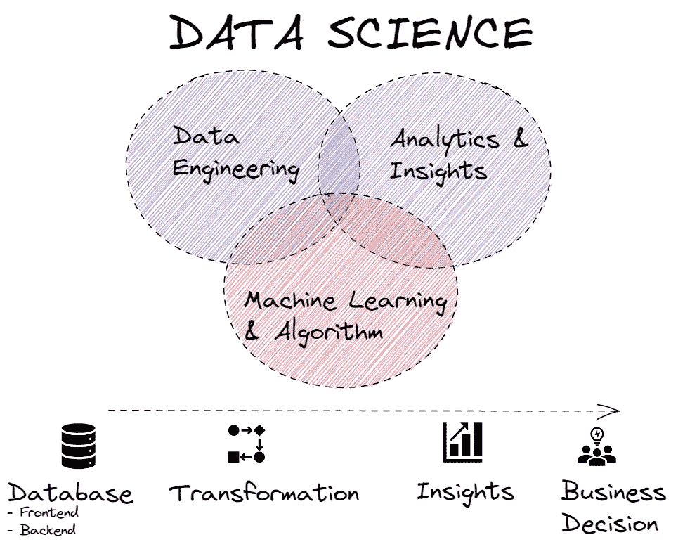
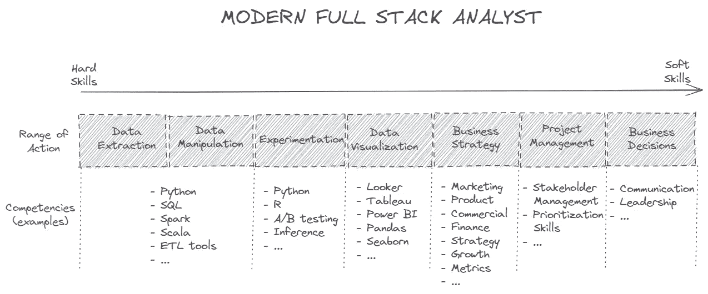

# 在分析领域工作去神秘化

> 原文：<https://towardsdatascience.com/working-in-analytics-demystified-a78e8bd60f32>

# 在分析领域工作去神秘化

这篇文章旨在阐明现代“全栈分析师”的定义，深入探讨这个角色的实际范围和成功的要求

数据科学组件，图片由作者提供

数据科学家是本世纪最性感的工作。大约 10 年前，这是一篇著名的 HBR 文章的标题，它打开了数据科学这门尚处于萌芽阶段的学科的大门。在接下来的几年里，许多雇主和企业(从中小企业和初创企业到老牌大公司)都在寻找最优秀的人才来释放大数据海洋中的潜力和隐藏的宝藏。一个引人注目的口号——“*数据是新的石油*”——是为了在一个越来越数字化的世界中捕捉数据的巨大相关性和重要性而创建的，收集了前所未有的数据量。

在过去十年中，数据科学一直被视为一个巨大的黑匣子。由于这一学科还是相当新的，对于构成数据科学的不同元素的结构还没有一致的共同理解。这引发了很多关于“数据科学家”应该拥有和执行什么能力和任务的困惑。公司的求职公告板上满是数据科学家和分析师的角色，但他们缺乏共同的特质。机器学习、算法、分析和数据工程专业经常互换使用，因此不同公司(甚至同一家公司)的数据科学家会做完全不同的事情。

现在，我们终于到达了数据科学的分类和定义广为人知和共享的地步。
数据科学可以分为三个不同的宏观领域，每个领域都有特定的技能和目标:分析&洞察力、机器学习&算法和数据工程。在这篇文章中，我将分享“**全栈分析师**”(FSA)在“分析&洞察”领域的一系列行动和主要活动，强调要在这一具有挑战性的角色中脱颖而出需要掌握的主要能力。

注意:就每一个理论框架而言，现实总是更加微妙，可能存在细微的差异。如上图所示，由个人兴趣或业务需求驱动的分析角色经常会与机器学习和数据工程有很大的重叠，所以要随时准备好学习和适应！

全栈分析框架，图片由作者提供

现代金融服务管理局需要软硬技能的独特结合。FSA 跟踪整个数据“价值链”,从数据提取到最终的业务决策，因此多才多艺和兼收并蓄是成功完成这一角色所需要的最重要的品质。在本文的剩余部分，我将更深入地探讨 FSA 涵盖的每一项活动。

***数据提取&数据操作***—FSA 的主要目标之一是将大量无组织、混乱、杂乱的原始数据转化为可操作的业务洞察。因此，FSA 必须能够提取和操作数据以满足业务需求。在实践中，这转化为能够清理和理解底层数据，查询数据库，并为利基商业案例创建模型和特别管道/来源。
直到最近，实现数据提取和数据操作普遍需要的唯一语言是 SQL。虽然它仍然是每个 FSA 闭着眼睛都必须知道的不可或缺的重要工具，但现代 FSA 被要求使用其他语言，如 evergreen Python 和 R，或更近的明星，如 Scala 和 Spark。

***实验*** —在科技公司，实验和 A/B 测试对于实现增长和战略目标至关重要。机械地运行测试结果的工具现在很常见，实验通常可以由业务团队自主运行。需要 FSA 的支持和意见，尤其是关于实验设置及其解释。FSA 拥有关于基础数据、统计数据和商业敏锐度的独特知识组合，因此他们可以帮助团队进行实验，确保测试设置正确，并且结果不会有偏差或被误解。

***数据可视化***—FSA 与业务方沟通的首选方式之一是通过数据可视化。随着可用工具和所用技术的进步，如今数据可视化本身可以被视为一个独立的学科(我在本文中探讨了这个主题:[https://medium . com/me/stats/post/78993900 ECA 9)。](https://medium.com/me/stats/post/78993900eca9).)数据可视化的强大功能来自其多种用途:它可以用于报告记分卡上的指标和 KPI，或者用于业务团队使用的自助服务工具，或者用于数据演示和讲述故事。
FSA 通常被视为组织内的 SME，因为它们能够直接与*数据提取&数据操作*活动产生的数据联系。
通常，FSA 应该精通一个或多个 BI 工具(Looker、Tableau、Power BI 等)或数据可视化库(例如 seaborn)。

***商业战略***——FSA 与机器学习数据科学家和数据工程师的主要区别在于 FSA 与整体产品战略的接近程度。金融服务助理必须具备商业头脑，他们需要在相关的业务和行业中拥有深厚的专业知识。FSA 是产品经理(或分配给他们的职能的所有者，例如营销经理、商务经理)的得力助手。等等)，它们对策略的计划、测试和跟踪有直接的影响。FSA 应该是指标和 KPI 树的所有者，他们应该建立它们的定义、可行性评估、计算和报告套件。

***项目管理****——FSA 很可能不仅仅分配给特定的团队。通常，FSA 服务于多个产品团队、多个营销渠道等。因此，许多不同的团队向 FSA 请求支持并不罕见。
能够对众多请求进行优先排序并拥有相关的项目管理技能对于确保 FSA 致力于对业务具有最高影响价值的活动至关重要。
因此，利益相关者管理技能至关重要。FSA 在一个组织内与大量不同的人一起工作，从初级到高级管理人员，与技术和非技术受众打交道。*

****业务决策*** —最终，FSA 的工作由所采取的数据驱动型业务决策来衡量。通过不断的咨询和与业务团队的有影响力的联系，FSA 可以直接或间接地做出这些决定。沟通可能是金融服务专员最重要的技能。无论你的模型有多复杂，你的洞察力有多强，如果你不能恰当地传达信息，你的工作就会被认为是草率和不充分的，从而影响你作为一个能够通过数据驱动的洞察力来推动价值的领导者的可信度和资格。*

# ***结论***

*一个反复出现的问题是“什么真正让分析师变得伟大？”我要说的是，尽管技术技能无可争议地必不可少，而且需求也越来越大，但金融服务人员只有具备出色的业务和行业知识，并且能够通过清晰、简洁且易于理解的沟通来传达自己的见解，才能真正改变一个组织。
由于 FSA 与系统和业务密切相关的独特地位，我预计越来越多寻求通过数据价值链获得真正竞争优势的公司将高度重视这一角色。*

*[1]:[https://HBR . org/2012/10/data-科学家-21 世纪最性感的工作](https://hbr.org/2012/10/data-scientist-the-sexiest-job-of-the-21st-century)*