# 在 Python 中使用井轨迹

> 原文：<https://towardsdatascience.com/working-with-well-trajectories-in-python-b8eb39773f64>

## 使用 wellpathpy 将原始油井测量数据转换为完整的位置数据


詹姆斯·惠勒摄:[https://www . pexels . com/photo/photo-of-pathway-around-by-fir-trees-1578750/](https://www.pexels.com/photo/photo-of-pathway-surrounded-by-fir-trees-1578750/)

处理地下数据时，深度是一个重要的测量指标。它用于将多组数据绑定到单个引用。有许多用于识别地下位置的深度参考。这些包括测量深度(MD)、真实垂直深度(TVD)和真实水下垂直深度(TVDSS)。

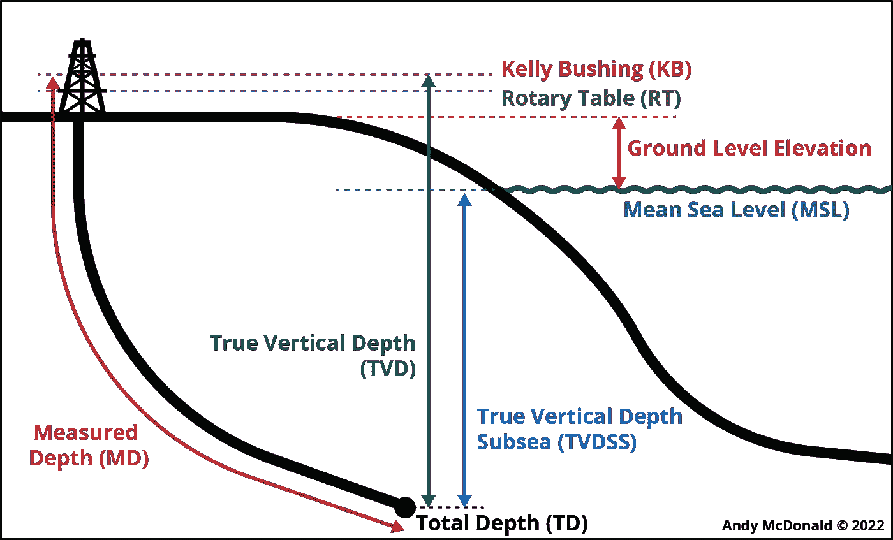

钻井和测井中关键参考和深度名称的图解。图片由作者提供。

上图展示了本文中提到的关键深度参考。

*   测量深度(MD)是沿井眼长度测量的井眼长度。
*   真实垂直深度(TVD)，是基准面(如转盘)和井筒中一点之间的绝对垂直距离。
*   海底真实垂直深度(TVDSS)，是平均海平面和井筒中某点之间的绝对垂直距离。

当井是垂直的时，MD 等于从同一基准面测量的 TVD。在井斜的情况下，TVD 值变得小于 MD 值。

当钻井时，通常进行勘测测量，以确保井沿着预定方向前进。这将生成一个具有稀疏测量值的数据集，其中包含井眼倾角(井眼偏离垂直方向的程度)、相对于北方的方位角以及当前测量的深度。

为了将其转换为定期采样的数据，类似于测井测量中使用的采样率，我们需要应用三角计算

在本教程中，我们将看到如何使用名为 [wellpathpy](https://github.com/Zabamund/wellpathpy) 的 Python 库来生成完整的位置日志。

## 视频教程

如果你想看这个教程的实际操作，我的 [YouTube 频道](https://www.youtube.com/c/AndyMcDonald42)上有这个教程的视频版本。

# 好可怜

[wellpathpy](https://github.com/Zabamund/wellpathpy) 是一个 Python 库，开发该库是为了从各种行业标准方法中获取油井测量数据并计算位置日志。这允许我们生成 TVD、TVDSS、北距和东距。

你可以在下面链接的 GitHub repo 中找到更多关于这个库的信息。

[](https://github.com/Zabamund/wellpathpy)  

如果您还没有安装这个库，您可以使用 pip 安装它，如下所示:

```
pip install wellpathpy
```

# 本教程中使用的数据

本教程中使用的数据是 Equinor 在 2018 年发布的 Volve 数据集的子集。数据集的全部细节，包括许可证，可以在下面的链接中找到。

[](https://www.equinor.com/energy/volve-data-sharing)  

Volve 数据许可证基于 CC BY 4.0 许可证。许可协议的全部细节可以在这里找到:

[https://cdn . sanity . io/files/h 61 q 9 gi 9/global/de 6532 f 6134 b 9 a 953 f 6 c 41 BAC 47 a 0 c 055 a 3712d 3 . pdf？equinor-hrs-许可条款和条件-数据-volve.pdf](https://cdn.sanity.io/files/h61q9gi9/global/de6532f6134b9a953f6c41bac47a0c055a3712d3.pdf?equinor-hrs-terms-and-conditions-for-licence-to-data-volve.pdf)

# 导入库和数据

我们教程的第一步是导入我们将要使用的库。

在这种情况下，我们将主要使用 3 个库: [wellpathpy](https://github.com/Zabamund/wellpathpy) 、 [matplotlib](https://matplotlib.org/) 用于可视化我们的井轨迹，以及 [pandas](https://pandas.pydata.org/) 用于创建我们的最终数据帧。

我们还导入了 [numpy](https://numpy.org/) ，它用于在 [wellpathpy](https://github.com/Zabamund/wellpathpy) 生成的数组中隐藏科学记数法。这是通过使用`np.set_printoptions()`函数并传入`supress=True`来实现的。

```
import wellpathpy as wp
import matplotlib.pyplot as plt
import pandas as pdimport numpy as np
np.set_printoptions(suppress=True)
```

导入库后，下一步是导入测量数据。原始 csv 文件包含三列，分别命名为 md，inc 和 azi。


一旦我们有了这种格式的 csv 文件，我们就可以给函数调用`wp.read_csv()`分配三个变量:`md, inc`和`azi`。

```
md, inc, azi = wp.read_csv('Data/Volve/15_9-F-12_Survey_Data.csv')
```

在后台执行许多检查，以确保数据是有效的。其中包括:

*   测量深度(md)单调增加
*   各列按照 md，inc 和 azi 的正确顺序排列
*   倾斜度(inc)包含 0 到 180 度之间的值
*   方位角(azi)包含 0 到 360 度之间的值

一旦数据被加载，我们可以调用`md`并查看数据。这允许我们检查数据是否已经成功加载。

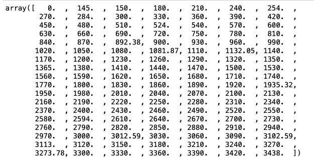

载入[井眼路径](https://github.com/Zabamund/wellpathpy)后的测量深度数据示例。图片由作者提供。

# 将调查数据加载到 wellpathpy

加载数据后，我们现在需要创建一个 [wellpathpy](https://github.com/Zabamund/wellpathpy) 偏差对象。这是按如下方式启动的:

```
dev = wp.deviation(md, inc, azi)
dev
```

当我们查看 dev 对象时，我们看到 md，inc 和 azi 数据存储在数组中。

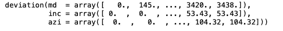

我们可以通过像这样调用它们来访问每一个:

```
dev.md
dev.inc
dev.azi
```

## 可视化原始调查数据

我们可以在 matplotlib 中通过创建一个包含两个子图形的图形来非常简单地可视化这些原始数据。一个用于倾角(inc ),一个用于方位角(azi)。这将使我们能够看到井眼轨迹如何随测量深度变化。

```
fig, ax = plt.subplots(1, 2, figsize=(8,10))ax1 = plt.subplot2grid((1,2), (0,0))
ax2 = plt.subplot2grid((1,2), (0,1))ax1.plot(dev.inc, dev.md, color = "black", marker='.', linewidth=0)
ax1.set_ylim(dev.md[-1], 0)
ax1.set_xlim(0, 90)
ax1.set_xlabel('Deviation', fontweight='bold', fontsize=14)
ax1.set_ylabel('Measured Depth', fontweight='bold', fontsize=14)
ax1.grid(color='lightgrey')
ax1.set_axisbelow(True)ax2.plot(dev.azi, dev.md, color = "black", marker='.', linewidth=0)
ax2.set_ylim(dev.md[-1], 0)
ax2.set_xlim(0, 360)
ax2.set_xlabel('Azimuth', fontweight='bold', fontsize=14)
ax2.grid(color='lightgrey')
ax2.set_axisbelow(True)plt.show()
```

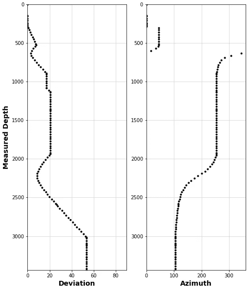

原始勘测测量的井筒方位角和倾斜度。图片由作者提供。

在上面的图中我们可以看到:

*   钻孔开始是垂直的，直到我们到达大约 500 米，然后逐渐增加，然后减少。最终，井眼以 53.43 度的倾角落在目标层段内。
*   当钻孔开始垂直时，我们的方位角被设置为正北(0 度)，然后转向东北，然后转向南方，并在东方结束

在本文的后面，我们将能够以 3D 的形式来可视化这些数据，这将会更有意义。

# 从测量数据创建位置日志

调查数据是随机抽样的，两次测量之间有很大的间隔。我们可以对数据进行重新采样，这样每 1 米就有一次测量。

为此，我们首先定义深度步长，然后创建一个在 0 和最后一个`md`值之间的等间距值列表。

```
depth_step = 1
depths = list(range(0, int(dev.md[-1]) + 1, depth_step))
```

[wellpathpy](https://github.com/Zabamund/wellpathpy) 包含多种计算真实垂直深度(TVD)的方法，但是，我们将重点介绍最小曲率法。如果你想了解这种方法背后的数学原理，请点击下面的链接。

[](https://www.drillingformulas.com/minimum-curvature-method/)  

为了创建我们的 TVD 曲线和位置测量(北距和东距),我们需要调用以下代码。这也将重新采样我们的深度值，以便我们每 1 米测量一次。

```
pos = dev.minimum_curvature().resample(depths = depths)
```

当我们调用`pos`时，我们得到一个包含三个数组的位置对象，如下所示:

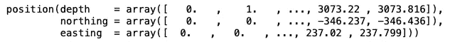

## 创建重新采样的测量数据

为了将我们的原始测量数据更新到 1 米的深度步长，我们可以通过调用`pos.deviation()`来对数据进行重新采样

```
resampled_dev = pos.deviation()
```

当我们查看`resampled_dev`时，我们得到下面的数组。

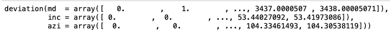

与我们对数据进行重采样的任何计算一样，将结果与原始结果进行比较是一种很好的做法。

下面的代码与上面创建的图相同，但是现在包含了来自变量`resampled`的重采样数据。

```
fig, ax = plt.subplots(1, 2, figsize=(8,10))ax1 = plt.subplot2grid((1,2), (0,0))
ax2 = plt.subplot2grid((1,2), (0,1))ax1.plot(dev.inc, dev.md, color = "black", marker='.', linewidth=0)
ax1.plot(resampled_dev.inc, resampled_dev.md, color='red')ax1.set_ylim(dev.md[-1], 0)
ax1.set_xlim(0, 90)
ax1.set_xlabel('Deviation', fontweight='bold', fontsize=14)
ax1.set_ylabel('Measured Depth', fontweight='bold', fontsize=14)
ax1.grid(color='lightgrey')
ax1.set_axisbelow(True)ax2.plot(dev.azi, dev.md, color = "black", marker='.', linewidth=0)
ax2.plot(resampled_dev.azi,resampled_dev.md, color='red')ax2.set_ylim(dev.md[-1], 0)
ax2.set_xlim(0, 360)
ax2.set_xlabel('Azimuth', fontweight='bold', fontsize=14)
ax2.grid(color='lightgrey')
ax2.set_axisbelow(True)plt.show()
```

当图出现时，我们可以看到原始数据为黑点，重采样数据为红线。总的来说，这看起来不错，并且这些值看起来彼此一致。

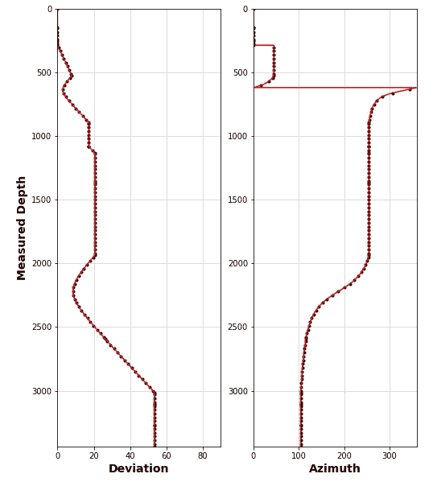

原始勘测测量的井眼方位角和倾斜度，以及来自 wellpathpy 的重采样数据。图片由作者提供。

## 创建位置地块

现在我们已经对数据进行了重新采样，并创建了位置日志，我们可以用下面的代码来可视化我们的位置数据。这允许我们生成三个图:

*   北/南位置与东/西位置(地形图)
*   东西位置随深度的变化
*   北/南位置随深度的变化

```
fig, ax = plt.subplots(2, 2, figsize=(15,5))ax1 = plt.subplot2grid((1,3), (0,0))
ax2 = plt.subplot2grid((1,3), (0,1))
ax3 = plt.subplot2grid((1,3), (0,2))ax1.plot(pos.easting, pos.northing, color = "black", linewidth=2)ax1.set_xlim(-500, 400)
ax1.set_ylim(-400, 100)
ax1.set_xlabel('West (-) / East (+)', fontweight='bold', fontsize=14)
ax1.set_ylabel('South (-) / North (+)', fontweight='bold', fontsize=14)
ax1.grid(color='lightgrey')
ax1.set_axisbelow(True)ax2.plot(pos.easting, pos.depth, color = "black", linewidth=2)ax2.set_xlim(-500, 400)
ax2.set_ylim(3500, 0)
ax2.set_xlabel('West (-) / East (+)', fontweight='bold', fontsize=14)
ax2.set_ylabel('Depth', fontweight='bold', fontsize=14)
ax2.grid(color='lightgrey')
ax2.set_axisbelow(True)ax3.plot(pos.northing, pos.depth, color = "black", linewidth=2)ax3.set_xlim(-500, 400)
ax3.set_ylim(3500, 0)
ax3.set_xlabel('South (-) / North (+)', fontweight='bold', fontsize=14)
ax3.set_ylabel('Depth', fontweight='bold', fontsize=14)
ax3.grid(color='lightgrey')
ax3.set_axisbelow(True)plt.tight_layout()plt.show()
```

这产生了下面的图。

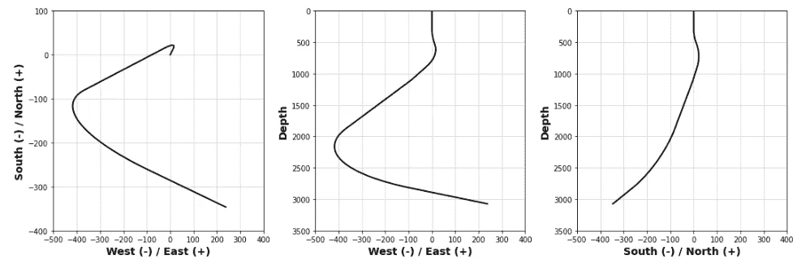

从不同角度观察井眼位置，以便更好地了解井眼轨迹。图片由作者提供。

# 计算 TVDSS

这些计算的一个常见输出是 TVDSS。这为我们提供了基准面(如转盘或钻台)和井筒内某个位置之间的绝对垂直差。

当它被计算时，我们在平均海平面以上有正值，在平均海平面以下有负值。


钻井和测井中关键参考和深度名称的图解。图片由作者提供。

为了计算 TVDSS，我们简单地调用`pos.to_tvdss()`并传入我们的永久数据。

```
 pos_tvdss = pos.to_tvdss(datum_elevation=30)
```

运行时，它返回以下带有多个数组的位置对象。第一个标记为深度的代表我们的 TVDSS 数据。

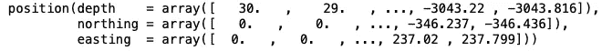

# 用 Plotly 构建 3D 井眼轨迹图

查看 2D 图上的油井位置可能会有很大的局限性，尤其是当您试图了解井筒的位置和形状时。在本节中，我们将了解如何使用 Python 和创建交互式 3D 绘图

但是，在我们生成图之前，我们可以选择将我们的井筒定位在正确的位置。

## 设置参考位置

我们的位置对象的当前北距和东距从 0 开始。我们可以通过提供钻机的表面位置来修正该位置。

```
wellhead_northing = 6478572
wellhead_easting = 435050pos_wellhead = pos.to_wellhead(surface_northing=wellhead_northing,
                               surface_easting=wellhead_easting)
```

运行这部分代码后，我们可以检查我们的井筒位置的北距，以查看数据是否已更新。

```
pos_wellhead.northing
```

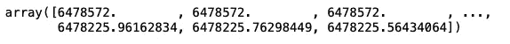

## 创建 3D 井眼轨迹图

现在，井眼已经参考到正确的位置，我们现在可以制作我们的三维绘图。

为此，我们将依赖于 [plotly](https://plotly.com/) 而不是 matplotlib。在我看来，与 matplotlib 相比，它生成了更好的交互图。

下面的代码用于生成 3D 绘图。如果你没有安装 [plotly](https://plotly.com/) ，你可以使用`!pip install plotly`在 Jupyter 笔记本上安装。

```
import plotly
import plotly.graph_objs as go# Configure Plotly to be rendered within the notebook
plotly.offline.init_notebook_mode()# Configure the trace.
wellpath = go.Scatter3d(
    x=pos_wellhead.easting,  
    y=pos_wellhead.northing,
    z=pos_wellhead.depth,
    mode='markers',
    marker={
        'size': 5,
        'opacity': 0.8,
    }
)data = [wellpath]fig = go.Figure(data=data)fig.update_layout(scene = dict(
                    zaxis_autorange="reversed",
                    xaxis_title='West (-) / East (+) (m)',
                    yaxis_title='South (-) / North (+) (m)',
                    zaxis_title='TVD (m)'),
                    width=800,
                    margin=dict(r=20, b=10, l=10, t=10))
plotly.offline.iplot(fig)
```

当上面的代码被执行时，我们生成了下面这个可以移动的图。注意，为了显示 z 轴随着我们的深入而增加的深度，我们需要通过用`zaxis_autorange="reversed"`更新布局来反转 z 轴。

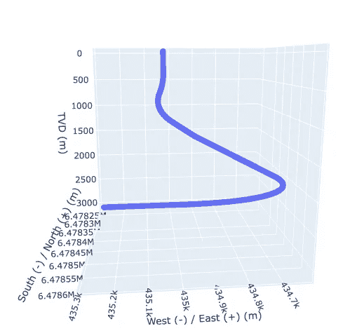

用 plotly 创建的交互式 3D 井眼轨迹。图片由作者提供。

# 创建重采样调查数据和位置数据的熊猫数据框架

在 Python 中处理测井数据时，通常会处理数据帧。 [wellpathpy](https://github.com/Zabamund/wellpathpy/tree/master/wellpathpy) 没有提供直接导出到这种格式，但是我们可以很容易地创建一个数据帧，如下所示:

```
#Create a dictionary of the curve names and the data
data = {'MD':resampled_dev.md, 
        'AZI':resampled_dev.azi,
        'INC':resampled_dev.inc,
        'TVD':pos.depth,
        'TVDSS':pos_tvdss.depth,
        'YLOC':pos.northing,
        'XLOC':pos.easting,
        'NORTHING': pos_wellhead.northing,
        'EASTING': pos_wellhead.easting}df = pd.DataFrame(data)
```

这将返回以下数据帧，其中包含我们计算的所有位置数据和测量结果。

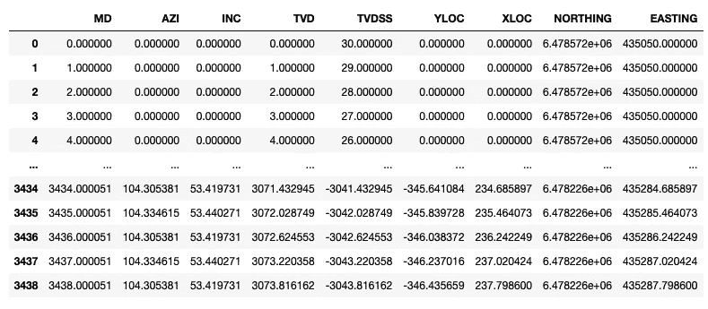

在 pandas 数据框架内结合油井测量和位置数据。图片由作者提供。

# 摘要

使用 [wellpathpy](https://github.com/Zabamund/wellpathpy/tree/master/wellpathpy) 库，将原始油井测量数据转换为定期采样的位置测量数据是一个简单的过程。生成数据后，我们可以创建交互式图表，以便更好地可视化和理解井眼轨迹。此外，这种数据现在可以与来自同一口井的测井数据集成，以便具有完整的复合井数据集。

*感谢阅读。在你走之前，你一定要订阅我的内容，把我的文章放到你的收件箱里。* [***你可以在这里做！***](https://andymcdonaldgeo.medium.com/subscribe)**或者，您可以* [***注册我的简讯***](https://fabulous-founder-2965.ck.page/2ca286e572) *免费获取更多内容，直接发送到您的收件箱。**

*其次，通过注册会员，你可以获得完整的媒介体验，并支持我和成千上万的其他作家。每月只需花费你 5 美元，你就可以接触到所有精彩的媒体文章，也有机会通过写作赚钱。*

**如果你用* [***我的链接***](https://andymcdonaldgeo.medium.com/membership) ***，*** *报名，你直接用你的一部分费用支持我，不会多花你多少钱。如果你这样做了，非常感谢你的支持！**