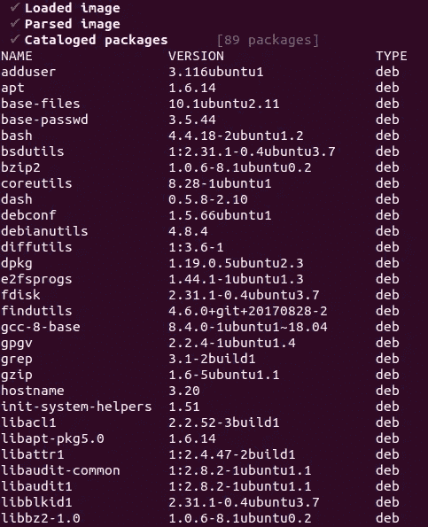
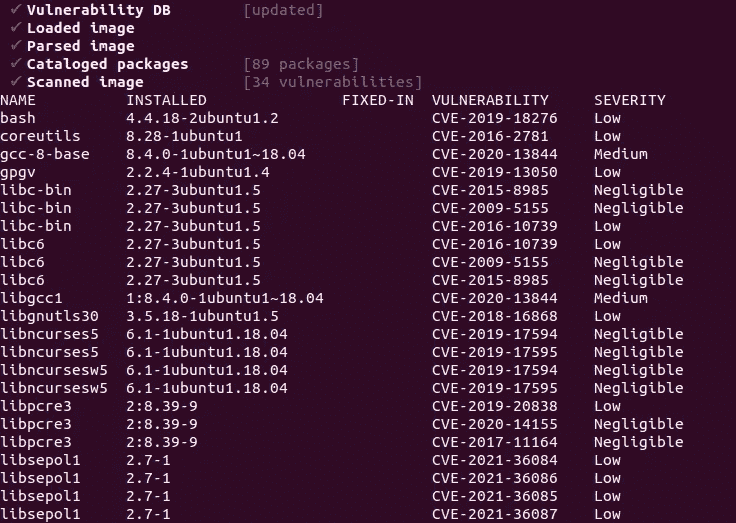
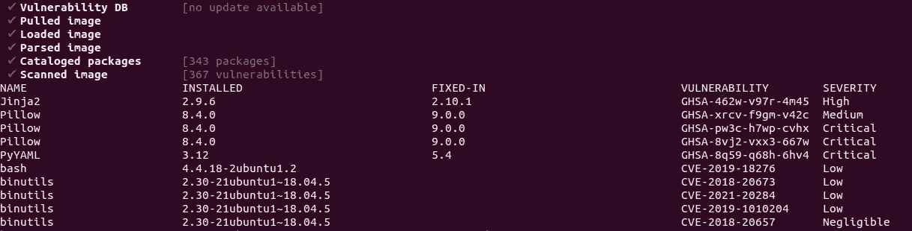

# 你能运行这个 Docker 图像吗？

> 原文：<https://towardsdatascience.com/would-you-run-this-docker-image-7b52d99e78ec>

## 您如何知道您从 Docker Hub 中提取的 Docker 映像可以安全使用？


由 [Timelab Pro](https://unsplash.com/@timelabpro?utm_source=medium&utm_medium=referral) 在 [Unsplash](https://unsplash.com?utm_source=medium&utm_medium=referral) 上拍摄的照片

Docker Hub 上只有极小一部分公开图片经过了验证和审查。一般来说，Docker Hub 上推送的图片有三种类型:

*   已验证:已验证图像是来自已验证发行商的高质量图像。Docker 团队已经分析了这些图像的安全缺陷。
*   官方:这是一组精选的码头工人图片。这些是高质量的 Docker 图像，但它们没有经过安全审查。因此，尽管它们通常被认为是安全的，但您仍然应该小心漏洞。
*   公开:任何人都可以在 Docker Hub 上发布图片。你永远不要相信未经核实的公众形象，你需要格外小心。

那么，你怎么知道你从 Docker Hub 中提取的 Docker 映像可以安全使用呢？您如何知道映像所依赖的开源软件库已经更新到了最新版本，并且安装了解决已知 CVE(常见漏洞和暴露)的所有安全补丁？

在这个故事中，您将看到如何分析 CVEs 的图像，并在运行它之前检测安全性缺陷。如果您想进入生产阶段，这是至关重要的一步，但即使您只在本地运行一个映像。

> [Learning Rate](https://www.dimpo.me/newsletter?utm_source=medium&utm_medium=article&utm_campaign=grype) 是一份时事通讯，面向那些对 AI 和 MLOps 世界感到好奇的人。你会在每个月的第一个星期六收到我关于最新人工智能新闻和文章的更新和想法。订阅[这里](https://www.dimpo.me/newsletter?utm_source=medium&utm_medium=article&utm_campaign=grype)！

# 信任如何扫描 Docker 图像？

如果您是 Docker Hub 上图像的发布者，您可以首先使用 Docker 内容信任对您的 Docker 图像进行签名。如果你拉一个图像，只寻找签名的图像。但是，此过程不会扫描映像内部的漏洞。

[](/secure-your-public-docker-images-6758f7ddb687)  

那么你能做什么呢？有两个步骤可以遵循。首先，当你构建你的图像时，你应该使用可信方审查过的图像作为你的基本图像。然后，你也应该亲自检查最终的图像，将它分解成不同的图层，并逐一检查。

Docker 图像层由软件材料清单(BOM)组成。这个术语只不过是您的映像用来成功运行的库和依赖项的列表。当您将映像分解成不同的层时，您的目标是在 BOM 的库和包中找到漏洞。

# 分解物料清单


图为[塔曼娜·茹米](https://unsplash.com/@tamanna_rumee?utm_source=medium&utm_medium=referral)在 [Unsplash](https://unsplash.com?utm_source=medium&utm_medium=referral)

要分解 BOM，首先需要理解它的内容。因此，BOM 包含两种类型的组件:

*   我们的软件直接用来执行的库
*   安装在我们映像中的库所依赖的其他软件

我们需要列举这两个类别来编辑一个完整的构成我们图像的材料列表。为此，我们将使用 [Syft](https://github.com/anchore/syft) 。

## Syft 安装

要安装 Syft，请遵循官方的[库](https://github.com/anchore/syft#installation)文档。例如，Linux 发行版的推荐方式是运行以下命令:

```
curl -sSfL [https://raw.githubusercontent.com/anchore/syft/main/install.sh](https://raw.githubusercontent.com/anchore/syft/main/install.sh) | sh -s — -b /usr/local/bin
```

## 使用 Syft 检查图像

让我们现在拉 Ubuntu 仿生海狸图像，并分解它。首先，让我们下载图像:

```
docker pull ubuntu:18.04
```

要查看此映像的 BOM，请运行以下命令:

```
syft ubuntu:18.04
```

结果应该呈现出构成 Ubuntu 仿生海狸图像的 89 个包。



Syft 结果—作者图片

所以，这是很好的第一步。我们有图像的 BOM。但是我们如何知道这些包中是否包含任何关键的 CVE 呢？我们应该对照 CVE 的数据库一个一个地检查吗？幸好没有！我们将为此使用另一个工具:让我们使用“grype”。

## grype 装置

要安装 grype，请遵循官方的[库](https://github.com/anchore/grype#installation)文档。例如，Linux 发行版的推荐方式是运行以下命令:

```
curl -sSfL [https://raw.githubusercontent.com/anchore/grype/main/install.sh](https://raw.githubusercontent.com/anchore/grype/main/install.sh) | sh -s — -b /usr/local/bin
```

## 检查 CVE 的图像

要检查之前为 CVEs 提取的 Ubuntu Bionic Beaver 图像，只需运行以下命令:

```
grype ubuntu:18.04
```



grype 结果—作者图片

幸运的是，今天你不会在那里发现任何高或严重的 CVEs。然而，让我们随机抽取一个公众形象，并对其进行测试:

```
grype ocdr/pytorchserver:1.9
```



grype 结果—作者图片

由于它依赖于几个库，例如`Pillow`和`log4j`，所以`ocdr/pytorchserver:1.9`映像包含几个关键的 CVE。既然你知道这个，你会用它吗？

但是，有些 CVE 很容易修复。我们看到 grype 通知我们 Pillow 库引入的所有关键 CVE 都在版本`9.0.0`中得到修复。所以，我们要做的就是把 Pillow 的版本更新到`9.0.0`，重新构建镜像。

# 结论

Docker Hub 上只有极小一部分公开图片经过了验证和审查。在这个故事中，我们看到了如何提取图像，分析其 BoM，并检查其安全性缺陷。

如果您想进入生产环境，这个过程是关键，但即使您只想在本地运行单个映像，也是如此。你怎么能确定它不会伤害你的系统？

在接下来的文章中，我们将以 Docker 和 Kubernetes 安全性来结束。我们将实时监控我们的系统，并在运行时扫描安全事件。

# 关于作者

我叫[迪米特里斯·波罗普洛斯](https://www.dimpo.me/?utm_source=medium&utm_medium=article&utm_campaign=grype)，我是一名为[阿里克托](https://www.arrikto.com/)工作的机器学习工程师。我曾为欧洲委员会、欧盟统计局、国际货币基金组织、欧洲央行、经合组织和宜家等主要客户设计和实施过人工智能和软件解决方案。

如果你有兴趣阅读更多关于机器学习、深度学习、数据科学和数据运算的帖子，请在 Twitter 上关注我的 [Medium](https://towardsdatascience.com/medium.com/@dpoulopoulos/follow) 、 [LinkedIn](https://www.linkedin.com/in/dpoulopoulos/) 或 [@james2pl](https://twitter.com/james2pl) 。

所表达的观点仅代表我个人，并不代表我的雇主的观点或意见。