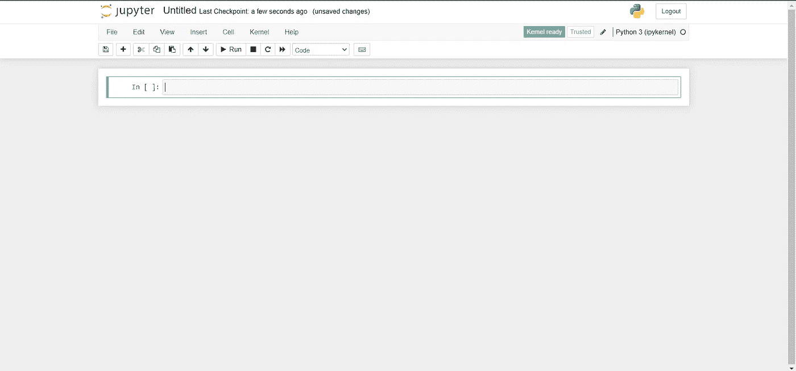
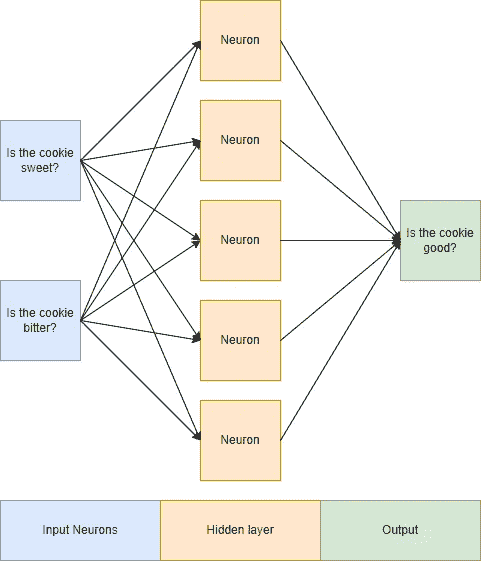

# 使用 Scikit-Learn 用不到 50 行代码编写你的第一个机器学习程序

> 原文：<https://towardsdatascience.com/write-your-first-machine-learning-program-in-under-50-lines-using-scikit-learn-926fbe5b6ad0>

## 利用机器学习的力量来分析巧克力饼干！


由 [Unsplash](https://unsplash.com?utm_source=medium&utm_medium=referral) 上的 [Arseny Togulev](https://unsplash.com/@tetrakiss?utm_source=medium&utm_medium=referral) 拍摄

机器学习在世界上日益无处不在，这使得它看起来像是一种没有数学和计算机科学的透彻知识就不可能理解和实现的技术。然而，事实远非如此。在当今世界，顶级公司都是在车库中建立起来的，FOSS(自由和开源软件)随处可见，有几个社区建立的库可以简化开发机器学习模型的过程。

# 什么是 Scikit-Learn？

Scikit-learn 是 Python 编程语言的机器学习库。它建立在几个 Python 库之上，包括 NumPy(数学函数)、SciPy(更多数学！)，以及 Matplotlib(数据可视化)。

如果你已经熟悉机器学习领域的一些术语，你可能会问为什么我们不使用 TensorFlow(由谷歌开发)。虽然 TensorFlow 也是一个机器学习库，但它主要专注于深度学习和神经网络，而 scikit-learn 包含更通用的机器学习概念。Scikit-learn 也被广泛认为比 TensorFlow 对初学者来说更容易。

摩根大通和 Spotify 等公司使用 scikit-learn 进行预测分析或歌曲推荐等任务。你可以在这里看到完整的证词列表[。](https://scikit-learn.org/stable/testimonials/testimonials.html)

# 入门指南

对于本教程，您需要:

*   Python(版本 3.7 或更高)-推荐基本体验

(安装教程:[https://www . tutorialspoint . com/how-to-install-python-in-windows](https://www.tutorialspoint.com/how-to-install-python-in-windows))

然后，在您的终端中使用`pip`安装三个软件包:

*   `pip install notebook`
*   `pip install numpy`
*   `pip install scikit-learn`

在你的终端中运行`jupyter notebook`。您的默认 web 浏览器应该会打开一个选项卡，您可以在其中看到文件资源管理器。只需转到您希望创建程序的目录，然后创建一个 Python 3 笔记本(选择右上角的`new`)。您现在应该会看到这个屏幕:



你可以通过点击“无标题”来重命名文件

# 代码时间！

完成写入后，按下屏幕顶部的`Run`按钮运行每个单元格。

在第一个单元格中，首先导入我们需要的库:

现在，该是我们训练模型的数据时间了。假设我们去一家饼干店，根据人们尝试的饼干对他们进行调查:

花点时间看看这些数据(注意顶部的注释)。作为人类，我们很快识别出一种模式:甜饼干是好的，苦饼干是坏的。这个简单的结论就是我们将训练我们的模型去识别的。

接下来，我们定义数据的特征和标签:

这是不言自明的——我们训练模型的特征是饼干是甜的还是苦的，标签是饼干是好还是不好。

按下`alt` + `enter`创建一个新的单元格。

现在，我们需要开发一个测试集来测试我们的模型。这将让我们了解模型的精确度。

按`alt` + `enter`创建一个新的单元格。

## 神经网络

我们将使用 scikit-learn 的 MLPClassifier 作为我们的模型。MLP 简单地(或者不那么简单地)代表多层感知器。不严格地说，多层感知器是一种前馈人工神经网络(其中输入和输出为 0 或 1):



鸣谢:图片由作者提供。

“神经网络”不是巧合——神经网络中的节点(或神经元)类似于人脑中的神经元。如果神经元受到足够的刺激，它们就会被触发。

隐藏层是奇迹发生的地方(之所以称为“隐藏”是因为在网络之外无法看到):

隐藏层中的每个神经元都有一个权重来反映其输入的重要性。例如，如果我们要在数据中增加更多的因素，而不仅仅是(甜或苦)，模型会对这些特征中的每一个施加权重。虽然咸味和甜味都有助于制作好的饼干，但咸味的权重(即 0.2 倍)可能小于甜味的权重(即 0.5 倍)，因为模型发现甜味更重要。

每个神经元也有一个偏差(一个常数),通过增加或减少该偏差来抵消神经元的结果。对于本教程来说有点太复杂了，所以我们将跳过细节。

我们将创建的神经网络不是深度学习网络。具有足够的隐层(超过三个 3 是普遍接受的数字)，一个神经网络被定义为深度神经网络。深度神经网络不需要标记数据。例如，一个经典的神经网络需要人为干预来标记数据集，正如我们在标记哪些 cookies 是好的，哪些不是时所做的那样——这就是所谓的监督学习。另一方面，深度神经网络执行无监督学习。他们可以利用未标记的数据，并根据它自己确定的特征将其分组到不同的组中。

最后，代码(我知道这并不令人印象深刻)。我们简单地定义我们的隐藏层将有 5 层，我们将通过我们的数据循环 3000 次。

按`alt` + `enter`创建一个新的单元格。

现在，我们将根据我们提供的数据来拟合或训练模型。我们的模型将遍历数据 3000 次(意味着它完成了 3000 个时期)，正如我们创建网络时所定义的那样。

然后，我们将使用它开发的权重和偏差，对照训练和测试集来测试我们的模型。

输出:

```
Training set score: 100.000%
Testing set score: 100.000%
```

按`alt` + `enter`创建一个新的单元格。

最后，我们可以使用我们经过试验和测试的模型来确定 cookie 是否是好的。这是我用来测试的一些代码:

还记得我们从数据中得出的结论吗？我们的模型成功地匹配了我们的想法！

```
Type: Sweet cookie
Good cookie!

Type: Bitter cookie
Bad cookie!
```

# 结论

当然，我们在这个模型中使用的数据不需要神经网络——但它是一个简单数据的简单实现，因此我们可以更多地关注机器学习如何工作。当然，可以根据自己的喜好随意更新 cookie 调查和测试集！添加更多特性(松脆度、咸味等)并对模型进行测试！

感谢您的阅读！我希望你非常喜欢这个教程，并且现在对机器学习的想法更加适应了。