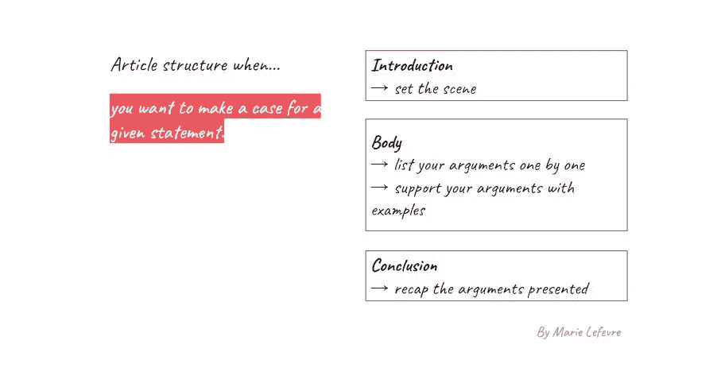
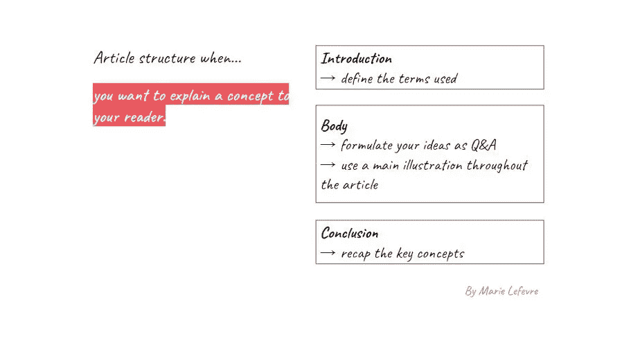
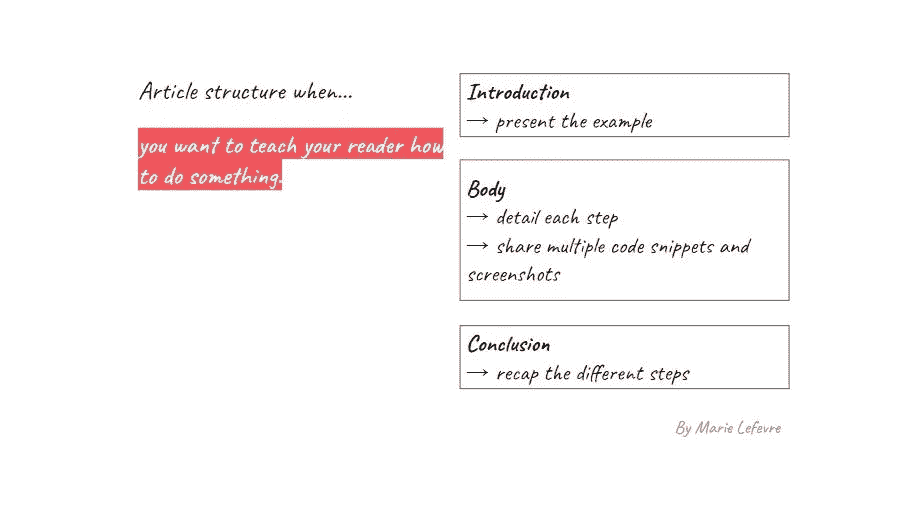

# 写数据文章就像盖房子

> 原文：<https://towardsdatascience.com/writing-a-data-article-is-like-building-a-house-755fc267760a>

## 技术写作

## 我构建可靠数据故事的秘诀

当你内心深处知道**你想谈论一个技术话题，但你真的不知道如何在一篇文章中正确对待它时，你知道这种感觉吗？**

**找到合适的角度来传达正确的信息**有时会很棘手。尤其是在处理数据科学或数据分析等技术主题时。如果你再加上为你的文章找到一个逻辑结构并相应地举例说明的挑战，那么要写出一篇好文章可能是一场真正的战斗。

首先，**作为一名数据从业者，您为什么会对撰写技术文章感兴趣？第一个好处是清晰地表达你的想法。作为一名数据分析师，在线写作帮助我记录日常生活中应用的最佳实践。有时，当我想向一位同事解释一个概念时，我会参考我的一篇文章:一旦你完成了写下你的专业知识的某些部分的工作，以后就更容易参考它们。还有其他原因可以让你写一些与你的数据工作不直接相关的技术文章。当你更深入地探索一个话题时，你会学到新的东西。写作也是提高你创造力的一种锻炼——也可能提高你的自信心。**

每个作家都会找到自己写技术文章的理由。在撰写了与数据相关的文章之后——其中大部分发表在面向数据科学的[出版物上——我想与您分享我的个人建议，以阐明一篇关于数据的文章,这样您就可以享受技术写作的好处。](https://towardsdatascience.com/)

除了建造房屋，你还必须具备:

*   坚实的基础
*   精心设计的结构
*   漂亮的室内装饰

照片由 [Avel Chuklanov](https://unsplash.com/@chuklanov?utm_source=unsplash&utm_medium=referral&utm_content=creditCopyText) 在 [Unsplash](https://unsplash.com/?utm_source=unsplash&utm_medium=referral&utm_content=creditCopyText) 上拍摄

# #1 基金会

不管你谈论的主题是什么，一个好的介绍都是以一句流行语开始的。短短几句话，读者就必须明白这篇文章的内容。他们必须找到进一步阅读你的文章的理由。

最好的方法是**找到你的文章正在解决的痛点**。基于你如何处理这个主题，你提出了一个解决读者痛点的方案。作为一名作家，你并不总是很容易将文章的主题与痛点联系起来，但我发现写一个吸引人的引言非常有用——甚至在你选择最好的吸引人的角度之前写几个草稿。

以下是一些棘手问题的示例:

*   你想让**解决一个技术概念**并向你的读者详细解释它吗？

**→** 解决的痛点可能是:*“如果你对这个概念感到困惑，或者你从未听说过它，请进一步阅读我的文章，你会对它有一个清晰的了解”*

*   要不要通过**方法论去做一件事**？

**→** 解决的难点可能是:*“如果你不知道如何做到这一点，进一步阅读我的文章，你将能够自己做到这一点”*

*   你想分享关于主题的**最佳实践吗？**

**→** 解决的难点可以是:*“您知道您可以做得更好吗？你可能做错了，所以继续往下读我的文章来改进你的练习吧*

最重要的是，你应该从一开始就牵着读者的手。特别是当你处理一个技术话题时，定义整篇文章中使用的术语是至关重要的。如果术语之间需要添加任何细微差别，那么文章的引言就是添加的地方。

例如，下面这篇关于 SQL 的文章面向技术和非技术读者。这就是为什么我在文章的开始部分对 SQL 的含义进行了适当的解释。

</3-reasons-why-you-should-learn-sql-even-if-you-are-not-part-of-a-tech-team-232be317b9d7>  

# #2 结构

我通常把我的内容分成三个部分——这绝对是我学习的遗产。但是没有什么能阻止你创造一个完全创新的结构。对我来说，三部分结构可以让我足够详细地阐述我的想法，这样我就可以在几个段落中阐述同一个想法，同时我希望一篇文章保持相对紧凑，不要太长。所以三个细节部分通常就能解决问题。

至于组织文章的最佳方式，在我作为技术写作者的经历中，我已经确定了一些模式。根据你想通过文章传达的信息和你想与读者建立的关系，文章结构的一种变化可能比其他变化更相关。

## 变式 A:你想为一个给定的陈述提供理由

作者图片

在这类文章中，你应该**关注你的陈述**背后的论证。要做到这一点，介绍应该用来设置场景。这会让读者理解你的论点发生的背景。

在你文章的主体**中，每一个论点都应该有例子支持**。这里你可以举一个例子并在你文章的每一部分中提到它，或者用一个具体的例子来支持每一段。例子会加强你的说法，让读者理解你每个论点的意思。

最后，结论应该包括对你所有论点的概述，还应该包括**可能的反驳论点和你刚刚提出的案例的局限性**。

这是我在本文中使用的结构类型，我首先阐述我的观点，然后用一个详细的例子详细说明它:

</not-all-data-requests-are-urgent-so-start-by-asking-these-5-questions-ad77d1fbe7dd>  

## 变体 B:你想向你的读者解释一个概念

作者图片

在这种类型的文章中，所有的教学技巧都是必需的，因为文章的目标是使一个复杂的概念易于理解。你甚至希望你的读者在所呈现的概念上变得知识渊博。为此，我使用的一个技巧是**将我的内容组织成问题和答案**。这加强了这种感觉:在教室里，有一位专注的老师会仔细检查学生可能有的每一个问题。

因此，一个好的引言包括你文章中要用到的术语的定义。即使您将在文章正文的后面进一步详细介绍，从定义开始会让读者有信心详细解释每个元素。

这类文章的一个关键要素是使用图形元素来解释你的概念。对于视觉记忆力强的读者来说，这可以帮助他们理解一些复杂的概念。

这就是我在本文中使用的结构类型，在本文中，我使用自己创建的图表解释了现代数据堆栈的概念:

</modern-or-not-what-is-a-data-stack-e6e09e74ae7f>  

## 变体 C:你想教你的读者如何做某事

作者图片

这是典型的**教程**文章。在这种结构中，**在整篇文章中引用一个例子**尤为重要。这可以在引言或文章的第一部分完成。

在你展示完例子后，你将牵着读者的手**带他们经历问题解决方案的每一步**。因此，我喜欢坚持对步骤和段落进行编号，以使教程更容易理解。

最后，没有什么比**代码片段和截图**更能让每个动作清晰明了。对你解决引言中暴露的问题的方式保持透明会让你的读者信任你:如果他们能重复你所经历的步骤，你的教程很有可能是有效的。

这是我在本文中应用的结构类型，在本文中，我解释了我在标准 SQL 中处理空值的方法:

</how-to-deal-with-null-values-in-standard-sql-1bffce0c55cd>  

# #3 装修

现在你的房子(或者我应该说，你的文章)的主要部分已经建成，是时候给它添加装饰元素了。

在这里我想为你的文章谈谈**图片和插图**。人们常说*“一图胜千言”*……我必须承认，我觉得这句话非常贴切。要对你的读者产生影响，没有什么比一幅合适的插图更好的了。有两种方法可以做到这一点:要么你自己创作插图，要么你从互联网上下载——或者你把两种方法结合起来。如果你没有创作自己的插图，请确保你有权利分享他人的作品。

最后但同样重要的是:**你文章的整体外观**。我的意思是，在发表一篇文章之前，你应该检查以下几点:

*   **审美**:图片与文字之间，文字段落本身之间的和谐等等。
*   **正确性**:没有拼写错误，数字正确，代码段正确等。
*   **详尽无遗:**确保你解决了引言中提到的所有话题

…然后您就可以点击“发布”按钮了！

# 结论

有了**坚实的基础**(找到你的文章要解决的痛点)**精心设计的结构**(根据你文章的目的选择)**一些内部装饰的好元素**(你文章的插图和视觉一致性)，你的技术文章现在就可以与读者分享了。

你写过数据相关话题的文章吗？你是怎么想出一个结构的？你还想分享什么建议？我很乐意了解其他作者是如何写出技术文章的！

你喜欢读这篇文章吗？ [*成为*](https://marie-lefevre.medium.com/membership) *的一员，加入一个不断成长的充满好奇心的社区吧！*

<https://marie-lefevre.medium.com/membership> 