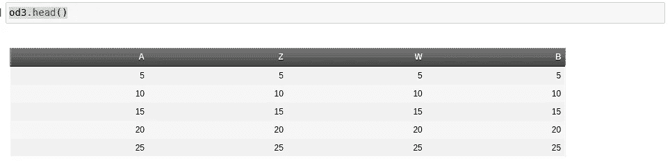
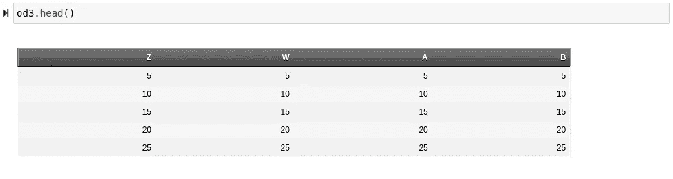

# 为我的数据框包编写合并函数

> 原文：<https://towardsdatascience.com/writing-a-merge-function-for-my-data-frames-package-f492e313d02b>

## OddFrames.jl

# 为我的数据框包编写合并函数

## 为我的包 OddFrames.jl 创建两种不同类型的合并。

# 介绍

数据管理框架通常因其方法和功能而备受推崇。这可能是因为这些方法可能很难构建，但也非常方便。关于移动和操作数据有很多东西要学，做这样一个项目的好处是我可以尝试创建自己的算法。

对于那些不熟悉我的项目 OddFrames.jl 的人来说，这是一个用于 Julia 中数据管理的选择性面向对象包。当然，这个软件包的应用主要是基于科学计算。也就是说，这肯定是一个有趣又酷的项目。如果你想查看这个项目的 Github，你可以在这里:

<https://github.com/ChifiSource/OddFrames.jl>  

今天，我们将加入一些新的功能，使我们能够轻松地将奇数帧组合在一起。我有几个有趣的计划来解决这个问题，我计划用函数做一些很酷的调度，我知道一个合并函数将会非常困难，所以不再多说，让我们开始写这些函数吧！最后一件事，如果你想更深入地了解 OddFrames.jl，这里是我写的关于这个包的前一篇文章，我在其中写了一个 CSV 解析器:

</the-wretched-pain-i-experienced-creating-a-csv-reader-in-julia-e67520857b9c>  

# 修改构造函数

由于有如此多的构造函数，我将把本文示例的重点放在 pairs 的分派上:

```
function OddFrame(p::Pair ...)
```

不过，在我们深入研究这个函数之前，让我们快速看一下外部构造函数，了解一下上下文。

```
mutable struct OddFrame <: AbstractMutableOddFrame
        labels::Array{Symbol}
        columns::Array{Any}
        types::Array
        head::Function
        drop::Function
        dropna::Function
        dtype::Function
        merge!::Function function OddFrame(p::Pair ...)
```

任何时候我们看到这样的外部构造函数，在内部构造函数中有不同的调用，这意味着我们很可能期望从函数中返回外部构造函数内部的数据。换句话说，OddFrame(::Pair)只是一组命令，在获取数据的算法完成后，这些命令将调用 OddFrame(::Array，::Array，…)。这个函数的第一部分获取我们的三个数组、标签、列和类型。

```
function OddFrame(p::Pair ...)
                # TODO Would be nice to combine these loops:
                labels  = [x[1] for x in p]
                columns = [x[2] for x in p]
                length_check(columns)
                name_check(labels)
                types = [typeof(x[1]) for x in columns]
                # Head
                #== TODO, maybe the best approach to solving
                the TODO outlined in member_func : 35 is to check
                REPL or otherwise here?==#
```

之后，定义了这个新构造类型 OddFrame 的子类型的函数调用。这些调用来自 member_funcs.jl 文件的函数，我们很快也会用到这个文件。

```
head(x::Int64) = _head(labels, columns, types, x, )
                head() = _head(labels, columns, types, 5)
                # Drop
                drop(x) = _drop(x, columns)
                drop(x::Symbol) = _drop(x, labels, columns, coldata)
                drop(x::String) = _drop(Symbol(x), labels, columns, coldata)
                # Dropna
                dropna() = _dropna(columns)
                # Dtype
                dtype(x::Symbol) = typeof(coldata[findall(x->x == x,
                                                labels)[1]][1])
                dtype(x::Symbol, y::Type) = _dtype(columns[findall(x->x == x,
                 labels)[1]], y)
```

这是构造函数中我要添加代码的部分。我将简单地为一个名为 merge 的新功能添加一些调度功能！().你可能会注意到这里合并！()有一个解释点，表明这个方法将改变它所调用的类型。在这个例子中，我们需要一个 OddFrame 来合并 OddFrame。我们的方法也需要来自当前 OddFrame 的数据。这是我想到的:

```
# Merge
 merge_def = labels[length(labels)]
merge!(od::OddFrame; at::Symbol = merge_def) = _merge!(labels,
                columns, od, at)
merge!(x::Array; at::Symbol = merge_def) = _merge!(labels,
                columns, od, at) merge_defi = length(labels) merge!(od::OddFrame; at::Int64 = merge_defi) = _merge!(labels,
                columns, od, at)
                merge!(x::Array, at::Int64 = merge_defi) = _merge!(lables,
                columns, od, at)
```

前两个合并是针对作为符号的 at 关键字参数，后两个合并是针对作为整数的 at 关键字参数。我们实际上可以通过将默认的关键字参数赋予别名来改变它，例如 merge_def，这种方法的唯一问题是函数永远不会被重新定义。换句话说，在这里使用默认值可能更好，并使用条件，因为 OddFrame 的长度是可变的，所以如果我们删除了一些列，现在我们的长度只有 2，我们不希望设置索引为 5。让我们改变这一点:

```
# Merge
merge!(od::OddFrame; at::Symbol = :end) = _merge!(labels,
                columns, od, at)
merge!(x::Array; at::Symbol = :end) = _merge!(labels,
                columns, od, at)
                merge_defi = length(labels)
merge!(od::OddFrame; at::Int64 = 0) = _merge!(labels,
                columns, od, at)
merge!(x::Array, at::Int64 = 0) = _merge!(lables,
                columns, od, at)
```

现在我们要做的就是使用 new()函数包装这个类型:

```
# type
                new(labels, columns, types, head, drop, dropna, dtype);
```

# 合并方法

在我们开始写合并之前！()方法，我们先写 merge()。与我们刚刚写的两个函数相反，这两个函数将调用 _merge！()在 member_funcs.jl 中，我们现在在 methods.jl 中工作，我准备写一个方法，用非变异的方式合并两个 OddFrame，返回一个新的 odd frame。存储在 methods.jl 和 member_funcs.jl 中的函数之间的最大区别是成员函数是该类型的子类型，这通常意味着它们将使用我们的数组，而方法通常将使用这些 member_funcs 与索引和所有其他 frame 属性一前一后地为 API 做出贡献。也就是说，我们在这里的论点可能只是两个奇怪的框架。我还将继续下去，把标签也拿出来:

```
function merge(od::AbstractMutableOddFrame,
        od2::AbstractOddFrame; at::Int64 = width(od))
        # f = od, s = od2
        flabels = od.labels
        slabels = od2.labelsend
```

现在，我们将使用 width(od)来填充 at 调用，这将被限制为表示轴的索引。一旦进入函数，我们就可以继续进行一些初始化。

```
pairs = []
```

我们将简单地创建一组新的对，然后将它们直接发送回 OddFrame 构造函数，并返回一个新的 OddFrame。如果我们的 OddFrame 的维度有效，我还将添加一个 throw，例如，我们有一个 3 列的 OddFrame，但有人试图在 5 列进行合并。

```
if at > width(od) || at < 1
throw(BoundsError("Merge position is not an index on this OddFrame!"))
        end
```

我们将需要在随后的 for 循环中使用 enumerate()方法来枚举我们的索引，

```
for (n, col) in enumerate(od.labels)end
```

现在我想到了，我们甚至真的不需要 od.labels，我们可以只使用我们的 od 的宽度()。

```
for n in 1:width(od)
```

现在我将有一个嵌套的 for 循环，如果值等于 at，它将填充第二个 Oddframe 的对。

```
function merge(od::AbstractMutableOddFrame,
        od2::AbstractOddFrame; at::Int64 = width(od))
        if at > width(od) || at < 1
                throw(BoundsError("Merge position is not an index on this OddFrame!"))
        end
        pairs = []
        for n in 1:width(od)
                if n == at
                        for col in width(od2)
                                push!(pairs, )
                        end
                end
                push!(pairs, od.labels[n], od.columns[n])
        end
end
```

现在让我快速总结一下这个函数:

```
function merge(od::AbstractOddFrame,
        od2::AbstractOddFrame; at::Int64 = width(od))
        if at > width(od) || at < 1
                throw(BoundsError("Merge position is not an index on this OddFrame!"))
        end
        pairs = []
        for n in 1:width(od)
                if n == at
                        for n in 1:width(od2)
                                push!(pairs, od2.labels[n] => od2.columns[n])
                        end
                end
                push!(pairs, od.labels[n] => od.columns[n])
        end
        return(OddFrame(pairs))
end
```

我还意识到不可变和可变类型都可以通过这一点，所以我改变了一点。现在，让我们打开一个笔记本，尝试这段代码。

```
include("../src/OddFrames.jl")
using Main.OddFramesarr = [5, 10, 15, 20, 25]
od = OddFrame(:A => arr, :B => arr)
od2 = OddFrame(:Z => arr, :B => arr) od3 = Main.OddFrames.merge(od, od2)Column names may not be duplicated!

Stacktrace:
 [1] (::Main.OddFrames.var"#name_check#75")(labels::Vector{Symbol})
   @ Main.OddFrames ~/dev/OddFrames.jl/src/type/frame.jl:125
```

在未来，我认为这可能是有意义的改变，只是用一个数字或什么来修改标签，然而这只是一个简单的用法错误，我在我的 OddFrames 上使用了相同的符号两列。

```
od2 = OddFrame(:Z => arr, :W => arr)od3 = Main.OddFrames.merge(od, od2)UndefVarError: coldata not defined
```

> 我的天啊。

被调用的构造函数似乎过时了，因为现在 coldata 只在打印头时被引用，数组类型用于保存数组。很可能我们在这里调用 OddFrame(::Array{Pair})而不是调用 OddFrame(::Pair…)，这并不是一件坏事，只是对于我正在开发的这个版本，我主要关注的是保持一个构造函数最新，直到 API 相对健壮。让我们继续看一看产生这个错误的构造函数:

```
function OddFrame(p::AbstractVector)
                # Labels/Columns
                labels, columns = map(x->x[1], p), map(x->x[2], p)
                length_check(columns)
                name_check(labels)
                types = [typeof(x[1]) for x in columns]
                # Head
                head(x::Int64) = _head(labels, columns, types, x)
                head() = _head(labels, columns, types, 5)
                # Drop
                drop(x) = _drop(x, columns)
                drop(x::Symbol) = _drop(x, labels, columns, coldata)
                drop(x::String) = _drop(Symbol(x), labels, columns, coldata)
                dropna() = _dropna(columns)
                dtype(x::Symbol) = typeof(coldata[findall(x->x == x,
                                                labels)[1]][1])
                dtype(x::Symbol, y::Type) = _dtype(columns[findall(x->x == x,
                 labels)[1]], y)
                # type
                new(labels, columns, coldata, head, drop, dropna, dtype);
        end
```

> 坚持住。

我真的这么生气吗？所以这很奇怪。您可能已经注意到，在我展示的第一个构造函数中有一个 TODO，

```
# TODO Would be nice to combine these loops:
                labels  = [x[1] for x in p]
                columns = [x[2] for x in p]
```

虽然在这个构造函数中可能没有做到这一点，但我认为这个 map()语法更好:

```
labels, columns = map(x->x[1], p), map(x->x[2], p)
```

然而，这种语法有一个问题——它将返回一个元组，因为 map()将保留这些类型，所以我们需要将其更改为其他构造函数所具有的类型。最后，我将更改真正导致我们错误的东西，即 new()调用:

```
new(labels, columns, coldata, head, drop, dropna, dtype);new(labels, columns, types, head, drop, dropna, dtype);
```

我可能想做的另一件事是提取更多的这些构造函数，在这一点上重复这么多行是没有意义的，函数定义当然可以从这些构造函数中提取——但是现在，让我们回来测试一下！

```
od3 = Main.OddFrames.merge(od, od2)OddFrame([:A, :Z, :W, :B], Any[[5, 10, 15, 20, 25], [5, 10, 15, 20, 25], [5, 10, 15, 20, 25], [5, 10, 15, 20, 25]], DataType[Int64, Int64, Int64, Int64], Main.OddFrames.var"#head#66"{Vector{DataType}, Vector{Vector{Int64}}, Vector{Symbol}}(DataType[Int64, Int64, Int64, Int64], [[5, 10, 15, 20, 25], [5, 10, 15, 20, 25], [5, 10, 15, 20, 25], [5, 10, 15, 20, 25]], [:A, :Z, :W, :B]), Main.OddFrames.var"#drop#67"{Vector{Vector{Int64}}, Vector{Symbol}}([[5, 10, 15, 20, 25], [5, 10, 15, 20, 25], [5, 10, 15, 20, 25], [5, 10, 15, 20, 25]], [:A, :Z, :W, :B]), Main.OddFrames.var"#dropna#68"{Vector{Vector{Int64}}}([[5, 10, 15, 20, 25], [5, 10, 15, 20, 25], [5, 10, 15, 20, 25], [5, 10, 15, 20, 25]]), Main.OddFrames.var"#dtype#69"{Vector{Vector{Int64}}, Vector{Symbol}}([[5, 10, 15, 20, 25], [5, 10, 15, 20, 25], [5, 10, 15, 20, 25], [5, 10, 15, 20, 25]], [:A, :Z, :W, :B]), #undef)
```

列表底部的未定义是因为合并！()函数尚未在此构造函数中定义。现在让我们来看看这个奇怪的框架:

```
od3.head()
```



(图片由作者提供)

> 嘿，成功了！

现在让我们通过在索引 1 处合并来检查 at 关键字参数:

```
od3 = Main.OddFrames.merge(od, od2, at = 1)
od3.head()
```



(图片由作者提供)

然而，我们需要做一点小小的调整，这真的很简单。在 merge()方法中，我们需要给 at 参数加 1，使它的宽度为 OddFrame + 1，因为在第一个示例中，现在它将它们全部放在索引 2 处:

```
function merge(od::AbstractOddFrame,
        od2::AbstractOddFrame; at::Int64 = width(od) + 1)
```

让我们快速复制这个函数并稍微修改一下，以便为 at 关键字参数提供调度:

```
function merge(od::AbstractOddFrame,
        od2::AbstractOddFrame; at::Symbol = od.labels[width(od)])
        pairs = []
        for n in 1:width(od)
                if n == at
                        for n in 1:width(od2)
                                push!(pairs, od2.labels[n] => od2.columns[n])
                        end
                end
                push!(pairs, od.labels[n] => od.columns[n])
        end
        return(OddFrame(pairs))
end
```

我们只需要将条件改为询问 labels[n]是否等于 at:

```
function merge(od::AbstractOddFrame,
        od2::AbstractOddFrame; at::Symbol = od.labels[width(od)])
        pairs = []
        for n in 1:width(od)
                if od.labels[n] == at
                        for n in 1:width(od2)
                                push!(pairs, od2.labels[n] => od2.columns[n])
                        end
                end
                push!(pairs, od.labels[n] => od.columns[n])
        end
        return(OddFrame(pairs))
end
```

# 变异函数

现在是艰难的时候了。我们需要用多个调度调用来创建一个类似的成员函数来合并我们的 OddFrames。这是备忘单:

```
merge!(od::OddFrame; at::Symbol = :end) = _merge!(labels,
                columns, od, at)
merge!(x::Array; at::Symbol = :end) = _merge!(labels,
                columns, od, at)
merge_defi = length(labels)
merge!(od::OddFrame; at::Int64 = 0) = _merge!(labels,
                columns, od, at)
merge!(x::Array; at::Int64 = 0) = _merge!(labels,
                columns, od, at)
```

我们基本上需要为每次做函数 _merge！()上面叫。因为关键字参数是由我们的成员函数 OddFrame.merge 处理的！()，我们可能应该对 at 使用位置参数，这样更快更容易。我在这里也改变了我的想法，虽然我们对符号使用了 dispatch，上次也是这样，但这次我们只是将值设置为等于 labels 数组中给定符号的索引。

```
merge!(od::OddFrame; at::Any = 0) = _merge!(labels,
                columns, od, at)
merge!(x::Array; at::Any = 0) = _merge!(labels,
                columns, x, at)
```

我在最初的调用中也犯了一些愚蠢的错误，我用这些替换了它们。因此，以下是匹配方法:

```
function _merge!(labels::Array{Symbol}, columns::Array{Any},
        od::AbstractOddFrame, at::Any)end
function _merge!(labels::Array{Symbol}, columns::Array{Any},
        x::Array, at::Any)end
```

第一个更难，因为它需要我们遍历整个 OddFrame，所以让我们先来看看数组版本。我要做的第一件事是确保我们的 at 参数是一个整数。我们将使用 findall()获取该元素的位置，如果它是:

```
if typeof(at) == Symbol
    at = findall(x->x==at, labels)[1]
end
```

我还将抛出 length_check()，如果数组的维数不同，这个函数将抛出:

```
length_check([x, columns[1])
```

现在我们将使用大量的推力！().如果你想阅读关于推的完整指南，推在朱莉娅中是相当重要的！()，以及这种非常通用的方法的所有细微差别，我实际上已经写了一整篇文章，您可以在这里阅读:

</everything-you-need-to-know-about-push-in-julia-1f01891f1c0a>  

如果我没有一个想法的话，接下来的部分会非常困难。我将扩展一些 Julia 的基本方法来处理一些我需要的语法。另一种方法是在将来我需要的时候再做，这可能会很多，所以我认为这肯定是一个好主意。我要创造一个新的推动！()变异方法。

这里的问题是，由于我们处于突变模式，我们必须改变这些类型。否则，该函数将需要一个适当的返回——这是我们不想要的，因为它只是为了改变类型本身。这就是我在讨论允许程序员更容易地管理不变性和可变性时所讨论的，这是该包的一个关键焦点——因此，重要的是，无论何时某个东西应该变异，它都应该变异，无论何时它不应该变异，它都不应该变异。将来，很可能大多数可变版本的方法，比如我们前面写的那个，将会使用一个又一个副本。目前，我的重点是获得一个足够好的内核来考虑这个工作接口，实际上我们已经非常接近了！

我实际上为此创建了一个新文件，该文件中所有代码的重点是扩展基本 Julia 类型的功能，这是该包的另一个关键特性 OddFrame 中没有意外和专有的构造数据类型，只有 Julian 数据结构。因为我们可以扩展它们中的任何一个来使用我们的方法，所以真的没有必要创建新的类型。我做的文件叫`interface/basetools.jl`。我添加的第一个方法将是一个新的推送！()绑定，它将接受一个 iterable、一个值和一个 at 关键字参数。这样，如果我想添加 at = _，它总是在那里，但不会干扰定期推送！()，因此我可以导出它。

```
function push!(iter::AbstractVector, val::Any; at::Int64 = length(iter))
```

现在我将按范围索引 iter 向量，并获取索引前后的所有值。我将对索引后面的值做同样的处理:

```
begin_vec = iter[1:at - 1]
n_vec = iter[at:length(iter)]
```

现在我们将使用 deleteat 清除数组！()，这样我们就可以推了！()这些值随后返回。

```
# Clears Array
    deleteat!(iter, 1:length(iter))
```

然后，最后:

```
[push!(iter, v) for v in begin_vec]
push!(iter, val)
[push!(iter, v) for v in n_vec]
```

总的来说，

```
import Base: push!function push!(iter::AbstractVector, val::Any; at::Int64 = length(iter))
    begin_vec = iter[1:at - 1]
    n_vec = iter[at:length(iter)]
    # Clears Array
    deleteat!(iter, 1:length(iter))
    [push!(iter, v) for v in begin_vec]
    push!(iter, val)
    [push!(iter, v) for v in n_vec]
    iter
end
```

现在让我们回到我们的合并！()函数这其实是为了和简单地使用 push！()将数组的值放入各自的索引中。

```
function _merge!(labels::Array{Symbol}, columns::Array{Any},
        x::Array, at::Any)
        if typeof(at) == Symbol
                at = findall(x->x==at, labels)[1]
        end
        length_check([x, columns[1]])
        push!(labels, Symbol(at), at = at)
        push!(columns, x, at = at)
end
```

> 简单。

最后，我们只需要为 OddFrame 编写相同的代码。

```
function _merge!(labels::Array{Symbol}, columns::Array{Any},
        od::AbstractOddFrame, at::Any)
        if typeof(at) == Symbol
                at = findall(x->x==at, labels)[1]
        end
        for (n, val) in enumerate(names(od::AbstractOddFrame))
                push!(labels, val, at = at)
                push!(columns, od[val], at = at)
                at += 1
        end
end
```

这里很容易理解，我们只是迭代地推进，并在每个循环中添加 at。我们使用 names(od)，这只是一个绑定到 od.labels 的方法，然后我们使用名称进行索引，我们通过循环来获取列的数据。然而，现在我意识到我搞砸了一件事，我忘记了类型数组！然而，一旦我们完成这两个功能，这将是一个快速而简单的修复。我想我有点搞混了，因为非变异函数不需要类型数组，因为它通过调用构造函数返回。

> 我想现在是时候验证一下了。

```
include("../src/OddFrames.jl")LoadError: syntax: invalid iteration specification
in expression starting at /home/emmac/dev/OddFrames.jl/src/type/member_func.jl:79
in expression starting at /home/emmac/dev/OddFrames.jl/src/type/frame.jl:3
in expression starting at /home/emmac/dev/OddFrames.jl/src/OddFrames.jl:1
```

我的天啊。

```
for (n, val) in enumerate(names(od::AbstractOddFrame))
```

为什么我把铅字放在那里？

```
include("../src/OddFrames.jl")
od.merge!(arr)MethodError: no method matching _merge!(::Vector{Symbol}, ::Vector{Vector{Int64}}, ::Vector{Int64}, ::Int64)
Closest candidates are:
  _merge!(::Array{Symbol}, ::Array{Any}, ::Array, ::Any) at ~/dev/OddFrames.jl/src/type/member_func.jl:85
```

噢，向量。

```
LoadError: UndefVarError: Vectoor not defined
in expression starting at /home/emmac/dev/OddFrames.jl/src/type/member_func.jl:74
```

> 我讨厌这里。

```
od.merge!(arr)
BoundsError: attempt to access 2-element Vector{Symbol} at index [0:2]
```

我想我可能不小心把默认值设置为零了…

```
# Merge
merge!(od::OddFrame; at::Any = 0) = _merge!(labels,
    columns, od, at)
 merge!(x::Array; at::Any = 0) = _merge!(labels,
                columns, x, at)
```

我做到了。

```
od.merge!(arr, at = 1)
3-element Vector{Vector{Int64}}:
 [5, 10, 15, 20, 25]
 [5, 10, 15, 20, 25]
 [5, 10, 15, 20, 25]
```

> 嘿！

```
od.head()
[[5, 10, 15, 20, 25], [5, 10, 15, 20, 25], [5, 10, 15, 20, 25]]DataType[Int64, Int64]BoundsError: attempt to access 2-element Vector{Any} at index [3]
```

为什么会这样？类型数组没有新元素，因此每当我们试图访问对应于新标签的元素时，它都会得到一个错误。您可以看到 head 函数当前打印数据，有三列，但只有两种类型。

# 添加类型

这里我不打算讲太多的细节，但是我们将把类型作为参数添加到方法中！()函数，并以与之前相同的方式推送，并在 method()函数中添加简单的调用。让我们从方法函数开始，我也将继续，从另一个函数中复制代码，将 at 转换为数字。

```
function merge(od::AbstractOddFrame,
        od2::AbstractOddFrame; at::Any = width(od) + 1)
        if typeof(at) == Symbol
                at = findall(x->x==at, labels)[1]
        end
        if at > width(od) || at < 1
                throw(BoundsError("Merge position is not an index on this OddFrame!"))
        end
        pairs = []
        for n in 1:width(od)
                if n == at
                        for n in 1:width(od2)
                                push!(pairs, od2.labels[n] => od2.columns[n])
                        end
                end
                push!(pairs, od.labels[n] => od.columns[n])
        end
        return(OddFrame(pairs))
end
```

我也刚刚意识到，在这里我们的类型被照顾，我完全忘记了。

```
function _merge!(labels::Vector{Symbol}, types::AbstractVector,
         columns::AbstractVector, od::AbstractOddFrame, at::Any)
        if typeof(at) == Symbol
                at = findall(x->x==at, labels)[1]
        end
        for val in names(od)
                push!(labels, val, at = at)
                push!(columns, od[val], at = at)
                push!(types, od.dtype(val))
                at += 1
        end
end
```

哦，我意识到我是在毫无理由地列举…方便地调用你自己的函数使工作花费更少的时间感觉真好。

> 每次都令人满意。

现在，我们最后修改内部构造函数中的调用:

```
# Merge
merge!(od::OddFrame; at::Any = 0) = _merge!(labels, types,
                columns, od, at)
merge!(x::Array; at::Any = 0) = _merge!(labels, types,
                columns, x, at)
```

现在让我们最终尝试一下吧！

```
od.merge!(arr, at = 1)
3-element Vector{DataType}:
 Int64
 Int64
 Int64od.head()
```


(图片由作者提供)

> 太美了。

# 很酷的急件

在完成这些整合之前，我还想做一些很酷的事情。第一个是添加一个新的 dispatch，它只是+操作符下的 merge 函数的别名。这段代码将进入 methods.jl。

```
+(od::AbstractOddFrame, od2::AbstractOddFrame) = merge(od, do2)
```

当然，必须将这些添加到输入中:

```
import Base: show, size, length, +, +=, -, -=
```

现在我们可以在奇数帧上使用`+`和`-`。

# 结论

OddFrames 项目进展非常顺利，我认为它也有一些非常酷的特性。我发现特别酷的是范式性质与奇怪框架的可变性相一致。虽然今天编程的某些部分有点疯狂，但可能大部分是在我们写那个推送的时候！()方法，我认为该基地变得非常有前途，我真的很高兴能把它的其余部分建设好！谢谢你看我的文章，它对我来说意味着整个世界！