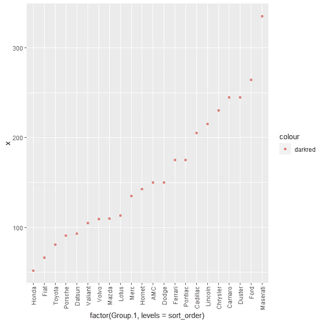
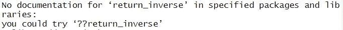
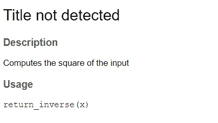
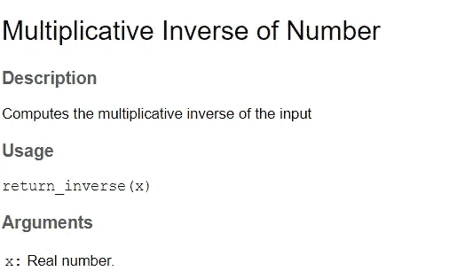

# 编写更好的 R 函数—最佳实践和技巧

> 原文：<https://towardsdatascience.com/writing-better-r-functions-best-practices-and-tips-d48ef0691c24>

## 了解一些常用的最佳实践和技巧，以使您的代码更具可读性，更易于他人调试


照片由 [Patrick](https://unsplash.com/@pf91_photography) @Unsplash.com 拍摄

大多数情况下，编写代码是一项协作工作。即使你是一个人在工作，写干净易读的代码只会让你的未来免于一些真正棘手的问题。

如果您没有软件工程背景(大多数数据科学家和分析师都没有)，您可能需要一段时间才能理解编写干净的代码是优秀数据专业人员最重要的特征之一。当你的级别更高，需要更频繁地查看别人的代码时，这种感觉也会发展起来。

如果你用 R 或 Python 编程，你肯定会偶然发现函数的概念。函数是使我们的代码可重用和模块化的主要特性，使得从头构建更容易。如果没有函数，您可能会构建混乱的脚本，难以维护、调试和传递给其他开发人员。

然而，编写函数并不是干净代码的灵丹妙药。即使你把所有的代码都放到函数中，仍然有很多事情会让你的脚本难以理解和调整。

因此，在这篇文章中，我们将探索一些很酷的最佳实践，它们将增强你的 R 函数。这些技巧涵盖了从文档和样式到整体代码结构的各个方面，应该会在下次您必须构建一些 R 脚本时对您有所帮助。

我们开始吧！

# 缩进，缩进，缩进

与 Python 相反，R 不需要适当的缩进就能工作。例如，下面的函数就很好:

```
print_names <- function(vector_names) {
for (name in vector_names) {
print(paste(‘Hello’,name))
}
}
```

但是读起来超级费劲。

循环从哪里开始？循环内部是什么？我们在迭代什么？缩进函数是读者查看代码的一种优雅方式，例如:

```
print_names <- function(vector_names) {
  for (name in vector_names) {
    print(paste('Hello',name))
  }
}
```

该函数的工作方式完全相同，但更清晰、更容易理解。你可以按照空格来检查循环插入的位置以及它在函数中是如何表达的。

缩进的另一个很酷的用法是当我们调用有很多参数的函数或者使用嵌套函数时。例如，假设下面的函数使用`mtcars` dataframe 根据`rownames`创建一个`brand`列:

```
get_car_brand <- function(car_model) {
 car_brand <- sapply(strsplit(car_model, ‘ ‘), ‘[‘, 1)
 return (car_brand)
}
```

嵌套函数有点难以理解，因为我们使用了`sapply`和`strsplit`的组合。我们可以利用缩进使函数更具可读性:

```
get_car_brand <- function(car_model) {
  car_brand <- sapply(
      strsplit(car_model, ' '), 
      '[', 
      1
    )
  return (car_brand)
}
```

适应这种向函数中输入参数的方式可能需要一段时间。但是，如果您最终没有使用 apply `%>%`，这是读取嵌套函数的一种更干净的方式。

# 长函数上的短函数

如果你有一个太长的函数，把它分解成更容易理解和调试的小的子函数。

让我们再次以`mtcars`数据帧为例。使用下面的函数，我们可以:

*   在`mtcars`数据框架上创建汽车品牌；
*   通过`brand`聚合`hp`；
*   在散点图中按品牌绘制马力；

```
plot_average_horsepower_brand <- function(cars_df) {

  cars_df_copy <- cars_df

  cars_df_copy['car_brand'] <- sapply(
    strsplit(rownames(cars_df_copy), ' '), 
    '[', 
    1
  )

  aggregate_brand <- aggregate(
    cars_df_copy$hp,
    by = list(cars_df_copy$car_brand),
    FUN = mean
  )

  sort_order <- factor(
    aggregate_brand[order(aggregate_brand[,'x']),]$Group.1
  )

  ggplot(
    data = aggregate_brand,
    aes(x=factor(Group.1, levels=sort_order), y=x, color='darkred')
  ) + geom_point() + theme(axis.text.x = element_text(angle = 90, vjust = 0.5, hjust=1)) 
}
```

如果我调用`plot_average_horsepower_brand(mtcars)`,这个函数将起作用，并将产生如下的图形:



按品牌列出的平均马力—按作者列出的图片

此功能的主要问题是什么？它试图在同一块代码中做所有的事情，这使得调试更加困难。可以说，当你看到我们在里面做了这么多事情时，有点不知所措。

我们可以用几种策略来解决这个问题。一个很酷的方法是将代码分解成更小的块，使其可重用和模块化，例如:

```
create_brand <- function(cars_df) {

  brands <- sapply(
      strsplit(rownames(cars_df), ' '), 
      '[', 
      1
    )

  return (brands)}mean_by_variable <- function(df, agg_var, by_var) {

  aggregate_brand <- aggregate(
    df[,agg_var],
    by = list(df[,by_var]),
    FUN = mean
  )

  return (aggregate_brand)

}plot_sorted_scatter <- function(cars_data, agg_var, by_var) {

  # Add Brand
  cars_data$brand <- create_brand(cars_data)

  # Create Aggregation
  agg_data <- mean_by_variable(cars_data, agg_var, by_var)

  # Sort 
  sort_order <- factor(
    agg_data[order(agg_data[,'x']),]$Group.1
  )

  ggplot(
    data = agg_data,
    aes(x=factor(Group.1, levels=sort_order), y=x, color='darkred')
  ) + geom_point() + theme(axis.text.x = element_text(angle = 90, vjust = 0.5, hjust=1))

}plot_sorted_scatter(mtcars, 'hp', 'brand')
```

您可能想知道我们的代码是否过于复杂。但是通过模块化，我们可以:

*   更容易调试。如果我在创建汽车品牌时需要改变什么，我只需查看`create_brand`。如果我需要更改我在聚合中使用的函数，我只需更改`mean_by_variable`。
*   扩展其他变量或图的逻辑。
*   更容易地向`plot_sorted_scatter`添加额外的步骤。

对于大多数编程语言来说，将函数分解成更小的函数是一种通用的最佳实践。在 R 中，没有什么不同，当你让脚本休息一会儿，然后再拿起时，你会感觉到不同。

# 利用文档字符串

其核心是，您可以通过在 R 函数上添加注释来记录它们。对于更复杂的函数，你想详细解释参数，这是不切实际的。另一个挫折是，如果我们不使用一个小技巧，当我们提供一个`?custom_function`时，R 不能访问文档(接下来解释这个！).

例如，如果我们做一个函数，返回一个数的乘法逆运算，比如:

```
return_inverse <- function(x) {
  #' Computes the multiplicative inverse of the input
  return(1/x)  
}
```

稍后呼叫:

```
?return_inverse
```

我们将在 R 控制台上看到一个错误:



我们希望访问`Computes the multiplicative inverse of the input`，就像我们从其他内置(或外部库)函数中访问文档一样。

幸运的是，我们可以使用`docstring`为我们的函数提供更高级的文档，这将帮助其他人更好地调试您的代码。例如:

```
library(docstring)
?return_inverse
```

注意:您可能需要重启 R 来访问功能文档(加载`docstring`后)。上面的代码现在将返回:



尽管并不完美，但我们现在可以在环境中的任何地方访问我们的`return_inverse`的特定文档。很酷的想法是，我们甚至可以利用参数来使文档更好:

```
return_inverse <- function(x) {
  #' Multiplicative Inverse of Number
  #' 
  #' [@description](http://twitter.com/description) Computes the multiplicative inverse of the input
  #' 
  #' [@param](http://twitter.com/param) x: Real number.
  return(1/x)

}?return_inverse
```

这将产生非常酷的东西——我们函数的大量文档！



`docstring`非常酷，因为它帮助你为一个函数构建文档，这个函数模仿了大量的 base R 代码文档。你可以在这里查看更多关于`docstring` [的信息](https://cran.r-project.org/web/packages/docstring/vignettes/docstring_intro.html)，包括我没有提到的额外参数。

# 显性回报与隐性回报

您可能会注意到，在我的整个函数中，我大多使用显式返回(使用`return`关键字在函数末尾包装最后一个对象)。请记住，这更多的是个人偏好，而不是适当的“最佳实践”。

但是，可以说，显式返回更有利于读者理解每个函数的结果。有时，查看函数的最后一条指令可能会令人困惑。

例如，以下两个函数将产生完全相同的结果:

```
create_brand_explicit <- function(cars_df) {
  brands <- sapply(
    strsplit(rownames(cars_df), ' '), 
    '[', 
    1
  )
  return (brands)
}create_brand_implicit <- function(cars_df) {
  sapply(
    strsplit(rownames(cars_df), ' '), 
    '[', 
    1
  )  
}
```

支持显式返回的另一个理由是变量名可以向读者暗示你的代码做了什么。在更复杂的函数中，更容易将读者的注意力吸引到显式的 return 语句上。这方面的一个例子是函数`create_brand_explicit.`，通过声明该函数返回一个`brands`变量，用户应该期望该对象将包含关于数据帧中汽车品牌的数据。

# 不加载库

最后，不要在函数中加载库，总是将依赖项放在脚本的顶部。

例如，在我们使用了`ggplot2`的 plot_sorted_scatter 中，可能会有这样的诱惑:

```
plot_sorted_scatter <- function(cars_data, agg_var, by_var) { library(ggplot2)

  # Add Brand
  mtcars$brand <- create_brand(cars_data)

  # Create Aggregation
  agg_data <- mean_by_variable(cars_data, agg_var, by_var)

  # Sort 
  sort_order <- factor(
    agg_data[order(agg_data[,'x']),]$Group.1
  )

  ggplot(
    data = agg_data,
    aes(x=factor(Group.1, levels=sort_order), y=x, color='darkred')
  ) + geom_point() + theme(axis.text.x = element_text(angle = 90, vjust = 0.5, hjust=1))

}
```

虽然没有什么可以阻止你这样做，但是这被认为是一个不好的做法，因为你希望你的依赖关系在你的代码的开始被声明。这将让用户知道他们必须如何设置他们的系统，以便能够从上到下运行您的脚本——由于大多数 R 脚本依赖于外部库，这是帮助其他人获得与您在本地机器或服务器上获得的相同结果的关键。

感谢你花时间阅读这篇文章！我希望这对你将来的 R 脚本有用。

函数是编程语言中一个非常令人兴奋的概念。它们非常灵活，可以提高脚本的速度和模块化程度。学习这些最佳实践将有助于您更频繁地共享代码，并使其他人(或者更重要的是，您未来的自己)更容易使用代码！)来理解和调试你的函数。

***我在 Udemy 上建立了一个***[***R***](https://www.udemy.com/course/r-for-absolute-beginners/?couponCode=IVOSTUDENTSJUNE)***入门和一个*** [***学习数据科学的训练营***](https://www.udemy.com/course/r-for-data-science-first-step-data-scientist/?referralCode=IVOSTUDENTSJUNE) ***。这两个课程都是为初学者量身定做的，我希望你能在我身边！***


[数据科学训练营:你成为数据科学家的第一步](https://www.udemy.com/course/r-for-data-science-first-step-data-scientist/?referralCode=IVOSTUDENTSJUNE) —图片由作者提供

[](https://medium.com/membership/@ivopbernardo) [## 通过我的推荐链接加入 Medium-Ivo Bernardo

### 阅读我在 Medium 上的所有故事，了解更多关于数据科学和分析的信息。加入中级会员，您将…

medium.com](https://medium.com/membership/@ivopbernardo) 

以下是这篇文章中代码的要点: