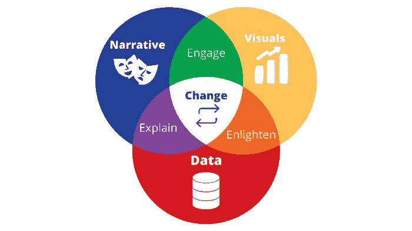

# 你想成为一名更好的数据科学家吗？开始写文章

> 原文：<https://towardsdatascience.com/writing-can-help-you-become-a-better-data-scientist-8b0f8adf74a5>

## 少数人拥有但许多数据科学家需要的技能。

图片来自 Shutterstock，授权给 Frank Andrade

日复一日，互联网上产生了大量的数据，但只有极少数人知道数据是什么，有什么用，为什么有价值。

这就是为什么每个数据科学家都需要教育他们的受众，以便让其他人知道他们的职业如何为他们工作的公司创造价值。

你可能擅长编码、分析数据和建立机器学习模型，但如果你不能够有效地沟通你作为数据科学家所做的事情，没有人会知道你提供的价值以及他们为什么需要你。

信不信由你，写作可以帮助你提高沟通技巧，了解更多关于数据科学的知识。让我们深入研究一下。

## 数据科学家为什么要写作？

数据无处不在。每天越来越多的数据是由像你我这样的普通人创建的，但非技术人员不知道数据实际上是什么，为什么它如此有价值。

这就是为什么数据科学家在每次演讲中都需要教育他们的观众。您可能需要描述数据，解释您如何使用它来开发模型(不要使用太多的术语)，并分享您的见解

没有良好的沟通技巧，你怎么能做到这一切呢？

公司拥有大量数据，他们需要数据科学家，这些科学家不仅能够理解和使用这些数据，还能与他人交流他们的见解。问题是，有时候那些有技术背景的人并不是最好的沟通者。

这就是写作能有所帮助的时候。

写作是一种有助于以可读的形式交流你的思想和观点的活动。说话是那么的自发，你根本没有时间去思考和阐述你的想法。然而，写作时你有足够的时间组织你的想法，写下来，甚至有机会在以后改进它们。

写作可以帮助你有效地传递思想。一旦你变得擅长写作，在演示或会议中解释你的想法会变得更加自然和流畅。

## 数据科学和写作有什么共同点？讲故事！

做好演讲的关键之一是吸引你的观众。要做到这一点，你需要有良好的沟通技巧。

如果你的听众不太了解数据科学，你的演示太专业，缺乏可视化，你的听众将不会理解你在说什么，并在精神上离开你。

写作也是如此。如果你文章的引言和正文不能让你的读者相信你的文章值得他们花时间，他们会离开的。

为了提高我们在演讲或写文章时的沟通技巧，我们需要学习讲故事的艺术！

作者图片

好的讲故事有三个要素:好的叙述、可视化和数据。

擅长讲故事的最好方法是练习。为此，你通常需要定期面对观众，像在工作中做演示一样解释事情。

然而，我们大多数人没有听众来练习，也没有时间去参加公开演讲课程。在这里，写作可以有所帮助。

你可以在一篇文章中实现讲故事的三个要素。假设您正在进行一个项目，以检测潜在的欺诈，并希望在一篇数据科学文章中解释您的分析。我们是这样做的。

首先，我们要为我们的观众使用正确的叙述。如果他们不太了解这个话题，在介绍中，我们用简单的英语解释这个项目是关于什么的。然后，在文章的主体，我们描述数据，我们使用可视化来增加参与度，并分享我们的见解。最后，在结论中，我们总结了文章最重要的一点。

一篇文章的结构和一个演示文稿很相似，不是吗？您可以将一篇数据科学文章视为您的演示文稿的脚本！

## 写作对你作为数据科学家的职业生涯有什么帮助？

写作可以通过不同的方式提升你作为数据科学家的职业生涯。

首先，正如我们之前提到的，写作会提高你的沟通能力。如果你学会了如何在写作时讲故事，那么在观众面前演讲时讲故事会变得容易得多。

第二，你可以在简历中包含你的数据科学文章的链接。如果文章写得好，解释得好，招聘人员会看到你有良好的沟通技巧，所以你获得工作面试的机会会增加。大多数招聘人员没有技术背景，所以他们不会在 Github 上检查你的代码，但会阅读你的文章以更好地了解你的项目。

最后，当你写一篇文章时，你会更加意识到你的工作。您可以发现弱点，并发现需要更多研究的部分，或者可以成为另一篇文章的新主题。

就是这样！现在是你开始写第一篇文章的时候了。

[**代码少，赚得多:获取我的免费电子书来赚钱写数据科学文章。与 10k+人一起加入我的电子邮件列表。**](https://frankandrade.ck.page/3b520320ac)

如果你喜欢阅读这样的故事，并想支持我成为一名作家，可以考虑报名成为一名媒体成员。每月 5 美元，让您可以无限制地访问数以千计的 Python 指南和数据科学文章。如果你用[我的链接](https://frank-andrade.medium.com/membership)注册，我会赚一小笔佣金，不需要你额外付费。

<https://frank-andrade.medium.com/membership> 