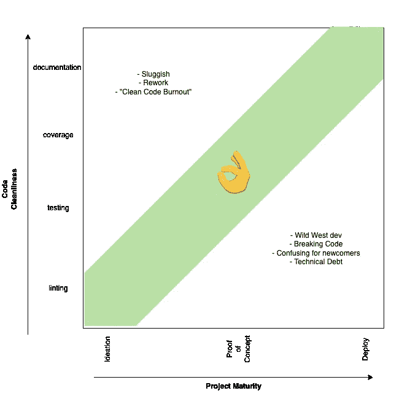
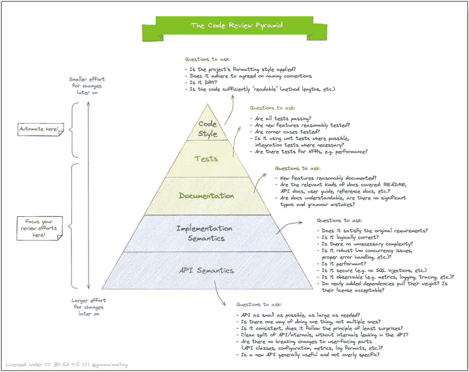
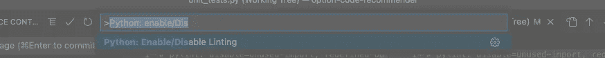
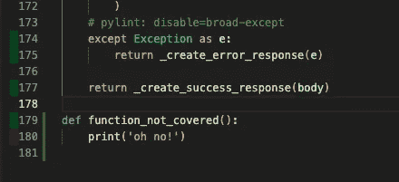
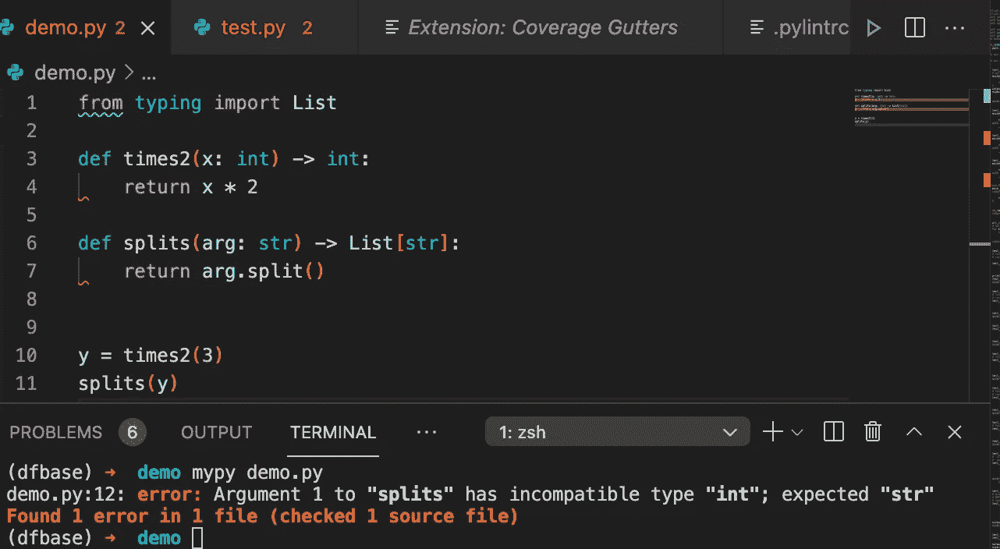

# 为数据科学家编写简洁的 Python 代码

> 原文：<https://towardsdatascience.com/writing-clean-python-code-for-data-scientists-3448c162ac01>

你是数据科学家，想用 Python 写干净的代码吗？那你来对地方了。写出好的代码需要很多东西。作为一名数据科学家，您可能会做大量 R&D / PoC 类型的工作，这需要您快速行动。因此，你在写好代码和快速前进之间走着一条微妙的路线。这种平衡是一种艺术形式，你必须为自己发展并适应你的情况。项目构思和部署之间有很大的灰色地带。但是随着你的项目变得越来越大，越来越接近部署，你就越想确保你写的是干净的、可持续的代码。这是我制作的一张图片，试图概括这种平衡。

项目生命周期中干净代码的平衡

下面是一个非常酷的图形，展示了编写好代码的各个层次。因为这篇文章的缘故，我将把重点放在这个金字塔的最上面两层，(单元)测试和代码风格。

TLDR，我将集中讨论你今天可以做的四件事来写更干净的代码。最后，我将谈谈如何实现这一过程的自动化，以及我个人如何在自己的工作中找到整洁和快速之间的平衡。

# 格式化程序— autopep8

*   格式化程序关心的是*样式和*是否符合 PEP8 定义的基本编码标准。
*   理想情况下，您应该知道编码标准并编写已经符合的代码。但是我们并不都是完美的，所以这就是格式化程序的作用。然而，如果你想在 autopep 警告你之前知道格式化你的代码的正确方法，请查看:【https://realpython.com/python-pep8/
*   怎么跑？简单。通过“pip 安装 autopep8”安装
*   然后用“autopep 8-r-a-a-in-place<foldername>运行</foldername>
*   r 将在整个目录中递归运行。-a 会让它变得有攻击性。—就地将就地更改文件。
*   最后一个技巧:您还可以设置 vscode 使用 autopep8 格式化程序并在保存时格式化！

# 棉绒——皮林

*   Linter 就像一个更加固执己见的格式化程序。它也更聪明一点。linter 可以捕捉潜在的错误，比如变量没有被定义，以及许多其他问题。
*   我为 Python 使用的 linter 是 pylint。linter 有很多规则和配置选项。您可以通过在项目目录中包含一个. pylintrc 来自定义所有这些参数。而不是自己写。pylintrc，我推荐从大 G 自己做的一个开始: [google pylintrc](https://raw.githubusercontent.com/google/seq2seq/master/pylintrc) 。
*   要安装，只需“pip install pylint”并运行“pylint <foldername>”</foldername>
*   还可以设置 vscode 来使用 pylint。只需使用热键 ctrl+shift+p 来打开命令 pallete，并键入“Python: enable/disable 林挺”来启用它。

*   这里的最后一点是，您可以在任何一行使用“# pylint: disable=”来忽略下面一行，从而忽略 pylint 错误。只要把你想忽略的错误的名字放在等号后面。比如“missing-function-docstring”。您也可以将此注释放在文件的顶部，以忽略整个文件。

# 测试— pytest

好了，开始测试的一个很好的地方就是为你的函数写很多断言语句。如果您还不想创建单独的测试文件，只需在文件底部的 If 语句子句中编写一些断言，如下所示:

if __name__ == "__main__ ":

断言 my_function() == "预期输出"

理想情况下，试着想出任何边缘情况并测试它们。你的目标是获得 100%的覆盖率，这意味着在你所有的测试中，你写的每一行代码都会运行。我们很快会谈到更多关于覆盖率的内容。

特别要注意的是你所有的“如果”语句，尽量确保你的测试会触发这些子句。

好了，现在你已经写好了你的断言语句，只是

*   创建一个 test.py 文件(文件名无关紧要)
*   在该文件中，创建一个以“test_”开头的函数，例如“def test_my_function():”
*   将您断言语句移到该函数中
*   > pip 安装 pytest
*   > pytest test.py

Pytest 将在该文件中查找任何以“test_”开头的函数并运行它们。如果 assert 语句的计算结果不为 true，pytest 会让您知道。

# Pytest —更多高级功能

## 固定装置

如果您有一段代码需要一段时间才能运行，您可以使用“fixtures”来确保您只在测试中运行这段代码一次，然后在其他测试中重用结果。你只需要给函数添加一个装饰器，这需要一段时间来运行。见[这里](https://www.tutorialspoint.com/pytest/pytest_fixtures.htm)一个简单的例子。

## 嘲弄的

单元测试是关于测试代码的“单元”(与用于确保整个管道运行良好的集成测试相反)。如果你有一个 API 调用，DB 调用或者其他一些你不想在你的单元测试中测试的外部依赖，但是你需要它们的输出来运行你的函数，你可以使用“嘲讽”。模仿是通过简单地包含一个

" mocker . patch(' path . to . function . to . mock '，return_value=5)"

在调用调用该函数的代码之前，在测试函数中调用。

这里见简单教程[。确保您首先“pip install pytest-mock”！](https://changhsinlee.com/pytest-mock/)

## 新闻报道

> pip 安装 pytest-cov

还记得我在上面说过要试着写一些在某个时候会用到/覆盖你所有代码的测试吗？嗯，有一种自动的方法可以知道我们覆盖了多少代码！超级简单。假设您正在构建一个名为 my_package 的 python 包，并且您有一个名为 my_tests 的测试文件夹。您可以在您的包上运行所有的测试，并使用下面的命令获得结果覆盖率(从 0 到 100%)。

> pytest — cov=my_package my_tests

它会把你的结果打印到终端上。但是等等，还有呢！通过运行以下命令，您可以写出一个. xml 文件，其中包含关于哪些行被覆盖和缺失的所有数据(注意，在双破折号之前应该有空格)。

> pytest-cov = my _ package-cov-report = XML my _ tests

如果你使用的是 vscode，你可以安装一个名为“Coverage Gutters”的扩展，并可视化哪些行被覆盖了！超级酷。

“Coverage Gutters 扩展”的演示。左边的红色高亮显示的是第 180 行没有经过测试。

# 静态类型— mypy

我知道我们已经谈了很多，但我还有一个问题要告诉你。所以你知道 python 通常不使用类型。然而，类型提示不久前作为“更正式的注释”被引入。它们对代码的可读性非常有帮助。事实证明，它们不仅仅可以提高可读性。它们实际上有助于在运行前捕捉错误！

> pip 安装 mypy

> mypy my_package

Splits 应该带一个 str，但是我们给它传递了一个 int。这将导致引发 TypeError 运行时异常。使用 mypy，我们能够提前发现这个错误！

# 额外提示—目录结构

这最后一个技巧很简短。基本上，我只是想链接到另一篇关于好的[目录结构](https://docs.python-guide.org/writing/structure/)的文章。拥有一个好的结构会让你看起来像一个专家，让项目的新来者更容易知道在哪里找东西，并且让在你的计算机上设置路径变量变得更容易。

# 持续集成/开发(CI/CD)

我们已经讨论了很多了。为了使这个主题完整，我应该谈谈如何通过使用 CI/CD 工具(如 Github actions)来自动化我们在这里讨论的一切。然而，这可能是(也确实是)一个值得单独写一篇文章的主题。所以暂时就这么说吧。只要适合你，我就会经常运行这 4 个命令，不会拖慢你的“速度”，但足够经常到你可以为你干净的代码感到自豪的程度。

> autopep8 -a -a -r —就地 my_package

> pylint **/*。巴拉圭

> mypy my_package

> pytest—cov = my _ package—fail-on = 100 my _ tests

对我来说，这意味着我要运行这四个命令，并确保它们在我提交 PR 之前都通过。我发现，如果我在尝试开发新功能的过程中过于担心样式、静态类型或测试，我可能会花太多时间来使代码变得漂亮，而我可能会扔掉这些时间。祝你的发展之旅好运！