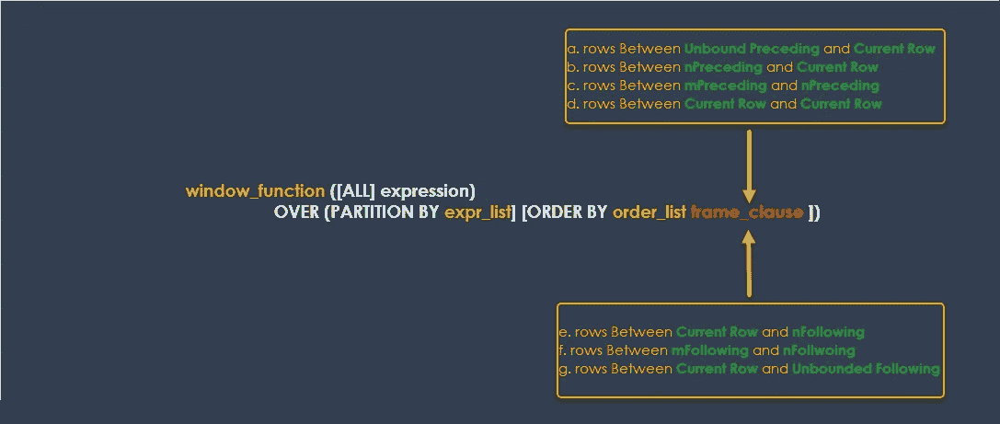
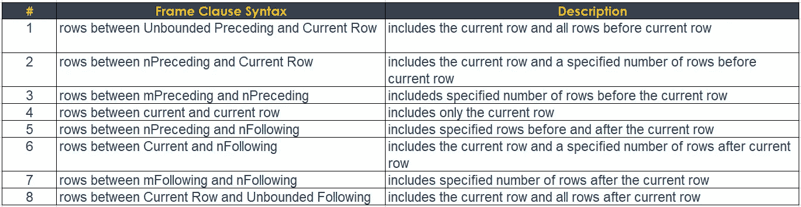
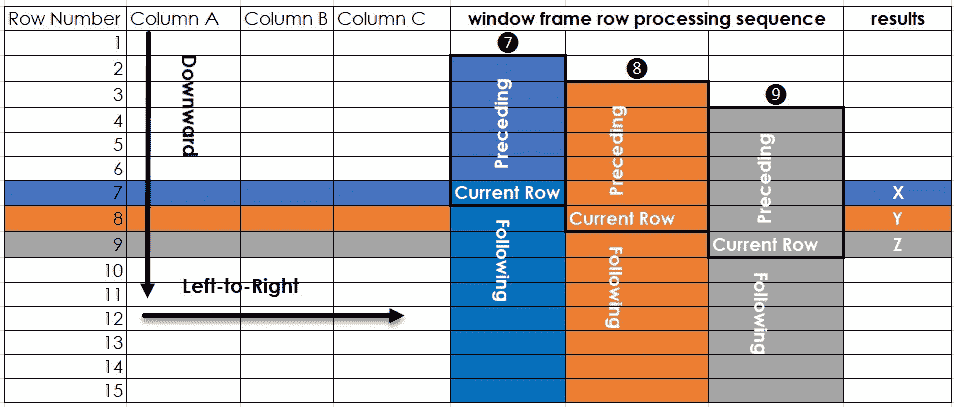
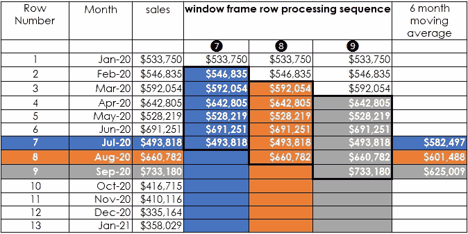
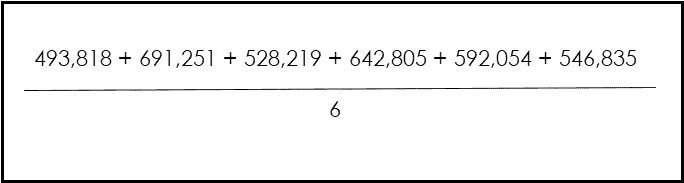
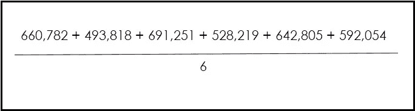
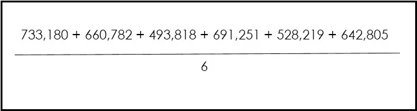
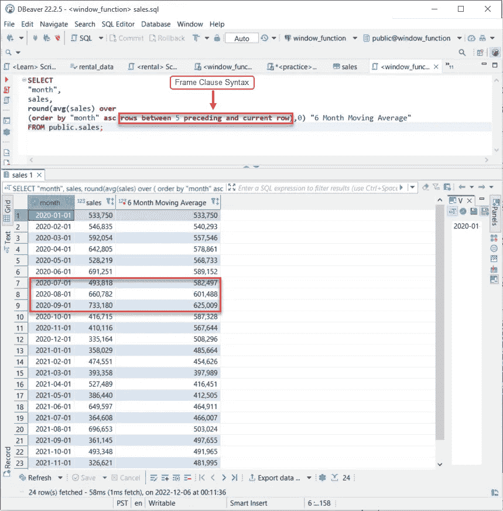

# 用 Frame 子句编写窗口函数

> 原文：<https://towardsdatascience.com/writing-window-functions-with-the-frame-clause-e91ada9da8b9>

## 辅导的

## 计算 6 个月移动平均值

佩克斯·马体·米罗什尼琴科

当我看着我所做的工作时，我认为自己是一名建筑工人。像大多数建筑工人一样，我有工作时使用的工具。我越了解这些工具，工作就越容易做。其中一个工具是窗口功能。我喜欢它的多功能性；它分割、切割和控制数据的能力。

在本教程中，我们将深入研究窗口函数中的**框架子句**。我们使用 frame 子句来控制计算中包含的行数。我们在使用**集合窗口函数**或某些**值窗口函数**时会发现框架子句。本教程假设你对窗口函数有基本的了解。如果你是窗口函数新手，推荐阅读 **SQL 窗口函数**，一段爱恨情仇。

</sql-window-functions-78593bcabf4>  

当处理数据时，窗口函数是一个强大的工具。为了帮助解释**框架子句**，我展示了如何使用它来计算一个 **6 个月的移动平均值**。

## 数据:如何访问它？

要跟进，您可以通过以下方式访问数据:

*   [点击此处](https://form.jotform.com/223404174362045)，我将向您发送用户名和密码以及如何访问数据的说明，以便您直接查询数据库。我有几个用户座位。注册无需付费，也不会收集个人信息。我正在探索新的方法来帮助读者轻松地接触这些材料。
*   直接从[这里](https://github.com/bensondavies/DataFiles/blob/main/sales_revenue.csv)下载一个 csv 文件，这样你就可以把它上传到你自己的数据库。

现在我们已经知道了，我们可以更深入地了解窗口函数中的**框架子句**。

## 框架子句:是什么？

窗口功能，作者

框架子句确定包含在窗口函数计算中的行。我使用术语**计算**作为提醒，窗口函数产生一个数值结果**和**在**框架子句**中指定的行确定结果。这才是真正的重点。**你**可以通过使用**框架子句**来控制窗口函数的**结果**。

frame 子句具有以下语法:

框架子句语法，作者

## 框架条款:大局！

从概念上来说，我发现把窗口框架想象成从左到右向下执行是很有帮助的。**向下**走到下一排。**从左到右**在向下到下一行之前填充结果列。

窗口框架执行，作者

在我们的示例中，假设处理从第 7 行开始:

*   第 7 行(蓝色):窗口框架包括当前行(第 7 行)和之前的 5 行(第 2-6 行)，用于确定窗口函数结果， **X** 。一旦该列填充了结果，处理**继续向下**并到达下一行**第 8 行**。
*   第 8 行(橙色):在第 8 行，重复该过程，窗口框架包括当前行(第 8 行)和前面的 5 行(第 3-7 行)，以确定窗口函数结果， **Y** 。一旦该列填充了结果，处理**继续向下**到下一行**第 9 行**。
*   第 9 行(灰色):在第 9 行，重复该过程，窗口帧包括当前行(第 9 行)和前面的 5 行(第 3-7 行)，以确定窗口函数结果， **Y** 。一旦该列填充了结果，处理继续到下一行，**行 10** 。

处理继续向右下方进行，直到到达最后一行。**要点**要记住:

*   框架将**向下移动**并在每行处理后将**结果列填充到右侧**。
*   **当前行**随着每行的加工而变化。

## 框架条款:计算 6 个月移动平均线

销售示例，作者

在我们的例子中，对于上面显示的数据，我们假设语法是“前 5 行和当前行之间的行”。处理从第 7 行开始。

*   第 7 行(蓝色):窗口框架包括当前行(第 7 行)和前面的 5 行(第 2-6 行)，以确定 6 个月的移动平均值$582，497。6 个月移动平均线的计算如下。一旦该列被填充，处理继续向下进行到 r **ow 8。**

*   第 8 行(橙色):在第 8 行，重复该过程，窗口框架包括当前行(第 8 行)和前面的 5 行(第 3-7 行)，以确定 6 个月的移动平均值$601，488。6 个月移动平均线的计算如下。一旦该列被填充，处理继续向下进行到 r **ow 9。**

*   第 9 行(灰色):在第 9 行，重复该过程，窗口框架包括当前行(第 9 行)和前面的 5 行(第 4-8 行)，以确定 6 个月的移动平均值$625，009。6 个月移动平均线的计算如下。一旦该列被填充，处理继续从左到右向下进行到最后一行**。**

## 我们的场景

下面的例子中的数据包括按月的销售收入。目的是使用**框架条款**计算 6 个月移动平均线。说完这些，让我们在 SQL 编辑器中深入研究一下代码。对于 6 个月移动平均线**，**，我们使用**平均窗口函数**，并将**框架子句**设置为“前 5 行和当前行之间的行”。这里，我们也按升序对月份进行排序，因为我们希望从最早的日期到最后的日期进行聚合。

当查询运行时，它会在 SQL 编辑器中显示结果。突出显示的第 7–9 行与前面解释中共享的结果相匹配。我建议通过下载数据集或请求用户名和密码来练习。暂时就这样了。继续成长、学习和发展。

***分享的灵感*** *:每一次分享的关键一击和教训，都让我想起我以前的同学，当时的经理，索菲亚。她用自己的语言、善良、专注和领导力帮助我重拾信心。当我结束为她工作时，我觉得我可以飞黄腾达了。直到今天，我还在惊叹她和她丈夫亚伯的善良。每一天都是让别人的生活变得更好的机会。拿着！*