# 神经网络中的 Xavier Glorot 初始化——数学证明

> 原文：<https://towardsdatascience.com/xavier-glorot-initialization-in-neural-networks-math-proof-4682bf5c6ec3>

## 使用 *tanh* 激活函数寻找深度学习层中权重矩阵的最佳初始分布的详细推导

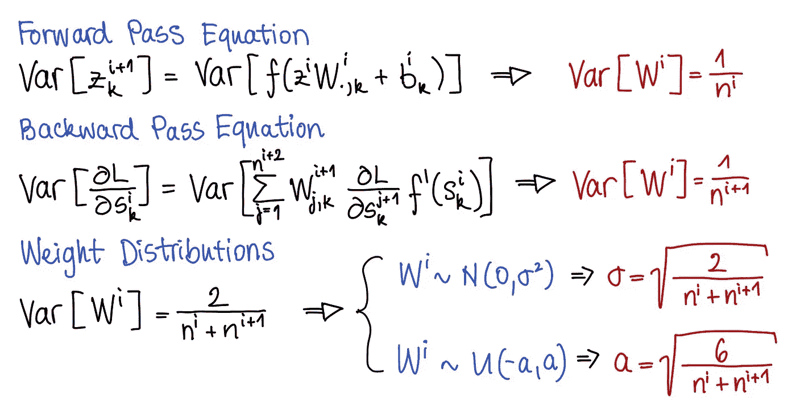

Xavier Glorot 的初始化是神经网络中初始化权重矩阵的最广泛使用的方法之一。虽然在实践中，它很容易在您的深度学习设置中使用，但思考这种标准初始化技术背后的数学推理可以证明是最有益的。此外，在机器学习面试中经常会问对这种方法的理论理解，知道这种推导提供了一个展示你知识深度的好机会。

基于 Xavier Glorot 等人(2010)的论文“*理解训练深度前馈神经网络的困难”* ⁽ ⁾”，我们提供了详细的三步数学推导:前向传递方程、后向传递方程和权矩阵分布的推导。Xavier Glorot 初始化通常与 *tanh* 激活函数一起使用，该函数满足证明所需的所有假设。

## 注释

*   具有权重矩阵 *Wⁱ* 和偏置向量 *bⁱ* 的神经网络由一组两个连续的变换组成: *sⁱ = zⁱ Wⁱ + bⁱ* 和 *zⁱ ⁺ = f (sⁱ)*
*   一层有 *nⁱ* 单位，于是有 *zⁱ∈ ℝⁿ⁽ⁱ⁾、*∈ℝⁿ⁽ⁱ⁾*ⁿ⁽ⁱ*⁺*⁾、bⁱ∈ℝⁿ⁽ⁱ*ₙ*ₙ*
*   *zⁱ Wⁱ+bⁱ* 有维度(*1×nⁱ)×(nⁱ×nⁱ*⁺*)+1×nⁱ*⁺*= 1×nⁱ*
*   **f* 是一个基于元素的函数，因此它不会影响向量的形状，而*zⁱ*⁺*= f(zⁱwⁱ+bⁱ)∈ℝⁿ⁽ⁱ*⁺*⁾**
*   *对于深度为 *n* :
    *的神经网络，z⁰* 为输入层， *zⁿ* 为输出层*
*   **L* 是神经网络的损失函数*

## *假设*

*   **假设 1* :
    我们假设用于特定层的激活函数为*奇数*，单位导数为 0:*f '(*0)*=**1*。回想一下，一个*奇数*函数被定义为 *f(-x) = -f(x)。*Glorot 初始化使用的一个常用激活函数是 *tanh* ，因此，我们需要验证该函数是否满足上述假设:*tanh '(x)= 1-tanh(x)**tanh '(0)= 1–0 = 1**
*   **假设 2:*
    我们假设初始化时的所有输入和所有层*都是 *iid，即*独立、同分布*、*，因此权重和梯度也是如此。**
*   **假设 3:*
    我们假设输入用零均值归一化，权重和偏差按照以零为中心的分布初始化，
    *即𝔼[z⁰] = 𝔼[Wⁱ] = 𝔼[bⁱ] = 0。*由此及 *f* 在零点的线性度得出 *zⁱ* 和 *sⁱ* 在初始化时都有一个零期望值。*

## *动机*

*该证明的目的是在给定两个约束条件的情况下，通过确定 *Var[W]* 来找到权重矩阵分布:*

1.  *∀ *i，var[zⁱ]=var[zⁱ*⁺*，
    *即*正向信号是恒定方差流动的**
2.  **∀ *i，var[∂l/∂sⁱ]=var[∂l/∂sⁱ*⁺*，
    即*反向信号以恒定的方差流动**

**为了防止神经网络中梯度的爆炸和消失，上述两个等式帮助我们保证，在初始化时，层和梯度的方差在整个网络中是恒定的，*即*信号增益正好是 1。相反，如果增益*高于*1，则可能导致梯度爆炸和优化发散，而信号增益*低于*1，则可能导致梯度消失并停止学习。**

# **数学证明:Xavier Glorot 初始化**

## **一、向前传球**

**我们正在寻找 *Wⁱ* ，使得每个后续层 *z* 的方差相等，*即**var[zⁱ]=var[zⁱ*⁺*。***

**我们知道 *zⁱ* ⁺ *= f (zⁱ Wⁱ + bⁱ).***

**为了简化即将到来的计算，我们首先在等式两边的索引 *k* 处应用方差运算符。请注意，每个输出神经元依赖于来自输入层的所有输入神经元。因此，当取 *zⁱ* ⁺ 的元素 *k* 时，整个向量 *zⁱ* 被用于计算。这就是为什么 *z* 仅在等式左侧的 *k* 处步进。**

**我们现在详细分析这个推导背后的步骤:**

**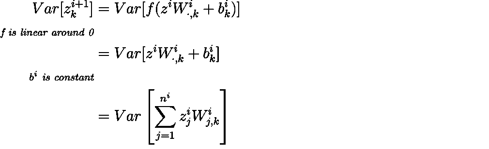**

*   **第一步，遵循前面说的*假设 1* ，给定 *f* 在 0 有一个单位导数，并且是奇数，我们可以在 0 附近近似 *f(x)* ≃ *x* 。然后， *zⁱ Wⁱ + bⁱ* 是假设在初始化时在 *0* 附近，因为 *Wⁱ* 和 *bⁱ* 是从以 0 为中心的分布中采样的，并且 *z⁰、*神经网络的输入向量由于输入归一化而被假设为归一化的。因此，每个随后的层 *zⁱ* 在预期中将为 0。**
*   **第二步，应用变量独立性下方差的可加性质，*即 Var[X+Y] = Var[X] + Var[Y]与 X* ⟂ *Y* ，
    和一个常数 *c* ，*的方差性质即 Var[c] = 0* ，我们知道 *Var[X+c] = Var[X]。*此外，为了清楚起见，我们将向量和矩阵乘法写成给定 *zⁱ∈ ℝⁿ⁽ⁱ⁾.的 *nⁱ* 元素的和***

*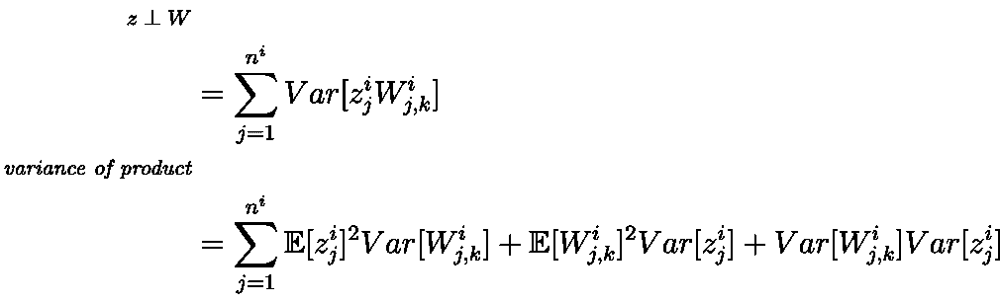*

*   *在第三步中，我们使用输入向量 *z* 和权重矩阵 *W* 之间的独立性 *z* ⟂ *W* 的假设，这是由于所有变量在初始化时是不相关的。在独立性下，和的方差是方差的和。*
*   *第四步，类似于方差和的规则，独立乘积的方差等于它们的方差加上两个涉及期望和方差的交叉项的乘积，
    *即 Var[XY]= Var[X]Var[Y]+E[X]**Var[Y]+E[Y]**Var[X]。**

*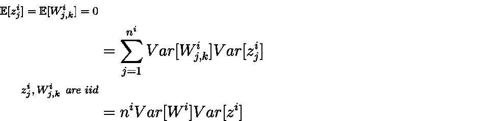*

*   *在第五步中，方程被很好地简化了，因为前两项被消除了，因为 *z* 和 *W* 都具有零均值。这是根据输入假设的标准化和从以零为中心的分布中对 *W* 的采样得出的。*
*   *在第六步中，我们注意到总和的每一项都是相同的，因为 *z* 和 *W* 是独立且同分布的，从而得出最终形式。*

*总之，分解了每个步骤后，下面是完整的推导过程，供再次回顾:*

*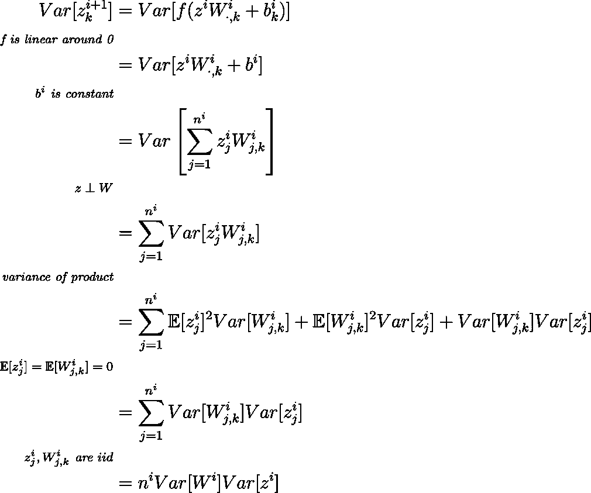*

*最后，这使我们得出前向传递证明的结论，即层的权重 *Wⁱ* 的方差是输入数量 *nⁱ* 的倒数。*

*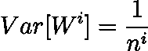*

*有趣的事实:上面的证明也是 LeCun 初始化的演示，最初由 LeCun 等人(1998)在⁽ ⁾的“高效反向投影”中介绍。*

## *二。偶数道次*

*我们正在寻找 *Wⁱ* 这样*var[∂l/∂sⁱ]=var[∂l/∂sⁱ*⁺*。**

*这里有*、sⁱ*⁺*=f(sⁱ)wⁱ*⁺*+bⁱ*⁺*，有 sⁱ∈ℝⁿ⁽ⁱ*̿*̿。**

*在应用方差算子之前，让我们先计算导数。*

*按链规则:*

*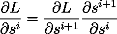*

*以矩阵形式:*

*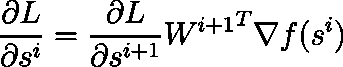*

*请注意这个等式两边每个矩阵和向量的维数:*1****×****nⁱ⁺=(1****×****nⁱ⁺****×****(nⁱ⁺*****×****nⁱ⁺***

**在下一步中，为了简化计算，我们使用元素表示法重写同一个等式。梯度现在变成导数，权重矩阵被截断到其第 *k* 列:**

****

**现在我们可以在两边应用方差。**

**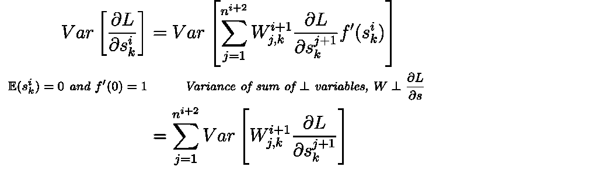**

*   **首先，让我们估计导数*f’。为了找到这一点，我们需要回顾一下，认识到 *sⁱ* 的期望值在初始化时是 0。这就简化了估算，因为我们知道 *f* 被假定为在 *0* 附近是线性的，其中 *f'(0) = 1。*因此， *𝔼[f'(sⁱ)] = 𝔼[f'(0)] = 1。****
*   *二、知道独立变量之和的方差等于方差之和，我们就可以把这个规律应用到右手边的方差上。*

*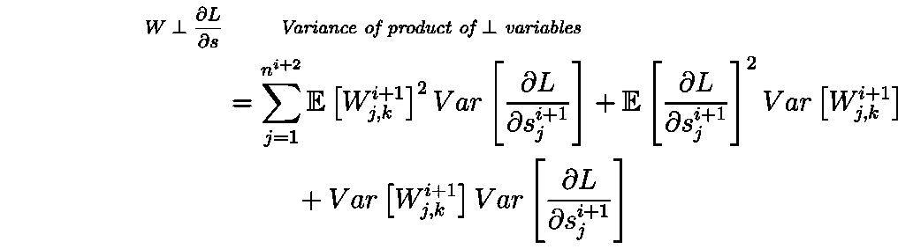*

*   *第三，应用自变量乘积方差的规则，*即 Var[XY]= Var[X]Var[Y]+E[X]**Var[Y]+E[Y]**Var[X]，*方程简化为个体期望和方差的乘积之和。*

*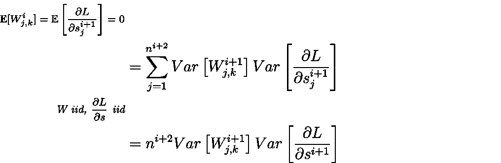*

*   *第四，由于两项的期望值都等于零，剩下的部分就是方差之和。*
*   *在第五步中，我们注意到总和的每一项都是相同的，因为 *L* 相对于 *sⁱ ⁺* 和 *W* 的偏导数是独立且同分布的。*

*总的来说，以下是所有的步骤供您再次回顾:*

*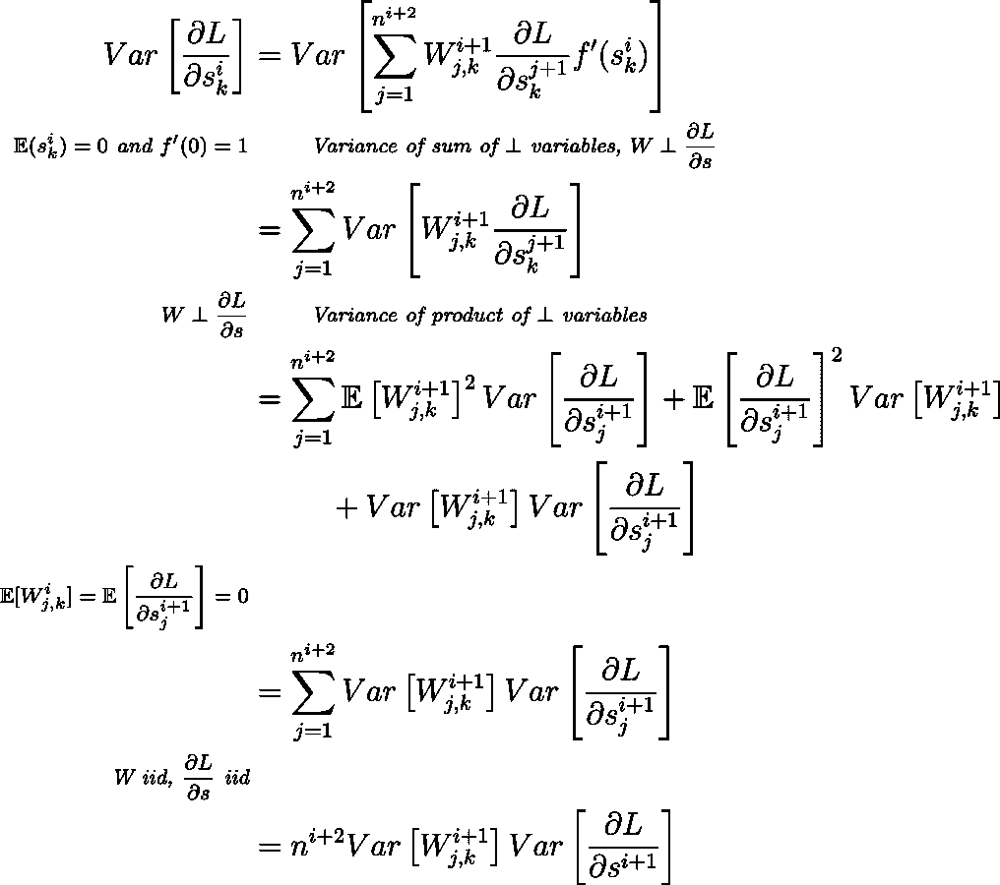*

*最后，我们得到以下结果:*

*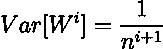*

## *三。重量分布*

*根据上述向前和向后传递的演示，我们得出两个结果:*

*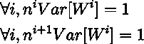*

*论文作者建议对最终结果的方差进行平均。主要理由来自于这样一个事实，即当神经网络具有相同宽度的后续层时(这是经常发生的情况)，两个等式得到满足，*即 nⁱ = nⁱ ⁺* 意味着平均结果满足前面两个等式。*

*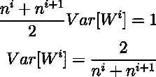*

*实际上，既然分布的方差是已知的，就用正态分布 *N(0，𝜎 )* 或均匀分布 *U(-a，a)* 来初始化权重。如上文*假设 3* 所述，选择的分布以 0 为中心是最基本的。*

*   ***为正态分布 *N(0，𝜎 )****

*如果 *X ~ N(0，𝜎)，*那么 *Var[X] = 𝜎* ，那么方差和标准差可以写成:*

*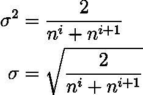*

*因此，我们可以得出结论， *Wⁱ* 遵循系数的正态分布:*

*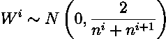*

*提醒一下， *nⁱ* 是该层的输入数， *nⁱ ⁺* 是该层的输出数。*

*   ***为均匀分布 *U(-a，a)* 为均匀分布***

*如果 *X ~ U(-a，a)* ，那么使用下面的服从均匀分布的随机变量的方差公式，我们可以找到界 *a* :*

*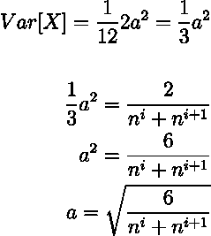*

*最后，我们可以得出结论， *Wⁱ* 遵循一个带系数的均匀分布:*

*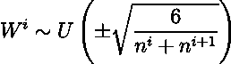*

## *结论*

*在本文中，我们提供了根据 Xavier Glorot 初始化查找权重矩阵分布的详细步骤。*

*给定一个单位导数为 0 的奇激活函数，如 *tanh* ，我们可以遵循这种方法来保证初始化时信号的最佳前向和后向传播，*即*在前向和后向传递中保持方差恒定。*

***引文**
(1)*[*理解训练深度前馈神经网络的难度*](https://proceedings.mlr.press/v9/glorot10a/glorot10a.pdf) 、Glorot *等* (2010)
(2) [*高效反向推进*](http://yann.lecun.com/exdb/publis/pdf/lecun-98b.pdf) 、LeCun *等* (1998)**

***来源:以上所有方程式和图片均为本人所有。***