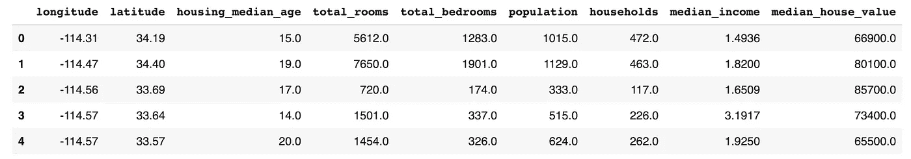
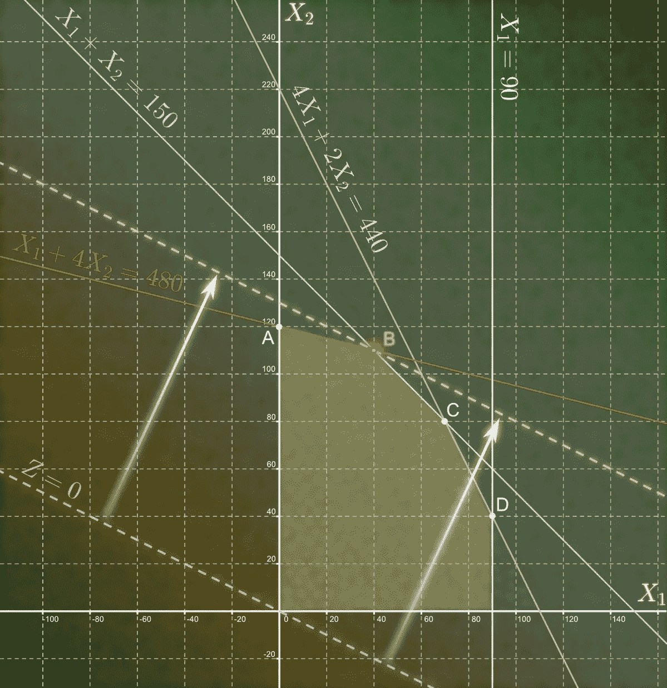
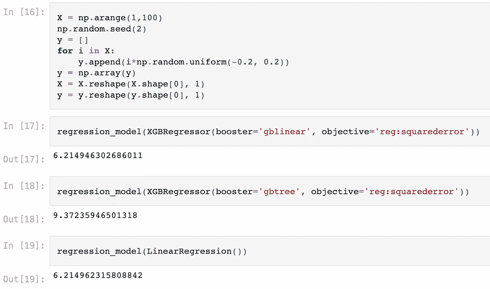

# XGBoost 备选基础学习者

> 原文：<https://towardsdatascience.com/xgboost-alternative-base-learners-a2dc72d97e64>

## dart、gblinear 和 XGBoost 随机森林简介

# 介绍

XGBoost 是“极限梯度提升”的缩写，是处理表格数据的最强的机器学习算法之一，由于成功赢得了众多 Kaggle 比赛，因此当之无愧的声誉。

XGBoost 是一种通常由决策树组成的集成机器学习算法。组成 XGBoost 的决策树分别被称为 *gbtree* ，是“梯度增强树”的缩写。XGBoost 集成中的第一个决策树是基础学习器，所有后续的树都从它的错误中学习。

尽管决策树由于其出色的集成分数而通常被首选为基础学习器，但是在某些情况下，备选的基础学习器可能会胜过它们。xd boost 包括 *gblinear* 、 *dart* 和 XGBoost Random Forests 作为备选的基础学习器，我们将在本文中探讨所有这些。

这篇文章是基于我的书第 8 章[用 XGBoost 和 Scikit-learn](https://www.amazon.com/Hands-Gradient-Boosting-XGBoost-scikit-learn/dp/1839218355) 实践梯度增强的新例子。鼓励不熟悉 XGBoost 的读者查看我以前的文章，[在 scikit-learn 中开始使用 XGBoost](/getting-started-with-xgboost-in-scikit-learn-f69f5f470a97)。下面的所有代码都可以在[这个 Colab 笔记本](https://colab.research.google.com/drive/16Nh7x5ZpP49oOhCcTBa_hMHppD8cd6CC?usp=sharing)里找到。


照片由邓肯 C，Flickr[https://www.flickr.com/photos/duncan/99863704](https://www.flickr.com/photos/duncan/99863704)

# 什么是基础学习者？

理解基础学习者首先需要理解助推。[根据 Michael Kearns 1998 年的文章《关于假设增强的思考》，](https://www.cis.upenn.edu/~mkearns/papers/boostnote.pdf)增强器是一种机器学习算法，旨在将弱学习者转化为强学习者。这是什么意思？

假设一个数据集将所有输出分类为红色或蓝色，您构建一个决策树，该决策树的正确预测率为 50%。显然，这并不比随机猜测好多少。但是如果决策树 51%的时候是正确的呢？假设真正的学习已经发生，这个弱学习者可以通过建立在已经发生的学习之上而转变成强学习者。

所有的提升组合都是从基础学习者开始的。它被称为“基础”是因为它排在第一位，被称为“学习者”是因为集合中的所有后续模型都从它的结果中学习。

在 XGBoost 中，在构建第一个决策树模型(称为基础学习器)之后，第二个模型根据第一个模型的错误(也称为残差)进行训练。然后根据第二个模型的误差训练第三个模型。然后，第四个模型根据第三个模型的错误进行训练，以此类推，大约一百棵树。

与随机森林不同，随机森林采用多个决策树的平均值，XGBoost 基于先前树的错误构建新的决策树。随着训练的继续，XGBoost 变得更加精确，因为误差随着集合的增长而被校正。

Boosting 是一个通用的概念，所以有各种各样的 boosting 风格，比如在 XGBoost 之前风靡一时的 AdaBoost。类似地，基础学习器是一个通用的概念，因此除了决策树之外，还可以使用不同的基础学习器。

在继续之前，我想强调的是，强化能让弱学习者变成强学习者。如果基础学习者太强，在随后的几轮中学习可能会受到限制，并且收获最多也是微乎其微。一个基础学习者当然可以做得比 51%更好才有效，但是当重要的学习发生在第一轮训练之后时，梯度推进算法工作得最佳。

# 数据和代码准备

打开一个 [Colab 笔记本](https://colab.research.google.com/)开始在实践中使用 XGBoost 基础学习者。我们将使用佩斯·r·凯利和罗纳德·巴里从美国人口普查中提取的[加州住房数据集](https://developers.google.com/machine-learning/crash-course/california-housing-data-description)。插入下面的代码片段，从 Colab 提供的 *sample_data* 文件夹中加载数据，然后按 Shift-Enter 运行单元格。

```
import pandas as pd
df=pd.read_csv('/content/sample_data/california_housing_train.csv')
df.head()
```

加州住房数据的标准是使用机器学习来预测最后一列，即 *median_house_value* ，如下图所示



加州住房数据框架。作者提交的照片。

现在，将数据分成机器学习输入 X 和机器学习输出 y。我们将实现 *cross_val_score* 来将模型分割成 5 个部分，以防止在测试模型时出现不均匀分割。

```
y = df.iloc[:, -1]
X = df.iloc[:, :-1]
from sklearn.model_selection import cross_val_score
```

最后的初步步骤是编写一个函数，该函数将机器学习模型作为输入，并将 5 次折叠的平均分数作为输出返回。

```
def cv_score(model):
  cv = cross_val_score(model, X, y)
  cv_mean_score = cv.mean()
  return cv_mean_score
```

注意，默认情况下 *cross_val_score* 将返回 R2 作为回归的评分标准。R2 评分标准返回一个百分比，该百分比表示模型可以解释多少预测变化，因此越接近 1 越好。

# gbtree

所有 XGBoost 模型都有基础学习者。如果你没有对默认设置做任何改变，那么基础学习者就是 *gbtree* ，是“梯度提升树”的缩写，它的操作就像一个标准的 sklearn 决策树。

让我们使用 XGBRegressor 默认值对 XGBoost 模型进行评分。将*objective =*'*reg:squarederror '*指定为一个参数，以防止错误消息让所有人都知道 XGBoost 已经更改*objective =*'*reg:linear '*。

```
from xgboost import XGBRegressor
model = XGBRegressor(objective='reg:squarederror')
cv_score(model)*0.49547514549498306*
```

默认的 XGBRegressor 解释了预测中几乎 50%的变化，这是一个相当不错的分数。

现在运行相同的模型，但是指定 *gbtree* 作为基本学习者，这是 XGBoost 的默认设置。用于指定基础学习者的参数是' *booster'* ，如下面的代码片段所示。

```
model = XGBRegressor(objective=’reg:squarederror’, booster=’gbtree’)
cv_score(model)*0.49547514549498306*
```

不出所料，比分完全一样。

本节的目的不是深入讨论 *gbtree* 的细节，而是揭示 XGBoost 如何使用 *booster* 参数实现基础学习器，以便在接下来的章节中对其进行更改。

# 飞镖

dart 背后的想法源于 Rashmi Korlakai Vinayak 和 Ran Gilad-Bachrach 的文章[“DART:辍学者遇到多重加法回归树”。](http://proceedings.mlr.press/v38/korlakaivinayak15.pdf)

基础学习器 *dart* 和基础学习器 *gbtree* 都是梯度提升树，这意味着 *dart* 继承了所有 *gbtree* 的参数。主要区别是*镖*移除树木，称为脱落，以帮助防止过度拟合。

要将 *dart* 实现为 XGBoost 的基础学习器，请按如下方式设置参数*booster =*'*dart '*。

```
model = XGBRegressor(objective='reg:squarederror', booster='dart')
cv_score(model)*0.49547514549498306*
```

如果你留心的话，你可能会惊讶于 *dart* 给出的分数与 *gbtree* 给出的分数完全相同。据推测，该算法实际上并没有丢弃树，这违背了使用 *dart* 的目的。为确保至少有一棵树被丢弃，设置参数 *one_drop=1* 如下。

```
model = XGBRegressor(objective='reg:squarederror', booster='dart', one_drop=1)
cv_score(model)*0.48632337772457224*
```

XGBoost 使用许多默认参数来防止过度拟合，因此至少删除一棵树并不能提高分数也就不足为奇了。要点是你可以掉树，设置 *booster=dart* 就是这么做的。

一个重要的 *dart* 调整:您可以通过将参数 *rate_drop* 设置为所需的百分比来控制树木掉落的百分比，如以下代码片段所示。

```
model = XGBRegressor(booster='dart', rate_drop=0.1, objective='reg:squarederror')
cv_score(model)*0.4344857301387063*
```

尽管通过减少 10%的树，分数并没有提高，但是很明显，在 XGBoost 中，减少树数是防止过度拟合的有效工具。

有关*飞镖*的更多信息，请查看[飞镖助推器 XGBoost 官方文档页面](https://xgboost.readthedocs.io/en/stable/tutorials/dart.html)。

## gblinear

决策树是非线性数据的理想选择，但在某些情况下，数据本身可能是线性的，或者最好用线性算法建模。



3.0<[https://creativecommons.org/licenses/by/3.0](https://creativecommons.org/licenses/by/3.0)>gyassinemrabettalk✉，CC，通过维基共享。[https://commons . wikimedia . org/wiki/File:Linear _ programming _ graphical _ solution . png](https://commons.wikimedia.org/wiki/File:Linear_programming_graphical_solution.png)

XGBoost 包含了 *gblinear* 作为处理线性数据的基础学习器。boosting 实现是相同的，这意味着每个模型都是根据以前模型的误差进行训练的，只是在这种情况下，模型本身是线性的。

检查数据是否线性的一个好方法是应用线性回归，如下面的代码片段所示。

```
from sklearn.linear_model import LinearRegression
model = LinearRegression()
cv_score(model)*0.54829300976933*
```

这是迄今为止最强的得分，表明加州住房数据可以很好地用线性模型来表示。

现在让我们看看 XGBoost 如何使用 *gblinear* 作为基础模型。

```
model=XGBRegressor(booster='gblinear',objective='reg:squarederror')
cv_score(model)*0.40932317082444925*
```

令人有点失望的是，对于加州住房数据集，gblinear R2 分数比线性回归和 XGBoost 树基学习器差。

在我的 [XGBoost 书](https://www.amazon.com/Hands-Gradient-Boosting-XGBoost-scikit-learn/dp/1839218355/)中，我生成了一个随机散射的线性数据集，并且 *gblinear* 在第五位小数上的表现优于 *LinearRegression* ！在下面的截图中，我使用了 RMSE(均方根误差)评分标准，所以越低越好。



[摘自 Jupyter 笔记本](https://github.com/PacktPublishing/Hands-On-Gradient-Boosting-with-XGBoost-and-Scikit-learn/blob/master/Chapter08/Alternative_Base_Learners.ipynb)发表在[用 XGBoost 和 Scikit-learn](https://www.amazon.com/Hands-Gradient-Boosting-XGBoost-scikit-learn/dp/1839218355/) 实际操作梯度增强。作者提交的照片。

在我看来，当使用一系列线性算法时，值得尝试一下 gblinear 。

欲了解更多关于 *gblinear* 的信息，请查阅[xgb boost 关于线性助力器](https://xgboost.readthedocs.io/en/stable/parameter.html?highlight=gblinear#parameters-for-linear-booster-booster-gblinear)参数的文档。

# XGBoost 随机森林

存在 XGBoost 随机森林的事实令人敬畏，也令人惊讶。在机器学习集成方面，随机森林是 XGBoost 的主要竞争对手之一，这些机器学习集成通常在默认参数下表现良好。回想一下，随机森林也是由许多决策树构建的，但是它们取所有树的平均值，而 XGBoost 训练树的误差(残差)。

XGBoost 随机森林实际上有两种风格:1)它们可能被用作基础学习者；以及 2)它们本身可以用作算法。

虽然 XGBoost 随机森林作为基础学习者听起来或多或少势不可挡，但请记住第一节的教训:**助推器是用来将弱学习者转化为强学习者的。**

随机森林通常是强大的基础学习者，因此 boosting 算法在后续的训练回合中可能会发现有限的增益。然而，可能会有随机森林基础学习者闪耀的边缘案例，在机器学习中，实验胜过一切。

XGBoost 随机森林基学习器通过不同参数实现， *num_parallel_trees* 。换句话说，您可以指定您希望在每轮 boosting 中携带多少棵平行树，这些平行树组合起来，在每轮训练中为您提供一个随机的森林分数。

例如，具有 10 个梯度提升树的随机森林基础学习器意味着基础学习器是 10 树随机森林，并且每一轮后续训练都包括 10 树随机森林。

让我们用 10 个梯度增强树实现一个随机森林基学习器，如下所示:

```
model = XGBRegressor(booster='gbtree', num_parallel_tree=10, objective='reg:squarederror')
cv_score(model)*0.4954762095888313*
```

在这种情况下，除了在运行时，添加并行树不会产生显著的差异，因为树的数量是运行时的 10 倍。

接下来让我们试试 XGBoost 随机森林算法。这些不是备选的基础学习者，而是备选的 XGBoost 模型。这些是 XGBoost 构建的随机森林，它们作为单独的类存在，如 *XGBRFRegressor* 和 *XGBRFClassifier* 。我们需要前者，因为我们正在处理回归。

在应用下面的代码之前，请注意，在实现 *XGBRFRegressor* 和 *XGBRFClassifier 时，不会发生任何提升。相反，他们使用 bagging (bootstrap aggregation ),这是随机森林中的标准。要了解更多信息，请查看关于 XGBoost 随机森林的官方文档。*

```
from xgboost import XGBRFRegressor
model = XGBRFRegressor(objective='reg:squarederror')
cv_score(model)*0.3533693725331441*
```

这不是最好的成绩，但也不是最差的。我们来对比一下 sklearn 的 *RandomForestRegressor* 。

```
from sklearn.ensemble import RandomForestRegressor
model = RandomForestRegressor()
cv_score(model)*0.3827582499069725*
```

根据我的经验，RandomForestRegressor 在大多数时候都比 *XGBRFRegressor* 表现更好。然而，随着时间的推移，我已经看到 XGBoost 的随机森林有所改进，我喜欢不时地尝试一下，看看会发生什么。

# 结论

在本文中，您了解了基础学习者在提升算法中的重要作用。此外，您已经看到了 XGBoost 如何默认使用 *gbtree* 作为它的基本学习器。值得注意的是，您已经使用 *booster* 和 *num_parallel_tree* 参数实现了 XGBoost 备选基础学习器，以应用 *dart* 、 *gblinear* 和 XGBoost 随机森林。XGBoost 随机森林类是作为奖励提供的。

根据我的经验，我大部分时间使用 XGBoost 缺省值 *gbtree* ,因为它通常会产生最好的结果。我的建议是尝试 *gblinear* 作为线性回归的替代方案，如果您的 XGBoost 模型过度拟合，并且您认为删除树可能会有所帮助，请尝试 *dart* 。最后，享受 XGBoost 随机森林带来的乐趣，因为它们可能会改进，并且当创造性地与其他参数一起使用时，可能会带来小的收益。

有关调优 XGBoost 备选基础模型的更多信息，请查看关于 [dart](https://xgboost.readthedocs.io/en/stable/tutorials/dart.html) 、 [gblinear](https://xgboost.readthedocs.io/en/stable/parameter.html?highlight=gblinear#parameters-for-linear-booster-booster-gblinear) 和 [XGBoost 随机森林](https://xgboost.readthedocs.io/en/stable/tutorials/rf.html)、的官方文档。

编码快乐！


作者提交的照片。

*作者科里·韦德是伯克利编码学院* [*的主任和创始人，他在这里向来自世界各地的青少年教授 Python、数据科学、机器学习&人工智能。*](https://www.berkeleycodingacademy.com/)